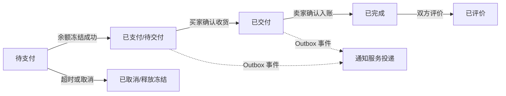
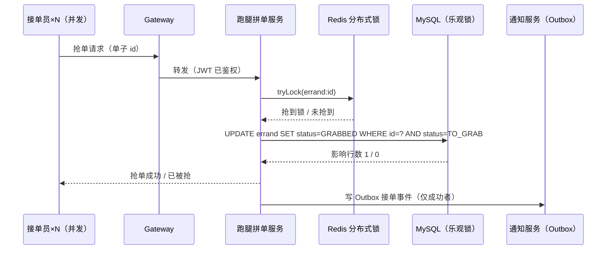

# 校园互助生活平台 - UserStory v0.3

> 本文档为《AICoding 架构设计》核心产物之一，对应**产品需求与用户故事（UserStory）**阶段。
> 上游输入：《高层架构设计》v0.2（G3 已通过）+ 资料摘要 v0.2（G1 已通过）；
> 下游输出：驱动《系统设计》《部署设计》《安全设计》的具体功能实现。
> 本阶段 Owner：product-story-designer（顾全景）；Gate：G4。

> **中间确认决议（元信息）**：§6.2 性能响应目标值已经用户拍板为**方案 A（轻量演示级）**，标注「经中间确认（CP-6）」，见附录 A。

```yaml
标题: 校园互助生活平台 - UserStory v0.3
版本: v0.3
状态: Draft   # Draft | Reviewing | Approved | Deprecated
创建日期: 2026-09-14
最后更新: 2026-09-14
作者: product-story-designer（顾全景）
评审人:
  - team-lead（主理人）
  - 用户（季祥浩，项目所有者）

关联文档:
  上游输入:
    - 高层架构设计: .workbuddy/output/高层架构设计.md（v0.2，G3 已通过）
    - 资料摘要: .workbuddy/output/material_digest.md（v0.2，G1 已通过）
  下游产出:
    - 系统设计: system-architect（与本文档并行）
    - 部署设计: platform-architect
    - 安全设计: security-architect
```

| 版本 | 日期 | 作者 | 变更内容 | 评审状态 |
| --- | --- | --- | --- | --- |
| v0.1 | 2026-09-14 | product-story-designer（顾全景） | 初稿：基于高层架构设计 v0.2 冻结边界展开六章 + 13 条七段式 UserStory | Draft |
| v0.2 | 2026-09-14 | product-story-designer（顾全景） | 中间确认回注（CP-6）：§6.2 性能目标值按用户裁决方案 A（轻量演示级）定稿并标注「经中间确认」，去除占位标注；附录 A 自检报告同步回填裁决结果 | Draft |
| v0.2 | 2026-09-14 | product-story-designer（顾全景） | 字符写法适配（G4 校验返工）：自检报告中"小于 0.5 人日 / 小于 0.2 人月"的写法统一改写为"0.5 人日以内 / 0.2 人月以内"，附录 A 中"用例"引导语改为"用例如下"句式；语义与数值完全不变，版本保持 v0.2 | Draft |
| v0.3 | 2026-09-14 | product-story-designer（顾全景） | 注册隐私同意增补（经中间确认·论题四，用户裁决方案 A"加勾选+政策页"）：§3 新增 F18（P1，MVP 内）；US-1 新增 AC8（未勾选同意不可提交注册）；§4.2 场景 S1 期望结果同步补齐。来源：Phase 5 安全设计合规闭环（个保法告知同意）下游落地 | Draft |

---

## 1. 业务背景与价值

### 1.1 业务背景

- **当前业务现状**：高校校园内二手交易、失物招领、跑腿拼单、日常问答四类互助信息散落在微信群 / QQ 群，时间线式信息流无法结构化检索、无状态跟踪、无信任保障——二手"单库存售出即失效"、失物"认领无记录易纠纷"、跑腿"接单无约束"（高层架构 §2.2 P1-2）。用户规模为单一校园在校学生（买卖双方、失主与拾得人、跑腿发单与接单双方）+ 平台管理员。
- **触发本次需求的事件**：项目所有者季祥浩（大三在校生）的**求职简历项目**需求——简历中 Spring Cloud（Nacos/Gateway/OpenFeign/Sentinel）、Redis、Vue 均为"了解"级且无微服务项目落地证据，需要以贴合校园生活的真实场景为载体，落地 Spring Cloud 微服务、AI Agent 应用、并发与幂等等简历技能点的完整工程闭环（高层架构 §2.2 P1-1）。
- **本系统在产品矩阵中的位置**：独立新建的自部署平台，无内部产品矩阵上下游；在"简历项目"价值主线中承担**技能点工程化载体**核心职责，与 Vue 3 前端（唯一用户触点）、百炼 LLM API（唯一外部上游）形成完整业务闭环（高层架构 §4.1）。系统验收口径为"**技术学习价值 > 生产级完备性**"（调研报告 §0 总基调，已冻结）。

### 1.2 行业方案

同类功能、痛点的行业标杆系统及解决方案（详见高层架构 §3，本节仅保留对 UserStory 有直接约束的结论）：

| 标杆 | 对 UserStory 的借鉴点 | 不借鉴点 |
| --- | --- | --- |
| B1 闲鱼 | C2C 单库存 + 状态机 + 售出即下架的交易链路；"轻发布 → 商品结构化"发布理念；信用/评价降低信任成本 | 任何架构级与规模级设计 |
| B2 UU 跑腿 | 发单-抢单-交接确认-双向评价-超时转派的履约流程 | 骑手体系、保险风控、抽佣模式 |
| B3 mall-swarm | 微服务基建裁剪模板（Nacos/Gateway/OpenFeign/Sentinel） | 全量组件栈（ES/MongoDB/Seata/K8s） |
| B4 校园开源项目群 | 业务数据模型与状态机设计（代码独立实现，不复制） | 停留在 Spring Boot 单体的实现方式 |

### 1.3 方案收益与价值

| 项 | 说明 |
| --- | --- |
| 功能模块 | 二手交易（发布/检索/下单/结算）、失物招领（双发布/匹配/认领审核）、跑腿拼单（发单/抢单/履约/顺路拼单轻量版）、AI 助手（三域 Agent 问答与工具代办）、余额与模拟支付、Outbox 可靠通知、平台管理（审核/举报/下架） |
| 预期价值收益 | 用户侧：四类互助场景从"群聊刷屏"变为"结构化检索 + 状态跟踪 + 信用保障"，三条主链路 100% 线上闭环（V2）；AI 侧：高频查询由对话直达，写操作 100% 附系统证据（V4）；项目所有者侧：≥10 项简历技能点落地为可演示、可答辩的工程证据（V1/V3/V4） |
| 量化标准 | 核心场景线上覆盖率 100%（V2）；通知投递成功率 ≥ 99%（V5）；并发 100 线程压测重复接单 0 / 超接 0（V3）；AI 写操作后置断言覆盖率 100%（V4）；容器内存峰值合计 ≤ 3GB（V6） |

### 1.4 术语清单

> 与《高层架构设计》术语口径对齐，供《系统设计》沿用。

| 术语 | 含义 |
| --- | --- |
| 单库存 | 一件二手商品仅有一份库存，下单成功即售出，售出即下架（借鉴 B1） |
| 订单状态机 | 订单/认领/审核等实体按预定义状态集合与迁移规则流转，本项目的轻量实现方式（不引入 Flowable，用户冻结裁决） |
| 审核记录表 | 记录审核操作人 / 时间 / 对象 / 结论 / 意见的数据库表，审核留痕的唯一载体 |
| 抢单 | 跑腿接单员在跑腿大厅对未接单据一击接单的动作，需 Redis 分布式锁 + DB 乐观锁双保险防重复接单/超接 |
| 超时自动转派 | 发单后 30 分钟无人接单，系统自动将单子重新推入大厅单池并提醒发单人（口径冻结于高层架构 F7） |
| 交接确认 | 接单员完成跑腿任务后，发单人确认收货/收事的履约完结动作 |
| 顺路拼单（轻量） | 跑腿单的"顺路拼单"标注字段 + 备注 + 子任务接单方式，MVP 承载"拼单"场景入口的轻量方案（经中间确认 D-08）；完整拼团撮合归完整版 F10 |
| 模拟支付 | 不对接真实支付渠道，由系统内部完成扣款确认的支付方式（经中间确认 D-09） |
| 平台余额 | 系统内置账户余额，来源为模拟充值或跑腿完单奖励，下单时冻结、成交后扣减，扣减幂等 |
| 支付网关适配器 | 支付能力的抽象接口层，MVP 用模拟支付实现，完整版替换为真实微信支付实现而业务代码不动（D-09） |
| 三域 Agent | AI 助手按业务域拆分的交易 Agent / 失物招领 Agent / 跑腿 Agent，各自独立工具白名单 |
| 工具白名单 | 每个 Agent 仅允许调用预先登记的工具集合，白名单外调用直接拒绝 |
| 后置断言 | AI 写操作（发布/接单/修改）后强制校验系统真实执行结果，以系统证据为准生成确认回复，防模型虚假确认（V4） |
| 流式问答 | LLM 回答以流式（SSE）逐字呈现，首字 P99 ≤ 2s（高层架构 §6.4 冻结） |
| 会话记忆 | AI 助手在会话内保留上下文（存 Redis），支持多轮追问 |
| Outbox | 业务状态变更与通知投递解耦的可靠投递方案：同库事务写事件表 + 定时任务原子领取 + 失败重试 + 成功证据校验（V5） |
| 信用分 | 由交易/履约/评价记录沉淀的用户信任分值，影响检索排序与接单优先级 |
| 敏感词过滤 | 发布内容的前置合规校验，命中即拦截并提示 |
| JWT | 网关统一鉴权使用的令牌会话机制 |
| Sentinel 降级 | Sentinel 熔断限流触发的降级响应，MVP 需可复现 ≥ 2 个演示用例（V1） |

---

## 2. 范围与边界

### 2.1 系统内模块及功能

> 一级功能清单，与高层架构 §5.1 业务架构图、§6.2 模块全景一致。

| 一级模块 | 包含功能 |
| --- | --- |
| Vue 3 前端（学生端 Web/H5 + 管理后台） | 首页/广场、二手列表/详情、统一发布页、失物招领列表/详情、跑腿大厅、AI 对话页、订单与余额中心、消息通知中心、管理端（登录/审核工作台/内容管理/用户管理） |
| 用户与信用服务 | 校园身份注册登录（F1）、个人主页、信用分体系（F2） |
| 二手交易服务 | 商品发布与检索（F3）、单库存下单与订单状态机、售出即下架（F4） |
| 失物招领服务 | 失物/拾物双发布与关键词匹配提醒（F5）、认领申请与状态机审核（F6） |
| 跑腿拼单服务 | 发单与并发抢单（F7）、履约交接与评价（F8）、顺路拼单轻量版（F9） |
| 余额支付模块（内嵌于业务链路） | 平台余额与模拟支付、冻结/扣减幂等、支付网关适配器（F11） |
| AI 助手服务 | 三域 Agent + LLM 路由 + 工具白名单 + 后置断言 + 流式问答 + 会话记忆（F13）、Dubbo 对比链路（F14） |
| 通知服务 | Outbox 可靠投递：原子领取/失败重试/防重复/成功证据（F15） |
| 平台管理服务 | 敏感词过滤、内容审核（审核记录表）、举报处置、违规下架（F16） |
| 微服务基建 | Spring Cloud Gateway 统一鉴权/路由、Nacos 注册与配置、OpenFeign 主链路 + Dubbo 3 对比链路、Sentinel 熔断限流、MySQL 8 多库 + MyBatis-Plus、Redis（缓存/分布式锁/会话）、Outbox 表 + 定时任务 |

### 2.2 系统外模块及功能

> 当前系统**不覆盖**的功能及原因，与高层架构 §6.1 Out-of-Scope（O1~O8）逐条一致，不得由本阶段扩展或裁剪。

| 编号 | 不做的事 | 原因 | 后续计划 |
| --- | --- | --- | --- |
| O1 | 真实在线支付（微信支付/支付宝回调、对账、退款） | 个人学生主体商户资质准入受限；经中间确认（D-09） | 完整版经支付网关适配器替换实现（F12） |
| O2 | 多人拼团完整撮合（拼团创建、凑单截止、成团状态机、费用分摊） | 撮合状态机复杂度高，单人项目工期风险大；经中间确认（D-08） | 完整版（F10） |
| O3 | Elasticsearch 搜索引擎 | 校园规模 MySQL 全文索引/前缀匹配够用，省约 1GB 级单机内存 | 完整版按需评估 |
| O4 | MongoDB、Flowable、poi-tl | 用户冻结裁决"可以不用mongoDB，poi，flowable"；审核场景用状态机 + 审核记录表 | 不做 |
| O5 | Kubernetes 编排、多节点部署、服务网格 | 超出"单台轻量云服务器 + Docker Compose"低成本硬约束 | 不做 |
| O6 | 微信小程序原生端 | 小程序类目审核政策不确定；渠道接入层已抽象 | 完整版作为第二渠道薄适配器 |
| O7 | 平台抽佣、骑手/保险风控体系、商业化运营 | 校园互助为非商业场景 | 不做 |
| O8 | 独立消息队列（RocketMQ/RabbitMQ） | Outbox + 定时任务已覆盖 MVP 通知需求，MQ 对单机约 450MB 额外负担 | 完整版按 D-04 决策评估 |
| F10/F12/F17 | 完整拼团撮合、真实微信支付、运营看板 | P2 优先级，归完整版时间窗（W7~W12） | 完整版 |

### 2.3 外部依赖

| 依赖系统 | 提供方 | 依赖能力 | 接入方式 | 接口人 |
| --- | --- | --- | --- | --- |
| 阿里云百炼 DashScope（qwen-plus） | 阿里云 | LLM 对话 / 流式 / Function Calling | HTTPS + SSE（Spring AI 抽象层），API Key 由安全设计管理 | 季祥浩（阿里云账号持有人） |
| 轻量云服务器（2核4G） | 云厂商（待部署设计确定） | 计算与网络资源，Docker Compose 自部署 | SSH + Docker Compose | 季祥浩 |
| 容器镜像源（Docker Hub / 国内镜像加速） | Docker 官方 / 云厂商 | 基建与业务容器镜像拉取 | Docker pull | 季祥浩 |

> 内部依赖（Nacos / Gateway / Sentinel / OpenFeign / Dubbo / MySQL / Redis / Outbox）均为自建开源组件，不属于外部系统依赖，接入约束见高层架构 §5.2。

---

## 3. 功能清单

> **定位**：全景骨架表。本表与高层架构 §6.3 功能清单逐行互查一致（编号、优先级、MVP 标记完全镜像，不得由本阶段调整）。

### 3.1 功能清单

| 一级模块 | 二级模块 | 功能项（编号） | 优先级 | MVP 范围 | 完整版范围 | 备注 |
| --- | --- | --- | --- | --- | --- | --- |
| 用户与信用 | 注册登录与个人主页 | 校园身份注册、JWT 会话、个人主页（F1） | P0 | ✅ | ✅ | 学号/校园邮箱注册 |
| 用户与信用 | 信用分体系 | 双向评价/履约记录写入信用分，影响检索排序与接单优先级（F2） | P1 | ✅ | ✅ | 对齐 V2 |
| 二手交易 | 商品发布与检索 | 轻发布 + 类目结构化 + 关键词检索（F3） | P0 | ✅ | ✅ | 不引入 ES（O3） |
| 二手交易 | 订单流转 | 单库存下单、订单状态机、售出即下架、余额结算联动（F4） | P0 | ✅ | ✅ | 对齐 V2 |
| 失物招领 | 失物/拾物发布与匹配 | 双向发布、关键词匹配触发提醒（F5） | P0 | ✅ | ✅ | 提醒经通知服务 |
| 失物招领 | 认领申请与审核 | 认领提交 + 状态机审核记录表（F6） | P0 | ✅ | ✅ | 不引入 Flowable（O4） |
| 跑腿拼单 | 发单与并发抢单 | Redis 分布式锁 + DB 乐观锁双保险、30 分钟未接单自动转派（F7） | P0 | ✅ | ✅ | 对齐 V2/V3 |
| 跑腿拼单 | 履约交接与评价 | 交接确认、双向评价（F8） | P0 | ✅ | ✅ | 评价回流信用分 |
| 跑腿拼单 | 顺路拼单（轻量） | 拼单标注 + 子任务接单（F9）——经中间确认（D-08） | P1 | ✅ | ✅ | 完整拼团归 F10 |
| 跑腿拼单 | 完整拼团撮合 | 拼团创建/凑单截止/成团状态机/费用分摊（F10）——经中间确认（D-08） | P2 | ❌ | ✅ | 本期不做（O2） |
| 余额支付 | 平台余额与模拟支付 | 模拟充值/完单奖励入账、下单冻结/扣减幂等、支付网关适配器（F11）——经中间确认（D-09） | P0 | ✅ | ✅ | 真实支付归 F12 |
| 余额支付 | 真实微信支付 | 回调/对账/退款，替换支付适配器实现（F12）——经中间确认（D-09） | P2 | ❌ | ✅（待商户资质） | 本期不做（O1） |
| AI 助手 | 对话问答与工具代办 | 三域 Agent + LLM 路由 + 工具白名单 + 后置断言 + 流式问答 + 会话记忆（F13） | P0 | ✅ | ✅ | 对齐 V4 |
| AI 助手 | Dubbo 对比链路 | 查询跑腿单单链路 OpenFeign/Dubbo 双实现演示（F14） | P1 | ✅ | ✅ | 对齐 V1 |
| 通知 | Outbox 可靠投递 | 状态变更通知投递（原子领取/重试/防重复/成功证据）（F15） | P0 | ✅ | ✅ | 对齐 V5 |
| 平台管理 | 审核/举报/下架 | 敏感词过滤 + 审核记录表人工处置 + 违规下架（F16） | P0 | ✅ | ✅ | 状态机方案（O4） |
| 平台管理 | 运营看板 | 完单率/通知成功率/AI 断言失败率指标展示（F17） | P2 | ❌ | ✅ | MVP 以数据库查询/日志替代（高层架构 §6.5） |
| 用户与信用 | 注册隐私同意 | 注册环节"已阅读并同意《用户协议与隐私政策》"勾选 + 静态政策页（F18）——经中间确认（论题四，方案 A） | P1 | ✅ | ✅ | 个保法告知同意（Phase 5 安全设计下游落地），由 US-1 承载；政策页明示采集范围/用途限定/AI 会话委托百炼处理事实/删除与留痕豁免 |
| 非功能约束（In-Scope 附属，不计功能项） | 部署与运行 | 单机 2核4G 轻量服务器 + Docker Compose，容器内存峰值合计 ≤ 3GB（N1） | — | ✅ | ✅ | 详见 §6.3 |
| 非功能约束（In-Scope 附属，不计功能项） | 并发与幂等 | 核心接口幂等（支付/扣减/抢单），并发 100 压测重复接单 = 0；Sentinel 降级演示用例 ≥ 2（N2） | — | ✅ | ✅ | 详见 §6.2 / US-11 |

**互查结论**：功能编号 F1~F17、优先级 P0（11 项）/P1（F2/F9/F14）/P2（F10/F12/F17）、MVP 标记与高层架构 §6.3 完全一致；F18 为 Phase 5 安全设计阶段经中间确认（论题四，方案 A）增补的 P1 功能（MVP 内），由 US-1 承载，不改变 F1~F17 冻结口径；N1/N2 为 In-Scope 非功能条目的附属呈现。✅

---

## 4. 角色与场景

### 4.1 角色清单

> 与高层架构 §2.1 核心角色关注点逐行对齐（三类六种），不做角色细分与增减。

| 角色 | 业务身份 | 主要操作 | 核心关注点 |
| --- | --- | --- | --- |
| 甲方决策者：季祥浩（项目所有者） | 大三在校生 / 求职者，本平台唯一开发者兼运营者 | 立项、开发、答辩演示、日常运营 | 简历技能点全部落地为可演示、可答辩的工程证据（Spring Cloud / Dubbo 对比 / AI Agent / 并发幂等） |
| 最终用户 A：互助需求方 | 在校学生（买家 / 失主 / 跑腿发单人） | 发布求购、搜索商品、登记失物、发布跑腿单、支付（模拟）、评价 | 找到目标的速度与交易/履约的确定性（商品还在不在、失物有没有人捡到、单有没有人接） |
| 最终用户 B：互助提供方 | 在校学生（卖家 / 拾得人 / 跑腿接单员） | 上架商品、发布拾物、抢单、履约交接、收款（余额）、评价 | 抢单公平性（不被重复抢单/超接）与收益到账可信（防"假成功"） |
| 最终用户 C：AI 助手使用者 | 全体在校学生 | 对话问答、让 AI 代查/代办（查商品、登记失物、查跑腿单状态） | AI 回答可信：说"已下单/已登记"必须真的执行成功 |
| 受影响方：平台管理员 | 季祥浩兼任（管理后台） | 内容审核、举报处置、违规下架 | 审核有记录、可追溯，审核流程轻量（状态机 + 审核记录表，不引入工作流引擎） |
| 受影响方：答辩评委 / 招聘面试官 | 外部评估者 | 查看简历、追问架构细节、审阅演示 | 微服务拆分理由、技术选型依据、并发与幂等的真实落地证据 |

### 4.2 关键场景清单

> 频率列为**演示口径预估**（非 SLA 承诺，见附录 A 自检报告 CP-4），供《系统设计》容量参考。

| 编号 | 角色 | 触发条件 | 期望结果 | 频率（演示口径预估） |
| --- | --- | --- | --- | --- |
| S1 | 互助需求方 / 提供方 | 首次使用平台 | 完成隐私政策同意勾选与校园身份注册登录，进入首页（经中间确认·论题四） | 日均 10~30 次 |
| S2 | 互助提供方 | 有闲置物品 | ≤ 3 步完成商品发布并进入检索范围 | 日均 20~50 次 |
| S3 | 互助需求方 | 检索到目标商品 | ≤ 2 步用余额完成下单，商品售出即下架 | 日均 10~30 次 |
| S4 | 学生 | 余额不足或需查看余额流水 | 模拟充值到账、明细可查 | 日均 5~15 次 |
| S5 | 失主 / 拾得人 | 丢失或捡到物品 | 双向发布成功；关键词命中时收到匹配提醒 | 日均 10~30 次 |
| S6 | 失主 / 平台管理员 | 失主发现疑似拾物 | 认领申请提交、审核留痕、通过后联系归还 | 日均 3~10 次 |
| S7 | 跑腿发单人 | 需要代办 | 发单成功进入跑腿大厅单池 | 日均 10~30 次 |
| S8 | 跑腿接单员 | 浏览大厅发现可接单 | 1 步抢单成功，并发下无重复接单/超接 | 日均 10~30 次；压测口径并发 100 线程 |
| S9 | 发单人 / 接单员 | 履约完成 | 交接确认、双向评价、信用分更新 | 日均 5~20 次 |
| S10 | 发单人 / 接单员 | 跑腿单标注顺路拼单 | 标注可见可筛选，按子任务方式接单 | 日均 2~10 次 |
| S11 | AI 助手使用者 | 咨询或让 AI 代查/代办 | 流式回答；写操作回复附系统证据标识 | 日均 20~60 次 |
| S12 | 学生 | 订单/认领/匹配状态变更 | 通知中心可靠触达（成功率 ≥ 99%，V5） | 每次状态变更 1 条，不重复不丢失 |
| S13 | 平台管理员 | 待审队列非空 / 收到举报 / 敏感词命中 | 处置留痕，违规下架实时生效并通知 | 日均 3~10 次 |
| S14 | 项目所有者 / 答辩评委 | 求职答辩演示 | 微服务全链路 + Dubbo 对比 + Sentinel 降级 + 并发压测可复现 | 低频（演示日） |

---

## 5. 用户旅程（UserStory）

> 共 13 条 US，覆盖 §3 功能清单全部 P0/P1 功能项（P2 的 F10/F12/F17 不在 MVP，不设 US）。每条按 5.1.1~5.1.7 七段式展开。

### 5.1 US-1：校园身份注册登录与个人主页

#### 5.1.1 业务场景

- **视角**：学生（互助需求方 / 提供方 / AI 使用者通用入口）
- **描述**：在校生首次打开平台（Web/H5），需要用校园身份（学号 + 校园邮箱）完成注册并登录，之后在个人主页维护资料、查看自己的信用分与发布/接单记录，作为后续所有互助场景的身份前提。

#### 5.1.2 业务流程

- Given 未注册学生打开平台首页
  - When 点击"注册"并填写学号、校园邮箱、昵称、密码
  - Then 系统校验邮箱为校园域名格式、密码达到强度要求（8 位以上大小写字母 + 数字 + 特殊字符）、学号未被占用，注册成功并自动登录
- Given 已注册学生
  - When 输入学号/邮箱 + 密码点击登录
  - Then 网关签发 JWT，跳转首页，右上角展示昵称与信用分
- Given 已登录学生
  - When 进入个人主页
  - Then 展示基础资料、信用分、我的发布（买/卖/失物/跑腿分栏）与退出登录入口

#### 5.1.3 UE 原型

- 核心路径：`首页 → 注册页（学号/邮箱/密码/昵称表单）→ 首页（已登录态）`；注册表单字段级即时校验（邮箱格式、密码强度条、学号查重提示）。
- 个人主页：`底部导航"我的" → 个人主页`，信息分区：资料卡（头像/昵称/学号脱敏展示）、信用分卡（分数 + 等级说明）、发布/接单记录 Tab。
- 交互约束（继承高层架构 §6.4）：注册到可用 ≤ 1 分钟；错误提示就地展示，不打断填写。

#### 5.1.4 业务逻辑

1. 前端提交注册请求 → Gateway 路由至用户与信用服务。
2. 服务端校验：校园邮箱域名白名单、密码强度正则、学号唯一性（DB 唯一索引兜底）。
3. 密码使用 BCrypt 加密存储，明文不落库、不落日志。
4. 登录成功签发 JWT（含用户 ID、角色 student/admin），Redis 存储会话状态支持主动登出。
5. 个人主页数据由用户与信用服务聚合（用户基础信息 + 信用分当前值）。

#### 5.1.5 数据描述

- `user`：id、student_no（唯一）、campus_email、nickname、password_hash、role（student/admin）、credit_score（默认初始值）、status（正常/封禁）、created_at。
- `credit_record`：user_id、source_type（交易/履约/评价/违规）、delta、ref_id、created_at；信用分为该表聚合快照。

#### 5.1.6 验收标准 AC

- **AC1（正常注册）**：Given 合法学号与校园邮箱，When 提交符合强度要求的密码，Then 注册成功并自动登录进入首页。
- **AC2（异常：邮箱不合法）**：Given 非校园域邮箱，When 提交注册，Then 提示"请使用校园邮箱"，注册不成功。
- **AC3（异常：密码强度不足）**：Given 密码为 6 位纯数字，When 提交注册，Then 提示密码强度要求，注册不成功。
- **AC4（异常：学号重复）**：Given 学号已注册，When 再次以同学号注册，Then 提示"该学号已注册"。
- **AC5（异常：密码错误）**：Given 已注册账号，When 输入错误密码登录，Then 提示"账号或密码错误"（不区分账号不存在/密码错误，防枚举），连续失败按安全设计锁定策略处理。
- **AC6（登出）**：Given 已登录用户，When 点击退出登录，Then JWT 失效，再次访问需登录页。
- **AC7（越权）**：Given 未携带有效 JWT，When 直接请求业务接口，Then 网关返回 401。
- **AC8（注册隐私同意，经中间确认·论题四）**：
  - **异常路径**：Given 未勾选"已阅读并同意《用户协议与隐私政策》"，When 用户点击注册按钮，Then 按钮不可提交（置灰或提交被拦截），并提示需先阅读并同意协议，注册请求不发出。
  - **正常路径**：Given 用户已勾选同意（可点击政策链接进入静态政策页查看：采集范围为学号/校园邮箱/昵称/密码，用途限定说明，AI 会话内容将传输至阿里云百炼的第三方委托处理事实，删除与留痕豁免说明），When 提交注册，Then 按 AC1 正常完成注册，且系统留存同意动作记录（勾选时间与政策版本）。
  - **政策页可达**：Given 用户处于注册页，When 点击协议链接，Then 静态政策页可打开且不要求登录。

#### 5.1.7 外部集成接口

- 无外部系统集成。内部依赖：Gateway（路由/鉴权）、Redis（会话）、MySQL（用户存储）。

### 5.2 US-2：二手商品发布与检索

#### 5.2.1 业务场景

- **视角**：互助提供方（卖家）/ 互助需求方（买家）
- **描述**：毕业生/换季学生有闲置物品（自行车、教材、台灯等），希望通过"轻发布"在 3 步内完成上架；想淘二手的学生通过类目筛选与关键词检索快速找到目标。

#### 5.2.2 业务流程

- Given 已登录卖家
  - When 进入发布页选择"二手"场景，填写标题、类目、价格、描述、上传图片（≤ 3 步）
  - Then 敏感词校验通过后商品上架成功，进入"最新发布流"与类目列表，状态为"在售"
- Given 已登录买家
  - When 在二手列表输入关键词或选择类目筛选
  - Then 系统返回匹配商品列表（按信用分/时间加权排序），点击进入详情页
- Given 商品已被售出或被违规下架
  - When 买家检索或直接访问该商品详情
  - Then 列表中不再展示，详情页提示"商品已售出/已下架"

#### 5.2.3 UE 原型

- 发布路径（≤ 3 步，冻结口径）：`首页"发布"按钮 → 场景切换选"二手" → 填表提交`；表单字段：标题*、类目*（下拉）、价格*、描述、图片（多张）。
- 检索路径：`二手 Tab → 顶部搜索框/类目筛选 → 商品列表 → 商品详情`；列表项含缩略图、标题、价格、卖家昵称与信用分标识。
- 关键交互：搜索无结果时给出空态引导；价格输入仅允许数字；图片上传有进度与失败重试。

#### 5.2.4 业务逻辑

1. 发布请求先经平台管理服务的敏感词过滤（白名单内调用），命中即拦截并返回命中的敏感词提示（不回显原文其余部分）。
2. 校验通过后写入商品表，状态 `在售`；写入 Outbox 事件（可选，供通知/索引扩展）。
3. 检索基于 MySQL 全文索引/前缀匹配（不引入 ES，O3 冻结），排序因子：关键词相关度 + 卖家信用分 + 发布时间倒序。
4. 商品状态机：`在售 → 已售出（下单成交触发）→ 已下架（卖家主动或管理员违规下架）`；售出即下架，单库存不可重复下单。

#### 5.2.5 数据描述

- `product`：id、seller_id、title、category、price、description、images(JSON)、status（ON_SALE/SOLD/OFF_SHELF）、created_at、updated_at。
- 检索请求/结果为瞬时数据不落库；敏感词命中记录写入审核记录表（供管理员追溯）。

#### 5.2.6 验收标准 AC

- **AC1（正常发布）**：Given 已登录卖家，When 填写完整必填字段提交，Then 商品 3 步内上架成功并在列表可见。
- **AC2（异常：敏感词）**：Given 描述含敏感词，When 提交发布，Then 发布被拦截并提示修改，商品不入库为在售状态。
- **AC3（正常检索）**：Given 已存在标题含"自行车"的在售商品，When 搜索"自行车"，Then 结果包含该商品且按排序规则展示。
- **AC4（异常：无结果）**：When 搜索不存在的关键词，Then 展示空态与引导，不报错。
- **AC5（售出即下架）**：Given 商品已被下单成交，When 买家检索该商品，Then 列表不展示；直接访问详情提示"已售出"。
- **AC6（违规下架）**：Given 管理员执行违规下架，When 买家访问该商品，Then 详情提示"已下架"，卖家收到下架通知。
- **AC7（异常：图片上传失败）**：When 图片上传超时/失败，Then 给出重试入口，商品不因图片失败而提交为空图脏数据（图片为选填时允许无图发布，必填校验按表单规则）。

#### 5.2.7 外部集成接口

- 无外部系统。内部依赖：平台管理服务（敏感词过滤）、Gateway、MySQL。

### 5.3 US-3：二手下单与模拟支付结算

#### 5.3.1 业务场景

- **视角**：互助需求方（买家）/ 互助提供方（卖家）
- **描述**：买家在商品详情页看中心仪商品，用平台余额一键下单支付（≤ 2 步冻结口径）；系统完成余额冻结/扣减、订单创建、商品售出即下架；卖家与买家分别收到成交通知，交易进入待交付→已完成状态机。

#### 5.3.2 业务流程

- Given 买家余额充足、商品在售
  - When 在详情页点击"立即下单"并确认（≤ 2 步）
  - Then 余额冻结 → 扣减，订单创建为"已支付（待交付）"，商品状态变为"已售出"并下架，双方收到成交通知
- Given 买家余额不足
  - When 点击"立即下单"
  - Then 提示余额不足并引导跳转余额中心充值（US-4），订单不创建
- Given 两名买家并发下单同一在售商品
  - When 两个下单请求几乎同时到达
  - Then 仅一个请求成功（单库存），另一请求收到"手慢了，商品已售出"
- Given 买家下单后长时间未支付完成/订单异常
  - When 系统检测订单超时未完成
  - Then 订单取消，冻结余额释放回账户，商品恢复"在售"

#### 5.3.3 UE 原型

- 下单路径（≤ 2 步）：`商品详情页 → 点击"立即下单" → 确认弹窗（展示扣款金额与余额）→ 结果页`。
- 结果页：成功展示订单号与"待交付"状态；失败展示原因（余额不足/已售出）与引导。
- 我的订单（买家/卖家分栏）可查看订单状态机当前节点。

#### 5.3.4 业务逻辑

1. 下单为幂等接口：同一买家对同一商品的重复提交（携带幂等键）仅产生一笔订单。
2. 余额操作顺序：冻结（下单事务内）→ 交付确认后扣减入卖家余额；扣减/入账均写余额流水，幂等键防重复入账（N2 冻结）。
3. 经支付网关适配器调用模拟支付实现（D-09 冻结）：适配器返回"支付成功"证据后订单才置为已支付；完整版替换为真实微信支付实现，业务代码与接口契约不变。
4. 订单状态机：`待支付 → 已支付(待交付) → 已交付 → 已完成(可评价) → 已评价 / 已取消(超时或买家取消，释放冻结)`。
5. 状态变更写 Outbox 事件，由通知服务可靠投递（US-12）。
6. 单库存防超卖：下单事务内乐观扣减库存/状态条件更新（`where status=ON_SALE`），失败即售罄。

#### 5.3.5 数据描述

- `order`：id、product_id、buyer_id、seller_id、amount、status、idempotent_key（唯一）、created_at、paid_at、delivered_at、finished_at。
- `balance_account`：user_id、balance、frozen_amount。
- `balance_flow`：id、user_id、type（充值/冻结/扣减/入账/释放）、amount、ref_order_id、idempotent_key（唯一）、created_at。
- Outbox 事件：`outbox_event`（订单成交/取消状态事件，供通知服务投递）。

#### 5.3.6 验收标准 AC

- **AC1（正常成交）**：Given 余额充足的买家与在售商品，When 下单确认，Then 订单为已支付、商品售出即下架、双方收到通知。
- **AC2（异常：余额不足）**：Given 余额小于商品价格，When 下单，Then 提示余额不足，订单与余额均不变。
- **AC3（并发单库存）**：Given 两请求并发下单同一商品，When 同时到达，Then 恰好一笔成功，另一笔返回已售出，库存/状态一致。
- **AC4（幂等）**：Given 同一幂等键重复提交下单，When 第二次请求到达，Then 不产生第二笔订单、余额只扣一次。
- **AC5（超时释放）**：Given 订单待支付超时，When 超时任务触发，Then 订单取消、冻结余额释放、商品恢复在售。
- **AC6（结算联动）**：Given 订单完成交付确认，When 卖家确认收款，Then 卖家余额入账且流水可查，金额与订单一致。
- **AC7（异常：下架商品下单）**：Given 商品已被下架/售出，When 直接调用下单接口，Then 返回业务错误，不创建订单。

#### 5.3.7 外部集成接口

- 无外部支付渠道（D-09 冻结：模拟支付 + 平台余额）。内部依赖：余额支付模块（适配器）、通知服务（Outbox）、Redis（幂等键）、MySQL。



### 5.4 US-4：余额管理与模拟充值

#### 5.4.1 业务场景

- **视角**：全体学生（买家、接单员）
- **描述**：学生余额不足时，在订单与余额中心进行模拟充值（不接真实支付）；跑腿接单员完单后奖励自动入账；所有余额变动（充值/冻结/扣减/入账/释放）在余额明细中可追溯。

#### 5.4.2 业务流程

- Given 已登录学生
  - When 在余额中心点击"模拟充值"并输入金额确认
  - Then 系统生成模拟支付成功凭证，余额即时增加，明细新增一条"充值"流水
- Given 接单员完成跑腿单（US-8 履约确认）
  - When 系统结算跑腿报酬
  - Then 报酬自动入账，明细新增"完单奖励"流水
- Given 学生查看余额明细
  - When 打开余额中心
  - Then 按时间倒序展示全部流水（类型/金额/关联单号/时间），余额与流水累计一致

#### 5.4.3 UE 原型

- `底部导航"订单/余额" → 余额卡（当前余额 + 充值按钮）→ 充值弹窗（金额输入 + 确认）→ 到账提示`；下方为流水分栏列表（收入绿色 / 支出红色，含类型标签）。

#### 5.4.4 业务逻辑

1. 模拟充值走支付网关适配器（D-09）：适配器直接返回成功证据，系统凭证据入账。
2. 入账幂等：每笔流水携带唯一幂等键，重复回调/重试不会重复入账（N2）。
3. 跑腿完单奖励由跑腿拼单服务在履约确认事务内写入流水并入账。
4. 充值/入账状态变更写 Outbox 事件通知用户。

#### 5.4.5 数据描述

- 复用 US-3 的 `balance_account` / `balance_flow`；充值流水 `type=RECHARGE`、跑腿奖励 `type=ERRAND_REWARD`；`outbox_event` 承载余额变动通知。

#### 5.4.6 验收标准 AC

- **AC1（正常充值）**：Given 已登录学生，When 模拟充值 50 元，Then 余额 +50，明细新增充值流水。
- **AC2（幂等）**：Given 同一充值请求重复提交（同幂等键），When 到达系统，Then 仅入账一次。
- **AC3（异常：非法金额）**：When 输入 0、负数或超上限金额，Then 校验拦截并提示，余额不变。
- **AC4（完单奖励）**：Given 跑腿单交接确认完成，When 结算触发，Then 报酬入账且明细关联该跑腿单号。
- **AC5（明细一致性）**：Given 任意时刻，When 计算流水累计，Then 与账户余额 + 冻结金额一致。

#### 5.4.7 外部集成接口

- 无外部支付渠道（D-09）。内部依赖：支付网关适配器（模拟实现）、跑腿拼单服务（奖励结算）、通知服务（Outbox）。

### 5.5 US-5：失物/拾物发布与关键词匹配提醒

#### 5.5.1 业务场景

- **视角**：失主（互助需求方）/ 拾得人（互助提供方）
- **描述**：学生丢失校园卡/耳机/钥匙后登记失物启事；捡到物品的学生发布拾物启事。系统对失物与拾物按关键词自动匹配，命中时向双方发送匹配提醒，把"守群刷屏等认领"变为"系统主动撮合"。

#### 5.5.2 业务流程

- Given 已登录学生
  - When 在发布页选择"失物登记"或"拾物发布"，填写物品名称、关键词（≥1 个）、丢失/拾获地点、时间、描述、图片并提交
  - Then 敏感词校验通过后发布成功，进入失物招领列表
- Given 新失物登记含关键词"校园卡"
  - When 系统执行关键词匹配
  - Then 若存在在挂拾物命中该关键词，向失主与拾得人双方发送匹配提醒（含对方启事链接）
- Given 无匹配拾物
  - When 匹配任务执行
  - Then 不发送提醒，失物保持"寻找中"状态

#### 5.5.3 UE 原型

- 发布路径与二手共用统一发布页（场景切换"失物/拾物"）。
- 失物招领列表：`失物招领 Tab → 失物/拾物子 Tab → 启事卡片 → 详情页（含"这是我的物品，申请认领"按钮）`。
- 匹配提醒落位于消息通知中心（US-12），点击直达对方启事详情。

#### 5.5.4 业务逻辑

1. 发布链路同 US-2：敏感词前置过滤 → 入库 → 状态 `寻找中/待认领`。
2. 匹配机制：失物/拾物发布事务提交后写 Outbox 匹配任务事件，失物招领服务按关键词（精确 + 前缀匹配，MySQL 索引）做双向匹配，命中生成提醒事件交通知服务投递。
3. 防误报：匹配提醒每个失物/拾物对仅生成一次（唯一约束），不重复骚扰。
4. 物品认领流转至 US-6；归还确认后启事状态置 `已找回/已归还`。

#### 5.5.5 数据描述

- `lost_item` / `found_item`：id、publisher_id、item_name、keywords(JSON)、location、lost_or_found_time、description、images(JSON)、status（寻找中/待认领/已归还/已下架）、created_at。
- `match_notice`：lost_id、found_id、keyword、notified_users、created_at（唯一键防重）。

#### 5.5.6 验收标准 AC

- **AC1（正常发布）**：Given 已登录学生，When 完成失物登记必填项，Then 发布成功且状态为"寻找中"。
- **AC2（匹配提醒）**：Given 拾物关键词命中在挂失物，When 匹配任务执行，Then 双方各收到 1 条匹配提醒且可点击直达。
- **AC3（防重）**：Given 同一对失物/拾物已提醒过，When 再次匹配执行，Then 不重复发送提醒。
- **AC4（异常：无匹配）**：When 无命中拾物，Then 不发送提醒，启事保持寻找中。
- **AC5（异常：敏感词）**：When 描述含敏感词，Then 发布被拦截并提示。

#### 5.5.7 外部集成接口

- 无外部系统。内部依赖：通知服务（Outbox 提醒投递）、平台管理服务（敏感词）、Gateway。

### 5.6 US-6：失物认领申请与审核

#### 5.6.1 业务场景

- **视角**：失主 / 平台管理员 / 拾得人
- **描述**：失主在拾物详情页发现疑似自己的物品，提交认领申请并描述物品特征作为凭证；平台管理员在审核工作台依据特征描述与拾得人登记信息审核，通过后双方联系归还；全过程写入审核记录表，杜绝"认领无记录易纠纷"。

#### 5.6.2 业务流程

- Given 失主浏览拾物详情
  - When 点击"申请认领"并填写物品特征描述（颜色/标识/内含物等）提交
  - Then 认领申请创建，状态"待审核"，拾得人收到认领申请通知
- Given 管理员登录管理后台
  - When 在审核工作台查看待审认领申请，核对特征描述与拾物登记信息，点击"通过"或"驳回"（附审核意见）
  - Then 状态机流转（待审核→已通过/已驳回），操作写入审核记录表，双方收到审核结果通知
- Given 认领通过
  - When 双方线下完成归还并在平台确认
  - Then 启事状态置"已归还"，评价入口开放（回流信用分）

#### 5.6.3 UE 原型

- 失主侧：`拾物详情 → "申请认领"弹窗（特征描述文本域）→ 提交 → "我的认领"列表跟踪审核状态`。
- 管理端：`审核工作台 → 待审认领列表 → 详情（拾物登记 vs 认领描述对照展示）→ 通过/驳回 + 意见`。
- 状态对失主可见：待审核 / 已通过 / 已驳回（含意见）。

#### 5.6.4 业务逻辑

1. 认领状态机：`待审核 → 已通过 / 已驳回；已驳回可修改后重新提交（新记录）；已通过 → 已归还（归还确认后）`。状态迁移由服务端校验合法性，非法迁移拒绝。
2. 每次审核动作写审核记录表（操作人/时间/对象/结论/意见），不可篡改删除（用户冻结裁决：状态机 + 审核记录表，不引入 Flowable）。
3. 通过/驳回结果经 Outbox 通知双方（US-12）。
4. 同一拾物允许多个失主申请，但仅一个可通过；通过后其余申请自动关闭并通知。

#### 5.6.5 数据描述

- `claim_application`：id、found_id、claimer_id、feature_description、status（PENDING/APPROVED/REJECTED/CLOSED/RETURNED）、created_at、updated_at。
- `audit_record`：id、biz_type（认领/举报/敏感词）、biz_id、operator_id、action（通过/驳回/下架/封禁）、opinion、created_at。

#### 5.6.6 验收标准 AC

- **AC1（正常提交）**：Given 已登录失主，When 提交含特征描述的认领申请，Then 申请创建为待审核，拾得人收到通知。
- **AC2（审核通过）**：Given 管理员审核通过某认领，When 操作提交，Then 状态流转为已通过、审核记录落库、双方收到通知。
- **AC3（驳回可重提）**：Given 认领被驳回附意见，When 失主修改描述重新提交，Then 生成新待审记录，旧记录保留可追溯。
- **AC4（唯一通过）**：Given 多人申请同一拾物，When 管理员通过其中一人，Then 其余申请自动关闭并收到通知。
- **AC5（异常：非法状态迁移）**：Given 申请已通过，When 再次调用审核接口，Then 拒绝并返回状态冲突错误。
- **AC6（留痕完整性）**：Given 任意审核动作，When 查询审核记录表，Then 均有操作人/时间/对象/结论/意见完整记录。

#### 5.6.7 外部集成接口

- 无外部系统。内部依赖：通知服务（审核结果通知）、平台管理服务（审核工作台与记录表）、用户与信用服务（归还评价回流信用分）。

### 5.7 US-7：跑腿发单与并发抢单

#### 5.7.1 业务场景

- **视角**：跑腿发单人（互助需求方）/ 跑腿接单员（互助提供方）
- **描述**：学生需要取快递、代买餐食、排队代办时发布跑腿单（类型、报酬、截止时间、备注，可标注顺路拼单）；接单员在跑腿大厅一键抢单。热门单并发抢单场景下，系统以 Redis 分布式锁 + DB 乐观锁双保险保证不重复接单、不超接（V3 冻结）。

#### 5.7.2 业务流程

- Given 已登录发单人
  - When 填写跑腿单（类型：帮取/帮买/帮送、描述、报酬、截止时间、可勾选"顺路拼单"并填写备注）提交
  - Then 发单成功（报酬金额冻结校验见 US-4/US-3 幂等口径），进入跑腿大厅单池，状态"待接单"
- Given 已登录接单员浏览大厅
  - When 对目标单点击"抢单"（1 步冻结口径）
  - Then 抢单成功，单状态置"已接单"，双方收到通知，接单员可在"我的接单"查看
- Given 多名接单员并发抢单同一跑腿单
  - When 100 并发线程同时抢单
  - Then 恰好一人成功，其余返回"已被抢"，全链路重复接单数 = 0、超接数 = 0（V3）
- Given 跑腿单发单后 30 分钟无人接单
  - When 超时任务触发
  - Then 系统自动转派：单子重新推入单池并置顶提醒，发单人收到提醒通知（可继续等待或手动取消）

#### 5.7.3 UE 原型

- 发单路径：`首页"发布" → 场景"跑腿" → 表单（类型/描述/报酬/截止时间/顺路拼单标注）→ 提交`。
- 抢单路径（1 步）：`跑腿大厅 → 单卡片"抢单"按钮 → 成功/失败 Toast`。
- 大厅交互：单池按"报酬 × 发单人信用分 × 时间"排序；已抢単立即从可抢列表移除；失败 Toast 明确原因。

#### 5.7.4 业务逻辑

1. 抢单双保险：Redis 分布式锁（Redisson，锁粒度 = 跑腿单 ID）先拦截并发，DB 层再以条件更新（`where status=TO_GRAB`）兜底；两者任一失败即抢单失败。
2. 抢单幂等：同一接单员重复点击/重试不产生多条接单记录。
3. 超时自动转派：定时任务扫描待接单超 30 分钟的单子（口径冻结 F7），执行转派并写 Outbox 提醒事件。
4. 信用分影响接单优先级（F2）：接单员端"推荐单"排序参考发单人信用分，大厅排序参考接单员信用权重（展示层排序，不做强制准入）。
5. 接单成功写 Outbox 事件 → 双方通知（US-12）。

#### 5.7.5 数据描述

- `errand_order`：id、publisher_id、type（PICKUP/BUY/QUEUE）、description、reward、deadline、status（TO_GRAB/GRABBED/DELIVERING/CONFIRMED/CANCELLED/TRANSFERRED）、is_pooling、pooling_note、grabber_id、grabbed_at、created_at。
- 抢单操作日志（含锁获取结果）供压测报告与答辩证据引用。

#### 5.7.6 验收标准 AC

- **AC1（正常发单）**：Given 已登录发单人，When 完成必填项提交，Then 单子进入大厅单池状态待接单。
- **AC2（正常抢单）**：Given 待接单跑腿单，When 接单员点击抢单，Then 抢单成功、状态置已接单、双方收到通知。
- **AC3（并发无重复）**：Given 并发 100 线程抢单同一单子，When 压测执行，Then 成功者恰 1 人，重复接单 0、超接 0（附压测脚本与报告，V3）。
- **AC4（异常：已被抢）**：Given 单子已被接单，When 他人点击抢单，Then 返回"已被抢"，状态不变。
- **AC5（超时转派）**：Given 发单 30 分钟无人接单，When 超时任务触发，Then 单子重新进入单池并提醒发单人。
- **AC6（异常：封禁用户）**：Given 账号被管理员封禁，When 尝试抢单/发单，Then 网关/服务层拒绝并提示。

#### 5.7.7 外部集成接口

- 无外部系统。内部依赖：Redis（分布式锁）、通知服务（接单/转派通知）、用户与信用服务（信用排序）、余额支付模块（报酬结算联动 US-4）。



### 5.8 US-8：跑腿履约交接、双向评价与信用回流

#### 5.8.1 业务场景

- **视角**：发单人 / 接单员
- **描述**：接单员完成任务后标记"已送达/已办结"，发单人当面核对后点击"确认交接"；随后双方互评（星级 + 标签），评价结果写入双方信用分，信用分反过来影响检索排序与接单优先级，形成信任闭环（借鉴 B1 思想）。

#### 5.8.2 业务流程

- Given 跑腿单状态"已接单"
  - When 接单员完成履约并点击"完成履约"
  - Then 单状态置"待确认"，发单人收到交接确认通知
- Given 发单人与接单员线下完成交接
  - When 发单人点击"确认交接"
  - Then 单状态置"已完成"，跑腿报酬入接单员余额（US-4），双方评价入口开放
- Given 双方提交评价
  - When 各自提交星级（1~5）与标签评价
  - Then 评价落库并更新双方信用分，信用分变化在个人主页可见
- Given 发单人长期未确认
  - When 发单人主动发起争议
  - Then 单子转交平台管理员处置（依据审核记录表流程），处置结果通知双方

#### 5.8.3 UE 原型

- 接单员侧：`我的接单 → 单详情"完成履约"按钮 → 待发单确认`。
- 发单人侧：`我的发单 → 待确认单"确认交接"（二次确认弹窗）→ 完成页 + 评价弹窗（星级 + 标签快选）`。
- 信用展示：个人主页信用分卡（分值 + 近期评价摘要）。

#### 5.8.4 业务逻辑

1. 履约状态机：`已接单 → 待确认 → 已完成 → 已评价`；非法迁移（如未完成履约直接评价）服务端拒绝。
2. 确认交接事务内完成：状态更新 + 报酬入账（幂等）+ Outbox 评价开放事件。
3. 信用分计算：交易/履约/评价/违规四类来源加权（初始规则由系统设计细化，本阶段约束为"评价与履约记录写入信用分，影响检索排序与接单优先级"，对齐 F2）。
4. 争议处置走审核工作台 + 审核记录表（同 US-6 机制），不引入工作流引擎。

#### 5.8.5 数据描述

- `errand_order.status` 扩展节点（待确认/已完成/已评价）。
- `review`：id、order_ref_type（二手/跑腿/认领）、order_ref_id、reviewer_id、reviewee_id、score、tags(JSON)、comment、created_at。
- `credit_record` 新增评价/履约来源记录（US-1）。

#### 5.8.6 验收标准 AC

- **AC1（正常履约闭环）**：Given 已接单跑腿单，When 接单员完成履约且发单人确认交接，Then 单置已完成、报酬入账、评价入口开放。
- **AC2（评价入信用）**：Given 双方提交评价，When 评价落库，Then 双方信用分按规则更新并在个人主页体现。
- **AC3（异常：未履约先评价）**：Given 单状态非已完成，When 调用评价接口，Then 拒绝并提示状态不符。
- **AC4（幂等结算）**：Given 确认交接请求重复提交，When 到达系统，Then 报酬仅入账一次。
- **AC5（争议处置）**：Given 发单人发起争议，When 管理员处置，Then 结果写入审核记录表并通知双方。
- **AC6（双向匿名可见性）**：Given 评价已提交，When 他人在用户主页查看，Then 可见评分聚合，评价正文按产品规则展示（不暴露双方沟通细节）。

#### 5.8.7 外部集成接口

- 无外部系统。内部依赖：余额支付模块（报酬入账）、用户与信用服务（信用分）、通知服务（状态通知）、平台管理服务（争议处置）。

### 5.9 US-9：顺路拼单（轻量版）

#### 5.9.1 业务场景

- **视角**：发单人 / 接单员
- **描述**：发单人发布的跑腿单若顺路（如"顺路帮我带一杯奶茶"），可勾选"顺路拼单"标注并填写拼单备注；接单员可按顺路子任务方式接单捎带。MVP 以该轻量方式承载"拼单"场景入口（经中间确认 D-08 冻结），完整拼团撮合不在本期（O2）。

#### 5.9.2 业务流程

- Given 发单人创建跑腿单
  - When 勾选"顺路拼单"并填写备注（如"从东门到图书馆，顺路带文件"）
  - Then 单子带拼单标注进入大厅，支持按"顺路单"筛选
- Given 接单员查看顺路单
  - When 对顺路单执行抢单
  - Then 走 US-7 同一抢单/履约/评价主流程，接单记录体现子任务（顺路捎带）属性
- Given 用户寻找完整拼团功能
  - When 访问拼单相关入口
  - Then 展示"完整拼团功能完整版上线"引导（不提供半成品入口）

#### 5.9.3 UE 原型

- 发布页跑腿表单新增"顺路拼单"开关 + 备注输入框。
- 跑腿大厅筛选条新增"顺路单"页签；顺路单卡片带角标与备注摘要。

#### 5.9.4 业务逻辑

1. `is_pooling` 与 `pooling_note` 为跑腿单表的两个字段（D-08 冻结：标注字段 + 备注），不新增拼团实体/状态机。
2. 顺路单的抢单、履约、结算、评价复用 US-7/US-8 全部逻辑与幂等约束，仅列表筛选与展示差异。
3. 大厅排序不因拼单标注改变公平性规则（先抢先得 + 并发双保险不变）。

#### 5.9.5 数据描述

- 复用 `errand_order` 的 `is_pooling`、`pooling_note` 字段；无新表。

#### 5.9.6 验收标准 AC

- **AC1（标注）**：Given 发单人勾选顺路拼单并填备注，When 提交，Then 大厅可见拼单标注与备注。
- **AC2（筛选）**：When 按顺路单筛选，Then 仅返回带标注的单子。
- **AC3（主流程一致）**：Given 顺路单被抢并完成履约，When 走完交接评价，Then 结算与信用回流与普通跑腿单一致。
- **AC4（边界）**：Given 拼团相关完整版功能，When 用户访问，Then 仅展示引导说明，不出现不可用功能入口。

#### 5.9.7 外部集成接口

- 无外部系统，无新增内部依赖（完全复用跑腿拼单服务）。

### 5.10 US-10：AI 助手问答与工具代办

#### 5.10.1 业务场景

- **视角**：AI 助手使用者（全体学生）
- **描述**：学生在 AI 对话页用自然语言咨询（"最近有什么二手自行车？"）或让 AI 代办（"帮我登记我丢了校园卡"、"我的跑腿单到哪一步了？"）。三域 Agent（交易/失物/跑腿）经 LLM 路由分派，工具调用限定白名单；所有写操作执行后置断言，回复必须附系统证据标识，杜绝"模型没执行却回复已成功"（V4 冻结）。

#### 5.10.2 业务流程

- Given 已登录学生进入 AI 对话页
  - When 发送查询类问题（如"有什么二手自行车"）
  - Then 交易 Agent 命中，调用白名单工具"搜索商品"，结果以流式回答 + 商品卡片返回
- Given 学生让 AI 代办写操作（如登记失物）
  - When 发送"帮我登记丢失的校园卡，特征是蓝色卡套"
  - Then 失物 Agent 调用白名单工具"登记失物"，系统真实创建失物记录，后置断言校验通过后，回复"已登记"并附系统证据（失物单号 + 创建时间）
- Given 工具执行失败或断言不通过
  - When 模型试图生成"已登记"类确认
  - Then 系统拦截该确认话术，回复"操作未成功，请稍后重试或到页面手动操作"，不出现虚假确认
- Given 学生发送白名单外请求（如"帮我直接扣别人余额"）
  - When 请求解析出非白名单工具意图
  - Then 系统拒绝执行并说明能力边界

#### 5.10.3 UE 原型

- 对话页：`底部导航"AI 助手" → 会话列表/新会话 → 流式对话气泡`。
- 工具调用卡片：写操作成功时，回复气泡下方展示证据卡（图标"系统已执行 ✓" + 单号 + 时间）；失败时展示"未执行"卡片与引导。
- 多轮记忆：同一会话内支持追问（"再帮我看看低于 200 的"）。

#### 5.10.4 业务逻辑

1. 请求进入 AI 助手服务 → LLM 路由（qwen-plus Function Calling）分派至三域 Agent，各 Agent 仅持独立工具白名单（复用实习方案，直接复用冻结）。
2. 写工具调用链：Agent → AI 助手服务 → OpenFeign（主链路）调用对应业务服务 → 业务服务返回执行结果 → 后置断言比对（记录存在/状态正确）→ 断言通过才允许生成确认话术。
3. 会话记忆存 Redis（会话窗口 + 摘要），支撑多轮追问。
4. LLM 调用经 Sentinel 熔断保护：百炼 API 异常时降级为"助手暂时不可用"提示（对应降级演示用例之一）。
5. 全部工具调用留痕（调用方/工具/参数摘要/结果/断言结论），供断言失败率统计（完整版 F17 口径的 MVP 替代）。

#### 5.10.5 数据描述

- `ai_session`：session_id、user_id、agent_domain、created_at、last_active_at。
- `ai_message`：session_id、role（user/assistant/tool）、content、tool_name、tool_args_digest、tool_result_digest、assertion_result、created_at。
- 会话记忆缓存：Redis key = session 上下文窗口。

#### 5.10.6 验收标准 AC

- **AC1（查询问答）**：Given 平台存在二手自行车商品，When 询问"有什么二手自行车"，Then 返回流式回答并附商品卡片。
- **AC2（写操作附证据）**：When 让 AI 登记失物成功，Then 回复含"已登记"+ 系统证据（单号/时间），且失物列表真实出现该记录。
- **AC3（断言拦截虚假确认）**：Given 工具执行失败，When 模型尝试输出成功确认，Then 回复为"操作未成功"类话术，虚假确认率 0（后置断言覆盖率 100%，V4）。
- **AC4（流式首字）**：When 正常问答，Then 首字呈现 P99 ≤ 2s（冻结口径）。
- **AC5（白名单边界）**：When 请求白名单外操作，Then 拒绝执行并说明，不产生任何业务数据变更。
- **AC6（多轮记忆）**：Given 同一会话内先问商品再追问筛选条件，When 追问到达，Then AI 结合上文回答。
- **AC7（降级）**：Given 百炼 API 不可用，When 发送消息，Then 返回友好降级提示，服务不雪崩（Sentinel 生效）。

#### 5.10.7 外部集成接口

- **阿里云百炼 DashScope（qwen-plus）**：唯一外部上游。接入方式 HTTPS + SSE（Spring AI 抽象层）；约束：API Key 由安全设计统一管理（不落前端、不落日志）、调用熔断上限（风险 R-04）、完整版可选 Ollama 本地兜底。
- 内部依赖：二手/失物/跑腿三服务（白名单工具接口）、Redis（会话记忆）、Sentinel、通知服务（登记成功通知复用 Outbox）。

### 5.11 US-11：微服务链路与 Dubbo 对比演示（答辩视角）

#### 5.11.1 业务场景

- **视角**：项目所有者（演示者）/ 答辩评委（外部评估者）
- **描述**：答辩场景下，季祥浩需要现场演示并讲解：① AI 查询跑腿单一条内部链路同时具备 OpenFeign 与 Dubbo 3 双实现、切换配置即切换协议且结果一致（F14 冻结）；② Sentinel 熔断降级场景可复现（≥ 2 个用例，V1）；③ 抢单并发压测报告（V3 证据）。该 US 是简历技能点"可演示、可答辩"的落地验收路径。

#### 5.11.2 业务流程

- Given 演示环境已启动（Docker Compose 全容器）
  - When 演示者将调用链配置切换为 OpenFeign 并触发"AI 查询跑腿单"
  - Then 查询成功，返回与页面一致的跑腿单数据
  - When 切换为 Dubbo 实现再次触发
  - Then 查询同样成功且结果一致，日志可辨识 RPC 协议差异
- When 演示者人为制造下游故障（如停掉跑腿服务实例）
  - Then Sentinel 触发熔断降级，返回友好兜底响应，≥ 2 个降级用例可复现（AI 工具降级、页面接口降级）
- When 演示者运行并发抢单压测脚本（100 线程）
  - Then 重复接单 0 / 超接 0，压测报告可展示（V3）

#### 5.11.3 UE 原型

- 面向演示者/评委，无独立学生端页面；演示路径：`AI 对话页发起查询 →（讲解）网关/注册中心/调用链日志 → 切换配置演示 → Sentinel 控制台/日志展示降级 → 压测报告页`。
- 降级时学生端表现为友好提示（US-10 AC7 / 页面兜底文案），体现"用户无感兜底"。

#### 5.11.4 业务逻辑

1. 双实现约束（冻结）：仅 AI 助手查询跑腿单一条链路做 OpenFeign/Dubbo 双实现，避免全链路双协议复杂度。
2. 切换机制：配置中心（Nacos）开关选择协议实现，业务代码不动（策略/适配器模式落地点）。
3. Sentinel 降级用例如下：a) AI 助手工具调用下游异常 → 降级提示；b) 前端核心读接口下游异常 → 兜底数据/提示。
4. 压测脚本与报告归档为答辩证据（对应 V3）。

#### 5.11.5 数据描述

- 演示产生的数据与生产表一致（跑腿单查询、AI 会话日志、抢单日志）；新增演示配置项：协议开关（Nacos 配置）、降级规则（Sentinel 规则）。

#### 5.11.6 验收标准 AC

- **AC1（双协议一致）**：Given 分别以 OpenFeign 与 Dubbo 触发 AI 查询跑腿单，When 各执行一次，Then 均成功且业务结果一致。
- **AC2（切换不改代码）**：When 仅修改 Nacos 配置切换协议，Then 无需重新编译业务代码即生效。
- **AC3（降级可复现）**：When 制造下游故障，Then ≥ 2 个 Sentinel 降级用例表现符合兜底设计（V1）。
- **AC4（压测证据）**：When 执行并发 100 抢单压测，Then 重复接单 0 / 超接 0，脚本与报告归档（V3）。
- **AC5（演示连续性）**：Given 演示中任一业务服务重启，When 服务恢复注册，Then 链路自动恢复可用（Nacos 服务发现）。

#### 5.11.7 外部集成接口

- 无新增外部系统。内部依赖：Nacos（配置/注册）、OpenFeign + Dubbo 3（双协议）、Sentinel、各业务服务。

### 5.12 US-12：状态变更通知可靠触达

#### 5.12.1 业务场景

- **视角**：全体学生（通知接收方）
- **描述**：订单成交、接单/转派、认领审核结果、失物匹配提醒等状态变更发生时，学生在消息通知中心可靠收到通知——不重复、不丢失、不"假成功"（Outbox：原子领取 + 失败重试 + 成功证据校验，复用实习方案，V5 冻结 ≥ 99%）。

#### 5.12.2 业务流程

- Given 任一业务状态变更（如订单成交）
  - When 业务事务提交
  - Then 同事务写入 Outbox 事件表，业务与事件原子一致
- Given 定时任务轮询 Outbox
  - When 原子领取待投递事件并投递站内通知成功
  - Then 事件标记已投递并记录成功证据；用户通知中心出现对应消息（未读标记）
- Given 投递失败（如通知服务瞬时不可用）
  - When 重试机制执行
  - Then 按退避策略重试直至成功或达上限，达上限事件进入人工排查列表，不静默丢弃
- Given 用户查看通知
  - When 打开通知中心点击某条通知
  - Then 标记已读并跳转对应业务详情

#### 5.12.3 UE 原型

- `顶部铃铛/底部"消息" → 通知列表（未读红点、类型筛选：交易/跑腿/失物/系统）→ 点击直达业务详情`。

#### 5.12.4 业务逻辑

1. Outbox 模式（冻结）：业务服务同库事务写 `outbox_event` → 定时任务原子领取（乐观锁防多实例重复领取）→ 投递 → 成功证据校验后标记完成。
2. 防重复：事件 ID 唯一 + 投递幂等；防丢失：失败重试 + 超限告警记录。
3. MVP 通知渠道为站内通知中心（不接短信/推送，无外部渠道依赖）。

#### 5.12.5 数据描述

- `outbox_event`：id、biz_type、biz_id、event_type、payload(JSON)、status（PENDING/DELIVERED/FAILED_MAX_RETRY）、retry_count、delivered_at、created_at。
- `notification`：id、user_id、type、title、content、ref_biz_id、read_flag、created_at。

#### 5.12.6 验收标准 AC

- **AC1（正常触达）**：Given 订单成交状态变更，When 事件投递，Then 双方通知中心各出现 1 条通知，投递成功率统计 ≥ 99%（V5）。
- **AC2（防重复）**：Given 同一事件重复投递尝试，When 幂等校验执行，Then 用户仅收到 1 条通知。
- **AC3（防丢失）**：Given 通知服务瞬时故障恢复，When 重试执行，Then 积压事件全部补投，无静默丢弃。
- **AC4（超限兜底）**：Given 事件重试达上限仍失败，When 达限判定执行，Then 事件标记 FAILED_MAX_RETRY 并进入排查记录，不标记成功（防"假成功"）。
- **AC5（已读联动）**：When 用户点击通知，Then 未读数 -1 并正确跳转业务详情。

#### 5.12.7 外部集成接口

- 无外部消息渠道（O8 冻结：不引入 MQ；站内投递）。内部依赖：各业务服务（Outbox 事件源）、定时任务调度、MySQL。

### 5.13 US-13：内容审核与违规处置（管理端）

#### 5.13.1 业务场景

- **视角**：平台管理员（季祥浩兼任）
- **描述**：管理员每日处理三类事项：① 发布环节被敏感词前置拦截的内容复核；② 学生举报的商品/启事/跑腿单；③ 违规内容下架与违规用户处置。所有处置经状态机流转并写入审核记录表，违规下架实时生效并触发通知（审核回路，高层架构 §5.3 冻结）。

#### 5.13.2 业务流程

- Given 管理员登录管理后台（独立管理员角色权限）
  - When 打开审核工作台
  - Then 展示待审队列（认领申请 / 举报 / 敏感词命中记录），按时间与类型排序
- Given 管理员处置举报
  - When 查看被举报内容详情，选择"下架"或"驳回"并附审核意见
  - Then 状态机流转，审核记录落库；下架实时生效（内容即刻不可见），发布者收到通知
- Given 管理员处置违规用户
  - When 在用户管理页对违规用户执行封禁
  - Then 用户即刻无法登录/操作（会话失效），处置记录留痕
- Given 学生对处置有异议
  - When 通过举报/申诉入口提交申诉
  - Then 申诉进入待审队列走同一状态机流程（不引入 Flowable，O4 冻结）

#### 5.13.3 UE 原型

- 管理端页面（高层架构 §6.5 冻结清单）：管理员登录/首页（待办概览）→ 审核工作台（待审队列 + 通过/驳回 + 意见）→ 内容管理（全量内容列表、筛选、下架）→ 用户管理（信用分查看、封禁）。数据指标页为完整版 F17，MVP 不出现。

#### 5.13.4 业务逻辑

1. 敏感词过滤在发布链路前置（US-2/US-5），命中即拦截并记录；词库由管理员维护（增删查）。
2. 审核状态机：内容侧 `正常 → 待审/已下架；驳回恢复`；申请侧同 US-6。非法迁移拒绝。
3. 下架指令由平台管理服务调用二手/失物服务白名单接口实时生效，并写 Outbox 通知发布者。
4. 审核记录表为唯一留痕载体：操作人/时间/对象/结论/意见，只增不删。
5. 管理端接口与前端独立于学生端权限体系（角色 admin），网关按角色路由鉴权。

#### 5.13.5 数据描述

- `audit_record`（同 US-6）、`sensitive_word`（词库：word、status、created_by）、`report`：id、reporter_id、biz_type、biz_id、reason、status（待处理/已处置/已驳回）、created_at。

#### 5.13.6 验收标准 AC

- **AC1（处置留痕）**：Given 任意审核动作，When 处置完成，Then 审核记录表新增完整记录（操作人/时间/对象/结论/意见）。
- **AC2（下架实时生效）**：Given 管理员执行违规下架，When 学生随即访问该内容，Then 不可见且提示已下架，发布者收到通知。
- **AC3（封禁即时）**：Given 用户被封禁，When 其持有 JWT 访问平台，Then 会话失效，操作被拒绝。
- **AC4（驳回通知）**：Given 举报被驳回，When 处置提交，Then 举报者收到驳回结果通知（附意见）。
- **AC5（异常：越权）**：Given 学生角色 JWT，When 请求管理端接口，Then 网关拒绝（403）。
- **AC6（词库维护）**：When 管理员新增敏感词，Then 后续发布命中该词即拦截。

#### 5.13.7 外部集成接口

- 无外部系统。内部依赖：二手/失物服务（下架指令白名单接口）、用户与信用服务（封禁联动）、通知服务（处置通知）、Gateway（角色鉴权）。

---

## 6. 非功能性需求

### 6.1 易用性需求

- **操作便利性（核心路径步数，冻结口径）**：发布 ≤ 3 步、下单 ≤ 2 步、抢单 1 步（高层架构 §6.4）；四大场景统一发布页，减少学习成本。
- **UI 一致性**：学生端与管理端均基于 Vue 3 + Element Plus 组件规范，同一操作（提交/取消/确认）交互模式全站一致；状态标签（在售/已售出/待审核/已接单等）统一色彩语义（进行中蓝、成功绿、异常红、待办橙）。
- **引导与提示**：发布表单必填项就地校验；错误反馈就地展示且含修改建议（如密码强度提示、敏感词提示）；空态页提供引导动作（无搜索结果 → 推荐类目；无通知 → 引导发布）。
- **AI 交互可解释性**：AI 写操作必须展示系统证据卡（"系统已执行 ✓" + 单号），让用户可核验，不依赖对模型的信任（V4 的体验面）。
- **无障碍支持**：基础保障——表单控件可键盘操作、颜色不作为唯一信息载体（状态同时有文字标签）、对比度满足常规可读性（个人项目按基础项执行，不承诺 WCAG 全量达标，见待澄清说明）。

### 6.2 性能响应需求

> 本节普通接口时延 / QPS / 并发用户数 / 数据规模上游未给出基线，取值**经中间确认（CP-6）**由用户拍板为**方案 A（轻量演示级）**；已冻结指标（V1/V3/V4/V5）不受影响。

| 指标项 | 目标值 | 来源/口径 |
| --- | --- | --- |
| 核心读接口时延（列表/详情/检索） | P50 ≤ 200ms / P90 ≤ 500ms / P99 ≤ 1s | 经中间确认（CP-6，方案 A） |
| 核心写接口时延（发布/下单/抢单/审核） | P50 ≤ 300ms / P90 ≤ 800ms / P99 ≤ 2s | 经中间确认（CP-6，方案 A） |
| AI 流式首字呈现 | P99 ≤ 2s | 已冻结（高层架构 §6.4） |
| 稳态并发用户数 | ≥ 50 在线用户 | 经中间确认（CP-6，方案 A） |
| 压测并发 | 100 并发线程抢单重复接单 = 0、超接 = 0 | 已冻结（V3） |
| 核心接口吞吐 | ≥ 50 QPS（单机演示口径） | 经中间确认（CP-6，方案 A） |
| 通知投递成功率 | ≥ 99%（Outbox 成功证据口径） | 已冻结（V5） |
| AI 写操作后置断言覆盖率 | 100% | 已冻结（V4） |
| 数据规模上限（6 周演示期） | 用户 ≤ 1000；商品/失物/跑腿单各 ≤ 1 万条；通知事件 ≤ 10 万条 | 经中间确认（CP-6，方案 A） |
| Sentinel 降级演示用例 | ≥ 2 个可复现 | 已冻结（V1/N2） |

### 6.3 操作与环境需求

- **客户端兼容性**：Chrome / Edge / Safari 近两年主版本；Vue 3 Web/H5 响应式布局，桌面浏览器与移动端浏览器均可完成核心路径；不承诺 IE。
- **网络环境**：校园网 / 4G/5G 移动网络；弱网下提交类操作有 loading 与失败重试提示，AI 流式输出中断可重新生成。
- **设备规格**：普通家用/教学电脑与主流手机浏览器即可，无高性能要求。
- **运行环境约束（冻结）**：单台轻量云服务器 2核4G 起步 + Docker Compose 自部署，约 10 容器（基建 + 网关 + 4 业务服务 + AI 服务 + 前端）；容器内存峰值合计 ≤ 3GB（V6），各容器设 JVM -Xmx 上限；Nacos 先于业务服务启动；MySQL 8 单实例多库（每业务服务独立 schema）；不使用 K8s / ES / MQ / MongoDB / Flowable。
- **时间与时区**：统一 Asia/Shanghai；所有状态时间戳服务端生成，前端仅展示。

### 6.4 安全性需求

#### 6.4.1 安全密码设置

- 产品涉及账号密码设置功能，必须支持达到以下设置强度：**8 位以上大小写字母 + 数字 + 特殊字符**；注册与改密均强制校验；密码 BCrypt 加密存储，明文不落库、不落日志。

#### 6.4.2 安全软件架构

- 各模块通信安全：对外统一经 Spring Cloud Gateway 接入（JWT 统一鉴权）；服务间调用限定白名单接口（AI 工具白名单、管理下架指令白名单），OpenFeign/Dubbo 内网通信。
- 认证与访问控制：用户 / 组件 / 资源三级认证授权——用户 JWT + 角色路由（student/admin）；业务服务经 Nacos 注册后仅接受网关与白名单调用。
- 外部接口安全：与百炼 DashScope 交互使用 HTTPS + SSE，API Key 仅存于服务端配置（配置中心/环境变量），不落前端、不落日志；限制外部可获取内容（LLM 提示词不含用户密码等敏感字段）；限制未经许可的接口访问（网关路由白名单 + Sentinel 限流）。

#### 6.4.3 安全设计

- 提供认证授权功能：登录签发 JWT（含角色声明），网关统一校验；管理端接口独立角色鉴权；封禁用户会话即时失效（Redis 会话状态联动）。

#### 6.4.4 安全开发

- 函数入口参数合法性与准确性检查（Bean Validation 全量覆盖写接口）；输入边界检查（标题/描述/金额/评价长度与格式限制，金额仅数字且带上限）。
- 不因代码编写出现可被直接利用的高危漏洞：SQL 全部走 MyBatis-Plus 参数化（防注入）；图片/内容渲染防 XSS（转义 + CSP）；接口幂等键防重放；下单/扣减/抢单等关键操作事务化防竞态。
- 输入输出模块适当过滤：发布内容敏感词过滤（防恶意内容）；LLM 输入输出过滤（提示词不含内部信息，回复不回显系统内部细节）；日志脱敏（密码/手机号/邮箱脱敏）。
- 禁止使用未经授权和验证的代码（开源依赖锁定版本、不引入未审计插件）；应用程序不存在任何可绕行安全机制的行为或遗留后门（无隐藏调试接口，Actuator 等端点不对外暴露）。

#### 6.4.5 安全测试和部署

- 上线前进行安全扫描测试（依赖漏洞扫描 + 接口越权自测用例）；安全配置基线检查（容器非 root、端口最小暴露、数据库账号最小权限）；安全功能测试（鉴权 / 越权 / 幂等 / 封禁用例回归）；系统上线前不存在高危风险。
- 测试重点用例映射：US-1 AC5/AC7（防枚举、401）、US-13 AC5（管理端越权 403）、US-3/US-7（并发与幂等）纳入安全回归范围。

#### 6.4.6 数据安全

- **数据存储和传输加密**：用户密码、身份鉴别信息等重要数据在存储（BCrypt 哈希）与传输（网关层 HTTPS / 服务间内网隔离）过程进行适当加密，保障信息不被泄露；百炼 API Key 等凭据加密配置管理；数据库备份随部署设计执行（归 platform-architect）。

---

## 附录 A：中间确认与自检报告

> 依据 `intermediate_confirmation.md` §2.4，在 §3 / §4 / §5 / §6 完成后各插入一次自检（先 §2.1 判定，再 §2.3 反向验证 3 问），作为 G4 审核追溯材料。

### CP-1：§3 功能清单完成后自检

- **§2.1 判定**：功能清单逐行镜像高层架构 §6.3（F1~F17、P0/P1/P2、MVP 标记一致），本阶段**未做任何**优先级调整 / 范围增减 → 无 ≥2 方案权衡 → 未命中 §2.1。
- **反向验证 3 问**：
  - Q1：若清单日后被推翻，返工范围 = 本文档 §3 及引用它的 §5 US 编号映射，切换成本 0.5 人日以内 → 可控。
  - Q2：功能清单内容用户已在 G3 人工审核过冻结版，本轮零改动，用户无新增可感知变化（依据：高层架构 §6.3 为已通过冻结产物，本文档互查一致）。
  - Q3：与用户原始诉求一致——用户诉求原文："二手交易 + 失物招领 + 跑腿拼单 + AI 助手服务"，F1~F17 全部在该范围内（material_digest.md D1 §头部；主理人任务下发原文）。
- **结论**：未命中，不发起。

### CP-2：§4 角色与场景完成后自检

- **§2.1 判定**：角色清单（6 行）逐行对齐高层架构 §2.1 三类六种，未做角色细分（管理员未拆分为子角色）；场景清单为对冻结功能的场景化组织 → 未命中 §2.1。
- **反向验证 3 问**：
  - Q1：若场景拆分调整，返工范围 = §4.2 与 §5 场景引用段，0.5 人日以内 → 可控。
  - Q2：用户感知不到场景编号与频率预估列（文档组织层；场景内容均在已冻结功能范围内）。
  - Q3：用户诉求未显式提及场景编号/频率列；本决策不改变产品形态与对外承诺 → 一致（不构成偏离）。
- **补充说明**：§4.2 频率列已标注"演示口径预估（非 SLA）"，不构成性能承诺，若用户希望删除或改口径可零成本调整。
- **结论**：未命中，不发起。

### CP-3：§5 全部 US 七段式完成后自检

- **§2.1 判定（US 拆分粒度）**：备选方案 a) 每个二级功能一条 US（约 17 条）；b) 按用户完整任务合并（本稿 13 条，评价与信用合并、余额并入交易链路）。两方案均不改变 F 编号/优先级/模块边界，差异仅为文档组织 → 不满足"无法仅凭专业判断单方裁决"的方案分歧定义 → 未命中 §2.1。
- **§2.3 反向验证 3 问**：
  - Q1：若用户偏好其他粒度，返工 = §5 章节合并/拆分重排（0.5 人日以内），不影响 system-architect（其输入为高层架构 §6.3 冻结清单，非 US 编号）→ 可控。
  - Q2：US 编号与拆分粒度用户可感知（阅读文档时），但感知对象是文档组织而非产品行为/交互/承诺；产品功能、交互路径、验收口径均与冻结版一致 → 不构成跨界感知型决策本体。
  - Q3：用户诉求原文未显式提及 US 编号体系；13 条 US 全部落在冻结功能范围内，无新增/裁剪功能 → 一致。
- **§5.1.6 验收严格度**：AC 中全部数值指标均可回溯冻结来源——并发 100/重复 0（V3）、通知 ≥99%（V5）、断言 100%（V4）、首字 P99 ≤2s（§6.4）、30 分钟转派（F7）、步数 ≤3/≤2/1（§6.4）；未自创新 SLA 数值 → 未命中。
- **结论**：未命中，不发起。

### CP-4：§6 非功能性需求完成后自检（最终复核）

- **§2.1 判定（§6.2 性能目标值）**：命中——普通读/写接口时延、稳态并发、QPS、数据规模上游未给出基线，存在 ≥2 合理方案（轻量演示级 vs 生产级），取值构成测试成本绑定与对外承诺 → 发起 `[中间确认]`。
- **§2.3 反向验证 3 问（针对 §6.2）**：
  - Q1：若目标值日后推翻，返工范围 = §6.2 表 + 引用时延的 AC 措辞，切换成本 0.2 人月以内 → 成本可控，但 Q2 命中故仍须发起。
  - Q2：**用户可感知**——性能目标值属"对外承诺：性能指标"（协议 §2.2(2)），且直接绑定测试成本与答辩演示口径 → 命中。
  - Q3：用户诉求显式口径为"验收口径 = 技术学习价值 > 生产级完备性"（调研报告 §0，经高层架构 §4.2 冻结）与"单台 2核4G 低成本部署"；方案 A 与该口径一致，方案 B（生产级）与其冲突——因存在方案分歧且为对外承诺，交由用户拍板。
- **其余 §6 小节**：6.1 步数口径 / 6.3 环境约束 / 6.4 安全要求均直接继承冻结文档与模板固定条款 → 未命中（证据：高层架构 §6.4、§5.2、D-09、O4）。
- **结论**：§6.2 命中，已发起（CP-6）；其余未命中。（后记：CP-6 已获用户裁决——方案 A，§6.2 已定稿，见 CP-6。）

### CP-6：已发起并已裁决的中间确认

- **论题**：§6.2 性能响应目标值（上游未给基线的普通接口时延 / QPS / 并发 / 数据规模）取哪组？
- **候选方案**：
  - **方案 A（推荐，当前占位）**：轻量演示级——读接口 P50/P90/P99 ≤ 200ms/500ms/1s；写接口 ≤ 300ms/800ms/2s；稳态并发 ≥ 50 在线用户；核心接口 ≥ 50 QPS；数据规模用户 ≤ 1000、单类业务单 ≤ 1 万条。优点：单机 2核4G 可稳定达成、压测成本可控、与"技术学习价值 > 生产级完备性"口径一致；缺点：不构成生产级 SLA 数字。
  - **方案 B**：生产级——读 P99 ≤ 200ms、写 P99 ≤ 500ms、QPS ≥ 500、并发 ≥ 1000。优点：简历数字更亮眼；缺点：2核4G 单机大概率不可达成，压测成本高，答辩现场翻车风险（违背 R-03 演示风险规避）。
- **推荐项**：方案 A。理由：与用户冻结口径（技术学习价值 > 生产级完备性、2核4G 低成本硬约束、V6 内存 ≤3GB）直接一致；已冻结指标（AI 首字 P99 ≤2s、V3 并发 100、V5 ≥99%）不受影响，仍提供足够的答辩演示含金量。
- **阻塞范围**：仅 §6.2 表格定稿及引用其中时延值的 AC 措辞复核；§1~§5、§6 其余小节、附录已完成不受阻塞。
- **期望回答时限**：本阶段内（G4 审核前）。
- **裁决结果（经中间确认）**：用户选择**方案 A（轻量演示级）**——回注原文："方案 A：轻量演示级（推荐）"。§6.2 表格已按方案 A 值定稿并逐项标注「经中间确认（CP-6，方案 A）」。
- **AC 措辞复核结论**：全部 13 条 US 的 AC 数值指标仅引用已冻结口径（V1/V3/V4/V5、AI 首字 P99 ≤ 2s、30 分钟转派、步数约束），无 AC 直接绑定 CP-6 新定值；时延/吞吐/数据规模仅作为 §6.2 系统级验收口径存在，无需改动任何 AC 措辞。

### CP-5 汇总：本轮中间确认发起情况

- 共发起 1 次（CP-6，§6.2 性能目标值），阻塞范围已声明；CP-1~CP-4 未命中项均已给出反向验证 3 问的证据。CP-6 已获用户裁决（方案 A）并回填定稿。
- 待澄清项汇总（需人工留意，不阻塞 G4 校验）：① §4.2 场景频率为演示口径预估（非 SLA），可按用户意见调整或删除；② §6.1 无障碍按"基础项"执行（个人项目范围声明），如需承诺 WCAG 全量达标请指出。

---

## 附录 B：流程图清单

本文档含 4 张 Mermaid 图，直接内嵌于对应 US（渲染于 Markdown 查看器）：

| 图 | 位置 | 类型 | 说明 |
| --- | --- | --- | --- |
| 二手订单状态机 | US-3（§5.3） | 状态流转图 | 待支付→已支付→已交付→已完成→已评价 / 已取消 |
| 并发抢单时序 | US-7（§5.7） | 时序图 | Redis 锁 + DB 乐观锁双保险 + Outbox 事件 |
| 审核状态机（认领） | US-6（§5.6） | 文字状态机 | 待审核→已通过/已驳回→已归还（正文表述） |
| 页面流转 | §5.1.3 / §5.2.3 等 | 文字路径 | 各 US 的 UE 原型核心路径（正文表述） |
