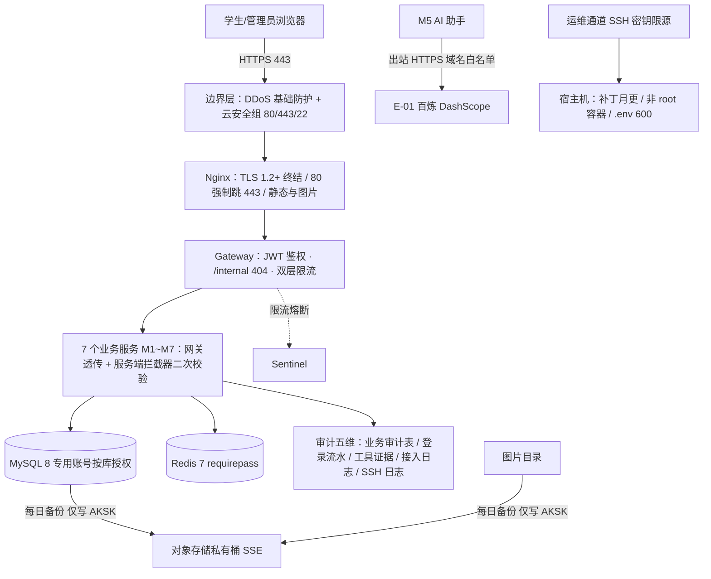
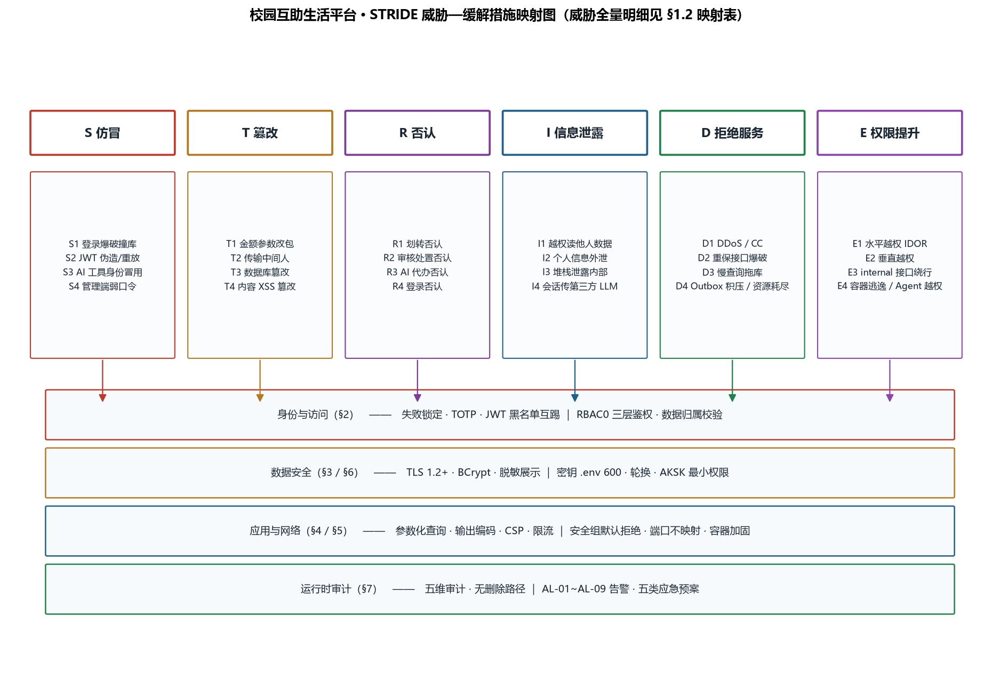
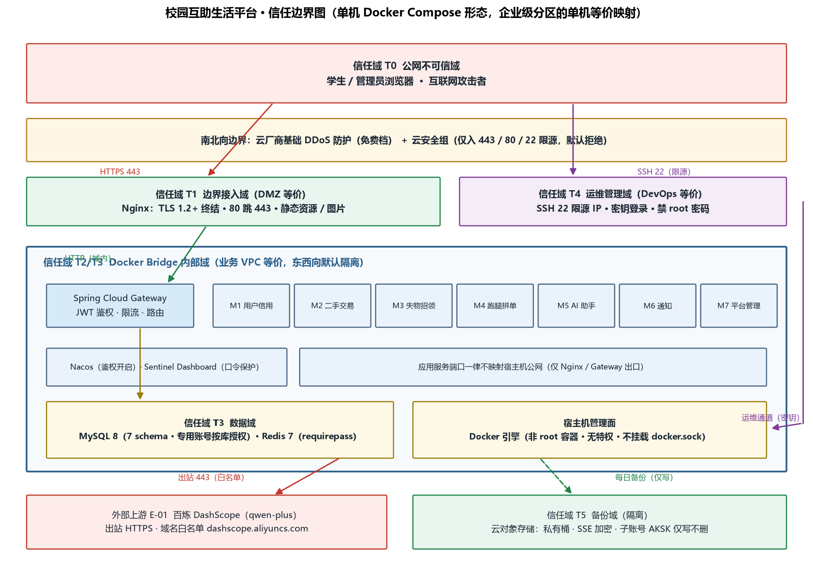
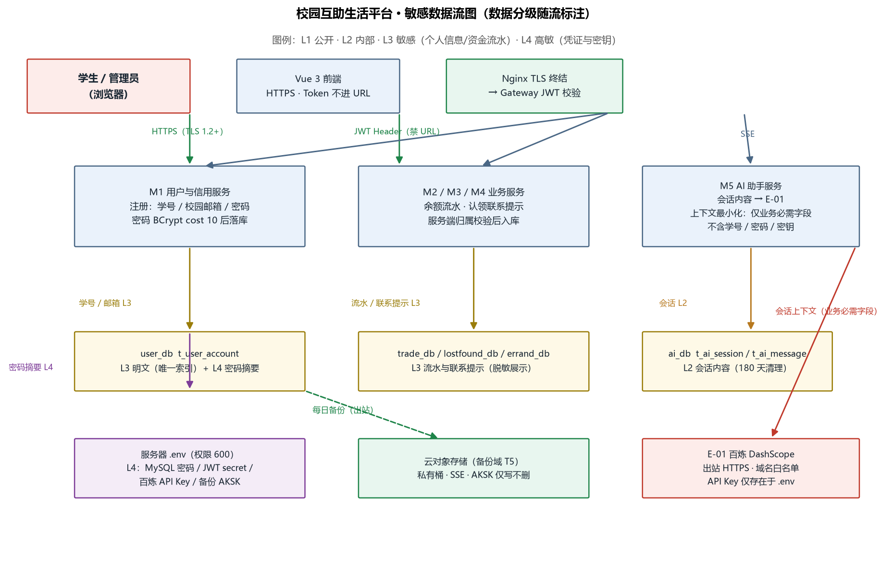

# 校园互助生活平台 · 安全设计

> 本文档为《AICoding 架构设计》核心产物之一，对应**《安全架构设计模版》**。
> 上游输入：《系统设计》v1.0（G4 已通过，威胁建模基线：模块边界 / 数据流 / 接口契约 / 身份边界 / 外部依赖 / 运行形态）；
> 下游输出：与《部署设计》（platform-architect）交叉对齐后进入 G5 审核，是 UserStory 与实施的安全约束输入。
> 本阶段 Owner：security-architect（严守正）；Gate：G5。

---

## 0. 元信息：修订记录

| 文档版本 | 发布日期 | 修订人 | 修订说明 |
| --- | --- | --- | --- |
| v0.1 | 2026-09-14 | security-architect（严守正） | 骨架稿：完成 §1 威胁建模、§2 IAM、§3 数据安全、§4 应用安全与 §5.1/§5.2 骨架（网络分区与流量管控初步规则），按 Step S 暂停 §6/§7 等待部署侧拓扑回传后回填 |
| v1.0 | 2026-09-14 | security-architect（严守正） | 正式稿：①§3.3.7 告知同意按中间确认结论（方案 A）落定；②收到部署设计 v0.1 后回填 §5.1 CIDR 建议值与购买日核对项、§5.2.3 新增 SG-08（uat 8443 限源）与 Bridge 网络策略结论、§5.3 资源编号对齐；③§6 密钥与凭证管理、§7 运行时安全成章（五类密钥分级/五维审计/五类应急预案）；④附录 A 补自检 4、附录 C 硬指标全部闭环 |
| v1.1 | 2026-09-14 | security-architect（严守正） | G5 交叉一致性 diff 定点返工（仅此一项，其余不动）：§5.1 CIDR 由本文档建议值改为部署侧权威值——prod Bridge（campus-net）172.28.0.0/16、uat Bridge（campus-uat-net）172.29.0.0/16、int 172.30.0.0/16；同步更新 §5.1 购买日核对项与附录 D 对账行；保留"显式固定、禁 Docker 随机分配"与"购买日不重叠核对"表述 |

**裁剪与适配总说明**（对应模板"使用说明"第 1~3 条）：

1. 本项目为**单台 2核4G 云服务器 + Docker Compose 自部署**的个人学生项目（系统设计 §5，冻结约束 O5：无 K8s、无多节点、无云上多产品），企业级组件（云 WAF、KMS、堡垒机、SOC、NAT 网关、mTLS、VPC 分区）按模板裁剪规则**逐项给出"不适用理由 + 单机等价替代控制"**，不做静默删除，保证硬指标可校验；
2. 本文档保留模板全部核心章节（威胁建模 / IAM / 数据安全 / 应用安全 / 网络与基础设施 / 密钥 / 运行时安全），章节序号与模板一致；
3. 所有阈值、算法、组件选型均结合本系统实际业务（校园单校、模拟资金、无真实支付、出口仅百炼 DashScope）确认，未照搬模板参考值；与《系统设计》§7 初步安全设计冲突或不一致之处，以本文档为准并逐项标注复核结论；
4. 全文以《系统设计》§1.3 名词表、§3.2 模块编号（M1~M7）、§4.2 表名、§8.4 告警编号（AL-xx）为基准引用，形成威胁—缓解—章节的映射闭环。

---

## 1. 安全总体架构

### 1.1 安全总体架构图

**总览**：以《系统设计》§5.4 部署拓扑为底，叠加安全控制面。下表为安全组件清单（结合单机形态裁剪，未启用项均给出替代控制）：

| 组件 | 作用 | 本系统启用结论 | 单机等价替代控制 |
| --- | --- | --- | --- |
| 抗 DDoS | 抵御流量攻击，避免业务不可访问 | 启用（云厂商基础 DDoS 防护免费档，系统设计 §7.1 冻结） | 应用侧网关全局限流 500 QPS 兜底 CC（§5.2.2） |
| WAF | 防御 Web 应用攻击、CC | **不启用**（本阶段权威结论，与系统设计 §6.2.1/§7.1 一致；理由：个人项目入口流量极小，云 WAF 成本不匹配） | §5.2.1 WAF 替代矩阵：Gateway 参数校验 + 全局限流 + 敏感词过滤 + §4 OWASP 逐项应用层防护 |
| 云防火墙 / 安全组 | 南北向边界流量管控 | 启用安全组（替代云防火墙，单机无 VPC 间东西向需求） | 安全组规则表见 §5.2.3（本文档权威产出） |
| 主机安全 | 漏洞修补、恶意文件检测、登录告警 | 启用（云厂商免费主机安全基线 + 手动月度补丁，冻结结论） | SSH 加固基线见 §5.3.1 |
| 数据安全审计 | 关键操作与资金账目审计 | 启用（审计表 + 五维日志，§7.2） | 审计表仅 INSERT 与状态更新、无删除路径 |
| KMS | 敏感数据加密、密钥托管 | **不启用**（冻结结论：单机无 KMS 预算） | 服务器 .env（权限 600）+ Git 忽略 + 轮换纪律，见 §6 |
| 堡垒机 | 运维通道保护 | **不适用**（唯一运维者即项目所有者） | SSH 密钥登录 + 限源 IP + SSH 登录审计（§5.2.4 / §7.2） |
| NAT 网关 | 隐藏内部架构、SNAT/DNAT | 不适用（单机弹性 IP 直出，无内网子网需要隐藏） | 中间件端口一律不映射宿主机公网（§5.2.3） |
| SOC | 资产管理、弱口令/配置扫描 | **不适用**（单人项目） | Grafana 告警 AL-01~AL-09 代偿安全事件感知（系统设计 §8.4） |
| 堡垒之外新增：Spring Cloud Gateway 鉴权 | 统一 JWT 校验、/internal/** 直接 404、全局限流 | 启用（冻结结论） | 服务内 UserContextInterceptor 二次校验（纵深防御） |

**安全总体架构图**（信任边界完整版含控制点标注，见 §1.2 信任边界图）：

### 1.2 威胁模型

采用 **STRIDE** 方法，威胁建模范围覆盖《系统设计》全部 7 个业务服务（M1~M7）、网关/Nacos/MySQL/Redis/Nginx 中间件、宿主机运维通道、备份通道与唯一外部依赖 E-01 百炼 DashScope。信任边界以单机形态映射为 6 个信任域（完整划分见 §5.1）：

| 信任边界 | 边界定义 | 跨界威胁面 |
| --- | --- | --- |
| 边界 B1：互联网 ↔ 边界接入域 | 云安全组 + DDoS 防护 + Nginx TLS | DDoS/CC、扫描、爆破、注入类攻击 |
| 边界 B2：边界接入域 ↔ 应用服务域 | Nginx 反代 → Gateway JWT 鉴权 | 伪造/过期 Token、垂直越权访问管理接口 |
| 边界 B3：应用服务域 ↔ 数据域 | Docker Bridge 网络隔离 + 中间件强鉴权 | 数据篡改、拖库、缓存/会话投毒 |
| 边界 B4：应用服务域 ↔ 外部上游 E-01 | 出站 HTTPS + 域名白名单 | API Key 泄露、会话数据外流 |
| 边界 B5：运维者 ↔ 宿主机 | SSH 22 限源 + 密钥登录 | 凭证爆破、主机失陷后横向影响全部信任域 |
| 边界 B6：应用域 ↔ 备份域 | 每日出站、AKSK 最小权限 | 备份泄露、勒索删除备份 |

**STRIDE 威胁明细与缓解映射表**（每条威胁映射到第 2~7 章具体缓解措施，映射链完整、无空行）：

| 编号 | 类别 | 威胁场景（对应系统设计位置） | 攻击路径简述 | 风险等级 | 缓解措施（映射章节） |
| --- | --- | --- | --- | --- | --- |
| S1 | 仿冒 | 学生登录接口爆破/撞库（M1 /api/v1/auth/login） | 脚本批量尝试弱密码，盗号后冒充交易/跑腿身份 | 高 | 登录失败 5 次锁 15 分钟（Redis 计数，§2.1.2）；重保接口单用户 5 次/分钟限流（§5.2.2）；BCrypt cost 10 慢哈希使撞库成本高（§2.1.2）；登录失败率告警 AL-08（§7.1） |
| S2 | 仿冒 | JWT 伪造或窃取重放（全站 API） | 抓包取 Token 重放，或猜测弱 secret 自签 Token | 高 | 强随机 secret ≥ 256 bit 且不入代码（§6.1）；全链路 TLS 1.2+ 防窃听（§3.2.1）；Token 有效期 2h（§2.1.3）；登出/互踢写 Redis 黑名单（§2.1.3）；token 禁止进 URL（§3.2.5） |
| S3 | 仿冒 | AI 写工具冒用他人身份（M5 代办链路） | 提示词注入诱导模型以他人身份登记失物/发跑腿单 | 中 | 写工具一律以服务端 UserContext.userId 为归属，模型参数不传入 userId（§4.3.6）；Agent 工具白名单 + 后置断言（§4.3.6）；工具调用全量留痕 t_ai_tool_call（§7.2） |
| S4 | 仿冒 | 管理端账号仿冒（admin 接管） | 针对唯一管理员账号爆破弱口令 | 高 | 管理端登录强制 TOTP 二次验证（§2.1.1）；重保限流（§5.2.2）；管理端与业务端登录入口分离 /admin/login（§2.1.1） |
| T1 | 篡改 | 关键金额参数改包（下单 price / 充值 amount / 酬劳 reward） | 前端改包低价下单、负数充值 | 高 | 服务端以 DB 快照计价：成交价取 t_goods.price 快照、入参区间校验 0.01~99999.99 与 1~500（§4.1）；金额字段 DECIMAL 禁浮点（§3.3.3）；资金流水 biz_req_no 幂等 + 每日链式对账（§3.3.3 / §7.1） |
| T2 | 篡改 | 传输链路篡改/中间人 | 公网明文抓包改包 | 中 | 全链路 HTTPS TLS 1.2+、禁用 SSLv3/TLS1.0/1.1、HSTS（§3.2.1） |
| T3 | 篡改 | 数据库/缓存数据篡改（主机失陷或直连） | 改 t_balance_account 余额、改 Redis 会话 | 高 | 中间件仅 Docker 内网可达、强口令鉴权、禁止公网映射（§5.4）；业务账号按库最小权限（§5.4.1）；流水链式对账发现篡改（§7.1）；备份可恢复（§3.3.6） |
| T4 | 篡改 | 存储型 XSS 篡改展示内容（商品/评语/失物描述） | 恶意脚本入库，浏览者会话被劫持 | 中 | 输出编码 + Vue 默认转义 + CSP（§4.1 XSS 行）；富文本一律按纯文本渲染约定（§4.1） |
| T5 | 篡改 | 供应链镜像/依赖篡改 | 拉取被投毒镜像或依赖 | 中 | 官方镜像固定版本 tag、发布前手动漏洞扫描（§4.4）；依赖国内可信镜像源白名单（§4.4） |
| R1 | 否认 | 买家/卖家否认划转与收款 | 交易纠纷时无凭据 | 中 | t_balance_flow 不可变流水含 biz_ref 与前后快照，永久保留（§7.2.2）；审计表无删除路径（§7.2.2） |
| R2 | 否认 | 管理员否认审核/下架处置 | 处置引发争议时无留痕 | 中 | t_audit_record opinion 必填 5~200 字（系统设计 §3.2.M7）；审计表仅 INSERT 与状态更新（§7.2.2） |
| R3 | 否认 | AI 代办否认（模型口头宣称成功） | 模型幻觉回复"已发布"但实际未执行 | 中 | 后置断言：写工具必须有系统证据 bizRef 才生成确认话术，t_ai_tool_call 留痕（§4.3.6，V4） |
| R4 | 否认 | 登录行为否认 | 盗号争议时无法回溯登录来源 | 低 | t_login_log 记录 userId/IP/结果/时间，保留 1 年（§7.2.2） |
| I1 | 信息泄露 | 水平越权读取他人数据（IDOR） | 遍历 ID 查他人订单/主页/通知 | 高 | 全部个人数据接口逐接口归属校验（§2.2.4 清单）；他人主页仅返回脱敏 UserPublicVO（§3.3.5） |
| I2 | 信息泄露 | 学号/邮箱/联系提示外泄 | 页面、日志、接口响应泄露明文 | 中 | 三级敏感字段展示脱敏规则（§3.3.5）；日志禁敏（§7.2.2）；无批量导出功能，天然规避导出泄露（§3.3.5） |
| I3 | 信息泄露 | 错误堆栈泄露内部信息 | 500 响应暴露 SQL/路径/版本 | 中 | 统一异常处理：对外仅 Result 结构与用户文案（§4.2.1）；生产关闭 debug 与 Knife4j（§4.2.2） |
| I4 | 信息泄露 | 用户会话数据过度传给第三方 LLM | 全量上下文送百炼导致个人信息外流 | 中 | AI 上下文最小化：仅传工具返回的业务必需字段，不传学号/密码/密钥（§3.3.7）；工具结果经 ToolAdapter ACL 转换（§4.3.6）；隐私政策明示第三方处理（§3.3.7） |
| I5 | 信息泄露 | 备份文件泄露 | 对象存储桶公开或 AKSK 泄露拖库 | 中 | 私有桶 + SSE 服务端加密 + 备份 AKSK 仅写不删（§3.3.6 / §6.2） |
| I6 | 信息泄露 | 密钥硬编码泄露 | Git 仓库/前端代码/日志泄密 | 高 | 密钥红线六禁（§6.3）；发布前密钥扫描 checklist（§6.3）；.env 在 .gitignore 且权限 600（§6.1） |
| D1 | 拒绝服务 | 公网 DDoS / CC 攻击 | 流量打满 3Mbps 带宽或耗尽 2核4G | 高 | 云基础 DDoS 防护（§5.2.1）；网关全局限流 500 QPS + 单 IP 60 QPS（§5.2.2）；Nginx 层连接与超时限制（§5.2.1） |
| D2 | 拒绝服务 | 重保接口爆破型资源耗尽 | 对登录/充值/抢单高频刷接口 | 中 | 单用户 5 次/分钟重保限流（§5.2.2）；登录失败锁定（§2.1.2） |
| D3 | 拒绝服务 | 慢查询拖垮 MySQL | 恶意构造检索条件全表扫 | 中 | 全文索引 + 分页上限 pageSize ≤ 100（§4.1）；慢查询日志 + 告警 AL-03（§7.1）；连接池上限（§5.4.1） |
| D4 | 拒绝服务 | Outbox 积压/事件风暴 | 状态事件堆积拖垮通知域 | 低 | 轮询批量上限 20 + 指数退避（系统设计 §3.2.M6）；积压告警 AL-04（§7.1） |
| D5 | 拒绝服务 | 单机资源耗尽（内存/CPU） | 任一容器内存失控拖垮整机 | 中 | 容器内存逐容器上限预算 ≤ 3GB（系统设计 §5.5.2）；水位告警 AL-05 + 红线限流联动（§7.1） |
| E1 | 权限提升 | 水平越权修改他人资源（IDOR 写） | 改包 orderId/cancel 接口取消他人订单 | 高 | 状态机前置校验 + 数据归属校验（buyer_id/seller_id/publisher_id == userId）（§2.2.4）；资金类仅状态属主可触发（§2.2.4） |
| E2 | 权限提升 | 垂直越权（学生调管理接口） | 直接请求 /api/v1/admin/** | 高 | 网关 JWT role claim 校验 + 服务端拦截器二次校验 + 前端 meta.roles 三层一致（§2.2.2） |
| E3 | 权限提升 | /internal 接口绕网关直连调用 | 端口暴露后直接调内部接口提升权限 | 高 | 网关对 /internal/** 直接 404（§5.2.2）；业务服务与中间件端口一律不映射宿主机公网（§5.2.3）；安全组默认拒绝（§5.2.3） |
| E4 | 权限提升 | 容器逃逸至宿主机 | 借助特权容器或 docker.sock 逃逸 | 中 | 容器非 root 运行、无特权、不挂载 docker.sock、官方最小化镜像（§5.3.2） |
| E5 | 权限提升 | AI Agent 跨域工具越权 | 交易 Agent 调用跑腿写工具等跨域操作 | 中 | 每个 Agent 独立工具白名单，命中拒绝记录 REJECTED_BY_WHITELIST（§4.3.6）；白名单外工具不发起业务调用（系统设计 §3.2.M5） |

**威胁—缓解措施映射图**（威胁全量明细以上表为准，图中为分层归纳）：

**信任边界图**：

### 1.3 敏感数据流

**敏感数据流说明**（数据分级定义见 §3.1；每条流标注保护控制）：

| 流编号 | 数据流 | 分级 | 保护控制（映射章节） |
| --- | --- | --- | --- |
| DF-1 | 注册：学号/校园邮箱/密码（浏览器 → 前端 → Gateway → M1 → user_db） | L3 + L4 | 全链路 HTTPS（§3.2.1）；密码 BCrypt cost 10 后落库、明文不落任何位置（§2.1.2）；学号唯一索引、展示脱敏（§3.3.5） |
| DF-2 | 登录：凭证换 JWT（浏览器 → M1 → Redis） | L4 | 失败锁定（§2.1.2）；t_login_log 留痕（§7.2.2）；secret 见 §6.1 |
| DF-3 | 交易资金：余额冻结/划转/充值流水（M2/M4 → trade_db） | L3 | biz_req_no 幂等唯一索引（§3.3.3）；对账任务链式校验（§7.1）；仅本人可见、管理端只看统计（§3.3.5） |
| DF-4 | 认领联系提示（M3 → lostfound_db） | L3 | 审核通过前对非双方脱敏展示（§3.3.5）；认领幂等唯一约束（系统设计 §4.2.t6） |
| DF-5 | AI 会话（浏览器 → M5 → ai_db + E-01 百炼） | L2 | 会话内容最小化出境（§3.3.7）；ai_db 180 天清理（§3.3.5）；E-01 仅出站域名白名单（§5.2.3） |
| DF-6 | 密钥与凭证（.env → 容器环境变量） | L4 | .env 权限 600 + Git 忽略（§6.1）；禁止入日志/堆栈（§6.3）；90 天轮换（§6.1） |
| DF-7 | 备份数据（MySQL/图片目录 → 对象存储） | L3 | 出站备份通道唯一（§5.2.3）；私有桶 + SSE + 仅写不删 AKSK（§3.3.6） |
| DF-8 | 商品/失物图片（上传 → Nginx 静态目录） | L1~L3 | 上传校验魔数+扩展名白名单+大小限制+随机重命名（§3.3.4）；目录禁执行（§3.3.4） |

---

## 2. 身份与访问管理（IAM）

### 2.1 身份认证（Authentication）

#### 2.1.1 用户登录

| 维度 | 本系统取值 | 说明 |
| --- | --- | --- |
| 账号体系 | 自建：学号 + 校园邮箱双标识、单一密码（系统设计 §7.2.1 冻结，无外部 SSO） | 注册要求校园邮箱域名校验，校园范围收敛注册面 |
| 登录方式一 | 账号密码登录（学号或校园邮箱 + 密码），BCrypt 比对 | 学生端与管理端共用账号体系，管理端入口独立路由 /admin/login |
| 登录方式二 | 管理端 TOTP 动态口令二次验证（密码 + TOTP 两因素） | 满足"认证方式不少于两种"硬指标；管理端强制、学生端不启用（单人管理员场景成本极低收益高） |
| 图形验证码 | MVP 不启用 | 裁剪理由：重保接口限流 + 失败锁定已覆盖爆破面；完整版若暴露面扩大（如开放外校访问）在登录与注册接口补充行为验证码 |
| MFA/2FA | 管理端强制（见登录方式二）；云控制台主账号强制 MFA（§2.3.1） | 学生端不启用（校园低敏场景，避免过度设计） |

#### 2.1.2 密码策略（量化阈值表）

| 项 | 本系统取值 | 与模板参考基线差异说明 |
| --- | --- | --- |
| 最小长度 | ≥ 8 位 | 与模板业务系统基线一致（系统设计 §7.2.1 冻结；校园场景友好，不上调 12 位） |
| 复杂度 | 禁止纯数字；不做四类字符强制组合 | 裁剪说明：强组合降低注册转化且校园低敏场景收益有限，以失败锁定 + 限流代偿 |
| 加密传输 | 全链路 HTTPS（TLS 1.2+）承载，密码字段不进 URL、不进日志 | 不做前端 RSA 加密的裁剪说明：HTTPS 已覆盖传输保密性，前端 RSA 需密钥分发管理，单机项目复杂度收益比为负；完整版若做浏览器侧防中间代理审计再评估 |
| 加密存储 | BCrypt cost 10 加盐哈希；禁止 MD5 / SHA1 / 明文 | 与系统设计 §7.2.1 一致 |
| 更换周期 | 不强制定期更换 | 裁剪说明：NIST SP 800-63B 不再建议强制定期换密（促弱密码），校园低敏场景按最小惊讶原则裁剪 |
| 重复限制 | 不启用最近 N 次不可复用 | 裁剪理由同上；密码哈希历史存储成本与收益不匹配 |
| 失败锁定 | 同一账号连续失败 5 次锁定 15 分钟（Redis 计数键 user:login:fail:{account}，系统设计 §4.4.3） | 与上游一致 |
| 自动登出 | Access Token 有效期 2h，过期即失效重新登录 | 对应模板"30 分钟无操作登出"的适配：JWT 无状态形态下以短有效期 + 前端过期跳转实现等效控制 |
| 注册策略 | 学生自助注册（校园邮箱域名校验 + 学号全校唯一约束） | 与模板"仅管理员创建"差异的裁剪说明：校园互助平台无管理员代建账号的运营人力，自助注册为业务前提；管理端账号不开放注册，由种子脚本初始化 |
| 改密验证 | 改密需验证原密码 | MVP 账号中心仅提供改密入口；完整版扩展资料编辑 |

#### 2.1.3 会话管理

| 维度 | 本系统取值 |
| --- | --- |
| Token 类型 | JWT（jjwt 0.12.6，HS256），网关统一校验后透传 UserContext（userId/role/schoolCode） |
| H3 复核结论 | **确认系统设计 §7.2.1 锁定的 JWT + 网关统一鉴权方案**。复核理由：① 两角色 RBAC0 + 单机部署，无会话共享需求，JWT 无状态最贴合；② 服务端拦截器二次校验补足 JWT 无法细粒度撤销的短板；③ jjwt 0.12.6 为当前维护版本。附带安全约束（本文档新增）：secret 长度 ≥ 256 bit 且仅存于 .env（§6.1）；JWT 载荷仅含 userId/role/schoolCode/jti/iat/exp，禁止携带敏感字段；完整版建议补充 refresh token（7d）+ 静默续签，MVP 以 2h 短有效期代偿 |
| 有效期 | Access Token 2h；MVP 不设 refresh token（2h 过期重新登录），完整版加 7d refresh 接口 |
| 互踢机制 | 单设备登录策略：新登录签发新 jti 并将旧 jti 写入 Redis 黑名单（键 common:jwt:blacklist:{jti}，TTL = 旧 Token 剩余有效期） |
| 主动注销 | 登出接口将当前 jti 写黑名单；网关校验黑名单命中即拒绝（C000002） |
| 风险登录检测 | MVP 不做异地/设备指纹检测（校园场景无异地语义）；代偿：t_login_log 全量留痕 + 登录失败率告警 AL-08，人工回溯 |
| Token 传递约束 | 仅置于 Authorization Header；禁止进 URL、禁止进日志、禁止渲染进页面源码注释（§3.2.5） |
| 前端存储取舍 | Access Token 存 Pinia 内存 + localStorage 持久化（MVP 取舍，配套 XSS 防护见 §4.1）；完整版可切换 HttpOnly Cookie 方案；**本取舍列入人工审核待确认项 B-2** |

### 2.2 授权与权限控制（Authorization）

#### 2.2.1 权限模型

- 采用 **RBAC0**（用户—角色—权限），两角色固定：STUDENT / ADMIN（系统设计 §7.2.5 冻结）；
- 不叠加 ABAC 的裁剪说明：角色固定为两个、数据敏感度由"归属校验 + 脱敏"承载，ABAC 属性条件无真实决策场景，引入即过度设计；完整版若引入多校园运营角色再评估；
- 权限判定路径：前端路由守卫（meta.roles）→ 网关 JWT role claim 校验 → 服务端 UserContextInterceptor 二次校验，三层一致（系统设计 §3.5.5 / §7.2.5）。

#### 2.2.2 权限维度

| 维度 | 本系统落地 |
| --- | --- |
| 接口级 | 网关统一 JWT 鉴权；/api/v1/admin/** 仅 ADMIN；/internal/** 网关直接 404 仅服务间可达；Knife4j 文档生产环境关闭（§4.2.2） |
| 数据级 | 行级：个人数据归属校验（见 §2.2.4 清单）；列级：脱敏展示（§3.3.5），管理端用户列表仅见脱敏学号/邮箱（系统设计 §7.2.2） |
| 功能级 | 前端路由 meta.requireAuth + meta.roles 全局守卫；管理端审核/内容/用户管理页面仅 admin 可达（系统设计 §3.5.5 路由清单） |

#### 2.2.3 多租户隔离

- 上游冻结：多租户 = 否（单校园实例），数据表以 school_code 预留维度字段（系统设计 §4.1）；
- 安全边界说明：本节安全设计仅承诺"单校数据不出实例、日志 tenantId 固定 CAMPUS-MAIN"；**多校扩展属于未冻结的边界变更，届时必须重新评审数据分级、隔离字段索引与越权防护清单**，不适用本版结论。

#### 2.2.4 越权防护

**水平越权（IDOR）逐接口归属校验清单**（每个查询/修改接口必须校验资源归属，无豁免）：

| 接口组 | 归属校验字段 | 校验规则 |
| --- | --- | --- |
| 商品编辑/下架（M2） | t_goods.seller_id | seller_id == 当前 userId，否则 C000003 |
| 订单确认收货/取消/评价（M2） | t_trade_order.buyer_id / seller_id | 仅对应属主可触发对应状态迁移；评价校验 rater 属于本单买卖双方 |
| 余额/流水查询（M2） | t_balance_account.user_id | 仅本人；管理端无个人明细权限（系统设计 §7.2.2） |
| 失物条目编辑/删除（M3） | t_lost_item.publisher_id | publisher_id == 当前 userId |
| 认领归还确认（M3） | t_claim_apply 关联失主 | 仅失主本人可确认归还（状态机前置校验） |
| 跑腿单状态动作（M4） | publisher_id / grabber_id | pickup/deliver 仅 grabber；finish/cancel 仅 publisher（系统设计 §3.2.M4 状态机） |
| 通知已读（M6） | t_notice.receiver_id | receiver_id == 当前 userId |
| AI 会话查询/删除（M5） | t_ai_session.user_id | user_id == 当前 userId；工具调用以服务端 UserContext.userId 为归属（§4.3.6） |

**垂直越权防护**：管理接口网关层校验 role=admin + 服务端拦截器二次校验 + 前端 meta.roles，三层缺一不可；**内部接口防绕行**：/internal/** 网关 404、业务与中间件端口不映射公网、安全组默认拒绝（§5.2.3），使外部攻击者无 /internal 网络可达路径。

### 2.3 云账号与云资源访问

> 单机个人项目实际云资源：1 台轻量云服务器 + 1 个对象存储备份桶 + 域名 DNS。裁剪说明：无多 VPC/多产品矩阵，按最小可用集裁剪。

| 维度 | 本系统取值 |
| --- | --- |
| 账号策略 | 云控制台主账号开启 MFA；日常运维仅 SSH 登录服务器，控制台仅用于升配/账单/安全组变更；禁止在代码与脚本中使用主账号访问密钥 |
| 权限分离 | 人员权限（控制台密码 + MFA）与程序权限（备份脚本子账号 AKSK，仅该备份桶写入权限）分离；程序 AKSK 管理见 §6.1/§6.2 |
| 高敏权限分离 | 安全组变更、服务器重装、域名解析变更、备份桶策略变更四类高敏操作仅项目所有者本人执行，且每类操作执行前填变更 checklist（变更项/时间/回退方式），操作后核对安全组规则表（§5.2.3）无漂移 |

---

## 3. 数据安全

### 3.1 数据分级

| 等级 | 类别 | 本系统数据对象（映射系统设计表名） | 处理策略 |
| --- | --- | --- | --- |
| L1 | 公开 | 商品/失物条目可见字段（t_goods、t_lost_item 业务字段）、平台公告 | 无特殊管控；发布内容过敏感词（系统设计 §3.2.M7） |
| L2 | 内部 | AI 会话内容（t_ai_session/t_ai_message）、通知内容（t_notice）、审核记录（t_audit_record）、运营指标 | 需登录鉴权访问；会话 180 天清理；审核记录永久留痕 |
| L3 | 敏感 | 学号、校园邮箱、认领联系提示（t_claim_apply.contact_hint）、余额与流水（t_balance_account/t_balance_flow） | 加密传输、登录鉴权、展示脱敏（§3.3.5）、逐接口归属校验（§2.2.4）、日志禁敏 |
| L4 | 高敏 | 密码摘要（t_user_account.password_hash）、JWT secret、百炼 API Key、MySQL 密码、备份 AKSK | 凭证类不入库（.env 托管，§6）；密码 BCrypt 单向哈希（§3.3.2）；严禁入日志/Git/URL（§6.3） |

**与系统设计 §7.2.2 三级分级的映射说明**：上游三级（L1 公开 / L2 个人信息 / L3 资金账目）并入本四级——上游"个人信息"对应本文 L3 敏感、"资金账目"并入 L3；本文新增 L2 内部承载 AI 会话等登录可见内容、新增 L4 高敏承载凭证类。分级细化仅影响文档口径与防护强度标注，不改变上游任何存储与接口设计（学号明文存储 + 唯一索引需求维持上游结论，见 §3.3.2 裁剪说明）。

### 3.2 数据传输安全

#### 3.2.1 公网访问

- 全链路 HTTPS / TLS 1.2+，禁用 SSLv3、TLS 1.0/1.1；
- TLS 终结点为 Nginx（冻结结论）：证书 Let's Encrypt 自动续期；Nginx TLS 配置基线：`ssl_protocols TLSv1.2 TLSv1.3`；启用 HSTS（max-age ≥ 15552000）；80 端口 301 强制跳 443；
- 内网（Nginx 之后）为 HTTP：属同一信任域 T1→T2 边界内转发，配合"端口不映射公网 + 安全组默认拒绝"构成等效边界（§5.2.3）。

#### 3.2.2 服务内部访问

- **不启用 mTLS**（系统设计 §6.3 冻结，本文档复核确认）：单机 Docker Bridge 单信任域内、无跨节点链路；东西向以网关鉴权 + /internal 不暴露 + 中间件强鉴权兜底；完整版若拆多机部署，跨机链路必须重新评审 mTLS 或等效加密。
- 服务间调用（OpenFeign 主链路 + Dubbo 单链路）均走 Docker 内部网络，禁止绕行公网。

#### 3.2.3 数据库连接

- MySQL/Redis 与应用同处 Docker Bridge 信任域 T3，**不启用 SSL 连接**（裁剪说明）：同机内网明文 + 账号强口令 + 仅内网可达 + 按库最小权限构成等效控制；云服务器磁盘层面依赖云厂商云盘加密选项（系统设计 §7.2.2 一致）；
- 备份文件出站至对象存储走 HTTPS，对象存储开启 SSE 服务端加密（§3.3.6）。

#### 3.2.4 接口签名（适用性裁剪决策）

- **本系统不引入 HMAC-SHA256 应用层接口签名**。裁剪理由：对外调用方仅为自有 Vue 前端（非开放 API、无第三方开发者），JWT + HTTPS 已提供身份认证与传输完整性；服务间调用为同一信任域内 OpenFeign/Dubbo，以网络隔离 + 网关 404 兜底；
- 防重放等效控制：资金类写操作以业务请求号 biz_req_no 唯一索引防重放（系统设计 §3.5.2）；写接口以 X-Idempotency-Key 幂等；JWT jti 互踢 + 2h 短有效期收敛 Token 重放窗口；
- **预留方案**（完整版若开放第三方 API 必须启用）：HMAC-SHA256 签名，参与签名字段 = HTTP 方法 + 路径 + 时间戳 + nonce + 请求体摘要；nonce 落 Redis 去重（TTL 5 分钟）；时间戳窗口 ±5 分钟；密钥按调用方独立签发（对应 §6.1 API Key 分级）。

#### 3.2.5 传参禁忌

| 禁忌项 | 本系统约束 |
| --- | --- |
| URL 携带 Token | 禁止：JWT 仅置于 Authorization Header；SSE 建立连接时经 Header 传递，禁止 query 传 token |
| URL/日志携带密钥 | 禁止：JWT secret、百炼 API Key、MySQL 密码、备份 AKSK 不得出现在 URL、日志、错误堆栈、traceId |
| URL 携带学号/手机号明文 | 禁止：学号不出现在 URL 与 GET query；本系统不采集手机号（§3.3.7 最小化采集） |
| GET 携带敏感参数 | 禁止：余额/流水/认领凭证等 L3 数据一律 POST 或受鉴权 GET 且不入 URL 检索位；检索关键词属 L1 公开查询除外 |
| 前端持久化敏感数据 | 禁止：localStorage 不得存储密码、学号明文、密钥；仅存 Access Token（取舍见 §2.1.3） |

### 3.3 数据存储安全

#### 3.3.1 加密存储

| 分级 | 存储策略 |
| --- | --- |
| L4 凭证 | 不入库：MySQL 密码/JWT secret/API Key/备份 AKSK 存服务器 .env（权限 600，§6.1）；用户密码 BCrypt 单向哈希入库 |
| L3 敏感 | 业务字段明文存储（学号唯一索引与检索需要，见 §3.3.2）+ 三层控制补强：传输 TLS、展示脱敏、归属校验；磁盘层依赖云盘加密选项 |
| L1/L2 | 明文存储 + 访问控制 |

**应用层 AES-256 加密不启用的裁剪说明**：应用层加密需 KMS 托管密钥（密钥与密文同机存储形同虚设），而本系统冻结不启用云 KMS（系统设计 §7.1）；校园场景 L3 数据威胁面已由传输/展示/访问控制覆盖；完整版若采集手机号/身份证等强监管字段，必须同步引入 KMS + 客户端加密，二者绑定决策。

#### 3.3.2 敏感字段单向哈希加盐

- 用户密码：BCrypt cost 10（自带盐）；
- 学号不做哈希（裁剪说明）：学号是注册唯一索引（uk_student_no）与登录检索键，单向哈希后无法检索；其敏感度由展示脱敏 + 归属校验承担（§3.3.5）；
- 无其他不可逆摘要字段需求（本系统无第三方回调 Token 校验场景）。

#### 3.3.3 数据库安全

| 维度 | 本系统取值 |
| --- | --- |
| 账号最小权限 | 每业务库独立专用账号（7 账号各仅授权本 schema 的 CRUD），禁用 root 供应用直连；运维使用单独管理账号仅人工登录容器执行 |
| 慢查询与审计 | 开启慢查询日志（long_query_time 1s，入 Loki 观测 profile）；审计依托业务审计表（§7.2.2）与 binlog |
| binlog | ROW 格式实时落盘保留 7 天（恢复 + 变更回溯，系统设计 §4.3.1） |
| 备份加密 | 备份上传对象存储开启 SSE 服务端加密；备份桶私有（§3.3.6） |
| SQL 注入防线 | 见 §4.1 A03 注入行 |

#### 3.3.4 文件存储安全

商品/失物图片存宿主机挂载目录（系统设计 §5.2.4 冻结，不引入对象存储直传），安全设计如下：

| 维度 | 本系统取值 |
| --- | --- |
| 上传校验 | 扩展名白名单 jpg/jpeg/png/webp；文件大小 ≤ 5MB；服务端读取文件头魔数二次校验（防扩展名伪装） |
| 存储命名 | 服务端 UUID 随机重命名，禁止沿用用户原始文件名（防路径穿越与猜测） |
| 访问控制 | 图片属 L1/L3 随条目公开/受限：Nginx 静态目录直接托管；认领凭证类图片（L3）路径以 UUID 不可枚举 + 条目鉴权页内展示 |
| 目录禁执行 | Nginx 对图片目录关闭一切解释器回退，仅静态文件响应；上传接口需登录 + 限流（§5.2.2） |

#### 3.3.5 数据使用安全

**展示脱敏规则**（服务端统一脱敏工具类实现，前端不做二次处理）：

| 字段 | 脱敏规则 | 适用场景 |
| --- | --- | --- |
| 学号 | 中间 4 位打星（如 2021…01 形态按系统设计 §7.2.2） | 他人主页、管理端用户列表 |
| 校园邮箱 | 首字符 + 三星 + 域名 | 他人主页、管理端列表 |
| 认领联系提示 | 审核通过前对非申请双方打星，通过后双方互见完整 | 认领详情页 |
| 余额/流水金额 | 不脱敏但仅本人可见；管理端仅统计聚合无个人明细 | 余额中心 |

**数据导出管控**：MVP 不提供任何批量导出接口（冻结结论，天然规避导出合规问题）；完整版若新增导出，必须配套：导出审批 + 文件水印（操作人 + 时间）+ 行数上限 + 导出操作写审计表，四项缺一不可。

**数据销毁策略**：沿用系统设计 §4.2 各表清理机制并补充用户注销路径——

| 场景 | 策略 |
| --- | --- |
| 常规过期数据 | CLOSED 条目/归档表按上游 §4.2 清理机制定时归档与物理清理 |
| AI 会话 | 用户可删除会话（接口已有）；CLOSED 180 天物理清理 |
| 用户注销/被遗忘请求 | 完整版路径：软删除账号 + 保留交易/审计类记录（t_balance_flow、t_audit_record、t_ai_tool_call 依法需留痕）+ 昵称与联系方式置匿名占位；MVP 以封禁（BANNED）替代注销 |

#### 3.3.6 数据备份与容灾

| 维度 | 取值（上游 §4.3.2 为基线，安全侧补充加粗项） |
| --- | --- |
| 备份方式 | mysqldump 每日 03:00 全量 + binlog 实时落盘（7 天）+ 图片目录 tar，上传云对象存储 |
| **备份访问控制** | **私有桶；备份子账号 AKSK 仅授予该桶写入权限（PutObject），不授予删除/读取，防勒索场景攻击者删库并清空备份**（§6.2） |
| **备份加密** | **对象存储 SSE 服务端加密开启** |
| 保留策略 | 全量 30 天；binlog 7 天；图片快照 30 天 |
| RPO / RTO | 常态 RPO ≤ 5 分钟；数据级 RTO ≤ 30 分钟；整机 ≤ 4 小时（上游冻结值，安全侧无修改） |
| 恢复演练 | 交付前 1 次全流程演练 + 每季度 1 次抽查（上游冻结；演练记录写入 docs/runbook 留痕，作为应急响应 §7.3 的输入） |

#### 3.3.7 隐私合规

**适用框架判定**：

| 框架 | 结论 | 判定依据 |
| --- | --- | --- |
| 《个人信息保护法》 | 适用（按校园个人项目的相称性落实） | 系统采集在校生学号、校园邮箱、昵称等个人信息；落实最小化采集、目的限定、告知同意、留痕与删除路径（见下） |
| 《数据安全法》 | 适用（一般数据安全管理义务） | 落实分级（§3.1）、访问控制（§2.2）与日志审计（§7.2）即为该法框架下的相称性措施 |
| GDPR | 不适用 | 无欧盟境内数据主体、无欧盟业务、数据不出境（唯一外部上游百炼为境内服务）；若未来扩展境外访问需重新评审 |

**个人信息保护落实清单**：

| 义务 | 本系统落实 |
| --- | --- |
| 最小化采集 | 仅采集学号/校园邮箱/昵称/密码；**不采集手机号、身份证、地理位置**（失物地点为用户自填文本，非定位数据） |
| 目的限定 | 学号/邮箱仅用于身份识别与登录；联系提示仅用于认领归还场景 |
| 告知与同意 | **注册页增加"已阅读并同意《用户协议与隐私政策》"勾选（提交前强制）+ 静态政策页**【经中间确认：方案 A】。政策文本四要素：①采集范围（学号/校园邮箱/昵称/密码，不采集手机号/身份证/定位）；②用途限定（身份识别/登录/认领归还）；③第三方委托处理告知（AI 会话内容将传输至阿里云百炼生成回复）；④删除路径与留痕豁免说明（见下两行） |
| 委托处理告知 | AI 会话内容将传输至阿里云百炼用于生成回复——该事实属于应向用户告知的第三方委托处理场景，若采纳同意机制则必须写入隐私政策文本 |
| 主体权利 | 查询（本人主页/导出流水页内查看）、更正（改密/资料）、删除（会话删除已实现；账号注销见 §3.3.5 完整版路径） |
| 留痕豁免说明 | 交易流水/审核记录/AI 工具证据依法务与纠纷回溯需要永久保留，注销时不物理删除个人在交易中的必要记录，仅匿名化展示 |

**经中间确认决策——用户同意机制（已落定）**：注册页增加"已阅读并同意《用户协议与隐私政策》"勾选 + 静态政策页，AI 会话传输百炼的第三方委托处理事实写入政策文本。【经中间确认：方案 A，用户原文选择"方案 A：加勾选+政策页（推荐）"】；对下游影响：UserStory 增加 1 个注册前勾选验收点 + 1 个静态政策页（前端开发量约 0.5 人日内）。

---

## 4. 应用安全

> 以 OWASP Top 10（2021）为风险框架，结合本系统模块逐项给出具体防护措施与落点（非泛化表述）。

### 4.1 输入安全（OWASP Top 10 防护矩阵）

| 风险 | 本系统具体防护措施（含落点） |
| --- | --- |
| A01 访问控制失效（含 IDOR / 越权） | 三层鉴权链：前端 meta.roles → 网关 JWT role claim → 服务端 UserContextInterceptor（§2.2.2）；§2.2.4 十类个人数据接口逐接口归属校验清单；/internal/** 网关 404；管理端接口仅 ADMIN |
| A02 加密机制失效 | TLS 1.2+ 全链路（§3.2.1）；BCrypt cost 10（§2.1.2）；密钥集中管理禁硬编码（§6）；L3 数据展示脱敏（§3.3.5） |
| A03 注入（SQL/命令/模板） | SQL：MyBatis-Plus 参数绑定全量使用占位符，代码评审禁用字符串拼接 SQL，动态排序字段仅允许枚举白名单映射（禁止直接拼列名）；命令注入：全项目禁止 Runtime.exec/ProcessBuilder 调用（无该需求，代码评审红线）；模板注入：不引入模板引擎（用户冻结 poi-tl），无风险面 |
| A04 不安全设计 | 资金操作单库本地事务 + 状态机前置校验 + 资金类强制幂等 biz_req_no（系统设计 §3.5.2）；抢单三重防线（Redisson 锁 + 乐观锁 + uk 唯一约束）；对账任务兜底数据完整性（§7.1） |
| A05 安全配置错误 | Nacos 开启鉴权并修改默认 nacos/nacos 口令（§5.4.3）；Redis requirepass 强口令（§5.4.2）；Knife4j 生产环境关闭（§4.2.2）；Actuator 仅暴露 liveness/readiness 探针端点，env/heapdump 等一律禁用（§5.3.1）；CORS 仅允许同源域名白名单；Nginx 隐藏版本号响应头 |
| A06 自带缺陷组件 | 依赖版本基线取自系统设计 §3.1.5（Boot 3.4.5 / SCA 2023.0.3.2 / jjwt 0.12.6 等 2024~2025 稳定版）；发布前手动执行 OWASP dependency-check 扫描高危 CVE（单机无 CICD 服务器的裁剪说明：以版本基线 + 发布前手动扫描替代流水线门禁）；运行期 Grafana 容量与错误率告警兜底异常 |
| A07 身份认证失效 | §2.1 全套：失败锁定、TOTP（管理端）、2h 短有效期、互踢黑名单、BCrypt；登录失败率告警 AL-08 |
| A08 数据完整性失效（反序列化/不安全传参） | 禁用 fastjson autoType 与 Jackson 多态默认类型（全项目 JSON 用 Jackson 白名单配置）；Dubbo 单链路 Hessian2 仅内网同版本服务间使用（攻击面收敛到不可达）；对象存储回调类功能不存在，无外部反序列化入口 |
| A09 日志与监控失效 | 五维审计日志（§7.2.2）+ AL-01~AL-09 告警（§7.1）+ 错误请求 100% 采样（系统设计 §8.3） |
| A10 SSRF | 全系统无用户可控的服务端出站请求：AI 工具仅调用白名单内部服务（系统设计 §3.2.M5）；唯一出站域名 dashscope.aliyuncs.com 白名单（系统设计 §6.2.2）；禁止接受用户提交 URL 并在服务端请求的功能（代码评审红线） |
| 文件上传 | §3.3.4：扩展名白名单 + 魔数校验 + 5MB 上限 + UUID 重命名 + 目录禁执行 + 上传接口鉴权限流 |
| XXE | 全项目无 XML 解析需求（JSON 体系；Dubbo/Hessian 非 XML）；如未来引入 XML 组件，必须关闭 DTD 与外部实体（代码评审红线） |
| 开放重定向 | 现无服务端跳转参数；前端路由守卫仅内部路由跳转；如新增跳转逻辑必须走域名白名单（代码评审红线） |

### 4.2 输出安全

#### 4.2.1 统一异常处理

- 全局异常处理器统一返回 Result 结构（code/msg/data/traceId，系统设计 §3.5.1），业务文案取自错误码注册表（19 条已定义）；
- 禁止对外暴露堆栈、SQL 语句、内部路径、容器/主机名、组件版本信息；B 类系统错误对外统一 C 文案"系统繁忙，请稍后再试"，堆栈仅入日志。

#### 4.2.2 调试信息管控

- 生产 profile 关闭 debug 日志级别；Knife4j/OpenAPI 文档生产环境禁用（答辩演示经独立演示 profile 开启，不影响生产安全基线）；
- Actuator 仅暴露 /actuator/health/liveness 与 /actuator/health/readiness 两个端点（系统设计 §5.2.1 健康检查路径），management.endpoints 其余全部排除；
- Nginx 关闭 server_tokens；错误页自定义，不透出 Nginx 版本页。

### 4.3 业务逻辑安全

| 维度 | 本系统措施 |
| --- | --- |
| 越权防护 | §2.2.4 全量清单（水平 + 垂直 + 内部接口防绕行），无豁免接口 |
| 防刷防爬 | 限流三层：全局 500 QPS / 单 IP 60 / 单用户读 30 写 10（系统设计 §3.5.3）；重保接口 5 次/分钟；分页 pageSize 上限 100 防批量爬取 |
| 防薅羊毛 | 余额体系无真实资金（风险本质收敛）：模拟充值单笔上限 500 + 单用户限流；完单奖励由状态机事件驱动不可重复领取（bizEventId 唯一索引，系统设计 §3.2.M1）；信用分区间钳制 [0,200] 防刷分 |
| 幂等性 | 全部写接口幂等（系统设计 §3.5.2 五问回答）：Redis SETNX 防抖 + DB 唯一索引兜底，资金/竞争类强制 |
| 关键操作二次验证 | 资金类（充值/下单冻结/划转）前端二次确认弹窗 + 后端幂等；管理端 TOTP；改密需原密码（§2.1.2） |
| AI 工具可信（V4 承接） | 每 Agent 独立工具白名单；写工具幂等键 sessionId+messageId；后置断言必须有系统证据 bizRef 才生成确认话术；断言失败率 24h > 10% 告警 AL-07（系统设计 §3.2.M5 / §8.4） |

### 4.4 第三方与供应链安全

| 维度 | 本系统措施 |
| --- | --- |
| 组件漏洞管理 | 版本基线（系统设计 §3.1.5）+ 发布前 OWASP dependency-check 手动扫描；高危 CVE 修复前不发布 |
| 开源协议合规 | 选型均为 Apache-2.0 / MIT 类协议（Spring 生态、Vue、MySQL Community、Redis、Nginx、Loki/Grafana 组合按各自许可）；约定不引入 GPL/AGPL 传染协议组件（代码评审红线） |
| 第三方服务评估 | 唯一外部服务 E-01 百炼：使用官方 SDK（经 Spring AI starter 封装）、HTTPS 传输、API Key 独立管理（§6.1）、出口域名白名单（§5.2.3）；密钥泄露应急见 §7.3 |
| 镜像与依赖源 | Docker 官方镜像 + 固定版本 tag；Maven/pip/npm 使用国内可信镜像源白名单，禁用未知源（防投毒） |
| 供应商条款 | 个人项目无商务合同；以百炼服务协议与数据合规声明为准，API Key 最小授权 + 90 天轮换降低依赖风险 |

---

## 5. 网络与基础设施安全

### 5.1 网络分区（信任域划分）

> 企业级"DMZ / 业务 / DevOps 三 VPC"在单机 Docker Compose 形态下的**等价映射**如下，已与部署设计 v0.1（§2.2.3 R-N-004、§3.1 五层拓扑）对齐；具体资源 ID（安全组实例、服务器、域名）待服务器购买后由部署侧回填，网络取值约束见本节 CIDR 建议值与购买日核对项。

| 信任域 | 企业级等价物 | 包含组件 | 域内安全要求 |
| --- | --- | --- | --- |
| T0 公网不可信域 | 互联网 | 用户浏览器、潜在攻击者 | 无任何数据与凭据驻留 |
| T1 边界接入域 | DMZ VPC | 云安全组、DDoS 基础防护、Nginx（TLS 终结/静态/图片） | 仅 443/80 对外；Nginx 无业务数据落盘（静态图片除外） |
| T2 应用服务域 | 业务 VPC | Gateway、M1~M7、Nacos、Sentinel Dashboard | 仅 T1 与域内可达；/internal 不出域 |
| T3 数据域 | 业务 VPC 数据子网 | MySQL（7 库）、Redis | 仅 T2 可达；端口不映射宿主机公网；强口令鉴权 |
| T4 运维管理域 | DevOps VPC | 宿主机 SSH、Docker 引擎、.env 密钥 | 仅运维者限源 IP 可达；密钥目录权限 600 |
| T5 备份域 | 独立云产品 | 对象存储备份桶 | 仅 T2 出站可达；AKSK 仅写不删；SSE 开启 |

**域间边界控制**：

| 边界 | 控制手段 |
| --- | --- |
| T0 ↔ T1 | 云安全组（默认拒绝，显式放通 443/80/22 限源）+ DDoS 基础防护（§5.2.1/§5.2.3） |
| T1 ↔ T2 | Nginx 反代固定转发 + Gateway 鉴权；Nginx 之后无任何组件直接映射公网端口 |
| T2 ↔ T3 | Docker Bridge 网络隔离（业务服务与中间件端口不映射宿主机）+ MySQL/Redis 强口令（§5.4） |
| T2 ↔ 外部 E-01 | 出站 HTTPS + 域名白名单 dashscope.aliyuncs.com（唯一出站业务目标） |
| T4 ↔ 全部 | SSH 密钥登录 + 限源 IP + 审计（§5.2.4）；T4 失陷即全域失陷，故 SSH 加固为最高优先级基线 |
| T2 ↔ T5 | 每日一次出站备份（HTTPS）+ 仅写 AKSK |

**信任边界图**见 §1.2。**CIDR 建议值与约束**（与部署设计 R-N-004 对齐；服务器未购买，购买日按下述核对项回填）：

| 网络 | 建议网段 | 说明 |
| --- | --- | --- |
| 宿主机所在 VPC/子网 | 云厂商默认（购买后回填，常见 10.0.0.0/16 或 172.16.0.0/16 段） | 单机形态无自定义 VPC 硬需求 |
| prod Compose Bridge（campus-net） | 部署侧权威值：172.28.0.0/16（显式固定，禁 Docker 随机分配） | 与部署设计 §3.1.2 对齐；与腾讯云轻量默认 VPC 常见 172.16.0.0/16 不重叠，购买日仍需实测核对 |
| uat Compose Bridge（campus-uat-net） | 部署侧权威值：172.29.0.0/16（显式固定，禁 Docker 随机分配） | 与 prod 网段分离，强化 project 三元隔离 |
| int Bridge（campus-int-net，开发机本地） | 部署侧权威值：172.30.0.0/16（部署侧兜底 172.31.0.0/16、10.210.0.0/16） | 与生产无互联；本地启动时避开校园网/家庭网段即可 |

**购买日核对项（列入上线 checklist）**：①确认 VPC CIDR 与 172.28.0.0/16、172.29.0.0/16 不重叠（腾讯云轻量默认 VPC 常见 172.16.0.0/16，与部署侧取值不冲突，仍以实测为准）；②确认安全组按 §5.2.3 规则表配置；③确认 22 端口限源清单为运维者当前出口 IP。

### 5.2 流量管控（南北向 + 东西向）

#### 5.2.1 公网入口防护

| 层 | 措施 |
| --- | --- |
| DDoS | 云厂商基础 DDoS 防护免费档（冻结结论）；带宽 3Mbps 为天然限流瓶颈，超大流量由云侧黑洞承接 |
| WAF（权威结论） | **不启用云 WAF**。替代矩阵：Gateway 参数校验（JSR-303 全量 DTO 注解校验）+ 全局限流（§5.2.2）+ 敏感词 DFA 过滤（内容安全）+ §4.1 OWASP 逐项应用层防护 + 统一异常处理防信息泄露。完整版若开放公网 API 生态再评估免费 WAF 方案 |
| 入口收敛 | 仅 Nginx 暴露 443（TLS 1.2+），80 强制 301 跳 443；Nginx 层配置单 IP 连接数与请求体大小上限（client_max_body_size 8m，覆盖图片 5MB 上限） |

#### 5.2.2 网关层管控

| 维度 | 取值（继承系统设计 §3.5.3，安全侧确认无修改） |
| --- | --- |
| 全局 QPS | 500（超限 C000004，红线与容量水位联动） |
| 单 IP | 60 QPS |
| 单用户 | 读 30 / 写 10 QPS |
| 重保接口 | 登录/充值/抢单 5 次/分钟 |
| /internal/** | 网关直接 404，不进入业务路由 |
| Sentinel 服务级 | 单服务 200 QPS；异常比例 > 50% 熔断 30s（BD-01/BD-04 降级） |

#### 5.2.3 主机流量防护（安全组规则表——本文档权威产出，platform-architect 按此配置）

| 规则号 | 方向 | 协议/端口 | 源/目标 | 策略 | 说明 |
| --- | --- | --- | --- | --- | --- |
| SG-01 | 入 | TCP 443 | 0.0.0.0/0 | 放行 | 唯一业务入口（HTTPS） |
| SG-02 | 入 | TCP 80 | 0.0.0.0/0 | 放行 | 仅用于 301 跳 443 |
| SG-03 | 入 | TCP 22 | 运维者常用出口 IP（/32 精确放通，多出口逐条列示） | 放行 | SSH 运维通道；出口 IP 变更时按 §2.3.3 高敏变更流程更新 |
| SG-04 | 入 | 全部协议 | 0.0.0.0/0 | 默认拒绝 | 显式兜底 |
| SG-05 | 出 | TCP 443 | 目的 dashscope.aliyuncs.com / 对象存储 / Let's Encrypt 校验 | 放行 | 白名单出站（应用层再校验域名） |
| SG-06 | 出 | 其余 | — | 放行（单机形态裁剪说明：云安全组出向精细到域名需 WAF/代理类产品，成本不匹配；域名白名单由应用层与 DNS 解析固定保障） | 完整版可收紧 |
| SG-07 | 入 | ICMP | 运维者出口 IP | 放行 | 可选：连通性诊断 |
| SG-08 | 入 | TCP 8443 | 运维者出口 IP（/32）+ 演示窗口临时白名单（/32 逐条） | 放行 | uat 发布/演示窗口专用（部署设计 §2.1 uat 行）；临时条目窗口结束后立即移除并按 §2.3.3 checklist 复核 |

**uat 8443 限源清单定义**（部署侧对接点 2 回执）：常驻放行仅运维者出口 IP（与 SG-03 同源维护）；演示评审场景在窗口开启时按需追加评审人出口 IP /32 条目，窗口关闭即删除；禁止对 8443 开放 0.0.0.0/0；uat 与 prod 同机 project 隔离（独立 Bridge 网段、独立数据卷、独立 .env，禁止共用任何密钥）。**Bridge 内网络策略结论**（部署侧 mTLS 行对齐）：单机 Bridge 维持单一信任域 + 端口不映射 + 中间件强鉴权为本版基线，mTLS 不启用确认；完整版可选增强为"边缘/应用/数据"三 Bridge 网段（MySQL/Redis 独立数据网段，仅服务层可达），届时与部署侧同步评审，非本期范围。

**端口映射白名单**（宿主机侧，安全侧权威约束）：仅 Nginx 443/80、SSH 22 映射/监听宿主机；Gateway、M1~M7、MySQL、Redis、Nacos、Sentinel 及观测组合容器**一律不映射宿主机端口**（系统设计 §6.1 冻结，本表为安全侧复核确认）。

#### 5.2.4 运维通道防护

- SSH 基线：密钥登录（禁用密码认证）、禁 root 远程登录（独立运维账号 + sudo）、22 端口限源（SG-03）；
- 无堡垒机的裁剪说明：唯一运维者即项目所有者；SSH 会话审计以 auth 日志承载（§7.2.2 第五维），高危操作（重装/安全组变更）走 §2.3.3 checklist；
- 运维操作窗口约定：高危变更前先执行备份（§3.3.6）并确认回退路径。

### 5.3 主机与容器安全

#### 5.3.1 主机安全

| 维度 | 本系统取值 |
| --- | --- |
| 系统基线 | 最小化安装（无多余服务）、云厂商免费主机安全基线（异常登录告警，冻结结论）、系统补丁手动月度更新并记录 |
| 账号管控 | 禁 root 远程登录；运维独立账号 + sudo 白名单命令；定期核对 /etc/passwd 无异常账号 |
| 登录加固 | SSH 仅密钥（§5.2.4）；可选 fail2ban（SSH 失败 IP 自动封禁，部署侧确认资源占用后启用） |
| Actuator/探针 | 仅暴露 liveness/readiness（§4.2.2）；管理端口不映射公网 |
| 漏洞感知 | 云主机安全基线告警 + 每月手工核对关键组件 CVE（依赖 §4.4 扫描结论） |

#### 5.3.2 容器安全

| 维度 | 本系统取值 |
| --- | --- |
| 镜像来源 | 全部使用官方镜像（MySQL/Redis/Nacos/Nginx 等）+ 应用自建镜像最小化（多阶段构建）；固定版本 tag（系统设计 §3.1.5 版本矩阵） |
| 运行权限 | 容器内进程非 root 运行；docker-compose 无 privileged、无 host network、不挂载 docker.sock；宿主机敏感目录只读挂载 |
| 密钥治理 | 镜像内禁止打包任何密钥；运行时经 .env 注入环境变量（§6.1）；镜像构建上下文排除 .env（.dockerignore） |
| 资源约束 | 每容器内存上限（系统设计 §5.5.2 预算表）+ restart:always；防止单容器拖垮整机（联动 D5） |
| 漏洞扫描 | 发布前对自建镜像手动执行 trivy 扫描（可选基线）；镜像不使用 latest 漂移 tag |
| 逃逸防线 | 非 root + 无特权 + 不挂载 docker.sock 三重约束（对应威胁 E4） |

> 本节与部署侧资源编号对齐（部署设计 §2.2.6）：SSH 密钥登录 + 限源 + 主机安全基线 = R-Sec-003；TLS 证书 = R-Sec-002（Let's Encrypt 自动续期，续期任务失败需告警感知——证书过期属可预期安全事故，列入 §7.3 应急预案漏洞类触发源）；.env 凭证 = R-Sec-004（分级细则见 §6）；DDoS = R-Sec-005。fail2ban 为可选项：若启用，其封禁记录纳入 §7.2 运维通道审计维度。

### 5.4 中间件安全

| 中间件 | 网络隔离 | 强制鉴权 | 审计 |
| --- | --- | --- | --- |
| MySQL 8 | 仅 T2 可达，端口不映射公网（§5.2.3） | 按库专用账号（7 账号最小权限）+ 强口令；禁 root 直连（§3.3.3）；**Nacos/Sentinel 同理**（见下行） | 慢查询日志 + binlog（§3.3.3） |
| Redis 7 | 仅 T2 可达 | requirepass 强口令（≥ 24 位随机，入 .env）；禁用 FLUSHALL 类命令的未授权执行风险由网络隔离 + 口令承担 | 键空间事件仅业务内部使用 |
| Nacos 2.3.2 | 仅 T2 可达 | **开启鉴权 nacos.core.auth.enabled=true，修改默认 nacos/nacos 口令为强口令**（安全侧新增要求，系统设计未显式覆盖，部署侧按此配置） | 配置变更经控制台操作留痕（变更记录文档化） |
| Sentinel Dashboard 1.8.8 | 仅 T2 可达 | **控制台设置登录口令**（默认空口令必须修改；安全侧新增要求） | 规则变更记录文档化 |
| Knife4j | 生产禁用（§4.2.2） | — | — |

> 安全侧新增要求小结（供 G5 与部署侧对齐）：Nacos 鉴权开启、Sentinel 控制台口令、Actuator 端点最小暴露、Nginx server_tokens 关闭、CORS 同源白名单，共 5 项，均为上游未显式覆盖但单机形态必须补齐的基线。

---

## 6. 密钥与凭证管理

> 本章为安全侧权威产出；部署侧按此配置 L4 Secret 层（对接 R-M-006 / R-Sec-004，回执见文末对账）。密钥分级、轮转周期、访问控制细则均为本阶段冻结基线。

### 6.1 密钥分级与存储

| 密钥类型 | 本系统实例 | 存储 / 下发方式 | 访问控制 | 轮换策略 |
| --- | --- | --- | --- | --- |
| 数据库密码 | MySQL 8 campus-mysql（root 保留本地应急 + 7 个业务专用账号各持本库密码） | 服务器 .env（权限 600）+ Compose env_file 注入容器环境变量；禁止写入 Nacos 明文配置、代码、Git | 仅项目所有者可读宿主机文件；业务账号密码仅对应服务容器环境可见 | 90 天轮换；轮换即改 .env 并滚动重启 MySQL 与对应业务容器（分钟级窗口，提前公告） |
| 云 AKSK | 备份子账号 AccessKey（唯一云程序凭证：仅 campus-backup-bucket 写入权限） | 服务器密钥目录（600）；备份脚本读取 | 云控制台 CAM 侧按最小权限策略绑定（§6.2）；主账号不创建访问密钥 | 无固定周期；疑似泄露立即禁用并新建（§7.3 密钥泄露预案） |
| 服务间密钥 | JWT HS256 签名密钥（Gateway 签发、M1~M7 校验的共享信任锚） | .env（600）注入 Gateway 与各服务容器 | 仅容器环境变量可见；长度 ≥ 256 bit 强随机 | 90 天轮换；轮换后全部在线 Token 失效（用户重新登录，可接受）；与互踢黑名单共同收敛伪造窗口 |
| 用户密码 | 学生/管理员登录口令 | BCrypt cost 10 单向哈希入 t_user_account.password_hash（不可逆，无需轮换机制） | 仅 M1 认证模块比对使用；禁止任何日志/接口返回 | 用户自助改密（需原密码）；不强制定期更换（§2.1.2 裁剪说明） |
| API Key | 百炼 DashScope API Key（E-01 唯一外部凭据） | .env（600）注入 M5 容器 | 仅 M5 进程可见；禁止出现在日志/堆栈/前端 | 90 天轮换（百炼控制台作废旧 Key）；与出口域名白名单共同约束滥用面 |
| TLS 证书私钥 | Let's Encrypt 单域名证书私钥（R-Sec-002） | 服务器 Nginx 证书目录（600） | 仅 Nginx 进程与 certbot 可读 | 证书 90 天有效期自动续期（certbot 自动化）；私钥不外传、不备份上云 |

**与配置分层对齐**（部署设计 §1.1 继承系统设计 §5.1）：L4 Secret 全部收口于 .env/密钥目录；L1 代码内禁止出现任何环境差异与密钥；L2 Nacos 仅承载非敏感配置（Sentinel 规则/降级开关/限流阈值）。

### 6.2 AKSK 泄露防护

- **方案 A（KMS 白盒）不启用**：冻结结论无云 KMS；单机形态下白盒密钥亦需 KMS 服务端，无落地条件；
- **方案 B（最小权限策略限制）为本系统采用方案**：备份子账号 AKSK 在云控制台绑定 CAM/访问策略——仅授予 campus-backup-bucket 的 PutObject（写）权限，不授予读取与删除；即便 AKSK 泄露，攻击者仅能写入垃圾对象，无法拖走备份数据，也无法删除历史备份（防勒索核心控制，联动 §3.3.6）；
- 补充控制：备份桶开启版本控制（防覆盖式篡改）；桶策略关闭公开访问；AKSK 与 JWT secret、API Key 分文件存放，降低单文件泄露的爆炸半径。

### 6.3 密钥使用红线

- **严禁**任何密钥/密码/Token 出现在源码、Git 仓库、前端代码、日志、错误堆栈、URL、Nacos 明文配置、镜像层（六禁红线）；
- **禁止** dev 与 prod 共用任何密钥（部署设计 §2.1 隔离策略对齐）；uat 独立 .env 三元隔离；
- **禁止**多用途共用：每个密钥单一用途单一持有者（见 §6.1 分级表），不共用；
- 上线前密钥扫描 checklist（单机无 CICD 流水线的裁剪说明：以发布前手动三步扫描替代流水线门禁）——①`git log -p` 与工作区检索已知密钥模式（password/secret/api-key/AK 前缀）；②`docker history` 检查镜像层无密钥残留（.dockerignore 排除 .env）；③前端构建产物检索无密钥字符串；checklist 通过方可发布；
- 泄露响应：任一密钥疑似泄露立即按 §7.3 密钥泄露预案执行（禁用→轮换→排查→复盘）；
- 密钥台账：每把密钥登记所有人（均为季祥浩）、用途、存储位置、上次轮换日期，台账随 docs/runbook 维护，上线 checklist 含"密钥扫描通过 + 台账更新"两项。

## 7. 运行时安全：监控、审计、应急

> 本章为安全侧权威产出（审计字段规范、不可篡改要求、合规保留期）；部署侧日志管道（Loki/Promtail）与观测 profile 按本章保留期配置（回执见文末对账，对接部署设计 §2.2.5）。

### 7.1 安全事件监控

| 监控类别 | 检测内容 | 承载实现 | 联动告警 |
| --- | --- | --- | --- |
| 入侵检测（IDS/IPS 等价） | SSH 异常登录（非密钥/非常用源）、云主机安全基线告警（异常进程/恶意文件）、安全组规则外探测 | 云厂商免费主机安全基线（R-Sec-003，常驻）+ auth 日志月度人工巡检 + fail2ban（可选） | P1 级人工响应；告警进 Grafana 告警总览大盘（观测期） |
| 登录异常 | 连续失败 5 次/锁定、单 IP 高频失败、登录失败率 > 20%（1h 窗口，疑似爆破） | Redis 失败计数 + t_login_log + 网关限流日志 | AL-08（P3）→ 触发 §7.3 被攻击预案研判 |
| 敏感操作 | 管理端审核/下架/封禁、违规下架联动失败、AI 断言失败率 > 10%（24h）、Outbox DEAD 事件 | t_audit_record / t_ai_tool_call / t_outbox_event 状态 | AL-06 / AL-07（P2）；管理端操作全量留痕（§7.2） |
| 权限异常 | 越权请求（C000003）、/internal 探测命中、Agent 工具白名单拒绝（REJECTED_BY_WHITELIST）、403/429 突增 | 网关接入日志 + Nginx access 日志（安全事件行）+ t_ai_tool_call | 人工巡检口径：观测 profile 启动期由 Loki 检索；日常以错误率告警 AL-01/AL-03 间接覆盖 |
| 资源与可用性异常（DoS 侧） | 5xx 错误率 > 5%（5min）、CPU/内存 > 80%、Outbox 积压 > 500、带宽打满 | Prometheus + Grafana（观测 profile）+ 容器水位 | AL-01 / AL-02 / AL-04 / AL-05（P0~P2） |

**观测 profile 按需启动的安全影响说明**（与部署侧 H2 冻结一致，风险接受）：日常时段 Grafana/Prometheus 关闭，指标类安全告警（AL-01~AL-07）不在线；代偿控制：①云主机安全基线告警为云侧常驻（不依赖观测栈）；②业务日志持续落盘（docker json-file），异常可事后回溯；③答辩/重保窗口启动观测 profile。该取舍已列入系统设计 H2 并经 G4 审核，安全侧不再重复发起确认。

### 7.2 审计日志（五维度）

| 维度 | 承载实现（单机等价替代） | 必含字段 | 不可篡改要求 | 保留期（权威基线） |
| --- | --- | --- | --- | --- |
| ①云资源审计 | 云控制台操作记录（安全组/服务器/DNS/备份桶策略变更）+ 高敏变更 checklist（§2.3.3） | 操作人、时间、资源 ID、变更项、回退方式 | 云厂商操作记录平台侧留存；checklist 文档化随 runbook 归档 | ≥ 1 年（跟随云平台；checklist 长期保留） |
| ②业务操作审计 | t_audit_record（管理处置）+ t_balance_flow（资金流水）+ t_ai_tool_call（AI 工具证据） | 谁（userId）、何时（DATETIME(3)）、对什么资源（bizType+bizId）、做了什么（decision/action/flow_type）、结果（execStatus/asserted/balance_after）、来源 IP（X-Forwarded-For） | 审计表仅允许 INSERT 与状态列 UPDATE：**业务 DB 账号不授予审计表 DELETE 权限**（账号级控制）；每日备份形成异地只增副本（备份桶版本控制开启） | t_audit_record / t_ai_tool_call / t_balance_flow **永久保留**（审计 ≥ 1 年硬指标的超集） |
| ③数据库审计 | 慢查询日志（long_query_time 1s）+ binlog（ROW）+ §4.1 审计五字段（created_by/updated_by 等） | SQL 文本、执行账号、时间、影响行数、来源容器 | binlog 与备份只增不删 | 慢查询 30 天；binlog 7 天；审计字段随表永久 |
| ④运维通道审计（堡垒机等价） | SSH auth 日志（auth.log/wtmp/last）+ sudo 记录 + fail2ban 封禁记录（若启用） | 登录账号、来源 IP、时间、结果（成功/失败/密钥类型）、执行的 sudo 命令 | 日志仅追加（root 才可清理）；随每日 tar 归档上云形成第二副本 | **1 年**（logrotate 按月归档，归档随备份上云） |
| ⑤入口防护日志（WAF 等价） | Nginx access/error 日志 + Gateway 接入日志（含 X-Forwarded-For、C000004 限流命中、/internal 404 命中） | 时间、来源 IP、方法、路径、状态码、UA、traceId、限流/404 标记 | 仅追加；观测期入 Loki | 常规 access 30 天（Loki 保留 30 天）；**安全事件行（403/429/5xx/internal 命中）90 天**（Loki 按保留期分桶或 ERROR 通道承载） |

**保留期与日志管道分工（回执部署侧 §2.2.5）**：数据库审计表（≥ 1 年/永久）为合规审计的权威载体；Loki 仅承载运行日志与安全事件检索（30/90 天）；两者不得互相替代。t_login_log 保留 1 年（系统设计 §4.2.10 冻结，本表确认）。归档与备份文件同样受 §6.2 仅写不删保护。

### 7.3 应急响应（五类事件预案）

> 每类预案统一结构：触发条件 → 响应动作 → 恢复 → 复盘。唯一响应人：季祥浩（On-call）；响应时限对齐系统设计 §8.4.1（P0 ≤ 5min 响应、P1 ≤ 15min、P2 ≤ 1h）。预案正文沉淀于 docs/runbook/，本节为纲领与触发索引。

| 事件类型 | 触发条件 | 响应动作（要点） | 恢复目标 | 复盘要求 |
| --- | --- | --- | --- | --- |
| ①漏洞应急 | 高危 CVE 披露命中技术栈（Boot/SCA/MySQL/Redis/Nginx/Nacos）；依赖扫描（dependency-check/trivy）发现高危 | 评估影响面 → 官方补丁升级（版本矩阵内小版本优先）→ 无法立即升级时启用临时缓解（WAF 替代规则/限流加严/端口收敛）→ 回归冒烟（uat 窗口） | 受影响组件 72h 内完成修复或缓解；记录台账 | 24h 内登记漏洞台账；评估是否纳入版本基线变更 |
| ②数据泄露应急 | 发现个人数据外泄迹象（异常导出、拖库痕迹、t_login_log/审计表异常、页面数据被抓取） | 立即止血：封禁涉事账号/收紧安全组/必要时停服（公告）→ 依据 §7.2 五维审计定位泄露范围与途径 → 修复漏洞 → 按留痕清单评估受影响用户 | 止血 ≤ 1h；定位 ≤ 24h；修复 ≤ 72h | 48h 内复盘报告；若确认为个人信息泄露，按个保法义务评估告知受影响个人 |
| ③被攻击应急 | DDoS/CC（AL-01 带宽/错误率异常）、爆破（AL-08 失败率 > 20%）、注入/Web 攻击迹象（入口日志 403/异常 payload） | DDoS：依赖云侧清洗 + 必要时临时关闭 80/仅留 443；爆破：限源清单复核 + fail2ban 启用 + 失败锁定核查；注入：定位入口 → 修复 → 检查审计表确认未得手 | 服务恢复至 SLA（RTO ≤ 30min 数据级）；攻击面收敛清单更新 | 每次攻击记录攻击源/手法/加固项；月度汇总 |
| ④密钥泄露应急 | JWT secret / 百炼 API Key / MySQL 密码 / 备份 AKSK 任一疑似泄露（误提交 Git、日志外泄、人员终端失窃） | 立即禁用/轮换：API Key 在百炼控制台作废重发；AKSK 在云控制台禁用并新建（仅写权限策略随之绑定）；JWT secret 轮换（全员重登录）；MySQL 密码轮换（§6.1 流程）→ 排查访问日志确认滥用面（百炼用量账单、对象存储访问记录、审计表） | 轮换 ≤ 1h；滥用面排查 ≤ 24h | 复盘泄露路径，补强 §6.3 红线控制；更新密钥台账 |
| ⑤勒索病毒应急 | 主机/容器内文件被加密、勒索提示、备份桶异常删除尝试（版本控制与仅写权限为第一道防线）、CPU/加密 IO 异常 | 隔离：安全组立即切换为仅运维 IP（停 443/80）→ 断定感染面（宿主机 vs 容器）→ 不支付赎金 → 重建：整机重装 + 镜像重建 + 备份回导（RTO ≤ 4h，RPO ≤ 24h 灾难级口径）→ 恢复前完成 §5.3 加固基线全量复核 | 整机 ≤ 4h；确认数据完整性（对账任务零差错 + 备份校验） | 根因（入口/弱口令/未修补漏洞）必须定位；加固项回写 §5/§6 基线 |

**演练要求**（模板硬指标：每年 ≥ 1 次灾备演练）：备份恢复演练按系统设计 §4.3.2 执行（交付前 1 次全流程 + 每季度 1 次抽查）；另每年 ≥ 1 次桌面推演覆盖五类预案（建议与季度抽查合并进行），推演记录随 runbook 归档。

---

## 附录 A：中间确认协议自检报告（协议 §2.4 要求，随回传提交）

本轮安全设计在 §1 / §2 / §3 三个关键章节完成后各插入一次自检（§6 自检待章节回填后补充），结论与证据如下。

### 自检 1：§1 威胁建模与 STRIDE 映射完成后

- **§2.1 判定**：STRIDE 六类框架为固定方法论，无方案分歧；威胁清单逐条取自《系统设计》实际模块（M1~M5 接口、t_balance_flow、/internal 约束等），无"另起炉灶"的替代建模方案可选。**未命中 §2.1**。
- **§2.3 反向验证 3 问**：
  - Q1：若威胁清单需增删，返工范围 = §1.2 明细表 + 映射图重新导出，约 0.5 人日；映射到的缓解措施章节不受影响（威胁条目与措施多对多，删除条目不删章节）。可控。
  - Q2：用户/客户/监管均不直接感知威胁清单本身；感知点为清单衍生的产品级控制（失败锁定、TOTP），其中 TOTP（管理端）与失败锁定为上游 §7.2.1 已冻结项，无新增未审感知点。判断依据：威胁建模属设计文档内部资产。
  - Q3：用户诉求原文（主理人任务下发）"安全设计要贴合学生个人项目定位：简单、可解释、可答辩，不过度设计"——STRIDE 表 30 条威胁全部锚定具体模块与既有冻结机制，未引入新重资产控制。一致。

### 自检 2：§2 IAM 设计完成后

- **§2.1 判定**：权限模型（RBAC0 两角色）、多租户（否）、JWT 方案均为上游冻结（系统设计 §7.2.1/§7.2.5），本文档 H3 复核为"确认 + 附加约束"而非推翻；密码策略阈值存在裁量空间（更换周期/复杂度/验证码），已逐项以"裁剪说明"落定且均可逆（改阈值即配置项，不绑表结构）。**未命中 §2.1**。
- **§2.3 反向验证 3 问**：
  - Q1：密码策略任一阈值调整 = 配置常量修改，0.1 人日；JWT 方案若被推翻需先推翻上游 G4 冻结（不在本阶段裁量）。可控。
  - Q2：用户可感知点为登录体验（无验证码、2h 重登、无强制换密）——均已在裁剪说明中标注理由，且为 G5 人工审核可见项（附录 B-1/B-2 列示），未静默。判断依据：策略表含"与模板基线差异说明"列。
  - Q3：用户诉求原文"简单、可解释、可答辩，不过度设计"——裁剪项（不强制换密/无验证码/无 ABAC）全部朝简化方向，并保留答辩可讲的控制点（锁定/限流/TOTP）。一致。

### 自检 3：§3 数据分级与隐私合规完成后

- **§2.1 判定**：数据分级 L1~L4 扩展——上游三级为本阶段输入而非用户冻结裁决（系统设计 §7.2.2 属初步设计，§7 声明"更深的威胁模型与防御对照由安全设计独立展开"），扩展为模板硬指标要求（四级齐全），且映射说明已保证不推翻上游任何存储设计。**未命中 §2.1**。
- **§2.3 反向验证 3 问**：
  - Q1：分级口径调整返工范围 = §3.1 表 + §1.3/§3.3 中分级标注，0.2 人日，无代码影响（上游存储设计零改动）。可控。
  - Q2：用户/客户/监管感知：分级为文档口径，用户不感知；监管侧无强制分级标准被违反（个保法落实见 §3.3.7 清单）。判断依据：分级标注不改变接口与页面。
  - Q3：用户诉求未显式提及数据分级层数；本文档按模板硬指标 L1~L4 执行，与"简单可解释"不冲突（四级比三级多一层凭证类，恰是答辩加分点）。一致。
- **命中项**：§3.3.7 用户同意机制存在 A/B 两个候选且**改变用户可见行为**（注册流程是否增加勾选 + 政策页），命中协议 §2.2(2) 用户可见行为——**已发起 [中间确认]**（单题、五字段齐备），阻塞范围仅 §3.3.7 同意机制小节。**处理结果**：用户裁决"方案 A：加勾选+政策页（推荐）"，已按方案 A 落定稿并标注「经中间确认」（见 §3.3.7），主理人回注原文已核对一致。

### 自检 4：§6 密钥与凭证管理完成后（最后一次完整复核）

- **§2.1 判定**：密钥管理方案（不启用云 KMS，以 .env 600 + 90 天轮换 + 最小权限 AKSK 替代）为上游冻结结论（系统设计 §7.1/§7.2.3）+ 部署侧 R-M-006 预填一致，本文档仅做分级细化与红线落地，不存在"KMS vs Vault vs 白盒"的现实可选空间（单机无预算约束下唯一可行解为文件托管 + 策略限制）。**未命中 §2.1 / §2.2**。
- **§2.3 反向验证 3 问**：
  - Q1：若未来引入云 KMS，返工范围 = §6.1 存储方式列 + 部署侧 R-M-006 配置，约 1~2 人日（配置级变更，不动代码结构）；当前方案无月级切换成本、无供应商合同绑定。可控。
  - Q2：用户/客户感知：密钥托管方式用户不可感知；监管感知点仅为"个人信息的保密措施是否相称"——BCrypt + TLS + 权限 600 + 最小权限 AKSK 的组合对校园 L3/L4 数据构成相称措施（§3.3.7 清单闭环）。判断依据：措施强度与数据分级匹配，非"感知缺失"。
  - Q3：用户诉求原文"简单、可解释、可答辩，不过度设计"+"无云资源现状核对"——.env 方案是可答辩的最简方案且与用户冻结约束一致；密钥五类分级为模板硬指标，其中"云 AKSK"在现实映射为备份子账号凭据（系统确实存在该凭据），非虚构。一致。

---

## 附录 B：人工审核待确认项（交 G5 弹窗把关，非中间确认）

| 编号 | 待确认项 | 本文档取值 | 说明 |
| --- | --- | --- | --- |
| B-1 | 密码策略裁剪项 | 不强制 90 天换密、无图形验证码、无最近 N 次复用限制 | 均有裁剪说明与代偿控制；用户可在 G5 提出上调 |
| B-2 | Access Token 前端存储 | Pinia 内存 + localStorage（MVP） | HttpOnly Cookie 为完整版选项；localStorage 依赖 §4.1 XSS 防护兜底 |
| B-3 | 安全侧新增基线 5 项 | Nacos 鉴权、Sentinel 控制台口令、Actuator 最小暴露、server_tokens 关闭、CORS 同源白名单 | 上游未显式覆盖的单机基线；部署侧按 §5.4/§4.2.2 配置 |
| B-4 | Knife4j 生产关闭策略 | 生产 profile 禁用，答辩演示经独立演示 profile 开启 | 影响答辩演示便利性，需用户知悉 |

---

## 附录 C：模板覆盖与硬指标自查清单

| 硬指标 | 要求 | 本文档落点 | 状态 |
| --- | --- | --- | --- |
| STRIDE 六类全覆盖 | 仿冒/篡改/否认/信息泄露/DoS/权限提升 | §1.2 明细表 30 条，六类齐备（S×4/T×5/R×4/I×6/D×5/E×6） | 完成 |
| 威胁—缓解映射 | 每条威胁映射到缓解章节 | §1.2 表"缓解措施（映射章节）"列逐条标注 | 完成 |
| 认证方式 ≥ 2 种 | 两种以上 | §2.1.1：账号密码 + 管理端 TOTP | 完成 |
| 数据分级 L1~L4 齐全 | 四级 | §3.1（含与上游三级映射说明） | 完成 |
| OWASP Top 10 逐项具体措施 | 非泛化 | §4.1 A01~A10 + 文件上传/XXE/重定向，每项含具体落点 | 完成 |
| 密钥分级含 5 类 | 数据库密码/云 AKSK/服务间密钥/用户密码/API Key | §6.1 分级表六行（五类 + TLS 证书私钥），含存储/访问控制/轮换策略 | 完成 |
| 审计日志含 5 维度 | 云资源/业务操作/数据库/堡垒机/WAF | §7.2 五维表：云资源审计（控制台记录+checklist）/业务操作审计（审计表组）/数据库审计（慢查询+binlog）/运维通道审计（SSH，堡垒机等价）/入口防护日志（Nginx+Gateway，WAF 等价），各维含字段/防篡改/保留期 | 完成 |
| 应急响应含 5 类事件 | 漏洞/数据泄露/被攻击/密钥泄露/勒索病毒 | §7.3 五类预案表（触发/响应/恢复/复盘）+ 演练要求（每年 ≥ 1 次） | 完成 |
| 全文无占位符残留 | 无尖括号占位符与悬空引用 | 自查通过（章内交叉引用均为上游既有章节号） | 完成 |
| 与系统设计映射 | 不脱离模块/接口/数据对象/运行环境 | 全文以 M1~M7、t_ 表名、AL-xx、§3.5.3 等上游编号锚定 | 完成 |

---

## 附录 D：与部署侧末段对账（G5 交叉一致性 diff 表——安全侧来源 6 项）

| 对账项 | 本文档取值（安全侧权威） | 部署侧对应位置 | 一致性结论 / 待办 |
| --- | --- | --- | --- |
| VPC / 信任域划分 | 单机 Bridge 等价六信任域（§5.1）；mTLS 不启用确认；Bridge 单网段为基线、三网段为完整版可选增强；CIDR 采用部署侧权威值（prod 172.28.0.0/16、uat 172.29.0.0/16，int 172.30.0.0/16） | 部署设计 §3.2.2 mTLS 行、§3.1 五层拓扑、§3.1.2 CIDR | 一致（其 mTLS 行"待 security 对齐"已闭环；CIDR 冲突经返工已按部署侧权威值对齐，v1.1）；购买日执行不重叠核对 |
| 安全组规则 | SG-01~SG-08 规则表（§5.2.3），含 uat 8443 限源清单定义 | R-N-003 / R-Sec-001 / §3.2.1 入口表 / §7.1 自检清单 | 一致（基线 80/443/22 + 22 限源吻合）；其按表回填具体规则集与 SG-08 |
| KMS | 不启用云 KMS，.env（600）+ 密钥目录替代 | R-M-006（预填 90 天轮换基线） | 一致；§6.1/§6.2/§6.3 为其 R-M-006"待对齐"格的回填内容 |
| 密钥分级（权威） | 六类分级（五类硬指标 + TLS 证书私钥）、存储/访问控制/轮换策略表 | R-M-006 / R-Sec-004 | 部署侧无冲突预填，按 §6.1 回执；其资源清单中 TLS 证书私钥已被本表覆盖 |
| 审计字段与保留期（权威） | 五维审计字段规范、防篡改（账号不授予 DELETE + 备份桶版本控制）、保留期总表（审计表永久 / 登录与 SSH 1 年 / access 30 天 / 安全事件行 90 天 / 慢查询 30 天 / binlog 7 天） | §2.2.5 日志保留期基线、§7.3 访问审计 | 一致（其"审计 ≥ 1 年由审计表承载"与本表吻合）；Loki 保留 30 天、安全事件行 90 天为其管道配置回执项 |
| WAF（权威） | 不启用云 WAF，替代矩阵（Gateway 校验 + 限流 + 敏感词 + OWASP 应用层防护） | 部署设计 §2.2.6 WAF 取值说明 | 一致（双方独立得出相同结论，无需裁决） |

**随购买回填的联动核对项**（进入上线 checklist）：资源 ID 三处（服务器/安全组/备份桶）→ 部署侧 §2.2 各表；CIDR 不重叠核对、安全组按 SG-01~SG-08 配置核对、22 端口限源清单核对 → 本文档 §5.1 购买日核对项。

> **decision: 安全设计冻结，可进入 G5 审核**（待人工审核通过后由主理人归档至 `delivery/安全设计.md`；与部署侧待购买回填项的联动核对见附录 D）
