# 校园互助生活平台 - 系统设计 v1.0

> 本文档为《AICoding 架构设计》核心产物之一，对应**系统架构设计模版**。
> 上游输入：《高层架构设计》v0.2（G3 已通过）产出的业务架构、系统定位、能力盘点；
> 下游输出：用于驱动《部署设计》《安全设计》《UserStory》的实施。
> 本阶段 Owner：system-architect（高见远）；Gate：G4。

---

## 0. 元信息：修订记录

| 文档版本 | 发布日期 | 修订人 | 修订说明 |
| --- | --- | --- | --- |
| v1.0 | 2026-09-14 | system-architect（高见远） | 文档初始版本：基于《高层架构设计》v0.2 冻结边界完成 §1~§8 全部章节设计 |

**裁剪说明**：
- 未启用：§4.5 数据迁移与兼容性（理由：全新系统，无存量数据迁移）。本节为 §4 末节，跳过后编号连续、无悬空引用。
- 本系统多租户按上游冻结结论为"否（单校园实例）"，§4.1 隔离字段行以 `school_code` 预留维度字段替代 `tenant_id`，理由与上游出处见 §4.1 表内说明。

---

## 1. 引言

### 1.1 文档目标

- **一句话定位**：本文档定义"校园互助生活平台"在交付物中的所有架构设计相关产物。
- **读者对象**：架构师 / 开发（季祥浩本人）/ 运维 / 安全 / 评审委员会（答辩评委）。
- **设计范围**：业务架构 + 应用架构 + 数据库设计 + 部署架构 + 网络架构 + 安全设计 + 可观测设计。
- **设计基线（继承上游冻结结论，本文档不得突破）**：
  1. 系统定位：面向单一校园的自部署微服务互助平台 + AI 助手，验收口径"技术学习价值 > 生产级完备性"（高层架构 §1.1）；
  2. 业务范围：二手交易 + 失物招领 + 跑腿拼单 + AI 助手四大模块 + 平台管理，7 个业务服务边界以高层架构 §5.1 / §6.2 为准；
  3. 技术栈：Spring Cloud Alibaba（Nacos/Gateway/OpenFeign/Sentinel）+ Dubbo 3 单链路对比 + Spring AI/qwen-plus + Outbox 可靠通知；MySQL + MyBatis-Plus + Redis + Vue 3；不采用 MongoDB / poi-tl / Flowable / ES / MQ / Seata / K8s（用户冻结裁决 + 高层架构 §6.1）；
  4. 经中间确认结论（不得翻案、不再就此发起中间确认）：D-08 拼单轻量化（顺路拼单备注 + 子任务接单）、D-09 模拟支付 + 平台余额体系；
  5. 部署：2核4G 单机 + Docker Compose，容器内存峰值合计 ≤ 3GB（高层架构 §1.3 成本维度）。

### 1.2 关联文档清单

| 输入类型 | 内容要点 | 在本文档中的用途 | 形式（外部文档 / 本文档自带） |
| --- | --- | --- | --- |
| 业务需求 | 四大业务模块场景闭环、角色六类、三条主链路（发布→检索匹配→意向达成→履约→评价沉淀）、MVP 范围 F1~F16 | §2 业务架构（业务域 / 限界上下文 / 用例 / 流程 / 功能清单） | 外部文档：`.workbuddy/output/高层架构设计.md` §1~§6 |
| 非功能性需求 | 容器内存峰值 ≤ 3GB、通知投递成功率 ≥ 99%、并发 100 压测重复接单 = 0、Sentinel 降级用例 ≥ 2、AI 首字 P99 ≤ 2s | §2.5 质量目标 / §3.5 接口契约 / §5.3 SLA / §8 可观测 | 外部文档：高层架构 §1.3 / §2.3 / §6.4 |
| 系统定位与边界 | 单校园自部署、多租户=否、上游仅百炼 DashScope、下游无外部系统、Out-of-Scope O1~O8 | §3.1.1 系统上下文 / §2.4 边界 | 外部文档：高层架构 §4.2 / §6.1 |
| 外部系统 API | 阿里云百炼 DashScope（qwen-plus）：对话 / 流式 / Function Calling，HTTPS + SSE | §3.1.3 外部依赖清单 E-01 / §3.2.M5 / §7.2.3 | 外部文档：高层架构 §5.2；research_report SR-18~19 |
| 云组件 / 中间件清单 | MySQL + MyBatis-Plus + Redis 基线（用户冻结裁决 2）、Nacos/Gateway/Sentinel/OpenFeign/Dubbo、Docker Compose 单机 | §3.1.3 云组件清单 C-xx / §3.1.5 技术选型 / §5 部署架构 | 外部文档：高层架构 §5.2；research_report §2.3 补充事实一（单机内存基线 SR-21） |
| 团队 / 行业规范 | 状态机 + 审核记录表（不引入 Flowable）、Outbox 原子领取/重试/成功证据（实习复用）、抢单双保险（Redis 锁 + DB 乐观锁） | §3.2 模块设计 / §4 数据库设计 / §3.5.2 幂等约定 | 外部文档：material_digest.md D1（实习经历③④）；research_report §4.1 |
| 人工审核与冻结裁决 | 不用 MongoDB/poi-tl/Flowable；D-08/D-09 经中间确认 | 全文约束 | 主理人任务下发消息（本轮正式任务） |

### 1.3 名词与术语表

| 业务术语 | 业务定义（≤ 30 字） | 应用层核心对象（§3.3 O-xx） | 数据库表名（§4.2） |
| --- | --- | --- | --- |
| 用户账户 | 学生以学号/校园邮箱注册的平台账号 | `UserAccount` | `t_user_account` |
| 信用分 | 由评价/履约沉淀、影响排序与接单优先级的分数 | `CreditRecord` | `t_credit_record` |
| 商品 | 用户上架的二手物品（单库存） | `Goods` | `t_goods` |
| 二手订单 | 买家对商品下单形成的交易单 | `TradeOrder` | `t_trade_order` |
| 评价 | 交易/履约完结后的双向评分与评语 | `Review` | `t_review` |
| 余额账户 | 平台内模拟资金的账户（冻结/扣减/入账） | `BalanceAccount` | `t_balance_account` |
| 余额流水 | 余额每一笔变动的不可抵赖记录 | `BalanceFlow` | `t_balance_flow` |
| 失物单 | 失物登记或拾物发布的统称条目 | `LostItem` | `t_lost_item` |
| 认领申请 | 拾得人/失主发起的认领凭证与描述 | `ClaimApply` | `t_claim_apply` |
| 审核记录 | 管理员对认领/举报/违规的处置留痕 | `AuditRecord` | `t_audit_record` |
| 跑腿单 | 发单人发布的取/买/送任务 | `ErrandOrder` | `t_errand_order` |
| 子任务 | 顺路拼单（D-08）下挂的接单单元 | `ErrandSubtask` | `t_errand_subtask` |
| AI 会话 | 学生与 AI 助手的一次多轮对话 | `AiSession` | `t_ai_session` |
| 工具调用记录 | AI 写操作的系统执行证据（V4） | `AiToolCallLog` | `t_ai_tool_call` |
| 通知 | 状态变更的站内信触达（V5） | `Notice` | `t_notice` |
| Outbox 事件 | 业务库内同事务写入的待投递事件 | `OutboxEvent` | `t_outbox_event` |
| 举报 | 用户对违规内容的上报 | `AdminReport` | `t_admin_report` |

---

## 2. 业务架构

> 本章回答：系统服务什么业务、业务由哪些场景构成、业务的关键流程长什么样。
> 本章不回答：用什么技术、怎么部署、表怎么建。

### 2.1 业务架构概览

#### 2.1.1 业务全景图

系统按上游 §5.1/§6.2 冻结的 7 个业务服务划分为 7 个业务域（3~7 上限内），业务域与 §3 模块、§4 数据库分组（多库 schema）一一对应。

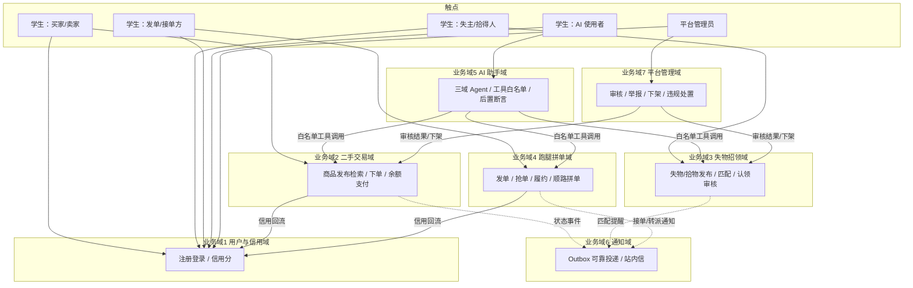

**业务域清单**：

| 业务域 | 核心场景 | 涉及角色 | 与其他业务域的关系 |
| --- | --- | --- | --- |
| 用户与信用域 | 注册登录 / 个人主页 / 信用分体系 | 全体学生、管理员 | 上游 二手交易域（评价事件）/ 下游为各域提供身份与信用查询 |
| 二手交易域 | 商品发布与检索、单库存下单、订单状态机、售出即下架、余额支付（D-09） | 买家、卖家、管理员 | 上游 用户与信用域 / 下游 通知域、AI 助手域（工具）、平台管理域（下架） |
| 失物招领域 | 失物/拾物双发布、关键词匹配提醒、认领申请 + 状态机审核 | 失主、拾得人、管理员 | 下游 通知域、AI 助手域（工具）、平台管理域（审核联动） |
| 跑腿拼单域 | 发单、并发抢单、履约交接、超时转派、顺路拼单（D-08） | 发单人、接单员、管理员 | 上游 用户与信用域（接单优先级）/ 下游 通知域、AI 助手域（工具） |
| AI 助手域 | 三域 Agent 问答 / 工具代办 / 流式输出 / 会话记忆 | 全体学生 | 下游消费 二手/失物/跑腿域的白名单工具；上游为百炼 LLM API |
| 通知域 | Outbox 可靠投递（原子领取/重试/成功证据）、站内信 | 全体学生 | 上游 二手/失物/跑腿/平台管理域（状态事件） |
| 平台管理域 | 敏感词过滤、内容审核（审核记录表）、举报处置、违规下架 | 管理员 | 下游 二手/失物域（下架指令）；消费 各域举报事件 |

### 2.2 领域关系映射

#### 2.2.1 限界上下文清单

| 限界上下文 | 对应业务域 | 域类型 | 覆盖的核心业务实体 | 上下文边界（属于本域 vs 不属于） |
| --- | --- | --- | --- | --- |
| 用户信用 BC | 用户与信用域 | 通用域 | 用户账户、信用记录 | 属于：注册登录、信用分计算与查询；不属于：具体交易行为、通知触达 |
| 二手交易 BC | 二手交易域 | 核心域 | 商品、二手订单、评价、余额账户/流水 | 属于：商品生命周期、单库存下单、模拟支付与余额；不属于：真实资金流（O1）、物流 |
| 失物招领 BC | 失物招领域 | 支撑域 | 失物单、认领申请 | 属于：失物/拾物发布、匹配提醒、认领与归还；不属于：人工审核的最终裁决（归平台管理域） |
| 跑腿拼单 BC | 跑腿拼单域 | 核心域 | 跑腿单、子任务 | 属于：发单、抢单并发控制、履约交接、超时转派、顺路拼单（D-08）；不属于：拼团撮合（O2）、骑手体系（O7） |
| AI 助手 BC | AI 助手域 | 核心域 | AI 会话、工具调用记录 | 属于：对话路由、工具编排、后置断言、记忆；不属于：各业务域自身状态变更（工具只是调用方） |
| 通知 BC | 通知域 | 通用域 | Outbox 事件、通知 | 属于：事件投递、站内信；不属于：业务状态机的定义与流转 |
| 平台管理 BC | 平台管理域 | 支撑域 | 审核记录、举报、敏感词 | 属于：人工审核处置、违规下架、封禁；不属于：业务内容的正常增删改 |

**域类型说明**（投入策略）：

| 域类型 | 含义 | 本系统投入策略 |
| --- | --- | --- |
| 核心域（Core） | 差异化竞争力所在 | 投入最多资源自研：二手交易（单库存 + 状态机 + 幂等支付）、跑腿拼单（并发抢单双保险）、AI 助手（工具白名单 + 后置断言）——三者均为简历技能点核心载体 |
| 支撑域（Supporting） | 必要但非差异化 | 自研但从简：失物招领（状态机 + 审核记录表）、平台管理（不引入工作流引擎） |
| 通用域（Generic） | 通用能力 | 复用成熟方案：用户与信用（JWT + 简单积分模型）、通知（复用实习 Outbox 方案） |

#### 2.2.2 上下文映射（Context Mapping）

| 关系编号 | 上游上下文 | 下游上下文 | 关系模式 | 同步方式 | 选择理由 |
| --- | --- | --- | --- | --- | --- |
| C-01 | 用户信用 BC | 二手交易 BC / 跑腿拼单 BC | Customer/Supplier | API 同步（OpenFeign 查询信用快照） | 交易/跑腿作为 Customer 提出排序与接单优先级需求，信用域按下游节奏提供 `GET /internal/credit/{userId}`；下游反馈可影响信用分规则迭代 |
| C-02 | 二手交易 BC / 失物招领 BC / 跑腿拼单 BC | 通知 BC | Published Language | 异步消息（Outbox 事件，统一事件 Schema：eventId/eventType/aggregateId/payload/occurredAt） | 多个上游共同投递状态事件给同一通知域，事件 Schema 是跨域标准语言，上游无需感知通知实现 |
| C-03 | 二手交易 BC / 失物招领 BC / 跑腿拼单 BC | AI 助手 BC | ACL 防腐层 | API 同步（AI 服务内 ToolAdapter 适配器 + DTO 转换） | 业务域的领域模型（商品/失物单/跑腿单）不直接进入 AI 域；工具返回统一 `ToolResult{success, evidence, data}`，外部模型变化不污染 AI 域 |
| C-04 | 百炼 DashScope（外部） | AI 助手 BC | Conformist | API 同步 + 流式（Spring AI 抽象层遵循 DashScope 模型） | 无议价能力的强势外部上游，直接遵循其 Chat/Function-Calling 协议，仅以 Spring AI 配置隔离接入点 |
| C-05 | 全部业务 BC | 全部业务 BC | Shared Kernel | 共享 DTO / SDK（common 模块：UserContext、Result、全局错误码、状态枚举、Outbox 写入组件） | 身份上下文与统一返回结构必须全站一致；common 保持最小集（≤ 10 个类），变更需全员评审（Shared Kernel 慎用纪律） |
| C-06 | 跑腿拼单 BC | AI 助手 BC | Open Host Service | RPC 同步（Dubbo 3：ErrandQueryDubboService 标准 API） | Dubbo 对比链路（F14）以标准接口形式发布，AI 域通过 @DubboReference 消费，接口契约即发布语言 |
| C-07 | 平台管理 BC | 二手交易 BC / 失物招领 BC | Open Host Service | API 同步（POST /internal/goods/{id}/offshelf 等标准下架接口） | 管理域作为消费方调用业务域公开的处置接口，业务域不感知管理域存在 |

**关系模式覆盖自查**：本表共使用 6 种关系模式——Customer/Supplier（C-01）、Published Language（C-02）、ACL（C-03）、Conformist（C-04）、Shared Kernel（C-05）、Open Host Service（C-06/C-07）≥ 模板要求的 5 种。✅

#### 2.2.3 跨域协作原则

| 原则编号 | 原则 |
| --- | --- |
| P-01 | 核心域（二手/跑腿/AI）→ 支撑域 / 通用域：禁止反向依赖；支撑域不得持有核心域内部模型 |
| P-02 | 核心域之间（二手 ↔ 跑腿 ↔ AI）：禁止直接耦合，必须通过事件（Outbox）/ 标准 API 解耦 |
| P-03 | 对接外部不可控系统（百炼 DashScope）：必须建 ACL 防腐层（Spring AI 配置隔离 + ToolAdapter），禁止把外部模型贯穿到本域 |
| P-04 | 跨库数据引用一律存 ID + 冗余展示字段（如订单冗余买家昵称），禁止跨库 JOIN |
| P-05 | 同步调用仅允许"左依赖右"（接入层方向），禁止形成环；回环逻辑一律改为事件异步 |

### 2.3 详细业务架构

#### 2.3.1 用例图

**用例图清单**：

| 编号 | 用例图标题 | 涉及业务域 | 源文件位置 |
| --- | --- | --- | --- |
| UC-01 | 学生端互助用例（交易/失物/跑腿） | 用户与信用、二手交易、失物招领、跑腿拼单 | 本文内嵌（Mermaid） |
| UC-02 | AI 助手用例 | AI 助手、二手交易、失物招领、跑腿拼单 | 本文内嵌（Mermaid） |
| UC-03 | 平台管理端用例 | 平台管理、用户与信用 | 本文内嵌（Mermaid） |

**UC-01 学生端互助用例**：

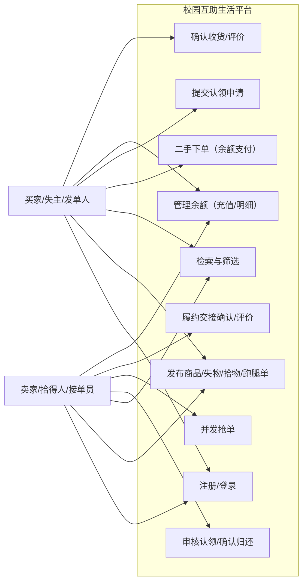

**UC-02 AI 助手用例**：

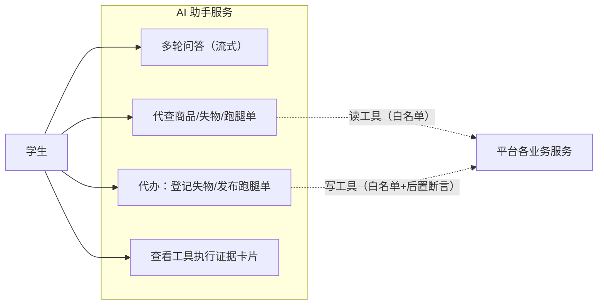

**UC-03 平台管理端用例**：

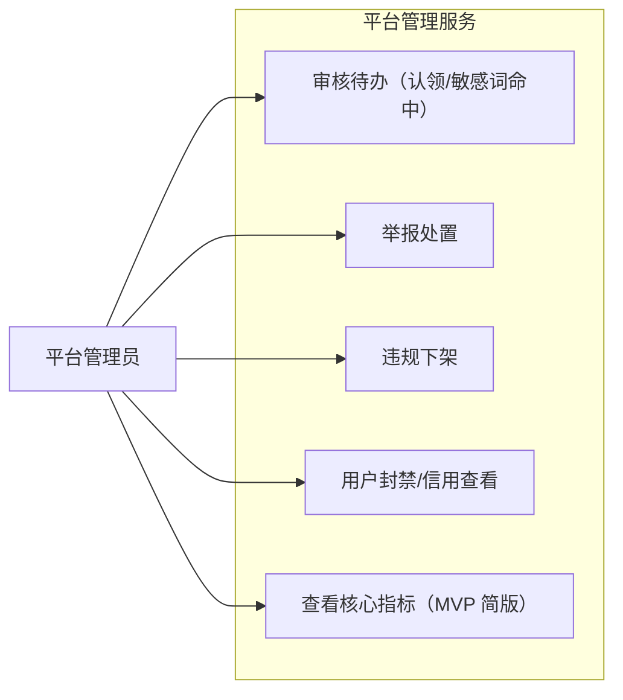

#### 2.3.2 业务流程图

**关键流程清单**（核心业务覆盖度 ≥ 80%：覆盖二手交易、失物招领、跑腿拼单三条主链路 + AI 代办链路，四者合计覆盖上游 V2 定义的全部核心场景）：

| 流程编号 | 流程名 | 起点 | 终点 | 涉及业务域 | 源文件位置 |
| --- | --- | --- | --- | --- | --- |
| BF-01 | 二手交易全流程 | 卖家上架商品 | 双向评价完成、信用回流 | 用户与信用、二手交易、通知、平台管理 | 本文内嵌（Mermaid） |
| BF-02 | 失物招领全流程 | 失主登记/拾得人发布 | 归还完成、评价回流 | 失物招领、平台管理、通知 | 本文内嵌（Mermaid） |
| BF-03 | 跑腿拼单全流程（含抢单并发与超时转派） | 发单人发单 | 交接确认、评价回流 | 跑腿拼单、用户与信用、通知 | 本文内嵌（Mermaid） |
| BF-04 | AI 代办流程（可信工具调用） | 学生发起对话 | 写操作成功 + 证据卡片展示 | AI 助手、二手/失物/跑腿 | 本文内嵌（Mermaid） |

**BF-01 二手交易全流程**：

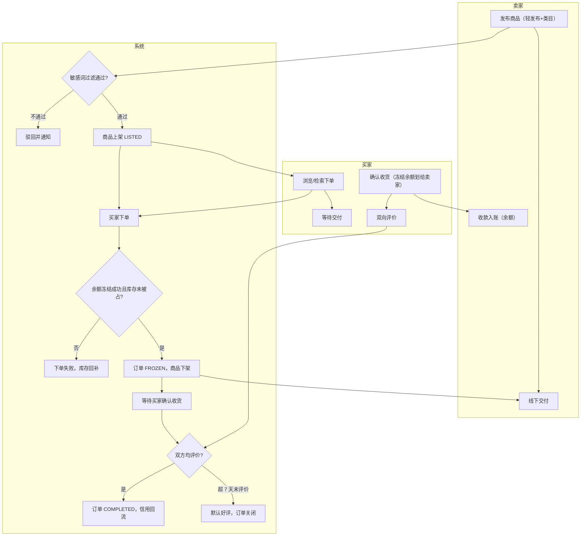

**BF-03 跑腿拼单全流程**：

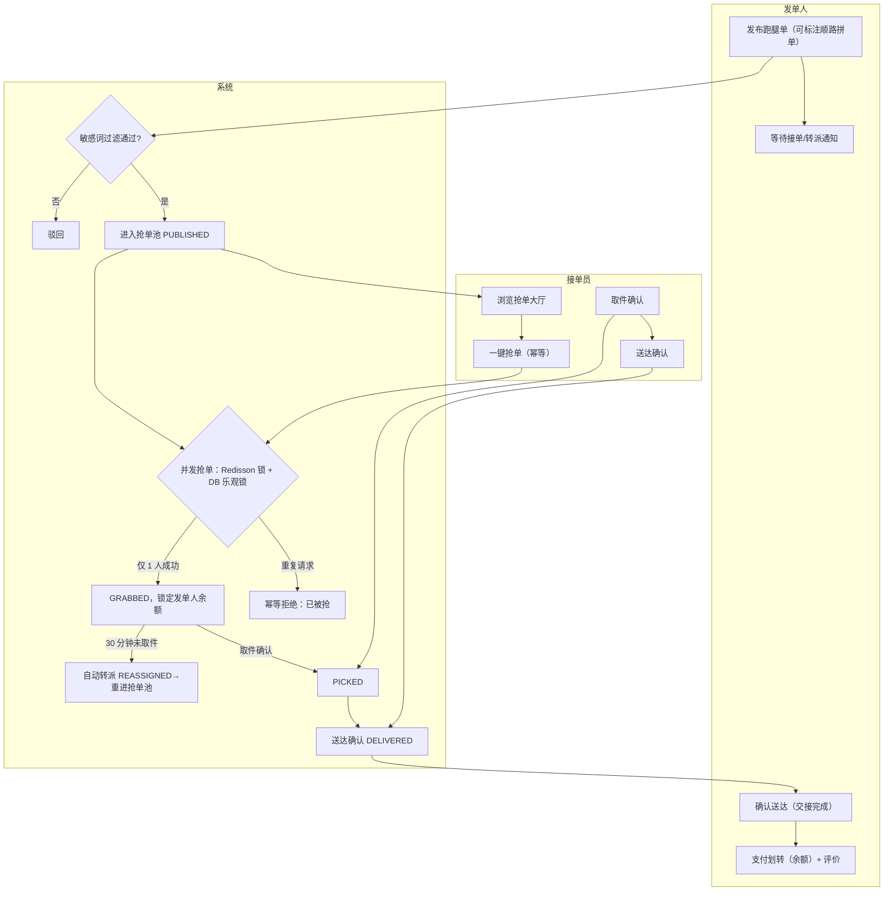

**BF-02 失物招领全流程**：失主登记/拾得人发布 → 系统按"物品名 + 地点 + 时间窗（±3 天）"关键词匹配并向对侧推送提醒（通知域）→ 拾得人（或失主）提交认领申请（含凭证描述）→ 进入平台管理域审核队列 → 管理员按状态机通过/驳回（写入审核记录表）→ 通过后双方线下交接 → 失主确认归还 → 双向评价、信用回流 → 条目 CLOSED。驳回则退回申请方可补充材料后重新提交（最多 3 次）。

**BF-04 AI 代办流程**：学生对话 → AI 服务按领域路由到交易/失物/跑腿 Agent → 模型发起工具调用 → 服务层校验该 Agent 工具白名单 → ToolAdapter（ACL）调用业务服务 → 拿到系统返回的执行证据（订单号/条目 ID）→ 后置断言校验（写操作必须有成功证据才能生成确认回复）→ 断言通过：向学生输出带证据标识的确认卡片；断言失败/工具超时：输出失败说明与重试建议，禁止模型口头宣称成功（V4）。

### 2.4 业务范围与边界

#### 2.4.1 功能模块清单

| 编号 | 一级功能名 | 子功能描述 | 对应业务域 | 实现状态 |
| --- | --- | --- | --- | --- |
| F1 | 用户与信用 | — | 用户与信用域 | — |
| F1.1 | — | 学号/校园邮箱注册、JWT 会话、个人主页 | 用户与信用域 | 完整实现 |
| F1.2 | — | 信用分体系（评价/履约沉淀 + 排序/接单优先级影响） | 用户与信用域 | 完整实现 |
| F2 | 二手交易 | — | 二手交易域 | — |
| F2.1 | — | 商品发布（轻发布 + 类目结构化）、关键词检索、售出即下架 | 二手交易域 | 完整实现 |
| F2.2 | — | 单库存下单、订单状态机、余额结算联动 | 二手交易域 | 完整实现 |
| F2.3 | — | 双向评价写入信用分 | 二手交易域 | 完整实现 |
| F3 | 失物招领 | — | 失物招领域 | — |
| F3.1 | — | 失物/拾物双发布、关键词匹配提醒 | 失物招领域 | 完整实现 |
| F3.2 | — | 认领申请 + 状态机审核（审核记录表，不引入 Flowable） | 失物招领域 | 完整实现 |
| F4 | 跑腿拼单 | — | 跑腿拼单域 | — |
| F4.1 | — | 发单、并发抢单（Redis 锁 + DB 乐观锁双保险）、超时自动转派 | 跑腿拼单域 | 完整实现 |
| F4.2 | — | 履约交接确认、双向评价 | 跑腿拼单域 | 完整实现 |
| F4.3 | — | 顺路拼单（拼单标注 + 子任务接单）——经中间确认（D-08） | 跑腿拼单域 | 完整实现 |
| F5 | 余额与模拟支付 | — | 二手交易域 | — |
| F5.1 | — | 平台余额（模拟充值/完单奖励入账）、下单冻结/扣减幂等 | 二手交易域 | 完整实现 |
| F5.2 | — | 支付网关适配器抽象——经中间确认（D-09） | 二手交易域 | [MOCK] 通道实现为模拟充值；完整版替换路径：`PaymentChannelAdapter` 实现类切换为微信支付，接口契约不变 |
| F6 | AI 助手 | — | AI 助手域 | — |
| F6.1 | — | 三域 Agent + LLM 路由 + 工具白名单 + 后置断言 + 流式问答 + 会话记忆 | AI 助手域 | 完整实现 |
| F6.2 | — | Dubbo 对比链路：AI 查跑腿单单链路 OpenFeign/Dubbo 双实现 | AI 助手域 | 完整实现 |
| F7 | 通知 | — | 通知域 | — |
| F7.1 | — | Outbox 可靠投递（原子领取/失败重试/防重复/成功证据） | 通知域 | 完整实现 |
| F7.2 | — | 站内信中心（未读标记/已读） | 通知域 | 完整实现 |
| F8 | 平台管理 | — | 平台管理域 | — |
| F8.1 | — | 敏感词过滤、内容审核（审核记录表）、举报处置、违规下架 | 平台管理域 | 完整实现 |
| F8.2 | — | 运营看板（完单率/通知成功率/AI 断言失败率） | 平台管理域 | [简化] MVP 以管理端"数据指标简版接口 + Grafana 业务大盘"替代；完整版替换路径：F17 独立看板页 + 多维下钻 |
| F9 | 跨域公共能力 | — | 跨域 | — |
| F9.1 | — | 网关统一 JWT 鉴权、统一返回结构、全局错误码、traceId 透传 | 跨域 | 完整实现 |

**In-Scope（本期范围内）**：

| 编号 | 本期必做的事项 |
| --- | --- |
| F1 | 用户与信用服务（注册登录 + 信用分） |
| F2 | 二手交易服务（发布/检索/下单/状态机/售出即下架） |
| F3 | 失物招领服务（双发布/匹配提醒/认领审核） |
| F4 | 跑腿拼单服务（发单/并发抢单/履约/顺路拼单） |
| F5 | 余额与模拟支付（冻结/扣减幂等 + 支付适配器） |
| F6 | AI 助手服务（三域 Agent + 白名单 + 后置断言 + Dubbo 对比链路） |
| F7 | 通知服务（Outbox 可靠投递 + 站内信） |
| F8 | 平台管理服务（审核/举报/下架 + 指标简版） |
| N1 | 单机 2核4G + Docker Compose，容器内存峰值合计 ≤ 3GB |
| N2 | 核心接口幂等（支付/扣减/抢单），并发 100 压测重复接单 = 0；Sentinel 降级演示用例 ≥ 2 |

**Out-of-Scope（本期不做）**：

| 编号 | 不做的事项 | 不做的原因 | 未来归属 |
| --- | --- | --- | --- |
| O1 | 真实在线支付（微信支付/支付宝回调、对账、退款） | 个人学生主体商户资质受限（调研 U-01）——经中间确认（D-09） | 完整版（F12，切换支付适配器实现） |
| O2 | 多人拼团完整撮合（拼团创建/凑单截止/成团状态机/费用分摊） | 撮合复杂度高、简历增益边际最低——经中间确认（D-08） | 完整版（F10） |
| O3 | Elasticsearch 搜索引擎 | 校园规模 MySQL 全文索引/前缀匹配够用，省约 1GB 级单机内存（调研 R-01/B3 否决项） | 完整版按需评估 |
| O4 | 独立消息队列（RocketMQ/RabbitMQ） | Outbox + 定时任务已覆盖 MVP 通知需求；MQ 对单机约 450MB 额外负担（调研 SR-21） | 完整版按 D-04 评估 |
| O5 | K8s 编排、多节点部署、服务网格 | 超出"单台轻量云服务器 + Docker Compose"低成本硬约束 | 不做 |
| O6 | 微信小程序原生端 | 小程序类目审核政策不确定（调研 U-04）；渠道层已抽象，MVP 仅 Vue Web/H5 | 完整版第二渠道薄适配器 |

**填写要求自查**：In-Scope 10 条 ≤ 15 ✅；Out-of-Scope 6 条 ≥ 3 ✅；Mock/简化项（F5.2、F8.2）均已标注并附完整版替换路径 ✅。

### 2.5 质量与柔性可用

#### 2.5.1 服务质量目标

**质量目标 Top 5**（按优先级排序）：

| 优先级 | 质量目标 | 业务驱动 | 受影响的关键章节 |
| --- | --- | --- | --- |
| Q1 | 并发正确性：抢单/扣库存/扣余额在并发下零重复、零超卖 | 上游 V3（答辩核心证据，演示翻车即项目失败） | §3.2.M4 / §3.5.2 / §4.2 / §8.4 |
| Q2 | 单机成本可行：容器内存峰值合计 ≤ 3GB（2核4G） | 上游 V6（硬约束） | §3.1.5 / §4.3 / §5.5 |
| Q3 | 用户体验响应性：核心接口 P95 ≤ 300ms；AI 流式首字 P99 ≤ 2s | 上游 §6.4 交互约束 | §3.5.4 / §4.4 / §5.3 |
| Q4 | 可观测可答辩：全链路 traceId、错误 100% 采样、指标四层可看 | 上游 V1（微服务技能点演示） | §8 / §5.5 |
| Q5 | 数据可靠性：模拟资金账目零差错（余额流水可对账、幂等可重放） | D-09 决策的可信底线 | §3.5.2 / §4.2 / §4.3 |

**可验证质量场景**（SEI ATAM 方法）：

| 场景编号 | 关联目标 | 触发源 | 触发条件 | 期望响应 | 度量指标 |
| --- | --- | --- | --- | --- | --- |
| QS-01 | Q1 | 100 线程并发抢同一跑腿单 | JMeter 并发压测 | 仅 1 人接单成功，其余收到幂等拒绝 | 重复接单数 = 0；超接单数 = 0（附压测报告） |
| QS-02 | Q2 | 全容器常驻运行 24h | docker stats 采样 | 内存峰值合计不超限 | 容器内存峰值合计 ≤ 3GB |
| QS-03 | Q3 | 用户访问 | 商品列表 30 QPS 并发 | 正常返回 | P95 ≤ 300ms；P99 ≤ 800ms |
| QS-04 | Q3 | AI 对话 | AI 助手发起流式问答 | 首字流式输出 | 首字 P99 ≤ 2s |
| QS-05 | Q4 | 任意接口 5xx | 出现错误请求 | Zipkin 可查全链路 | 错误请求采样率 100% |
| QS-06 | Q5 | 余额流水 | 任意时段对账 | 冻结/扣减/入账三态流水平衡 | 流水差额 = 0 |

#### 2.5.2 业务柔性可用策略

**业务功能优先级分层**（§2.4.1 全部一级功能已分层；L0 数量 2/8 = 25% ≤ 30%）：

| 层级 | 含义 | 关联一级功能 |
| --- | --- | --- |
| L0 核心业务 | 生命线，挂掉等于业务停摆 | F2 二手交易、F4 跑腿拼单（含 F5 余额支付随行） |
| L1 重要业务 | 不影响主链路但高频使用 | F1 用户与信用、F3 失物招领、F6 AI 助手 |
| L2 辅助业务 | 提升体验但非必要 | F7 通知（站内信中心页）、F8 平台管理 |
| L3 附加业务 | 长尾/统计类 | F8.2 指标简版、信用排序加权（可退化为按时间排序） |

**业务降级清单**：

| 编号 | 关联功能（F-xx） | 触发条件 | 降级动作 | 用户感知 | 决策类型 |
| --- | --- | --- | --- | --- | --- |
| BD-01 | F6（AI 助手） | 百炼 API 超时/限流/余额不足（Sentinel 规则：异常比例 > 50%） | 熔断后返回固定提示话术 + 建议稍后再试；历史会话可看 | "AI 服务忙，请稍后再试"，问答页给出兜底提示 | 自动 |
| BD-02 | F6.2（AI 写代办） | 后置断言失败 / 工具返回非证据结果 | 拒绝生成确认回复，输出"操作未完成"卡片 | 明确看到"未完成"，不会被假成功误导 | 自动 |
| BD-03 | F2.1（商品检索） | Redis 缓存不可用 | 降级直查 DB（限流保护，QPS 阈值减半） | 列表加载略变慢 | 自动 |
| BD-04 | F2.1 / F3.1（列表页） | 二手/失物服务实例不可用（Sentinel 网关降级演示用例 1） | 网关返回兜底页与重试引导 | "服务维护中，请稍后访问"提示页 | 自动 |
| BD-05 | F7.1（通知投递） | Outbox 重试达上限（5 次）事件 | 标记 DEAD + P2 告警；管理员可手动补投 | 个别通知延迟到达，最终必达 | 手动 |
| BD-06 | F3.1（匹配提醒） | 匹配计算超时 | 放弃本轮提醒，下轮定时任务重算 | 提醒延后数分钟 | 自动 |
| BD-07 | L3 信用排序 | 信用服务不可用 | 检索/抢单大厅退化为按时间倒序 | 排序变为最新优先 | 自动 |

---

## 3. 应用架构

> 本章回答：系统由哪些模块组成、模块与外部系统怎么集成、每个模块的内部交互链路是什么。

### 3.1 应用架构概览

#### 3.1.1 系统上下文

本系统作为中心节点，周围辐射出"用户角色 + 外部系统"关系。

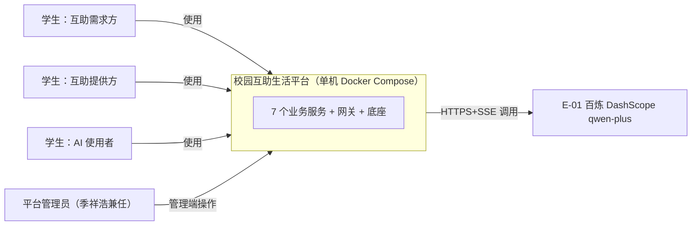

**系统上下文要素清单**：

| 节点类型 | 节点名 | 与本系统的关系 | 关系语义 |
| --- | --- | --- | --- |
| 角色 | 学生（互助需求方：买家/失主/发单人） | 使用 | 学生端页面操作（发布/下单/登记/发单） |
| 角色 | 学生（互助提供方：卖家/拾得人/接单员） | 使用 | 学生端页面操作（上架/抢单/履约） |
| 角色 | 学生（AI 助手使用者） | 使用 | AI 对话页问答与代办 |
| 角色 | 平台管理员 | 使用 | 管理端操作（审核/举报/下架） |
| 上游平台 | E-01 百炼 DashScope（qwen-plus） | 本系统 → 调用 | LLM 对话/流式/Function Calling，唯一外部上游 |
| 下游平台 | 无外部系统下游 | — | 用户触点仅 Vue 3 前端（经 Gateway 统一接入） |

**填写要求自查**：本系统画成单一节点不展开内部组件 ✅；周围节点取自 E-01 与 §2.3 用例图角色 ✅；每条边标注关系语义 ✅。

#### 3.1.2 系统模块图

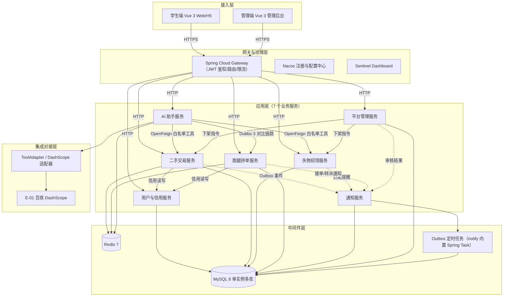

**分层组件清单**：

| 层次 | 内容 | 数据来源 |
| --- | --- | --- |
| 接入层 | 学生端 Vue 3 Web/H5、管理端 Vue 3 管理后台 | §2.3 用例图角色 |
| 应用层 | 7 个业务服务：用户与信用 / 二手交易 / 失物招领 / 跑腿拼单 / AI 助手 / 通知 / 平台管理（与 §3.2 一一对应） | §2.1 / 高层架构 §5.1 |
| 中间件层 | MySQL 8（C-01）、Redis（C-02）、Nacos（C-03）、Gateway（C-04）、Sentinel Dashboard（C-05）、Nginx（C-06）、Outbox 定时任务（notify 内置 Spring Task） | §3.1.3 云组件清单 |
| 集成对接层 | DashScope 适配器 + ToolAdapter（E-01 集成桩） | §3.1.3 外部依赖清单 |

#### 3.1.3 集成架构

##### 外部依赖清单

| ID | 外部系统 | 归属团队 / 供应商 | 类别 | 使用方式 | 集成方式 | 协议 / 版本 | 功能定位（≤ 30 字） | 联系人 |
| --- | --- | --- | --- | --- | --- | --- | --- | --- |
| E-01 | 阿里云百炼 DashScope（qwen-plus） | 阿里云 | 第三方业务平台 | 消费 | HTTPS + SSE（Spring AI 抽象层） | qwen-plus（DashScope OpenAPI 兼容模式） | LLM 对话/流式/Function Calling | 季祥浩（项目所有者，唯一外部账号归属） |

##### 云组件 / 基础设施清单

| ID | 组件类别 | 选型 | 部署形态 | 规格量级 | 容量预估 | 提供方 / SLA | 用途 |
| --- | --- | --- | --- | --- | --- | --- | --- |
| C-01 | 关系型数据库 | MySQL 8.0.36 | 单实例多库（Docker 容器，每业务服务独立 schema） | 内存上限 500MB | 7 库；单表 < 50 万行；写 TPS < 20 | 自建（单机，无 SLA 承诺，见 §5.3） | 各业务模块主存储 |
| C-02 | 缓存 | Redis 7.2.5 | 单机（Docker 容器，AOF everysec） | 内存上限 150MB | 热点商品/会话/锁；< 2 万 Key | 自建 | 热点缓存 / 分布式锁 / 会话 / 限流计数 |
| C-03 | 注册与配置中心 | Nacos 2.3.2（standalone 内嵌 Derby） | Docker 容器 | 内存上限 450MB | 服务实例 < 12；配置项 < 100 | 自建 | 服务注册发现 + 配置（Sentinel 规则/降级开关） |
| C-04 | API 网关 | Spring Cloud Gateway 4.1.5 | Docker 容器 | JVM -Xmx 300MB | 峰值 50 QPS | 自建 | 统一入口路由 / JWT 鉴权 / 全局限流 |
| C-05 | 熔断限流控制台 | Sentinel Dashboard 1.8.8 | Docker 容器 | 内存上限 200MB | 规则 < 50 条 | 自建 | 熔断限流规则管理与演示（V1） |
| C-06 | Web 服务器 / 静态资源 | Nginx 1.24 | Docker 容器 | 内存上限 30MB | 静态资源 < 50MB；图片目录挂载 | 自建 | 前端静态资源 / 图片访问 / TLS 终结 |
| C-07 | 指标采集 | Prometheus 2.53（观测 profile，按需启动） | Docker 容器 | 内存上限 250MB | 采集目标 < 12；保留 15 天 | 自建 | 四层指标采集（§8.1） |
| C-08 | 可视化看板 | Grafana 11.1（观测 profile，按需启动） | Docker 容器 | 内存上限 200MB | Dashboard ≥ 6 | 自建 | §8.1.2 Dashboard 承载 |
| C-09 | 链路追踪 | Zipkin 3.4（观测 profile，按需启动） | Docker 容器 | 内存上限 150MB | 采样 < 100 span/s | 自建 | 微服务全链路追踪演示（§8.3） |
| C-10 | 日志汇聚 | Loki 3.1 + Promtail（观测 profile，按需启动） | Docker 容器 ×2 | 内存上限 200MB | 日志 < 200MB/天 | 自建 | 结构化 JSON 日志汇聚与检索（§8.2） |

**观测 profile 说明**：C-07~C-10 定义于 docker-compose 的 `observability` profile——答辩演示/故障排查时段一键启动（`docker compose --profile observability up -d`），日常时段关闭。常驻组合（C-01~C-06 + 7 服务 + 前端）内存峰值合计 ≤ 3GB（逐容器预算见 §5.5.2）；观测组合额外约 800MB，演示期业务低负载时 JVM 实际 RSS 低于 -Xmx 上限，整机 4GB 内不 OOM（演示期约束见 §5.5.4）。

##### 组件依赖关系

| 业务模块（§3.2） | 依赖的外部系统（E-xx） | 依赖的云组件（C-xx） | 故障传导风险 |
| --- | --- | --- | --- |
| M1 用户与信用服务 | — | C-01, C-03 | C-01 不可用 → 全站不可登录（最重风险，单机单实例）；C-03 不可用 → 已注册实例继续运行，路由不受影响 |
| M2 二手交易服务 | — | C-01, C-02 | C-02 不可用 → 检索降级直查 DB（BD-03）；C-01 不可用 → 交易链路不可用 |
| M3 失物招领服务 | — | C-01 | C-01 不可用 → 失物链路不可用 |
| M4 跑腿拼单服务 | — | C-01, C-02 | C-02 不可用 → 抢单双保险退化（仅 DB 乐观锁仍保证正确性，性能下降）；C-01 不可用 → 抢单不可用 |
| M5 AI 助手服务 | E-01 | C-01, C-02 | E-01 超时/限流 → AI 熔断降级（BD-01），业务链路不受影响 |
| M6 通知服务 | — | C-01 | C-01 不可用 → 通知延迟（Outbox 落库后重启可续投，不丢失） |
| M7 平台管理服务 | — | C-01 | C-01 不可用 → 管理端不可用，学生端不受影响 |

#### 3.1.4 工程结构

公共模块（common）与业务服务的依赖方向：业务服务依赖 common，禁止反向。

```
campus-mutual-platform/
├── backend/
│   ├── pom.xml                     # 父 POM：统一依赖版本管理
│   ├── common/                     # 公共模块（Shared Kernel，§2.2.2 C-05）
│   │   └── src/main/java/com/campus/common/
│   │       ├── dto/                # Result / PageRequest / PageResponse / UserContext
│   │       ├── enums/              # 全局状态枚举（OrderStatus / ErrandStatus ...）
│   │       ├── exception/          # BizException + 全局错误码 ErrorCode
│   │       ├── outbox/             # OutboxTemplate（业务服务同事务写事件）
│   │       ├── idempotent/         # @Idempotent 注解 + AOP（幂等键校验）
│   │       └── log/                # traceId/tenantId MDC 过滤器
│   ├── gateway/                    # Spring Cloud Gateway：路由 + JWT 过滤器 + 限流
│   ├── user-credit-service/        # M1 用户与信用服务（8081）
│   ├── trade-service/              # M2 二手交易服务（8082，含余额支付）
│   ├── lostfound-service/          # M3 失物招领服务（8083）
│   ├── errand-service/             # M4 跑腿拼单服务（8084，含 Dubbo Provider）
│   ├── ai-assistant-service/       # M5 AI 助手服务（8085）
│   ├── notify-service/             # M6 通知服务（8086，含 Outbox 轮询任务）
│   └── admin-service/              # M7 平台管理服务（8087）
├── frontend/
│   ├── student-web/                # 学生端（Vue 3 + Element Plus）
│   │   ├── src/
│   │   │   ├── api/                # 接口封装（与后端 §3.2 接口清单对齐）
│   │   │   ├── stores/             # Pinia 全局状态（会话/通知未读数）
│   │   │   ├── pages/              # 页面（按路由分目录）
│   │   │   ├── components/         # 跨页面通用组件
│   │   │   ├── composables/        # 自定义 Hooks（SSE 流式、轮询）
│   │   │   ├── types/              # TS 类型定义（与后端 DTO/VO 对齐）
│   │   │   ├── utils/              # 工具函数
│   │   │   └── router.ts           # 路由配置（§3.5.5 前端路由清单）
│   │   └── package.json
│   ├── admin-web/                  # 管理端（Vue 3 + Element Plus）
│   └── shared/                     # 跨端共用 TS 类型 / 工具
├── docker/
│   ├── docker-compose.yml          # 常驻组合（base + services）
│   ├── docker-compose.obs.yml      # 观测组合（C-07~C-10，observability profile）
│   └── sql/                        # 各服务 schema 初始化 DDL（§4.2）
└── docs/
    ├── runbook/                    # 告警 Runbook（§8.4.2 引用）
    └── press-test/                 # 抢单并发压测脚本与报告（QS-01）
```

#### 3.1.5 技术选型（版本约束）

| 技术分类 | 选型 | 版本 | 备注 / 选型理由 |
| --- | --- | --- | --- |
| 后端语言 | Java | 21（LTS） | 上游技术路线延续实习栈（Java 21）；LTS 版本虚拟线程可用，为并发抢单提供可选优化点 |
| 后端框架 | Spring Boot | 3.4.5 | Spring Cloud Alibaba 2023.0.x 官方适配基线；为何不选 Boot 4：SCA/Spring AI 生态版本矩阵尚不稳，学习型项目优先"可跑通、可答辩" |
| 微服务框架 | Spring Cloud Alibaba | 2023.0.3.2 | Nacos/Gateway/OpenFeign/Sentinel 一站式；为何不选 RuoYi-Cloud：生成代码占比高，答辩"自己的代码"少（调研 §4.3） |
| 服务注册/配置 | Nacos | 2.3.2 | SCA 官方适配；standalone 模式单机内存可控（约 450MB，SR-21） |
| API 网关 | Spring Cloud Gateway | 4.1.5 | 与 SCA 同版本矩阵；响应式模型单机即可扛校园级流量 |
| 服务间调用（主） | OpenFeign + LoadBalancer | 4.1.5 / 4.1.5 | 声明式 HTTP 主链路；为何不选全链路 Dubbo：上游冻结"仅单链路对比"，避免全链路双协议复杂度（调研 §4.1） |
| 服务间调用（对比链路） | Apache Dubbo（dubbo-spring-boot-starter） | 3.3.3 | 原生适配 Nacos/Sentinel；仅 AI 查跑腿单一条链路（F14），@DubboService/@DubboReference 与 SCA 共存 |
| 熔断限流 | Sentinel | 1.8.8 | SCA 组件；提供可演示的降级用例（BD-01/BD-04），满足 V1 |
| 持久层（ORM） | MyBatis-Plus | 3.5.9 | 用户冻结基线；内置乐观锁插件（@Version）直接支撑抢单双保险与幂等更新 |
| 关系型存储 | MySQL | 8.0.36 | 用户冻结基线；ngram 全文解析器支撑商品/失物关键词检索（替代 ES，O3） |
| 缓存 | Redis | 7.2.5 | 热点缓存/分布式锁/会话三用途；为何不选 Memcached：需 Lua 与原子过期支撑限流与锁 |
| 分布式锁 | Redisson | 3.30.0 | 看门狗续期 + 可重入，比手写 SETNX 更可解释、可答辩；抢单双保险之一 |
| 认证方案 | JWT（jjwt）+ 网关统一鉴权 | jjwt 0.12.6 | 无状态、跨服务透传 userId；为何不选 Sa-Token：功能冗余且概念面大，JWT 更标准可讲（D-02 对齐点，见 §7.2.1） |
| API 通信 | 同步 REST（OpenFeign）+ 异步 Outbox 轮询 | — | 简单可解释；不引入 MQ（O4），Outbox 复用实习方案（V5） |
| AI 框架 | Spring AI | 1.0.0 | 用户实习直接复用（与实习 Spring AI 2.0 同构 API）；为何不选 LangChain4j：学习曲线陡且为全新实践（调研 SR-16~17） |
| LLM 接入 | 阿里云百炼 DashScope（qwen-plus） | DashScope OpenAPI（兼容模式） | 上游冻结唯一外部上游；配置化切换便于 Ollama 兜底（R-04） |
| 异步通知 | Outbox 表 + Spring Task（notify 内置） | Spring Framework 6.2 | 原子领取/重试/成功证据；为何不选 XXL-Job：需额外调度中心容器，单机不划算 |
| 前端框架 | Vue 3 + TypeScript | 3.4 | 用户冻结基线（+Vue 前端）；B4 主流选择（调研 §4.3） |
| 前端 UI | Element Plus | 2.7 | Vue 3 官方生态最成熟组件库，学生端/管理端共用风格 |
| 前端状态 | Pinia | 2.1 | Vue 3 官方推荐；为何不选 Vuex：Pinia TS 支持更好、样板更少 |
| 前端构建 | Vite | 5.4 | 秒级冷启动，学习型项目开发体验优先 |
| API 文档 | Knife4j | 4.5.0 | OpenAPI3 界面化，支撑前后端联调与答辩演示 |
| 三方 SDK | DashScope Java SDK（经 Spring AI 兼容 starter 封装） | spring-ai-openai starter 1.0.0 | 唯一三方 SDK；替代方案：直接 HTTP 封装（保留为 Ollama 兜底接入点） |

### 3.2 模块详细设计

> 核心方法论：模块详细设计描述业务逻辑在角色和系统之间流动的过程。组织原则：§3.2.1/§3.2.2 给出跨模块共享约束与模块清单；§3.2.3 为规范说明（各模块共同遵守的硬性要求只在此声明，各模块下只体现、不重复声明）；§3.2.M1~M7 每模块按五段式独立成节。

#### 3.2.1 模块公共约束（Common）

**通信方式约束**：

| 约束项 | 取值 |
| --- | --- |
| 接口路径风格 | RESTful（锁定；Dubbo 对比链路为 RPC 特例，见 §2.2.2 C-06） |
| 协议 | HTTP（学生/管理端）+ HTTPS（Nginx TLS 终结）+ RPC（Dubbo 单链路）+ SSE（AI 流式） |
| 数据格式 | JSON（UTF-8） |
| 字符编码 | UTF-8 |

**通用基础结构**：

| 基类 / 结构 | 用途 | 包路径 |
| --- | --- | --- |
| `BaseRequest` | 请求基类（含 traceId 透传位） | `com.campus.common.dto` |
| `PageRequest` | 分页请求（pageNo/pageSize，pageSize 上限 100） | `com.campus.common.dto` |
| `PageResponse<T>` | 分页响应（total/pages/records） | `com.campus.common.dto` |
| `Result<T>` | 统一返回结构（code/msg/data/traceId，见 §3.5.1） | `com.campus.common.dto` |
| `UserContext` | 网关解析 JWT 后透传的用户上下文（userId/role/schoolCode） | `com.campus.common.dto` |
| `BizException` + `ErrorCode` | 业务异常 + 6 位错误码（见 §3.5.1） | `com.campus.common.exception` |

#### 3.2.2 模块清单与编号规则

**模块清单**：

| 编号 | 模块名 | 业务域（§2.1） | 模块负责人 | 关联子领域 |
| --- | --- | --- | --- | --- |
| M1 | 用户与信用服务（user-credit-service，8081） | 用户与信用域 | 季祥浩 | 身份认证 / 信用分 |
| M2 | 二手交易服务（trade-service，8082） | 二手交易域 | 季祥浩 | 商品 / 订单 / 余额支付（D-09） |
| M3 | 失物招领服务（lostfound-service，8083） | 失物招领域 | 季祥浩 | 失物/拾物 / 认领 |
| M4 | 跑腿拼单服务（errand-service，8084） | 跑腿拼单域 | 季祥浩 | 发单 / 抢单 / 履约 / 顺路拼单（D-08） |
| M5 | AI 助手服务（ai-assistant-service，8085） | AI 助手域 | 季祥浩 | 三域 Agent / 工具可信 / Dubbo 对比链路 |
| M6 | 通知服务（notify-service，8086） | 通知域 | 季祥浩 | Outbox 投递 / 站内信 |
| M7 | 平台管理服务（admin-service，8087） | 平台管理域 | 季祥浩 | 审核 / 举报 / 下架 |

**编号规则**：模块编号 M{N} 全局唯一，与 §2.1 业务域一致；每模块在 §3.2 下独立成节 `§3.2.M{N}`，节内五段式编号 `§3.2.M{N}.1` ~ `§3.2.M{N}.5`，顺序与 §3.2.3 模板一致。

#### 3.2.3 单模块设计模板（五段式）

> ⚠️ 本节性质说明：本节定义每个模块五段各应产出什么、遵守什么格式，本身不是任何模块的内容。所有模块共同遵守的项目级规范——接口路径 RESTful、默认超时/重试引用 §3.5.4、幂等性引用 §3.5.2、鉴权引用 §7.2.5；DTO 按"基本信息/业务字段/状态/时间/扩展"分块且枚举列出全部取值；时序图含异常分支、调用方式标注、写操作标注事务边界/锁 Key/幂等键，参与者命名与 §3.1.2/§3.1.3 一致——在各模块下只体现、不重复声明。

#### 3.2.M1 用户与信用服务（user-credit-service）

##### §3.2.M1.1 模块概述

用户与信用服务是全站的通用域入口：覆盖注册登录（F1.1）与信用分体系（F1.2）业务流程。业务逻辑在学生（注册/登录/查看主页）与平台管理员（信用查看/封禁）之间流动，同时涉及 Gateway（JWT 签发前置）、二手交易/跑腿拼单服务（信用分读取，C-01 Customer/Supplier）、MySQL user_db（C-01）、Redis（登录失败计数）等内外部系统的数据流动。

##### §3.2.M1.2 接口清单

| 子领域 | 方法 | 路径 | 用途（≤ 20 字） | 请求 DTO | 响应 VO | 幂等 |
| --- | --- | --- | --- | --- | --- | --- |
| 认证 | POST | /api/v1/auth/register | 学号/校园邮箱注册 | `RegisterRequest` | `UserVO` | 是（学号唯一索引兜底） |
| 认证 | POST | /api/v1/auth/login | 登录并签发 JWT | `LoginRequest` | `LoginVO` | 天然（失败计数防爆破） |
| 认证 | POST | /api/v1/auth/logout | 登出（Redis 黑名单） | — | `Result` | 天然 |
| 用户 | GET | /api/v1/users/me | 查询本人主页 | — | `UserVO` | 天然 |
| 用户 | GET | /api/v1/users/{id} | 查询他人主页 | — | `UserPublicVO` | 天然 |
| 信用 | GET | /api/v1/credits/me | 查询本人信用分与明细 | — | `CreditDetailVO` | 天然 |
| 内部·信用 | GET | /internal/credit/{userId} | 供 M2/M4 查询信用快照 | — | `CreditSnapshotVO` | 天然 |
| 内部·信用 | POST | /internal/credit/adjust | 评价/履约事件回流加分 | `CreditAdjustRequest` | `Result` | 是（bizEventId 唯一） |

##### §3.2.M1.3 关键结构定义（DTO）

```java
public class LoginRequest {
  // ===== 必填字段 =====
  @NotBlank private String account;      // 学号或校园邮箱
  @NotBlank private String password;     // BCrypt 比对，禁止明文存储
}

public class UserVO {
  // ===== 基本信息 =====
  private Long id;
  private String nickname;               // 昵称，默认"同学+学号后4位"
  private String schoolCode;             // 学校编码，MVP 固定 CAMPUS-MAIN
  private String studentNoMasked;        // 学号脱敏展示（中间 4 位打星，§7.2.2）
  // ===== 状态字段 =====
  private String status;                 // 枚举：ACTIVE / BANNED
  // ===== 业务字段 =====
  private Integer creditScore;           // 信用分，初始 100，区间 [0, 200]
  // ===== 时间字段 =====
  private LocalDateTime createdAt;
}
```

| DTO / VO 名 | 字段名 | 类型 | 必填 | 业务含义 | 约束 / 默认值 |
| --- | --- | --- | --- | --- | --- |
| `RegisterRequest` | studentNo | String | 是 | 学号 | 全校唯一；长度 8~12 |
| `RegisterRequest` | email | String | 是 | 校园邮箱 | 以校园邮箱域名结尾 |
| `RegisterRequest` | password | String | 是 | 登录密码 | 长度 ≥ 8，BCrypt 存储 |
| `CreditAdjustRequest` | bizEventId | String | 是 | 业务事件 ID（评价/履约 ID） | 幂等键，DB 唯一索引 |
| `CreditAdjustRequest` | delta | Integer | 是 | 信用分增减 | 评价 ±(1~5)，违约 -10 |
| `CreditSnapshotVO` | creditScore | Integer | 是 | 当前信用分 | 用于检索排序/接单优先级 |

##### §3.2.M1.4 模块逻辑时序图

| 编号 | 标题 | 场景类别 | 是否包含异常分支 |
| --- | --- | --- | --- |
| SQ-11 | 用户与信用服务 - 登录与 JWT 签发 | 身份认证 | 是 |

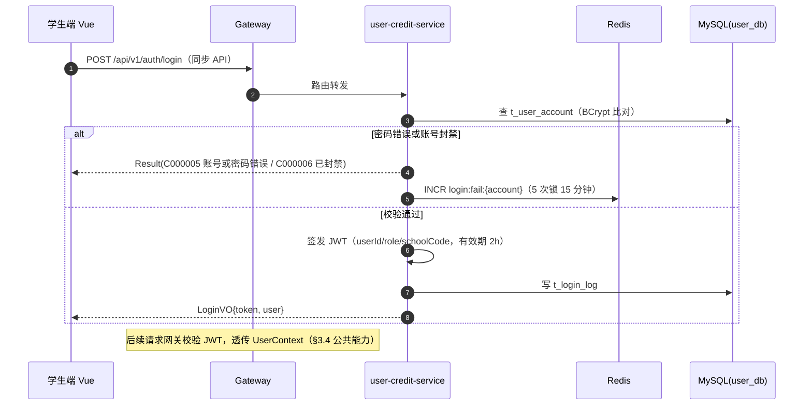

##### §3.2.M1.5 关键流程逻辑

```
触发：POST /internal/credit/adjust（评价/履约事件回流；由 M2/M4 的 Outbox 事件驱动其内部调用）

Step 1: 幂等校验（同步）
  ├── 以 bizEventId 查 t_credit_record 唯一索引 → 已存在直接返回成功（防重复加分）
  └── [兜底] 唯一索引冲突捕获 DuplicateKeyException → 幂等返回成功

Step 2: 信用分更新（本地事务，user_db）
  ├── INSERT t_credit_record + UPDATE t_user_account.credit_score（乐观锁 version）
  ├── 分数钳制 [0, 200]
  └── 无状态机（信用分单调累计）；无跨库事务：M2/M4 侧 Outbox 保证事件至少一次到达，
      本服务以 bizEventId 唯一索引保证恰好一次生效（最终一致）
```

#### 3.2.M2 二手交易服务（trade-service）

##### §3.2.M2.1 模块概述

二手交易服务覆盖商品发布与检索（F2.1）、单库存下单与订单状态机（F2.2）、余额支付与结算（F5，D-09）、双向评价（F2.3）业务流程，是 L0 核心业务。业务逻辑在买家、卖家、平台管理员之间流动，同时涉及用户与信用服务（评价事件回流）、通知服务（状态事件 Outbox 投递，C-02 Published Language）、平台管理服务（下架指令，C-07）、AI 助手服务（白名单读工具被调用方，C-03）、MySQL trade_db（C-01）、Redis（C-02，商品热点缓存 + 幂等键）等内外部系统的数据流动。

##### §3.2.M2.2 接口清单

| 子领域 | 方法 | 路径 | 用途（≤ 20 字） | 请求 DTO | 响应 VO | 幂等 |
| --- | --- | --- | --- | --- | --- | --- |
| 商品 | POST | /api/v1/goods | 发布商品（敏感词过滤后上架） | `GoodsCreateRequest` | `GoodsVO` | 是（X-Idempotency-Key） |
| 商品 | GET | /api/v1/goods | 关键词/类目/分页检索 | Query 参数 | `GoodsListVO` | 天然 |
| 商品 | GET | /api/v1/goods/{id} | 商品详情 | — | `GoodsDetailVO` | 天然 |
| 商品 | PUT | /api/v1/goods/{id} | 编辑本人商品 | `GoodsUpdateRequest` | `GoodsVO` | 是（id+version） |
| 商品 | DELETE | /api/v1/goods/{id} | 下架本人商品 | — | `Result` | 天然 |
| 订单 | POST | /api/v1/trade-orders | 下单（冻结余额 + 占库存） | `TradeOrderCreateRequest` | `TradeOrderVO` | 是（X-Idempotency-Key，资金类强制） |
| 订单 | GET | /api/v1/trade-orders/my | 我的订单（买/卖分栏） | Query 参数 | `TradeOrderListVO` | 天然 |
| 订单 | GET | /api/v1/trade-orders/{id} | 订单详情 | — | `TradeOrderDetailVO` | 天然 |
| 订单 | POST | /api/v1/trade-orders/{id}/confirm | 买家确认收货（划转） | — | `TradeOrderVO` | 是（状态机前置校验） |
| 订单 | POST | /api/v1/trade-orders/{id}/cancel | 取消订单（解冻） | — | `TradeOrderVO` | 是（状态机前置校验） |
| 订单 | POST | /api/v1/trade-orders/{id}/reviews | 双向评价 | `ReviewCreateRequest` | `ReviewVO` | 是（orderId+rater 唯一） |
| 余额 | GET | /api/v1/balance | 查询余额 | — | `BalanceVO` | 天然 |
| 余额 | POST | /api/v1/balance/recharge | 模拟充值（D-09） | `RechargeRequest` | `BalanceVO` | 是（X-Idempotency-Key，资金类强制） |
| 余额 | GET | /api/v1/balance/flows | 余额流水分页 | Query 参数 | `BalanceFlowListVO` | 天然 |
| 内部·商品 | POST | /internal/goods/{id}/offshelf | 管理端违规下架（C-07） | `OffShelfRequest` | `Result` | 天然（状态幂等） |
| 内部·工具 | GET | /internal/goods/search | AI 白名单读工具 | Query 参数 | `GoodsListVO` | 天然 |

##### §3.2.M2.3 关键结构定义（DTO）

```java
public class TradeOrderCreateRequest {
  // ===== 必填字段 =====
  @NotNull  private Long goodsId;         // 目标商品，单库存
  // ===== 幂等字段 =====
  @NotBlank private String idempotencyKey; // X-Idempotency-Key，UUID，调用方生成
  // ===== 可选字段 =====
  private String remark;                   // 买家留言，≤ 100 字，过敏感词
}

public class TradeOrderDetailVO {
  // ===== 基本信息 =====
  private Long id;
  private String orderNo;                  // 展示单号：TO + yyyyMMdd + 6 位序列
  private Long goodsId;
  private String goodsTitle;               // 冗余展示字段（P-04，禁止跨库 JOIN）
  private Long buyerId;
  private Long sellerId;
  private BigDecimal price;                // 成交价，下单时快照
  // ===== 状态字段 =====
  private String status;                   // 枚举：FROZEN / COMPLETED / CANCELLED
  // ===== 时间字段 =====
  private LocalDateTime createdAt;
  private LocalDateTime completedAt;
  // ===== 扩展字段 =====
  private Map<String, Object> bizFields;   // 业务方扩展，禁止扩展业务核心语义
}
```

| DTO / VO 名 | 字段名 | 类型 | 必填 | 业务含义 | 约束 / 默认值 |
| --- | --- | --- | --- | --- | --- |
| `GoodsCreateRequest` | title | String | 是 | 商品标题 | 长度 ≤ 50，过敏感词 |
| `GoodsCreateRequest` | category | String | 是 | 类目 | 枚举：BOOK/DIGITAL/DAILY/SPORT/OTHER |
| `GoodsCreateRequest` | price | BigDecimal | 是 | 售价 | 0.01 ≤ price ≤ 99999.99 |
| `GoodsCreateRequest` | images | `List<String>` | 否 | 图片 URL 列表 | ≤ 9 张，Nginx 静态目录路径 |
| `ReviewCreateRequest` | rating | Integer | 是 | 评分 | 1~5 |
| `RechargeRequest` | amount | BigDecimal | 是 | 模拟充值金额 | 1 ≤ amount ≤ 500（单笔） |
| `TradeOrderDetailVO` | status | String | 是 | 订单状态 | 枚举见 §3.2.M2.5 状态机 |

##### §3.2.M2.4 模块逻辑时序图

| 编号 | 标题 | 场景类别 | 是否包含异常分支 |
| --- | --- | --- | --- |
| SQ-21 | 二手交易服务 - 下单（余额冻结 + 库存占用） | 核心动作的执行 | 是 |
| SQ-22 | 二手交易服务 - 确认收货（扣减划转 + 事件投递） | 核心动作的执行 / 补偿 | 是 |

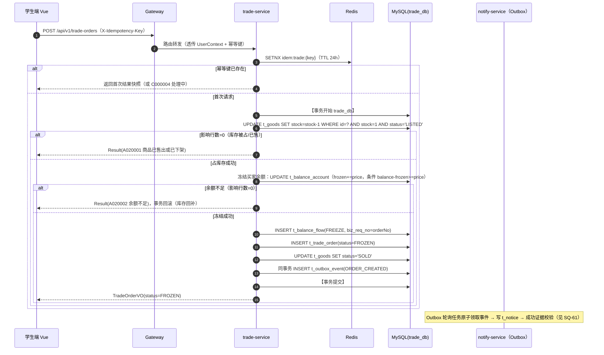

##### §3.2.M2.5 关键流程逻辑

**状态机迁移表（二手订单 t_trade_order.status）**：

| 起始状态 | 触发事件 | 终止状态 | 触发条件 / 校验 | 副作用 |
| --- | --- | --- | --- | --- |
| （无，下单事务内直达） | 下单成功 | FROZEN | 库存占用成功 + 余额冻结成功（同一本地事务） | 商品置 SOLD；Outbox 事件 ORDER_CREATED |
| FROZEN | 买家确认收货 | COMPLETED | 仅买家本人（数据归属校验）；冻结余额划转给卖家（同事务） | 卖家入账流水；Outbox 事件 ORDER_COMPLETED；评价窗口开启 |
| FROZEN | 买家取消 | CANCELLED | 仅买家本人；解冻余额（同事务） | 商品回 LISTED；Outbox 事件 ORDER_CANCELLED |
| FROZEN | 管理员违规下架裁定 | CANCELLED | 平台管理域 C-07 指令 | 解冻买家余额；通知双方 |
| COMPLETED | 双方评价完成 | COMPLETED（评价关闭） | orderId+rater 唯一约束 | Outbox 事件 REVIEW_SUBMITTED → 信用回流 |
| COMPLETED | 超 7 天未评价 | COMPLETED | 定时任务扫描 review_deadline | 默认好评写入 |

**关键伪代码（下单事务边界与 Mock 点）**：

```
触发：POST /api/v1/trade-orders
Step 1: 幂等前置（Redis SETNX，TTL 24h）→ 重复请求返回首次结果快照
Step 2: 【单库本地事务 trade_db】
  ├── 库存原子占用：UPDATE ... stock=stock-1 WHERE stock=1 AND status='LISTED'
  ├── 余额冻结：UPDATE t_balance_account SET frozen=frozen+price WHERE balance-frozen>=price
  │     → 影响行数=0 时抛 BizException(A020002 余额不足) 整体回滚（库存回补）
  ├── 流水落库（biz_req_no=orderNo，uk 兜底）+ 订单落库 FROZEN + 商品置 SOLD
  └── 同事务写 t_outbox_event（"状态变更"与"事件"原子性，V5 基础）
[MOCK] 模拟充值通道：RechargeService 直接写 RECHARGE 流水并加余额；
  [完整版替换点] PaymentChannelAdapter 接口不变，实现类替换为微信支付（回调改异步通知 + 对账）
```

#### 3.2.M3 失物招领服务（lostfound-service）

##### §3.2.M3.1 模块概述

失物招领服务覆盖失物/拾物双发布与关键词匹配提醒（F3.1）、认领申请与状态机审核（F3.2）业务流程。业务逻辑在失主、拾得人、平台管理员之间流动，同时涉及平台管理服务（认领审核结论回调 + 违规下架，C-07）、通知服务（匹配提醒/审核结果事件，C-02）、AI 助手服务（白名单读/写工具被调用方，C-03）、MySQL lostfound_db（C-01）等内外部系统的数据流动。审核采用"状态机 + 审核记录表"轻量方案（用户冻结裁决：不引入 Flowable）。

##### §3.2.M3.2 接口清单

| 子领域 | 方法 | 路径 | 用途（≤ 20 字） | 请求 DTO | 响应 VO | 幂等 |
| --- | --- | --- | --- | --- | --- | --- |
| 条目 | POST | /api/v1/lost-items | 发布失物登记或拾物信息 | `LostItemCreateRequest` | `LostItemVO` | 是（X-Idempotency-Key） |
| 条目 | GET | /api/v1/lost-items | 关键词/类型分页检索 | Query 参数 | `LostItemListVO` | 天然 |
| 条目 | GET | /api/v1/lost-items/{id} | 条目详情 | — | `LostItemDetailVO` | 天然 |
| 条目 | PUT | /api/v1/lost-items/{id} | 编辑本人条目 | `LostItemUpdateRequest` | `LostItemVO` | 是（id+version） |
| 条目 | DELETE | /api/v1/lost-items/{id} | 删除/关闭本人条目 | — | `Result` | 天然 |
| 认领 | POST | /api/v1/lost-items/{id}/claims | 提交认领申请 | `ClaimCreateRequest` | `ClaimVO` | 是（item+claimer+round 唯一） |
| 认领 | GET | /api/v1/claims/my | 我的认领申请列表 | Query 参数 | `ClaimListVO` | 天然 |
| 认领 | POST | /api/v1/claims/{id}/return-confirm | 失主确认归还 | — | `ClaimVO` | 是（状态机前置校验） |
| 内部·条目 | POST | /internal/lost-items/{id}/offshelf | 管理端违规下架（C-07） | `OffShelfRequest` | `Result` | 天然 |
| 内部·审核 | POST | /internal/claims/{id}/review | 管理端审核结论回调（C-07） | `ClaimReviewRequest` | `Result` | 是（claimId+round） |
| 内部·工具 | GET | /internal/lost-items/search | AI 白名单读工具 | Query 参数 | `LostItemListVO` | 天然 |
| 内部·工具 | POST | /internal/lost-items | AI 代办登记失物（写工具） | `LostItemCreateRequest` | `LostItemVO` | 是（X-Idempotency-Key） |

##### §3.2.M3.3 关键结构定义（DTO）

```java
public class LostItemCreateRequest {
  // ===== 必填字段 =====
  @NotBlank private String title;          // 物品名，≤ 30 字，匹配键之一
  @NotBlank private String description;    // 物品描述，≤ 200 字
  @NotBlank private String itemType;       // 枚举：LOST（失物登记）/ FOUND（拾物发布）
  @NotBlank private String location;       // 地点，匹配键之一
  // ===== 可选字段 =====
  private String occurredAt;               // 发生时间（ISO-8601），匹配键之一
  private List<String> images;             // 图片 ≤ 3 张
  // ===== 扩展字段 =====
  private Map<String, Object> bizFields;
}

public class LostItemDetailVO {
  // ===== 基本信息 =====
  private Long id;
  private String title;
  private String itemType;                 // 枚举：LOST / FOUND
  private String location;
  // ===== 状态字段 =====
  private String status;                   // 枚举：OPEN / MATCHED / RETURNED / CLOSED / OFFSHELF
  // ===== 时间字段 =====
  private LocalDateTime createdAt;
}
```

| DTO / VO 名 | 字段名 | 类型 | 必填 | 业务含义 | 约束 / 默认值 |
| --- | --- | --- | --- | --- | --- |
| `ClaimCreateRequest` | evidenceDesc | String | 是 | 认领凭证描述 | 长度 10~200 |
| `ClaimCreateRequest` | contactHint | String | 是 | 联系方式提示 | 展示时脱敏（§7.2.2） |
| `LostItemDetailVO` | status | String | 是 | 条目状态 | 枚举：OPEN/MATCHED/RETURNED/CLOSED/OFFSHELF |

##### §3.2.M3.4 模块逻辑时序图

| 编号 | 标题 | 场景类别 | 是否包含异常分支 |
| --- | --- | --- | --- |
| SQ-31 | 失物招领服务 - 认领申请与审核联动 | 核心动作的执行 / 跨域协作 | 是 |

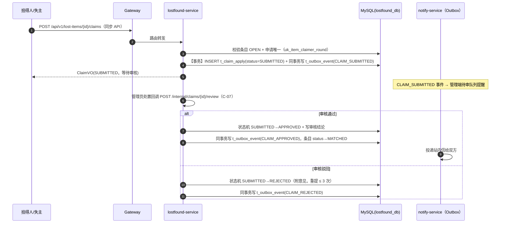

##### §3.2.M3.5 关键流程逻辑

**状态机迁移表（认领申请 t_claim_apply.status）**：

| 起始状态 | 触发事件 | 终止状态 | 触发条件 / 校验 | 副作用 |
| --- | --- | --- | --- | --- |
| （无） | 提交申请 | SUBMITTED | 条目 OPEN；同条目同人同轮未重复申请 | Outbox 事件 CLAIM_SUBMITTED（进管理端待审队列） |
| SUBMITTED | 审核通过 | APPROVED | 管理员处置（审核记录表留痕） | Outbox 事件；条目 status→MATCHED |
| SUBMITTED | 审核驳回 | REJECTED | 重提轮次 < 3 | Outbox 事件；可补充材料重提 |
| REJECTED | 重新提交 | SUBMITTED | 重提轮次 < 3 | 重新进队列 |
| APPROVED | 失主确认归还 | RETURNED | 仅失主本人确认 | Outbox 事件 RETURN_CONFIRMED；评价窗口开启 |
| RETURNED | 双方评价 / 7 天默认 | CLOSED | 定时任务扫描 | 条目 status→CLOSED；信用回流 |

**匹配提醒逻辑**：条目发布后异步任务以"物品名关键词 + 地点 + 时间窗（±3 天）"在异类型条目（LOST ↔ FOUND）中检索候选，命中则写 Outbox 事件 MATCH_FOUND 投递提醒；本轮失败（BD-06）放弃、下轮重算，幂等键 = 条目对 ID + 日期，防重复提醒。

#### 3.2.M4 跑腿拼单服务（errand-service）

##### §3.2.M4.1 模块概述

跑腿拼单服务覆盖发单与并发抢单（F4.1）、履约交接与评价（F4.2）、顺路拼单轻量承载（F4.3，经中间确认 D-08）业务流程，是本系统并发正确性（Q1/V3）的核心载体，同为 L0 核心业务。业务逻辑在发单人、接单员之间流动，同时涉及用户与信用服务（信用接单优先级 + 评价事件回流）、通知服务（接单/转派事件，C-02）、AI 助手服务（Dubbo 对比链路消费方 + 白名单工具被调用方，C-06/C-03）、MySQL errand_db（C-01）、Redis（C-02，Redisson 分布式锁）等内外部系统的数据流动。酬劳冻结/划转通过内部接口复用 M2 余额体系（P-04/P-05 纪律）。

##### §3.2.M4.2 接口清单

| 子领域 | 方法 | 路径 | 用途（≤ 20 字） | 请求 DTO | 响应 VO | 幂等 |
| --- | --- | --- | --- | --- | --- | --- |
| 跑腿单 | POST | /api/v1/errand-orders | 发布跑腿单（冻结酬劳） | `ErrandCreateRequest` | `ErrandOrderVO` | 是（X-Idempotency-Key，资金类强制） |
| 跑腿单 | GET | /api/v1/errand-orders | 抢单大厅（PUBLISHED 列表） | Query 参数 | `ErrandListVO` | 天然 |
| 跑腿单 | GET | /api/v1/errand-orders/my | 我的发单/接单分栏 | Query 参数 | `ErrandListVO` | 天然 |
| 跑腿单 | GET | /api/v1/errand-orders/{id} | 跑腿单详情 | — | `ErrandDetailVO` | 天然 |
| 跑腿单 | POST | /api/v1/errand-orders/{id}/grab | 并发抢单（双保险） | — | `ErrandOrderVO` | 是（orderId 唯一约束 + 锁，强制） |
| 跑腿单 | POST | /api/v1/errand-orders/{id}/pickup | 接单员取件确认 | — | `ErrandOrderVO` | 是（状态机前置校验） |
| 跑腿单 | POST | /api/v1/errand-orders/{id}/deliver | 接单员送达确认 | — | `ErrandOrderVO` | 是（状态机前置校验） |
| 跑腿单 | POST | /api/v1/errand-orders/{id}/finish | 发单人确认完成（划转） | — | `ErrandOrderVO` | 是（状态机前置校验） |
| 跑腿单 | POST | /api/v1/errand-orders/{id}/cancel | 发单人取消（解冻） | — | `ErrandOrderVO` | 是（状态机前置校验） |
| 拼单 | POST | /api/v1/errand-orders/{id}/subtasks | 添加顺路拼单子任务（D-08） | `SubtaskCreateRequest` | `SubtaskVO` | 是（X-Idempotency-Key） |
| 拼单 | POST | /api/v1/subtasks/{id}/accept | 接单员接子任务 | — | `SubtaskVO` | 是（order+acceptor 唯一约束） |
| 评价 | POST | /api/v1/errand-orders/{id}/reviews | 双向评价 | `ReviewCreateRequest` | `ReviewVO` | 是（orderId+rater 唯一） |
| 内部·RPC | Dubbo | ErrandQueryDubboService.getErrandBrief(id) | AI 查跑腿单（F14 对比链路） | `ErrandBriefQuery` | `ErrandBriefDTO` | 天然（读） |
| 内部·工具 | GET | /internal/errand-orders/{id} | AI 白名单读工具 | — | `ErrandBriefDTO` | 天然 |
| 内部·工具 | POST | /internal/errand-orders | AI 代办发跑腿单（写工具） | `ErrandCreateRequest` | `ErrandOrderVO` | 是（X-Idempotency-Key） |

##### §3.2.M4.3 关键结构定义（DTO）

```java
public class ErrandCreateRequest {
  // ===== 必填字段 =====
  @NotBlank private String title;          // 任务标题，≤ 30 字
  @NotBlank private String description;    // 任务描述，≤ 200 字
  @NotBlank private String errandType;     // 枚举：PICKUP(帮取) / BUY(帮买) / SEND(帮送)
  @NotNull  private BigDecimal reward;     // 酬劳（发单即冻结），0.5 ≤ reward ≤ 100
  @NotBlank private String deadline;       // 截止时间（ISO-8601），≥ 当前 +10 分钟
  // ===== 顺路拼单（D-08） =====
  private Boolean rideshareFlag;           // 是否顺路拼单，默认 false
  private String rideshareNote;            // 拼单备注（路线说明），≤ 50 字
  // ===== 幂等字段 =====
  @NotBlank private String idempotencyKey; // X-Idempotency-Key
}

public class ErrandDetailVO {
  // ===== 基本信息 =====
  private Long id;
  private String errandNo;                 // 展示单号：EO + yyyyMMdd + 6 位序列
  private String errandType;               // 枚举：PICKUP / BUY / SEND
  private BigDecimal reward;
  private Long publisherId;
  private Long grabberId;                  // 接单员，未抢为 null
  // ===== 状态字段 =====
  private String status;                   // 枚举：PUBLISHED/GRABBED/PICKED/DELIVERED/COMPLETED/REASSIGNED/CANCELLED
  // ===== 拼单字段（D-08） =====
  private Boolean rideshareFlag;
  private String rideshareNote;
  private List<SubtaskVO> subtasks;        // 顺路拼单子任务列表
  // ===== 时间字段 =====
  private LocalDateTime deadline;
  private LocalDateTime createdAt;
}
```

| DTO / VO 名 | 字段名 | 类型 | 必填 | 业务含义 | 约束 / 默认值 |
| --- | --- | --- | --- | --- | --- |
| `ErrandDetailVO` | status | String | 是 | 跑腿单状态 | 枚举见 §3.2.M4.5 状态机 |
| `SubtaskCreateRequest` | note | String | 是 | 子任务说明（顺路捎带内容） | ≤ 50 字 |
| `SubtaskVO` | status | String | 是 | 子任务状态 | 枚举：OPEN / ACCEPTED / DONE |
| `ErrandBriefDTO` | id | Long | 是 | RPC 返回跑腿单摘要 | Dubbo 与 Feign 双实现共用契约（C-06） |

##### §3.2.M4.4 模块逻辑时序图

| 编号 | 标题 | 场景类别 | 是否包含异常分支 |
| --- | --- | --- | --- |
| SQ-41 | 跑腿拼单服务 - 并发抢单（双保险） | 核心动作的执行（并发） | 是 |
| SQ-42 | 跑腿拼单服务 - 超时自动转派 | 异常 / 补偿 | 是 |

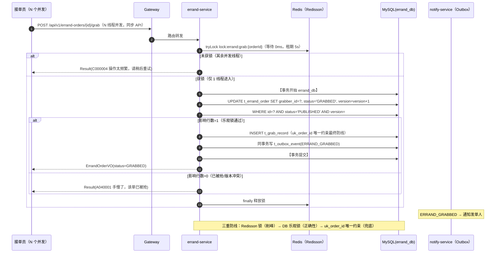

##### §3.2.M4.5 关键流程逻辑

**状态机迁移表（跑腿单 t_errand_order.status）**：

| 起始状态 | 触发事件 | 终止状态 | 触发条件 / 校验 | 副作用 |
| --- | --- | --- | --- | --- |
| （无，发单事务内） | 发单成功 | PUBLISHED | 酬劳冻结成功（内部调 M2 余额，同事务语义以 biz_req_no 幂等对齐） | 进入抢单大厅；Outbox 事件 ERRAND_PUBLISHED |
| PUBLISHED | 抢单成功 | GRABBED | Redisson 锁 + 乐观锁 + uk_order_id 三重防线 | 记录 grabber + pickup_deadline=now+30min；Outbox 事件 ERRAND_GRABBED |
| PUBLISHED | 发单人取消 | CANCELLED | 无 grabber | 解冻酬劳；通知下架 |
| GRABBED | 取件确认 | PICKED | 仅 grabber 本人 | Outbox 事件 |
| GRABBED | 30 分钟未取件 | REASSIGNED → PUBLISHED | 定时任务扫描（每分钟）；转派次数 ≤ 3 | grabber 置空重进抢单池；Outbox 事件 ERRAND_REASSIGNED；超 3 次 → A040002 终止并通知发单人 |
| PICKED | 送达确认 | DELIVERED | 仅 grabber 本人 | Outbox 事件（通知发单人确认） |
| DELIVERED | 发单人确认完成 | COMPLETED | 仅 publisher 本人 | 酬劳划转给 grabber（biz_req_no 幂等）；评价窗口开启 |
| DELIVERED | 24 小时未确认 | COMPLETED | 定时任务扫描 | 自动划转 + 默认好评 |
| 任意非终态 | 管理员裁定取消 | CANCELLED | 平台管理域指令 | 按状态解冻/退回酬劳（发单人） |

**顺路拼单（D-08）逻辑**：rideshareFlag=true 的跑腿单可挂子任务（t_errand_subtask）；子任务接单走独立唯一约束（uk order+acceptor），仅记录捎带承诺，酬劳仍以主单计算（MVP 轻量边界，完整版拼团撮合见 O2）；主单状态机不受子任务影响。

#### 3.2.M5 AI 助手服务（ai-assistant-service）

##### §3.2.M5.1 模块概述

AI 助手服务覆盖三域 Agent 对话问答与工具代办（F6.1）、Dubbo 对比链路（F6.2）业务流程，是工具调用可信化（V4）的核心载体。业务逻辑在学生（AI 使用者）与三个领域 Agent（交易/失物/跑腿）之间流动，同时涉及百炼 DashScope qwen-plus（E-01，C-04 Conformist）、二手/失物/跑腿服务（白名单工具，经 ToolAdapter ACL 防腐层 C-03 + Dubbo 对比链路 C-06）、Redis（C-02，会话记忆缓存）、MySQL ai_db（C-01，会话与工具调用记录）等内外部系统的数据流动。

##### §3.2.M5.2 接口清单

| 子领域 | 方法 | 路径 | 用途（≤ 20 字） | 请求 DTO | 响应 VO | 幂等 |
| --- | --- | --- | --- | --- | --- | --- |
| 对话 | POST | /api/v1/ai/chats（SSE 流式） | 发起对话，流式返回 | `AiChatRequest` | SSE event 流 | 写工具由工具侧幂等键保障 |
| 对话 | GET | /api/v1/ai/sessions | 我的会话列表 | Query 参数 | `AiSessionListVO` | 天然 |
| 对话 | GET | /api/v1/ai/sessions/{id}/messages | 会话消息历史 | Query 参数 | `AiMessageListVO` | 天然 |
| 对话 | DELETE | /api/v1/ai/sessions/{id} | 删除会话 | — | `Result` | 天然 |
| 内部·质量 | GET | /internal/ai/tool-call-stats | 断言失败率查询（管理端） | Query 参数 | `ToolCallStatsVO` | 天然 |

##### §3.2.M5.3 关键结构定义（DTO）

```java
public class AiChatRequest {
  // ===== 必填字段 =====
  @NotNull  private Long sessionId;        // 会话 ID，首次可传 null 自动创建
  @NotBlank private String content;        // 用户输入，≤ 500 字
  // ===== 可选字段 =====
  private String agentHint;                // 枚举：TRADE/LOSTFOUND/ERRAND，默认 LLM 自动路由
}

public class AiMessageVO {
  // ===== 基本信息 =====
  private Long id;
  private Long sessionId;
  private String role;                     // 枚举：USER / ASSISTANT / TOOL
  private String content;
  // ===== 工具调用证据（V4） =====
  private String toolName;                 // 调用的工具名（白名单键）
  private ToolEvidenceVO evidence;         // 系统执行证据（业务单号/条目 ID + 断言结果）
  // ===== 时间字段 =====
  private LocalDateTime createdAt;
}

public class ToolEvidenceVO {
  // ===== 断言结果 =====
  private Boolean asserted;                // 后置断言是否通过
  private String bizRef;                   // 证据引用：订单号/条目 ID
  private String assertionMsg;             // 断言说明（失败原因）
}
```

| DTO / VO 名 | 字段名 | 类型 | 必填 | 业务含义 | 约束 / 默认值 |
| --- | --- | --- | --- | --- | --- |
| `AiChatRequest` | agentHint | String | 否 | Agent 路由提示 | 枚举：TRADE/LOSTFOUND/ERRAND |
| `AiMessageVO` | role | String | 是 | 消息角色 | 枚举：USER/ASSISTANT/TOOL |
| `ToolEvidenceVO` | asserted | Boolean | 是 | 后置断言结果 | 写工具必填；false 时禁止生成确认话术 |
| `ToolEvidenceVO` | bizRef | String | 条件必填 | 系统证据引用 | 写工具断言通过时必填 |

##### §3.2.M5.4 模块逻辑时序图

| 编号 | 标题 | 场景类别 | 是否包含异常分支 |
| --- | --- | --- | --- |
| SQ-51 | AI 助手服务 - 写工具调用与后置断言（可信链路） | 核心动作的执行 / 可信校验 | 是 |

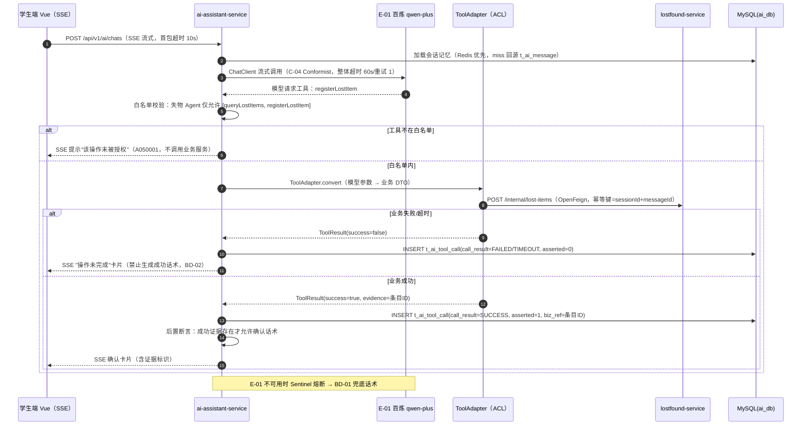

##### §3.2.M5.5 关键流程逻辑

```
触发：POST /api/v1/ai/chats（写代办场景）

Step 1: 路由（同步）
  ├── agentHint 显式指定 → 直连对应 Agent
  └── 未指定 → LLM 路由（意图分类提示词），置信度不足时追问澄清

Step 2: 工具执行（同步，写操作）
  ├── 白名单校验：每个 Agent 独立工具清单（交易 4 / 失物 3 / 跑腿 3，合计 ≥ 8 个读+写工具，对齐上游 V2 AI 指标）
  ├── [MOCK] 无本地模型：默认走 E-01；[完整版替换点] Ollama 兜底（Spring AI 配置切换，代码不动，R-04）
  ├── 幂等：写工具幂等键 = sessionId + messageId，业务服务侧唯一索引兜底（§3.5.2）
  └── 状态记录：t_ai_tool_call 落 call_result 与 asserted 结果（V4 证据表，Q4 无状态机）

Step 3: 后置断言（同步，V4 核心）
  ├── 写工具成功 → 必须解析出业务证据（bizRef）才标记断言通过
  ├── 断言失败 → ASSISTANT 消息固定为失败话术，模型不得自由发挥确认语
  └── 断言失败率上报 /internal/ai/tool-call-stats（管理端指标 + §8 告警 AL-07）
```

**Dubbo 对比链路（F6.2）**：`ErrandQueryDubboService`（errand-service 提供 @DubboService，M5 @DubboReference）与 OpenFeign 共用同一契约 `ErrandBriefDTO`；演示开关 `ai.rpc.mode=feign|dubbo`（Nacos 配置，§5.1 L2），运行时按配置路由，答辩现场可切换对比时延。

#### 3.2.M6 通知服务（notify-service）

##### §3.2.M6.1 模块概述

通知服务覆盖 Outbox 可靠投递（F7.1）与站内信中心（F7.2）业务流程，是状态触达可靠性（V5 ≥ 99%）的核心载体。业务逻辑在各业务服务（事件上游，C-02 Published Language）与学生（通知接收人）之间流动，同时涉及 MySQL（C-01，各业务库 outbox 表 + notify_db 站内信表）、Outbox 轮询定时任务（notify 内置 Spring Task）等内外部系统。

##### §3.2.M6.2 接口清单

| 子领域 | 方法 | 路径 | 用途（≤ 20 字） | 请求 DTO | 响应 VO | 幂等 |
| --- | --- | --- | --- | --- | --- | --- |
| 通知 | GET | /api/v1/notices | 我的通知分页（未读优先） | Query 参数 | `NoticeListVO` | 天然 |
| 通知 | GET | /api/v1/notices/unread-count | 未读数角标 | — | `UnreadCountVO` | 天然 |
| 通知 | POST | /api/v1/notices/{id}/read | 标记已读 | — | `Result` | 天然 |
| 通知 | POST | /api/v1/notices/read-all | 全部已读 | — | `Result` | 天然 |
| 内部·补偿 | POST | /internal/outbox/{eventId}/redeliver | 管理端手动补投（BD-05） | — | `Result` | 是（eventId 幂等） |

##### §3.2.M6.3 关键结构定义（DTO）

```java
public class NoticeListVO {
  // ===== 基本信息 =====
  private Long id;
  private String title;                    // 通知标题，如"你的跑腿单已被接"
  private String content;
  private String bizType;                  // 枚举：ORDER / CLAIM / ERRAND / SYSTEM
  private String bizRef;                   // 点击跳转的业务单号
  // ===== 状态字段 =====
  private Boolean readFlag;                // 未读标记
  // ===== 时间字段 =====
  private LocalDateTime createdAt;
}

public class OutboxEventDTO {
  // ===== 事件信封（Published Language 标准 Schema，C-02） =====
  private String eventId;                  // UUID，全局唯一（防重复投递键）
  private String eventType;                // 枚举：ORDER_CREATED/ERRAND_GRABBED/CLAIM_APPROVED/...（全局枚举）
  private String aggregateId;              // 业务聚合 ID
  private Long targetUserId;               // 接收人
  private String payload;                  // JSON 业务载荷
  private LocalDateTime occurredAt;
}
```

| DTO / VO 名 | 字段名 | 类型 | 必填 | 业务含义 | 约束 / 默认值 |
| --- | --- | --- | --- | --- | --- |
| `OutboxEventDTO` | eventId | String | 是 | 事件唯一键 | 防重复投递；t_notice 以 event_id 唯一索引 |
| `OutboxEventDTO` | eventType | String | 是 | 事件类型 | 全局枚举，Schema 变更需评审（Published Language 纪律） |
| `NoticeListVO` | readFlag | Boolean | 是 | 已读状态 | 未读列表按时间倒序置顶 |

##### §3.2.M6.4 模块逻辑时序图

| 编号 | 标题 | 场景类别 | 是否包含异常分支 |
| --- | --- | --- | --- |
| SQ-61 | 通知服务 - Outbox 原子领取与可靠投递 | 核心动作的执行 / 补偿 | 是 |

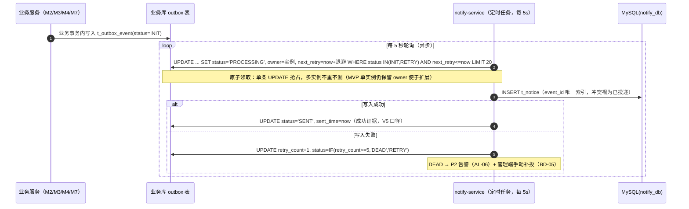

##### §3.2.M6.5 关键流程逻辑

```
触发：Outbox 轮询定时任务（Spring Task，fixedDelay 5s，任务超时上限 30s，失败重试 3 次后告警）

Step 1: 原子领取（异步）
  ├── 各业务库 t_outbox_event 按 next_retry 时间窗批量抢占（LIMIT 20，状态机 INIT/RETRY→PROCESSING）
  └── [幂等] t_notice.event_id 唯一索引是投递"恰好一次"的最终防线

Step 2: 投递与证据（异步）
  ├── 成功 → status=SENT（成功证据；V5 口径：SENT 数 / 应投递总数 ≥ 99%）
  ├── 失败 → 指数退避 30s/2min/10min/30min/1h，5 次后 DEAD + P2 告警
  └── 状态变更：INIT→PROCESSING→SENT ｜ RETRY→DEAD（Outbox 事件自身状态机）
```

#### 3.2.M7 平台管理服务（admin-service）

##### §3.2.M7.1 模块概述

平台管理服务覆盖内容审核与举报处置（F8.1）、指标简版（F8.2 简化实现）业务流程。业务逻辑在平台管理员与待审内容（认领申请/敏感词命中/举报）之间流动，同时涉及失物招领服务（认领审核结论联动，C-07）、二手交易/失物招领服务（违规下架指令，C-07 Open Host Service）、通知服务（处置结果事件，C-02）、MySQL admin_db（C-01）等内外部系统。审核采用状态机 + 审核记录表（用户冻结裁决：不引入 Flowable）。

##### §3.2.M7.2 接口清单

| 子领域 | 方法 | 路径 | 用途（≤ 20 字） | 请求 DTO | 响应 VO | 幂等 |
| --- | --- | --- | --- | --- | --- | --- |
| 审核 | GET | /api/v1/admin/audits/queue | 待审队列（认领/举报） | Query 参数 | `AuditQueueVO` | 天然 |
| 审核 | POST | /api/v1/admin/audits | 审核处置（通过/驳回/下架） | `AuditDecisionRequest` | `AuditRecordVO` | 是（bizType+bizId+round 唯一） |
| 举报 | POST | /api/v1/reports | 学生提交举报 | `ReportCreateRequest` | `ReportVO` | 是（X-Idempotency-Key） |
| 内容 | GET | /api/v1/admin/contents | 全量内容治理列表 | Query 参数 | `ContentListVO` | 天然 |
| 内容 | POST | /api/v1/admin/contents/offshelf | 违规下架（联动 M2/M3） | `OffShelfDecisionRequest` | `Result` | 是（bizId 幂等） |
| 用户 | GET | /api/v1/admin/users | 用户列表/信用查看 | Query 参数 | `UserAdminListVO` | 天然 |
| 用户 | POST | /api/v1/admin/users/{id}/ban | 违规封禁 | `BanRequest` | `Result` | 天然（状态幂等） |
| 指标 | GET | /api/v1/admin/metrics/summary | 完单率/通知成功率/断言失败率简版 | — | `MetricsSummaryVO` | 天然 |
| 内部·敏感词 | POST | /internal/sensitive/check | 敏感词过滤（M2/M3 发布前调用） | `SensitiveCheckRequest` | `SensitiveCheckVO` | 天然 |

##### §3.2.M7.3 关键结构定义（DTO）

```java
public class AuditDecisionRequest {
  // ===== 必填字段 =====
  @NotBlank private String bizType;        // 枚举：CLAIM / REPORT / CONTENT
  @NotNull  private Long bizId;            // 待审对象 ID
  @NotBlank private String decision;       // 枚举：APPROVE / REJECT / TAKEDOWN
  @NotBlank private String opinion;        // 审核意见，5~200 字（必填留痕）
  // ===== 扩展字段 =====
  private Map<String, Object> bizFields;
}

public class AuditRecordVO {
  // ===== 基本信息 =====
  private Long id;
  private String bizType;                  // 枚举：CLAIM / REPORT / CONTENT
  private Long bizId;
  private Long auditorId;                  // 操作人（管理员）
  private String decision;                 // 枚举：APPROVE / REJECT / TAKEDOWN
  private String opinion;
  // ===== 状态字段 =====
  private String execStatus;               // 枚举：PENDING / EXECUTED / FAILED
  // ===== 时间字段 =====
  private LocalDateTime createdAt;
}
```

| DTO / VO 名 | 字段名 | 类型 | 必填 | 业务含义 | 约束 / 默认值 |
| --- | --- | --- | --- | --- | --- |
| `AuditDecisionRequest` | decision | String | 是 | 处置动作 | 枚举：APPROVE/REJECT/TAKEDOWN |
| `AuditDecisionRequest` | opinion | String | 是 | 审核意见 | 必填，保证处置可追溯 |
| `SensitiveCheckVO` | passed | Boolean | 是 | 是否通过 | 命中词仅返回给管理端，不对学生展示词原文 |
| `MetricsSummaryVO` | aiAssertFailRate | BigDecimal | 是 | AI 断言失败率 | 时窗 24h，告警阈值联动 AL-07 |

##### §3.2.M7.4 模块逻辑时序图

| 编号 | 标题 | 场景类别 | 是否包含异常分支 |
| --- | --- | --- | --- |
| SQ-71 | 平台管理服务 - 违规下架联动 | 核心动作的执行 / 跨域协作 | 是 |

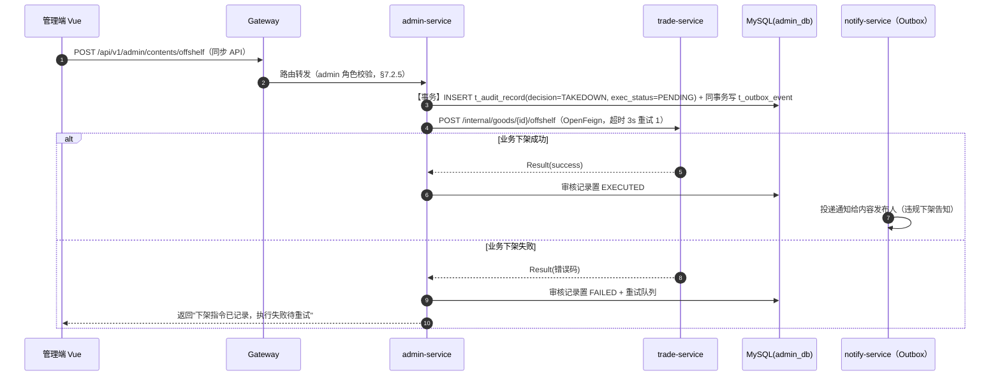

##### §3.2.M7.5 关键流程逻辑

**审核处置状态机（t_audit_record 联动业务对象）**：

| 起始状态 | 触发事件 | 终止状态 | 触发条件 / 校验 | 副作用 |
| --- | --- | --- | --- | --- |
| PENDING（待审队列） | 管理员处置 | EXECUTED | decision 合法 + opinion 必填 | 联动业务侧状态机（认领 APPROVED/REJECTED、内容下架）；Outbox 通知事件 |
| PENDING | 联动调用失败 | FAILED | 内部接口错误/超时 | 进重试队列（3 次）；P3 告警 |
| FAILED | 重试成功 | EXECUTED | 定时重试 | 补发通知 |

**敏感词过滤**：词库表 t_sensitive_word（管理端可维护）全量加载进 admin-service 内存（DFA 算法），M2/M3 发布接口同步调用 `/internal/sensitive/check`（超时 1s，超时按"通过 + 事后异步复审"放行并写审计，不阻塞发布主链路）。

### 3.3 核心业务对象清单

#### 3.3.1 对象定义

| 编号 | 对象名（代码类名） | 对象类型 | 包路径 | 模块归属 | 被哪些模块复用 | 实例化策略 | 序列化约定 | 持久化策略 |
| --- | --- | --- | --- | --- | --- | --- | --- | --- |
| O-01 | `UserAccount` | 聚合根 | `com.campus.user.domain` | user-credit-service | M1 / 全站（经 UserContext） | 工厂方法 `UserAccountFactory.register()` | JSON | 落表 → `t_user_account` |
| O-02 | `CreditRecord` | 实体 | `com.campus.user.domain` | user-credit-service | M1 / M2 / M4 | 由聚合根创建 | JSON | 落表 → `t_credit_record` |
| O-03 | `Goods` | 聚合根 | `com.campus.trade.domain` | trade-service | M2 / M5 | Builder | JSON | 落表 → `t_goods` |
| O-04 | `TradeOrder` | 聚合根 | `com.campus.trade.domain` | trade-service | M2 / M5 | 工厂方法（幂等键必填） | JSON | 落表 → `t_trade_order` |
| O-05 | `Review` | 实体 | `com.campus.trade.domain` | trade-service | M2 / M4（跑腿评价同构复用） | 由聚合根创建 | JSON | 落表 → `t_review` |
| O-06 | `BalanceAccount` | 聚合根 | `com.campus.trade.domain.balance` | trade-service | M2 / M4（划转） | 工厂方法（注册即开户） | JSON | 落表 → `t_balance_account` |
| O-07 | `BalanceFlow` | 实体 | `com.campus.trade.domain.balance` | trade-service | M2 / M4 | 由聚合根创建，不可变 | JSON | 落表 → `t_balance_flow` |
| O-08 | `LostItem` | 聚合根 | `com.campus.lostfound.domain` | lostfound-service | M3 / M5 | Builder（type 区分失物/拾物） | JSON | 落表 → `t_lost_item` |
| O-09 | `ClaimApply` | 聚合根 | `com.campus.lostfound.domain` | lostfound-service | M3 / M7 | 工厂方法 | JSON | 落表 → `t_claim_apply` |
| O-10 | `ErrandOrder` | 聚合根 | `com.campus.errand.domain` | errand-service | M4 / M5 | 工厂方法（冻结酬劳必填） | JSON | 落表 → `t_errand_order` |
| O-11 | `ErrandSubtask` | 实体 | `com.campus.errand.domain` | errand-service | M4 | 由聚合根创建（D-08） | JSON | 落表 → `t_errand_subtask` |
| O-12 | `AiSession` / `AiMessage` | 聚合根 / 实体 | `com.campus.ai.domain` | ai-assistant-service | M5 | 会话工厂 + 消息追加 | JSON | 落表 → `t_ai_session` / `t_ai_message` |
| O-13 | `AiToolCallLog` | 实体 | `com.campus.ai.domain` | ai-assistant-service | M5 / M7（指标） | 由断言结果创建 | JSON | 落表 → `t_ai_tool_call` |
| O-14 | `OutboxEvent` | 共享 DTO（事件信封） | `com.campus.common.outbox` | common | M2 / M3 / M4 / M6 / M7 | OutboxTemplate 同事务创建 | JSON payload | 落表 → 各业务库 `t_outbox_event` |
| O-15 | `Notice` | 实体 | `com.campus.notify.domain` | notify-service | M6 | 由事件投递创建 | JSON | 落表 → `t_notice` |
| O-16 | `AuditRecord` | 聚合根 | `com.campus.admin.domain` | admin-service | M7 / M3（审核联动） | 工厂方法（opinion 必填） | JSON | 落表 → `t_audit_record` |
| O-17 | `ToolResult` | 值对象（ACL 出参） | `com.campus.ai.acl` | ai-assistant-service | M5 | new（不可变） | JSON | 不落表，瞬时转换；证据落 `t_ai_tool_call` |
| O-18 | `ErrandBriefDTO` | 共享 DTO（Dubbo 契约） | `com.campus.errand.api.dto` | errand-service（api 包） | M4 / M5（C-06） | new | Hessian2（Dubbo）/ JSON（Feign） | 不落表 |

#### 3.3.2 命名漂移登记表

| 业务实体（§2） | 代码类名（§3.3.1） | 数据表名（§4.2） | 漂移原因 |
| --- | --- | --- | --- |
| 用户 | `UserAccount` | `t_user_account` | 避免与 Spring Security `User` 及外部认证体系概念冲突 |
| 失物/拾物 | `LostItem`（type=LOST/FOUND） | `t_lost_item` | 失物登记与拾物发布字段结构高度重合，单表双类型承载，减少重复建模 |
| 跑腿拼单 | `ErrandOrder` + `ErrandSubtask` | `t_errand_order` + `t_errand_subtask` | 业务单一实体在代码层拆为聚合根 + 子任务实体（D-08 轻量承载） |
| Outbox 事件 | `OutboxEvent` | 各业务库 `t_outbox_event` | 每业务库一张同构表，与"业务事务同库写入"约束一致（无跨库事务） |

### 3.4 跨模块公共能力

| 公共能力 | 简述 | 提供方（SDK / 切面 / Bean） | 被哪些模块复用 | 接入方式 |
| --- | --- | --- | --- | --- |
| 登录鉴权 | 网关 JWT 校验 + UserContext 透传 + 服务端拦截器二次校验 | `JwtGlobalFilter`（gateway）+ `UserContextInterceptor`（common） | 全部业务模块 | 网关全局过滤器 + WebMvc 拦截器自动注册 |
| 幂等组件 | 幂等键校验（Redis SETNX + DB 唯一索引兜底） | `com.campus.common.idempotent.@Idempotent` + `IdempotentAspect` | M2（下单/充值）/ M3（发布/认领）/ M4（发单/抢单/子任务）/ M5（写工具） | 注解 `@Idempotent(key = "...", ttl = "24h")` |
| Outbox 事件写入 | 业务事务内同库写事件（V5 基础） | `com.campus.common.outbox.OutboxTemplate` | M2 / M3 / M4 / M7 | Bean 注入，`outboxTemplate.append(eventType, aggregateId, payload)` |
| 链路追踪与日志上下文 | traceId/tenantId 注入 MDC，日志统一 JSON 输出 | `com.campus.common.log.TraceMdcFilter` + Logback pattern | 全部业务模块 | Servlet Filter 自动注册，业务代码零侵入 |
| 乐观锁更新 | MyBatis-Plus @Version 插件统一配置 | `OptimisticLockerInnerInterceptor`（common 自动装配） | M1 / M2 / M4 | 实体字段标注 `@Version`，更新自动携带版本条件 |
| 敏感词过滤 DFA | 词库内存 DFA 匹配（admin 承载，内部接口形态） | `SensitiveWordChecker`（admin-service） | M2 / M3 发布链路 | OpenFeign 内部接口调用（见 §3.2.M7.2） |

### 3.5 接口契约

> 本系统对外暴露的接口（含同步 API、异步事件、跨服务 RPC）在错误码、幂等、限流、超时上的全局约定。所有接口必须遵守，不在每个接口下重复声明。

#### 3.5.1 全局错误码体系

**错误码格式**：

| 项 | 取值 |
| --- | --- |
| 错误码格式 | 6 位：1 位类别 + 2 位模块 + 3 位错误序号，如 A020001 |
| 分段规则 | 类别：A=业务错误（HTTP 200，业务语义失败）/ B=系统错误（HTTP 5xx）/ C=客户端错误（HTTP 4xx）；模块号：01 用户信用、02 二手交易、03 失物招领、04 跑腿拼单、05 AI 助手、06 通知、07 平台管理、00 全局通用 |

**错误响应统一结构**：

```json
{
  "code": "A020001",
  "msg": "商品已售出或已下架",
  "data": null,
  "traceId": "7f3a9c1d2e4b5f60",
  "timestamp": "2026-09-14T10:00:00.000Z"
}
```

**错误码注册表**：

| 错误码 | HTTP 状态 | 所属模块 | 含义 | 重试建议 | 用户文案 |
| --- | --- | --- | --- | --- | --- |
| A010001 | 200 | M1 用户信用 | 学号/邮箱已注册 | 不重试 | 该学号已注册过，请直接登录 |
| A010002 | 200 | M1 用户信用 | 信用分不足无法接单 | 不重试 | 信用分不足，先去完成几单互助吧 |
| A020001 | 200 | M2 二手交易 | 商品已售出或已下架 | 不重试 | 手慢了，该商品已售出 |
| A020002 | 200 | M2 二手交易 | 余额不足（含冻结额度） | 不重试 | 余额不足，可去余额中心模拟充值 |
| A020003 | 200 | M2 二手交易 | 重复评价 | 不重试 | 你已评价过本单 |
| A030001 | 200 | M3 失物招领 | 重复认领申请 | 不重试 | 你已提交过认领申请，请等待审核 |
| A040001 | 200 | M4 跑腿拼单 | 单已被抢 | 不重试 | 手慢了，该单已被抢 |
| A040002 | 200 | M4 跑腿拼单 | 超过转派次数上限 | 不重试 | 该单已多次转派，已通知发单人处理 |
| A050001 | 200 | M5 AI 助手 | 工具不在白名单 | 不重试 | 该操作未被授权 |
| A050002 | 200 | M5 AI 助手 | 后置断言失败（未生成确认） | 换一种问法重试 | 操作未完成，请稍后重试 |
| A070001 | 200 | M7 平台管理 | 内容命中敏感词 | 修改后重试 | 内容包含违规词，请修改后发布 |
| B000001 | 500 | 全局 | 系统内部错误 | 可重试（指数退避） | 系统繁忙，请稍后再试 |
| B000002 | 503 | 全局 | 下游服务不可用（Sentinel 熔断） | 退避后重试 | 服务维护中，请稍后再试 |
| C000001 | 400 | 全局 | 参数校验失败 | 不重试 | 参数错误，请检查填写 |
| C000002 | 401 | 全局 | 未登录 / Token 失效 | 重新登录 | 请重新登录 |
| C000003 | 403 | 全局 | 无权限（角色/数据归属） | 不重试 | 无权访问 |
| C000004 | 429 | 全局 | 触发限流 | 按 Retry-After 退避 | 操作太频繁，请稍后再试 |
| C000005 | 200 | M1 用户信用 | 账号或密码错误（防枚举语义） | 不重试 | 账号或密码错误 |
| C000006 | 200 | M1 用户信用 | 账号已封禁 | 不重试 | 账号已被封禁，如有疑问联系管理员 |

#### 3.5.2 幂等性约定

| 接口类型 | 是否要求幂等 | 幂等键来源（建议） |
| --- | --- | --- |
| 写入类（POST 创建） | 视业务：涉及资金/通知/库存等"重复执行有副作用"的必须幂等 | Header `X-Idempotency-Key`（UUID，前端生成） |
| 更新类（PUT / PATCH） | 必须幂等 | 资源 ID + version（MyBatis-Plus 乐观锁） |
| 删除类（DELETE） | 天然幂等 | — |
| 查询类（GET） | 天然幂等 | — |
| 资金类（冻结/扣减/划转/充值） | **强制幂等** | 业务请求号 biz_req_no（订单号/流水号），DB 唯一索引兜底 |
| 并发竞争类（抢单/接子任务） | **强制幂等** | orderId（uk 唯一约束）+ Redisson 锁 |

**幂等设计五问（本系统回答）**：

| 问题维度 | 本系统设计要点 |
| --- | --- |
| 幂等键生命周期 | Redis 幂等键 TTL 24h（防抖）；资金类 biz_req_no 落 DB 流水永久保留（对账） |
| 重复请求语义 | 返回首次相同响应（Redis 缓存首次 Result 快照）；冲突型重复（抢单）返回幂等错误码 A040001 |
| 执行中态处理 | 第二个请求命中 SETNX 占位失败 → 返回 C000004"处理中请稍候"，前端退避重查 |
| 失败请求可重试性 | 业务失败时删除 Redis 幂等占位，允许同键重试；DB 唯一索引冲突视为已成功（幂等返回） |
| 存储兜底 | 全部资金/竞争类写操作均有 DB 唯一索引（uk）作为 Redis 丢失后的最终防线 |

#### 3.5.3 限流约定

| 维度 | 默认值 | 触发动作 | 调整方式 |
| --- | --- | --- | --- |
| 全局 QPS | 500 | 返回 C000004 | 网关配置 |
| 单 IP QPS | 60 | 返回 C000004 + 风控标记 | 网关配置 |
| 单用户 QPS | 30（读）/ 10（写） | 返回 C000004 | 业务配置中心（Nacos） |
| 服务间调用（Sentinel） | 单服务 200 QPS；异常比例 > 50% 熔断 30s | 触发降级（BD-01/BD-03/BD-04） | Sentinel Dashboard |
| 重保接口（登录 / 充值 / 抢单） | 单用户 5 次/分钟 | 返回 C000004；登录连续失败 5 次锁 15 分钟 | 业务配置中心 |

**降级策略**：

| 策略项 | 内容 |
| --- | --- |
| 前端退避 | 触发限流后前端按 `Retry-After` Header 退避重试（≤ 3 次） |
| 后端记录 | 写入类接口限流同时记录事件日志（风控审计） |
| 红线联动 | 限流红线值与 §5.5.4 容量水位线"红线"一致（全局 500 QPS 对应单机水位红线） |

#### 3.5.4 默认超时与重试基线

| 调用类型 | 默认超时 | 默认重试 | 重试条件 |
| --- | --- | --- | --- |
| 同步 API（前端 → 网关 → 服务） | 3s | 0 次 | — |
| 同步 API（服务间 OpenFeign） | 3s | 1 次（退避 500ms） | 仅连接异常 / 503；写接口依赖幂等 |
| Dubbo 对比链路 | 3s | 0 次 | — |
| 外部 E-01（百炼，流式） | 首包 10s / 整体 60s | 1 次 | 仅网络错误 / 429 / 5xx |
| Outbox 轮询投递 | 批次 30s | 5 次（指数退避 30s~1h） | 业务异常进 DEAD + 告警 |
| 定时任务（转派扫描 / 默认好评 / 匹配提醒） | 5min | 3 次 | 失败记录日志 + P3 告警 |

**填写要求自查**：所有超时有上限、重试有上限、重试依赖幂等（§3.5.2）✅。各模块接口清单通过引用本节继承默认值；覆盖点已在模块设计显式标注（如 E-01 首包 10s）。

#### 3.5.5 路由设计规范

**API 路由规范**：

| 维度 | 取值 |
| --- | --- |
| 风格 | RESTful（资源化 URL） |
| 版本控制 | `/api/v1/...`（路径版本） |
| 命名 | 小写 + 中划线（kebab-case） |
| 资源命名 | 名词复数（`/api/v1/goods`，goods 为惯用不可数形） |
| 子资源 | `/api/v1/errand-orders/{id}/subtasks` |
| 动作类接口 | `/api/v1/<resource>/{id}/<action>`（POST），如 `/grab` `/confirm` |
| 内部接口 | `/internal/...`（仅服务间可达，网关不暴露） |

**前端页面路由清单**：

| 路径 | 页面 / 功能 | 入口角色（§2.3） | 鉴权要求 | 关联模块（§3.2.M{N}） |
| --- | --- | --- | --- | --- |
| /login | 登录/注册页 | 全部 | 公开 | M1 |
| / | 广场（四场景入口 + 最新发布流） | 学生 | 公开（列表可浏览） | M2/M3/M4 |
| /goods | 二手列表页 | 学生 | 已登录 | M2 |
| /goods/:id | 商品详情页 | 学生 | 已登录 | M2 |
| /publish | 统一发布页（商品/失物/拾物/跑腿） | 学生 | 已登录 | M2/M3/M4 |
| /lostfound | 失物招领列表页 | 学生 | 已登录 | M3 |
| /lostfound/:id | 失物详情/认领页 | 学生 | 已登录 + 数据归属校验 | M3 |
| /errand | 跑腿大厅 | 学生 | 已登录 | M4 |
| /ai | AI 助手对话页 | 学生 | 已登录 | M5 |
| /orders | 订单中心（买/卖/跑腿分栏） | 学生 | 已登录 + 数据归属校验 | M2/M4 |
| /balance | 余额中心（余额/流水/充值） | 学生 | 已登录 + 数据归属校验 | M2 |
| /notices | 消息通知中心 | 学生 | 已登录 + 数据归属校验 | M6 |
| /admin/login | 管理端登录页 | 管理员 | 公开 | M1/M7 |
| /admin/audits | 审核工作台 | 管理员 | 已登录 + 角色 admin | M7 |
| /admin/contents | 内容管理 | 管理员 | 已登录 + 角色 admin | M7 |
| /admin/users | 用户管理 | 管理员 | 已登录 + 角色 admin | M1/M7 |

**前端路由约定**：

| 维度 | 取值 |
| --- | --- |
| 路由模式 | History |
| 命名风格 | 小写 + 中划线（kebab-case） |
| 动态参数 | `/:id` |
| 鉴权方式 | `meta.requireAuth = true` + `meta.roles = ['student' 或 'admin']`，全局路由守卫拦截 |
| 嵌套路由 | 列表页 → 详情页 → 子功能页 |

---

## 4. 数据库设计

> 本章回答：每个模块的状态用什么表存、表怎么建、数据怎么清理、缓存怎么用。
> 数据库按业务域组织（每业务服务独立 schema，共 7 库），与第 2 章 / 第 3 章一致。

### 4.1 全局数据约定

| 约定项 | 取值 | 说明 |
| --- | --- | --- |
| 命名规范（表名） | `t_<entity>` 业务主表；`t_<entity>_archive` 归档表 | 全项目统一前缀 `t_` |
| 命名规范（字段名） | 小写 + 下划线（snake_case） | 禁止驼峰 |
| 主键类型 | `BIGINT AUTO_INCREMENT` | 全项目统一；为何不选 Snowflake：单机多库无合表需求，AUTO_INCREMENT 可读性更好、答辩时执行计划更直观 |
| 字符集 / 排序 | `utf8mb4 / utf8mb4_0900_ai_ci` | 支持 emoji；MySQL 8 默认排序规则 |
| 时间字段类型 | `DATETIME(3)`，应用层统一 UTC 存取 | 统一精度（毫秒）；前端按本地时区渲染 |
| 软删除字段 | `deleted TINYINT(1) DEFAULT 0` | 二选一锁定（标志位式）；全项目统一 |
| 审计字段 | `created_by / created_time / updated_by / updated_time` | 命名锁定 |
| 隔离字段 | **不启用 tenant_id**；`school_code VARCHAR(20) NOT NULL DEFAULT 'CAMPUS-MAIN'` 预留维度字段 | 上游冻结"多租户=否，数据表预留学校维度字段"（高层架构 §4.2）；MVP 固定单校，完整版多校时该字段即隔离键；日志 tenantId 字段取值即 school_code（§8.2.2） |
| 业务唯一标识 | `biz_no VARCHAR(32)`（展示单号）+ `event_id VARCHAR(64)`（事件键） | 与外部系统对齐时使用 |
| 状态枚举 | `VARCHAR(30)` 字符串 | 锁定字符串枚举；DDL 注释列出全部取值；与 §1.3 / §3.3 对齐 |
| 金额字段 | `DECIMAL(10,2)` | 禁止 FLOAT/DOUBLE；余额、酬劳、售价统一 |
| 手机号 / 学号存储 | 明文 `VARCHAR(20)` + 展示层脱敏 | 校园非敏感级数据；展示脱敏见 §7.2.2 |
| 多库 schema | user_db / trade_db / lostfound_db / errand_db / ai_db / notify_db / admin_db | 每业务服务独立 schema（上游 §4.3 决策），禁止跨库 JOIN（P-04） |

### 4.2 单表设计

> 每张核心表严格按 5 段编写（库表元信息 → 结构定义 → 索引设计 → DDL → 清理机制）。核心 9 张表全五段展开；其余表见 §4.2.6 表清单总览，均按 §4.1 全局约定与同构五段式模板实现。

#### 4.2.t1 t_user_account（用户表）

**① 库表元信息**：

| 字段 | 取值 |
| --- | --- |
| 数据库类型 | MySQL 8.0.36 |
| 库名 | user_db |
| 表名 | t_user_account |
| 业务含义（≤ 50 字） | 学生与管理员的账号与信用主档 |
| 模块归属（§3.2） | M1 用户与信用服务 |
| 对应核心对象（§3.3） | O-01 |

**② 库表结构定义**：

| 列名 | 数据类型 | 可为空 | 约束 | 默认值 | 备注 |
| --- | --- | --- | --- | --- | --- |
| id | BIGINT | NOT NULL | PRIMARY KEY AUTO_INCREMENT |  | 主键 |
| school_code | VARCHAR(20) | NOT NULL |  | 'CAMPUS-MAIN' | 学校维度预留字段（§4.1） |
| student_no | VARCHAR(20) | NOT NULL | UNIQUE |  | 学号，注册唯一 |
| email | VARCHAR(64) | NOT NULL |  |  | 校园邮箱 |
| password_hash | VARCHAR(80) | NOT NULL |  |  | BCrypt 摘要 |
| nickname | VARCHAR(30) | NOT NULL |  |  | 昵称 |
| role | VARCHAR(20) | NOT NULL |  | 'STUDENT' | 枚举：STUDENT/ADMIN |
| status | VARCHAR(20) | NOT NULL |  | 'ACTIVE' | 枚举：ACTIVE/BANNED |
| credit_score | INT | NOT NULL |  | 100 | 信用分，区间 [0,200] |
| version | INT | NOT NULL |  | 0 | 乐观锁 |
| created_by / created_time / updated_by / updated_time | 按 §4.1 审计字段 | NULL |  | 见 §4.1 | 审计字段 |
| deleted | TINYINT(1) | NOT NULL |  | 0 | 删除标志 |

**③ 索引设计**：

| 索引名 | 索引类型 | 字段（含顺序） | 设计目的 | 关联查询场景 |
| --- | --- | --- | --- | --- |
| PRIMARY | 主键 | id | 唯一标识 | 按主键查询 |
| uk_student_no | 唯一索引 | student_no | 学号全局唯一（注册幂等兜底） | 注册 / 登录 |
| idx_email | 普通索引 | email | 邮箱登录查询 | 登录 |
| idx_status_created | 普通索引 | status, created_time | 封禁用户管理列表 | 管理端用户管理 |

**④ DDL**：

```sql
CREATE TABLE `t_user_account` (
  `id` BIGINT NOT NULL AUTO_INCREMENT COMMENT '主键',
  `school_code` VARCHAR(20) NOT NULL DEFAULT 'CAMPUS-MAIN' COMMENT '学校维度预留字段',
  `student_no` VARCHAR(20) NOT NULL COMMENT '学号',
  `email` VARCHAR(64) NOT NULL COMMENT '校园邮箱',
  `password_hash` VARCHAR(80) NOT NULL COMMENT 'BCrypt 密码摘要',
  `nickname` VARCHAR(30) NOT NULL COMMENT '昵称',
  `role` VARCHAR(20) NOT NULL DEFAULT 'STUDENT' COMMENT '角色：STUDENT/ADMIN',
  `status` VARCHAR(20) NOT NULL DEFAULT 'ACTIVE' COMMENT '状态：ACTIVE/BANNED',
  `credit_score` INT NOT NULL DEFAULT 100 COMMENT '信用分[0,200]',
  `version` INT NOT NULL DEFAULT 0 COMMENT '乐观锁版本',
  `created_by` VARCHAR(64) DEFAULT NULL COMMENT '创建人',
  `created_time` DATETIME(3) DEFAULT CURRENT_TIMESTAMP(3) COMMENT '创建时间',
  `updated_by` VARCHAR(64) DEFAULT NULL COMMENT '更新人',
  `updated_time` DATETIME(3) DEFAULT CURRENT_TIMESTAMP(3) ON UPDATE CURRENT_TIMESTAMP(3) COMMENT '更新时间',
  `deleted` TINYINT(1) NOT NULL DEFAULT 0 COMMENT '删除标志（0 存在 1 已删）',
  PRIMARY KEY (`id`),
  UNIQUE KEY `uk_student_no` (`student_no`),
  KEY `idx_email` (`email`),
  KEY `idx_status_created` (`status`, `created_time`)
) COMMENT='用户账号与信用主档';
```

**⑤ 扩展逻辑（清理机制）**：无（永久保留；封禁用户软封禁不物理删除，保证交易/信用记录可追溯）。

#### 4.2.t2 t_goods（商品表）

**① 库表元信息**：MySQL 8.0.36 ｜ trade_db ｜ t_goods ｜ 二手商品主档，单库存、售出即下架 ｜ M2 二手交易服务 ｜ O-03

**② 库表结构定义**：

| 列名 | 数据类型 | 可为空 | 约束 | 默认值 | 备注 |
| --- | --- | --- | --- | --- | --- |
| id | BIGINT | NOT NULL | PRIMARY KEY AUTO_INCREMENT |  | 主键 |
| school_code | VARCHAR(20) | NOT NULL |  | 'CAMPUS-MAIN' | 学校维度预留 |
| seller_id | BIGINT | NOT NULL |  |  | 卖家用户 ID（逻辑外键） |
| title | VARCHAR(50) | NOT NULL |  |  | 标题（过敏感词） |
| description | VARCHAR(500) | NULL |  |  | 描述 |
| category | VARCHAR(20) | NOT NULL |  |  | 枚举：BOOK/DIGITAL/DAILY/SPORT/OTHER |
| price | DECIMAL(10,2) | NOT NULL |  |  | 售价 |
| images | VARCHAR(1024) | NULL |  |  | 图片 URL JSON 数组（≤ 9） |
| stock | INT | NOT NULL |  | 1 | 单库存固定 1，下单原子扣减 |
| status | VARCHAR(20) | NOT NULL |  | 'LISTED' | 枚举：LISTED/SOLD/OFFSHELF/DELETED |
| audit_status | VARCHAR(20) | NOT NULL |  | 'PASSED' | 枚举：PASSED/REJECTED（敏感词事后复审） |
| version | INT | NOT NULL |  | 0 | 乐观锁 |
| 审计五字段 | 同 §4.1 | — | — | — | — |

**③ 索引设计**：

| 索引名 | 索引类型 | 字段（含顺序） | 设计目的 | 关联查询场景 |
| --- | --- | --- | --- | --- |
| PRIMARY | 主键 | id | 唯一标识 | 详情/下单扣库存 |
| idx_status_category_created | 普通索引 | status, category, created_time | 列表筛选（状态+类目+时间倒序） | GET /api/v1/goods |
| ft_title_desc | 全文索引 | title, description（WITH PARSER ngram） | 关键词检索（替代 ES，O3） | 检索接口 |
| idx_seller | 普通索引 | seller_id, status | 我的在售列表 | /api/v1/goods?mine=1 |

**④ DDL**：

```sql
CREATE TABLE `t_goods` (
  `id` BIGINT NOT NULL AUTO_INCREMENT COMMENT '主键',
  `school_code` VARCHAR(20) NOT NULL DEFAULT 'CAMPUS-MAIN' COMMENT '学校维度预留字段',
  `seller_id` BIGINT NOT NULL COMMENT '卖家用户 ID',
  `title` VARCHAR(50) NOT NULL COMMENT '标题',
  `description` VARCHAR(500) DEFAULT NULL COMMENT '描述',
  `category` VARCHAR(20) NOT NULL COMMENT '类目：BOOK/DIGITAL/DAILY/SPORT/OTHER',
  `price` DECIMAL(10,2) NOT NULL COMMENT '售价',
  `images` VARCHAR(1024) DEFAULT NULL COMMENT '图片 URL JSON 数组',
  `stock` INT NOT NULL DEFAULT 1 COMMENT '库存（单库存固定 1）',
  `status` VARCHAR(20) NOT NULL DEFAULT 'LISTED' COMMENT '状态：LISTED/SOLD/OFFSHELF/DELETED',
  `audit_status` VARCHAR(20) NOT NULL DEFAULT 'PASSED' COMMENT '复审：PASSED/REJECTED',
  `version` INT NOT NULL DEFAULT 0 COMMENT '乐观锁版本',
  `created_by` VARCHAR(64) DEFAULT NULL COMMENT '创建人',
  `created_time` DATETIME(3) DEFAULT CURRENT_TIMESTAMP(3) COMMENT '创建时间',
  `updated_by` VARCHAR(64) DEFAULT NULL COMMENT '更新人',
  `updated_time` DATETIME(3) DEFAULT CURRENT_TIMESTAMP(3) ON UPDATE CURRENT_TIMESTAMP(3) COMMENT '更新时间',
  `deleted` TINYINT(1) NOT NULL DEFAULT 0 COMMENT '删除标志',
  PRIMARY KEY (`id`),
  KEY `idx_status_category_created` (`status`, `category`, `created_time`),
  FULLTEXT KEY `ft_title_desc` (`title`, `description`) WITH PARSER ngram,
  KEY `idx_seller` (`seller_id`, `status`)
) COMMENT='二手商品主档（单库存）';
```

**⑤ 扩展逻辑（清理机制）**：OFFSHELF/DELETED 超过 180 天的商品由定时任务归档至 `t_goods_archive`（同库），主表保持轻量。

#### 4.2.t3 t_trade_order（二手订单表）

**① 库表元信息**：MySQL 8.0.36 ｜ trade_db ｜ t_trade_order ｜ 二手交易订单，状态机 + 余额冻结划转联动 ｜ M2 二手交易服务 ｜ O-04

**② 库表结构定义**：

| 列名 | 数据类型 | 可为空 | 约束 | 默认值 | 备注 |
| --- | --- | --- | --- | --- | --- |
| id | BIGINT | NOT NULL | PRIMARY KEY AUTO_INCREMENT |  | 主键 |
| school_code | VARCHAR(20) | NOT NULL |  | 'CAMPUS-MAIN' | 学校维度预留 |
| order_no | VARCHAR(32) | NOT NULL | UNIQUE |  | 展示单号 TO+日期+序列 |
| goods_id | BIGINT | NOT NULL |  |  | 商品 ID |
| goods_title | VARCHAR(50) | NOT NULL |  |  | 冗余展示字段（P-04） |
| goods_price | DECIMAL(10,2) | NOT NULL |  |  | 成交价快照 |
| buyer_id | BIGINT | NOT NULL |  |  | 买家 |
| buyer_nickname | VARCHAR(30) | NOT NULL |  |  | 冗余展示 |
| seller_id | BIGINT | NOT NULL |  |  | 卖家 |
| status | VARCHAR(20) | NOT NULL |  | 'FROZEN' | 枚举：FROZEN/COMPLETED/CANCELLED（下单事务内一步到 FROZEN，无 CREATED 落库态） |
| idempotency_key | VARCHAR(64) | NOT NULL | UNIQUE |  | 下单幂等键（DB 兜底防线） |
| remark | VARCHAR(100) | NULL |  |  | 买家留言 |
| review_deadline | DATETIME(3) | NULL |  |  | 评价窗口截止（完成 + 7 天） |
| version | INT | NOT NULL |  | 0 | 乐观锁 |
| 审计五字段 | 同 §4.1 | — | — | — | — |

**③ 索引设计**：

| 索引名 | 索引类型 | 字段（含顺序） | 设计目的 | 关联查询场景 |
| --- | --- | --- | --- | --- |
| PRIMARY | 主键 | id | 唯一标识 | — |
| uk_order_no | 唯一索引 | order_no | 展示单号唯一 | 详情查询 |
| uk_idem | 唯一索引 | idempotency_key | 下单幂等最终防线 | 重复下单拦截 |
| idx_buyer_status | 普通索引 | buyer_id, status, created_time | 我的买入分栏 | /api/v1/trade-orders/my |
| idx_seller_status | 普通索引 | seller_id, status | 我的卖出分栏 | 同上 |
| idx_review_deadline | 普通索引 | review_deadline | 默认好评扫描任务 | 定时任务 |

**④ DDL**：

```sql
CREATE TABLE `t_trade_order` (
  `id` BIGINT NOT NULL AUTO_INCREMENT COMMENT '主键',
  `school_code` VARCHAR(20) NOT NULL DEFAULT 'CAMPUS-MAIN' COMMENT '学校维度预留字段',
  `order_no` VARCHAR(32) NOT NULL COMMENT '展示单号',
  `goods_id` BIGINT NOT NULL COMMENT '商品 ID',
  `goods_title` VARCHAR(50) NOT NULL COMMENT '商品标题快照',
  `goods_price` DECIMAL(10,2) NOT NULL COMMENT '成交价快照',
  `buyer_id` BIGINT NOT NULL COMMENT '买家 ID',
  `buyer_nickname` VARCHAR(30) NOT NULL COMMENT '买家昵称快照',
  `seller_id` BIGINT NOT NULL COMMENT '卖家 ID',
  `status` VARCHAR(20) NOT NULL DEFAULT 'FROZEN' COMMENT '状态：FROZEN/COMPLETED/CANCELLED',
  `idempotency_key` VARCHAR(64) NOT NULL COMMENT '下单幂等键',
  `remark` VARCHAR(100) DEFAULT NULL COMMENT '买家留言',
  `review_deadline` DATETIME(3) DEFAULT NULL COMMENT '评价截止时间',
  `version` INT NOT NULL DEFAULT 0 COMMENT '乐观锁版本',
  `created_by` VARCHAR(64) DEFAULT NULL COMMENT '创建人',
  `created_time` DATETIME(3) DEFAULT CURRENT_TIMESTAMP(3) COMMENT '创建时间',
  `updated_by` VARCHAR(64) DEFAULT NULL COMMENT '更新人',
  `updated_time` DATETIME(3) DEFAULT CURRENT_TIMESTAMP(3) ON UPDATE CURRENT_TIMESTAMP(3) COMMENT '更新时间',
  `deleted` TINYINT(1) NOT NULL DEFAULT 0 COMMENT '删除标志',
  PRIMARY KEY (`id`),
  UNIQUE KEY `uk_order_no` (`order_no`),
  UNIQUE KEY `uk_idem` (`idempotency_key`),
  KEY `idx_buyer_status` (`buyer_id`, `status`, `created_time`),
  KEY `idx_seller_status` (`seller_id`, `status`),
  KEY `idx_review_deadline` (`review_deadline`)
) COMMENT='二手交易订单';
```

**⑤ 扩展逻辑（清理机制）**：永久保留（交易凭证与对账依据，Q5）。

#### 4.2.t4 t_balance_flow（余额流水表）

**① 库表元信息**：MySQL 8.0.36 ｜ trade_db ｜ t_balance_flow ｜ 余额每笔变动不可抵赖记录（冻结/扣减/解冻/划转入账/充值/奖励），对账核心 ｜ M2 二手交易服务（M4 经内部接口写入） ｜ O-07

**② 库表结构定义**：

| 列名 | 数据类型 | 可为空 | 约束 | 默认值 | 备注 |
| --- | --- | --- | --- | --- | --- |
| id | BIGINT | NOT NULL | PRIMARY KEY AUTO_INCREMENT |  | 主键 |
| school_code | VARCHAR(20) | NOT NULL |  | 'CAMPUS-MAIN' | 学校维度预留 |
| user_id | BIGINT | NOT NULL |  |  | 归属用户 |
| flow_type | VARCHAR(20) | NOT NULL |  |  | 枚举：FREEZE/UNFREEZE/DEDUCT/INCOME/RECHARGE/REWARD |
| amount | DECIMAL(10,2) | NOT NULL |  |  | 本笔金额（正数） |
| direction | TINYINT(1) | NOT NULL |  |  | 枚举：1 增 / 0 减 |
| biz_req_no | VARCHAR(64) | NOT NULL |  |  | 业务请求号（幂等键） |
| biz_ref | VARCHAR(64) | NOT NULL |  |  | 关联业务单号（订单/跑腿单） |
| balance_after | DECIMAL(10,2) | NOT NULL |  |  | 变动后可用余额（快照） |
| frozen_after | DECIMAL(10,2) | NOT NULL |  |  | 变动后冻结额（快照） |
| 审计五字段 | 同 §4.1 | — | — | — | — |

**③ 索引设计**：

| 索引名 | 索引类型 | 字段（含顺序） | 设计目的 | 关联查询场景 |
| --- | --- | --- | --- | --- |
| PRIMARY | 主键 | id | 唯一标识 | — |
| uk_biz_req | 唯一索引 | user_id, biz_req_no | 资金类幂等最终防线（Q5） | 重复扣款/重复冻结拦截 |
| idx_user_created | 普通索引 | user_id, created_time | 流水分页 | /api/v1/balance/flows |
| idx_biz_ref | 普通索引 | biz_ref | 按单号对账 | 对账任务 |

**④ DDL**：

```sql
CREATE TABLE `t_balance_flow` (
  `id` BIGINT NOT NULL AUTO_INCREMENT COMMENT '主键',
  `school_code` VARCHAR(20) NOT NULL DEFAULT 'CAMPUS-MAIN' COMMENT '学校维度预留字段',
  `user_id` BIGINT NOT NULL COMMENT '归属用户',
  `flow_type` VARCHAR(20) NOT NULL COMMENT '类型：FREEZE/UNFREEZE/DEDUCT/INCOME/RECHARGE/REWARD',
  `amount` DECIMAL(10,2) NOT NULL COMMENT '本笔金额',
  `direction` TINYINT(1) NOT NULL COMMENT '方向：1 增 0 减',
  `biz_req_no` VARCHAR(64) NOT NULL COMMENT '业务请求号（幂等）',
  `biz_ref` VARCHAR(64) NOT NULL COMMENT '关联业务单号',
  `balance_after` DECIMAL(10,2) NOT NULL COMMENT '变动后可用余额快照',
  `frozen_after` DECIMAL(10,2) NOT NULL COMMENT '变动后冻结额快照',
  `created_by` VARCHAR(64) DEFAULT NULL COMMENT '创建人',
  `created_time` DATETIME(3) DEFAULT CURRENT_TIMESTAMP(3) COMMENT '创建时间',
  `updated_by` VARCHAR(64) DEFAULT NULL COMMENT '更新人',
  `updated_time` DATETIME(3) DEFAULT CURRENT_TIMESTAMP(3) ON UPDATE CURRENT_TIMESTAMP(3) COMMENT '更新时间',
  `deleted` TINYINT(1) NOT NULL DEFAULT 0 COMMENT '删除标志',
  PRIMARY KEY (`id`),
  UNIQUE KEY `uk_biz_req` (`user_id`, `biz_req_no`),
  KEY `idx_user_created` (`user_id`, `created_time`),
  KEY `idx_biz_ref` (`biz_ref`)
) COMMENT='余额流水（资金幂等与对账核心）';
```

**⑤ 扩展逻辑（清理机制）**：永久保留（模拟资金账目，Q5 零差错对账依据）；对账任务每日按 biz_ref 汇总校验 balance_after 链式一致性。

#### 4.2.t5 t_lost_item（失物/拾物条目表）

**① 库表元信息**：MySQL 8.0.36 ｜ lostfound_db ｜ t_lost_item ｜ 失物登记与拾物发布统一条目（type 区分），匹配提醒与认领的载体 ｜ M3 失物招领服务 ｜ O-08

**② 库表结构定义**：

| 列名 | 数据类型 | 可为空 | 约束 | 默认值 | 备注 |
| --- | --- | --- | --- | --- | --- |
| id | BIGINT | NOT NULL | PRIMARY KEY AUTO_INCREMENT |  | 主键 |
| school_code | VARCHAR(20) | NOT NULL |  | 'CAMPUS-MAIN' | 学校维度预留 |
| publisher_id | BIGINT | NOT NULL |  |  | 发布人 |
| item_type | VARCHAR(10) | NOT NULL |  |  | 枚举：LOST（失物）/FOUND（拾物） |
| title | VARCHAR(30) | NOT NULL |  |  | 物品名（匹配键） |
| description | VARCHAR(200) | NOT NULL |  |  | 描述 |
| location | VARCHAR(50) | NOT NULL |  |  | 地点（匹配键） |
| occurred_at | DATETIME(3) | NULL |  |  | 发生时间窗（匹配键） |
| images | VARCHAR(512) | NULL |  |  | 图片 JSON 数组（≤ 3） |
| status | VARCHAR(20) | NOT NULL |  | 'OPEN' | 枚举：OPEN/MATCHED/RETURNED/CLOSED/OFFSHELF |
| match_count | INT | NOT NULL |  | 0 | 已匹配提醒次数 |
| version | INT | NOT NULL |  | 0 | 乐观锁 |
| 审计五字段 | 同 §4.1 | — | — | — | — |

**③ 索引设计**：

| 索引名 | 索引类型 | 字段（含顺序） | 设计目的 | 关联查询场景 |
| --- | --- | --- | --- | --- |
| PRIMARY | 主键 | id | 唯一标识 | — |
| idx_type_status_created | 普通索引 | item_type, status, created_time | 分类型列表（失物/拾物 tab） | GET /api/v1/lost-items |
| ft_title_desc_loc | 全文索引 | title, description, location（ngram） | 关键词检索与匹配候选 | 检索 / 匹配提醒任务 |
| idx_publisher | 普通索引 | publisher_id, status | 我的发布 | /api/v1/lost-items?mine=1 |

**④ DDL**：

```sql
CREATE TABLE `t_lost_item` (
  `id` BIGINT NOT NULL AUTO_INCREMENT COMMENT '主键',
  `school_code` VARCHAR(20) NOT NULL DEFAULT 'CAMPUS-MAIN' COMMENT '学校维度预留字段',
  `publisher_id` BIGINT NOT NULL COMMENT '发布人 ID',
  `item_type` VARCHAR(10) NOT NULL COMMENT '类型：LOST/FOUND',
  `title` VARCHAR(30) NOT NULL COMMENT '物品名',
  `description` VARCHAR(200) NOT NULL COMMENT '描述',
  `location` VARCHAR(50) NOT NULL COMMENT '地点',
  `occurred_at` DATETIME(3) DEFAULT NULL COMMENT '发生时间',
  `images` VARCHAR(512) DEFAULT NULL COMMENT '图片 JSON 数组',
  `status` VARCHAR(20) NOT NULL DEFAULT 'OPEN' COMMENT '状态：OPEN/MATCHED/RETURNED/CLOSED/OFFSHELF',
  `match_count` INT NOT NULL DEFAULT 0 COMMENT '已提醒次数',
  `version` INT NOT NULL DEFAULT 0 COMMENT '乐观锁版本',
  `created_by` VARCHAR(64) DEFAULT NULL COMMENT '创建人',
  `created_time` DATETIME(3) DEFAULT CURRENT_TIMESTAMP(3) COMMENT '创建时间',
  `updated_by` VARCHAR(64) DEFAULT NULL COMMENT '更新人',
  `updated_time` DATETIME(3) DEFAULT CURRENT_TIMESTAMP(3) ON UPDATE CURRENT_TIMESTAMP(3) COMMENT '更新时间',
  `deleted` TINYINT(1) NOT NULL DEFAULT 0 COMMENT '删除标志',
  PRIMARY KEY (`id`),
  KEY `idx_type_status_created` (`item_type`, `status`, `created_time`),
  FULLTEXT KEY `ft_title_desc_loc` (`title`, `description`, `location`) WITH PARSER ngram,
  KEY `idx_publisher` (`publisher_id`, `status`)
) COMMENT='失物/拾物统一条目';
```

**⑤ 扩展逻辑（清理机制）**：CLOSED/OFFSHELF 超过 180 天归档至 `t_lost_item_archive`；软删条目保留 30 天后物理清理（定时任务）。

#### 4.2.t6 t_claim_apply（认领申请表）

**① 库表元信息**：MySQL 8.0.36 ｜ lostfound_db ｜ t_claim_apply ｜ 认领申请与审核状态机记录 ｜ M3 失物招领服务 ｜ O-09

**② 库表结构定义**：

| 列名 | 数据类型 | 可为空 | 约束 | 默认值 | 备注 |
| --- | --- | --- | --- | --- | --- |
| id | BIGINT | NOT NULL | PRIMARY KEY AUTO_INCREMENT |  | 主键 |
| school_code | VARCHAR(20) | NOT NULL |  | 'CAMPUS-MAIN' | 学校维度预留 |
| item_id | BIGINT | NOT NULL |  |  | 关联条目 |
| claimer_id | BIGINT | NOT NULL |  |  | 申请人 |
| evidence_desc | VARCHAR(200) | NOT NULL |  |  | 凭证描述 |
| contact_hint | VARCHAR(50) | NOT NULL |  |  | 联系提示（展示脱敏） |
| status | VARCHAR(20) | NOT NULL |  | 'SUBMITTED' | 枚举：SUBMITTED/APPROVED/REJECTED/RETURNED/CLOSED |
| resubmit_round | INT | NOT NULL |  | 0 | 重提轮次（≤ 3） |
| audit_opinion | VARCHAR(200) | NULL |  |  | 最近审核意见（联动 t_audit_record） |
| reviewer_id | BIGINT | NULL |  |  | 审核管理员 |
| version | INT | NOT NULL |  | 0 | 乐观锁 |
| 审计五字段 | 同 §4.1 | — | — | — | — |

**③ 索引设计**：

| 索引名 | 索引类型 | 字段（含顺序） | 设计目的 | 关联查询场景 |
| --- | --- | --- | --- | --- |
| PRIMARY | 主键 | id | 唯一标识 | — |
| uk_item_claimer_round | 唯一索引 | item_id, claimer_id, resubmit_round | 同条目同人同轮唯一（认领幂等） | 提交申请 |
| idx_status | 普通索引 | status, created_time | 待审队列 | 管理端审核队列 |
| idx_claimer | 普通索引 | claimer_id, status | 我的申请 | /api/v1/claims/my |

**④ DDL**：

```sql
CREATE TABLE `t_claim_apply` (
  `id` BIGINT NOT NULL AUTO_INCREMENT COMMENT '主键',
  `school_code` VARCHAR(20) NOT NULL DEFAULT 'CAMPUS-MAIN' COMMENT '学校维度预留字段',
  `item_id` BIGINT NOT NULL COMMENT '条目 ID',
  `claimer_id` BIGINT NOT NULL COMMENT '申请人 ID',
  `evidence_desc` VARCHAR(200) NOT NULL COMMENT '凭证描述',
  `contact_hint` VARCHAR(50) NOT NULL COMMENT '联系提示（脱敏展示）',
  `status` VARCHAR(20) NOT NULL DEFAULT 'SUBMITTED' COMMENT '状态：SUBMITTED/APPROVED/REJECTED/RETURNED/CLOSED',
  `resubmit_round` INT NOT NULL DEFAULT 0 COMMENT '重提轮次',
  `audit_opinion` VARCHAR(200) DEFAULT NULL COMMENT '最近审核意见',
  `reviewer_id` BIGINT DEFAULT NULL COMMENT '审核管理员',
  `version` INT NOT NULL DEFAULT 0 COMMENT '乐观锁版本',
  `created_by` VARCHAR(64) DEFAULT NULL COMMENT '创建人',
  `created_time` DATETIME(3) DEFAULT CURRENT_TIMESTAMP(3) COMMENT '创建时间',
  `updated_by` VARCHAR(64) DEFAULT NULL COMMENT '更新人',
  `updated_time` DATETIME(3) DEFAULT CURRENT_TIMESTAMP(3) ON UPDATE CURRENT_TIMESTAMP(3) COMMENT '更新时间',
  `deleted` TINYINT(1) NOT NULL DEFAULT 0 COMMENT '删除标志',
  PRIMARY KEY (`id`),
  UNIQUE KEY `uk_item_claimer_round` (`item_id`, `claimer_id`, `resubmit_round`),
  KEY `idx_status` (`status`, `created_time`),
  KEY `idx_claimer` (`claimer_id`, `status`)
) COMMENT='认领申请';
```

**⑤ 扩展逻辑（清理机制）**：CLOSED 超 365 天归档（审核留痕属审计类记录，§7.2.4 要求 ≥ 1 年）。

#### 4.2.t7 t_errand_order（跑腿单表）

**① 库表元信息**：MySQL 8.0.36 ｜ errand_db ｜ t_errand_order ｜ 跑腿单主档：发单/抢单/履约/转派状态机 + 顺路拼单标注 ｜ M4 跑腿拼单服务 ｜ O-10

**② 库表结构定义**：

| 列名 | 数据类型 | 可为空 | 约束 | 默认值 | 备注 |
| --- | --- | --- | --- | --- | --- |
| id | BIGINT | NOT NULL | PRIMARY KEY AUTO_INCREMENT |  | 主键 |
| school_code | VARCHAR(20) | NOT NULL |  | 'CAMPUS-MAIN' | 学校维度预留 |
| errand_no | VARCHAR(32) | NOT NULL | UNIQUE |  | 展示单号 EO+日期+序列 |
| publisher_id | BIGINT | NOT NULL |  |  | 发单人 |
| grabber_id | BIGINT | NULL |  | NULL | 接单员（转派后置空） |
| errand_type | VARCHAR(10) | NOT NULL |  |  | 枚举：PICKUP/BUY/SEND |
| title | VARCHAR(30) | NOT NULL |  |  | 标题 |
| description | VARCHAR(200) | NOT NULL |  |  | 描述 |
| reward | DECIMAL(10,2) | NOT NULL |  |  | 酬劳（发单即冻结） |
| status | VARCHAR(20) | NOT NULL |  | 'PUBLISHED' | 枚举：PUBLISHED/GRABBED/PICKED/DELIVERED/COMPLETED/REASSIGNED/CANCELLED |
| rideshare_flag | TINYINT(1) | NOT NULL |  | 0 | 顺路拼单标注（D-08） |
| rideshare_note | VARCHAR(50) | NULL |  |  | 拼单备注 |
| deadline | DATETIME(3) | NOT NULL |  |  | 任务截止时间 |
| pickup_deadline | DATETIME(3) | NULL |  |  | 取件超时线（GRABBED+30min，转派扫描用） |
| reassign_count | INT | NOT NULL |  | 0 | 转派次数（≤ 3） |
| idempotency_key | VARCHAR(64) | NOT NULL | UNIQUE |  | 发单幂等键 |
| version | INT | NOT NULL |  | 0 | 乐观锁（抢单双保险之二） |
| 审计五字段 | 同 §4.1 | — | — | — | — |

**③ 索引设计**：

| 索引名 | 索引类型 | 字段（含顺序） | 设计目的 | 关联查询场景 |
| --- | --- | --- | --- | --- |
| PRIMARY | 主键 | id | 唯一标识 | 抢单目标行 |
| uk_errand_no | 唯一索引 | errand_no | 展示单号唯一 | 详情 |
| uk_idem | 唯一索引 | idempotency_key | 发单幂等兜底 | 重复发单拦截 |
| idx_status_created | 普通索引 | status, created_time | 抢单大厅（PUBLISHED 池） | GET /api/v1/errand-orders |
| idx_publisher | 普通索引 | publisher_id, status | 我的发单/接单 | /my |
| idx_status_pickup_deadline | 普通索引 | status, pickup_deadline | 超时转派扫描 | 定时任务 |
| idx_grabber | 普通索引 | grabber_id | 我的接单 | /my?role=grabber（超接防护由乐观锁 + t_grab_record 承担，不建条件唯一索引） |

**④ DDL**：

```sql
CREATE TABLE `t_errand_order` (
  `id` BIGINT NOT NULL AUTO_INCREMENT COMMENT '主键',
  `school_code` VARCHAR(20) NOT NULL DEFAULT 'CAMPUS-MAIN' COMMENT '学校维度预留字段',
  `errand_no` VARCHAR(32) NOT NULL COMMENT '展示单号',
  `publisher_id` BIGINT NOT NULL COMMENT '发单人',
  `grabber_id` BIGINT DEFAULT NULL COMMENT '接单员',
  `errand_type` VARCHAR(10) NOT NULL COMMENT '类型：PICKUP/BUY/SEND',
  `title` VARCHAR(30) NOT NULL COMMENT '标题',
  `description` VARCHAR(200) NOT NULL COMMENT '描述',
  `reward` DECIMAL(10,2) NOT NULL COMMENT '酬劳（发单冻结）',
  `status` VARCHAR(20) NOT NULL DEFAULT 'PUBLISHED' COMMENT '状态：PUBLISHED/GRABBED/PICKED/DELIVERED/COMPLETED/REASSIGNED/CANCELLED',
  `rideshare_flag` TINYINT(1) NOT NULL DEFAULT 0 COMMENT '顺路拼单标注（D-08）',
  `rideshare_note` VARCHAR(50) DEFAULT NULL COMMENT '拼单备注',
  `deadline` DATETIME(3) NOT NULL COMMENT '任务截止时间',
  `pickup_deadline` DATETIME(3) DEFAULT NULL COMMENT '取件超时线',
  `reassign_count` INT NOT NULL DEFAULT 0 COMMENT '转派次数',
  `idempotency_key` VARCHAR(64) NOT NULL COMMENT '发单幂等键',
  `version` INT NOT NULL DEFAULT 0 COMMENT '乐观锁版本（抢单双保险）',
  `created_by` VARCHAR(64) DEFAULT NULL COMMENT '创建人',
  `created_time` DATETIME(3) DEFAULT CURRENT_TIMESTAMP(3) COMMENT '创建时间',
  `updated_by` VARCHAR(64) DEFAULT NULL COMMENT '更新人',
  `updated_time` DATETIME(3) DEFAULT CURRENT_TIMESTAMP(3) ON UPDATE CURRENT_TIMESTAMP(3) COMMENT '更新时间',
  `deleted` TINYINT(1) NOT NULL DEFAULT 0 COMMENT '删除标志',
  PRIMARY KEY (`id`),
  UNIQUE KEY `uk_errand_no` (`errand_no`),
  UNIQUE KEY `uk_idem` (`idempotency_key`),
  KEY `idx_status_created` (`status`, `created_time`),
  KEY `idx_publisher` (`publisher_id`, `status`),
  KEY `idx_status_pickup_deadline` (`status`, `pickup_deadline`),
  KEY `idx_grabber` (`grabber_id`)
) COMMENT='跑腿单（并发抢单核心表）';
```

**⑤ 扩展逻辑（清理机制）**：COMPLETED/CANCELLED 超 365 天归档至 `t_errand_order_archive`；`t_grab_record`（抢单流水，uk_order_id）永久保留作为 V3 压测与审计证据。

#### 4.2.t8 t_outbox_event（Outbox 事件表，各业务库同构）

**① 库表元信息**：MySQL 8.0.36 ｜ trade_db / lostfound_db / errand_db / admin_db（同构 4 张，notify_db 无） ｜ t_outbox_event ｜ 业务事务内写入的待投递状态事件，可靠通知源头 ｜ M2/M3/M4/M7 写入，M6 轮询 ｜ O-14

**② 库表结构定义**：

| 列名 | 数据类型 | 可为空 | 约束 | 默认值 | 备注 |
| --- | --- | --- | --- | --- | --- |
| id | BIGINT | NOT NULL | PRIMARY KEY AUTO_INCREMENT |  | 主键 |
| event_id | VARCHAR(64) | NOT NULL | UNIQUE |  | 事件唯一键（防重复投递） |
| event_type | VARCHAR(40) | NOT NULL |  |  | 枚举：ORDER_CREATED/ORDER_COMPLETED/ERRAND_GRABBED/ERRAND_REASSIGNED/CLAIM_APPROVED/MATCH_FOUND/TAKEDOWN_DONE 等 |
| aggregate_id | VARCHAR(64) | NOT NULL |  |  | 业务聚合 ID |
| target_user_id | BIGINT | NOT NULL |  |  | 接收人 |
| payload | VARCHAR(1024) | NOT NULL |  |  | JSON 业务载荷 |
| status | VARCHAR(20) | NOT NULL |  | 'INIT' | 枚举：INIT/PROCESSING/SENT/RETRY/DEAD |
| owner | VARCHAR(64) | NULL |  |  | 领取实例标识（原子领取） |
| retry_count | INT | NOT NULL |  | 0 | 重试次数（≥ 5 → DEAD） |
| next_retry_time | DATETIME(3) | NULL |  |  | 下次可领取时间（退避） |
| sent_time | DATETIME(3) | NULL |  |  | 投递成功时间（成功证据，V5） |
| created_time | DATETIME(3) | NULL |  | CURRENT_TIMESTAMP(3) | 事件发生时间 |

**③ 索引设计**：

| 索引名 | 索引类型 | 字段（含顺序） | 设计目的 | 关联查询场景 |
| --- | --- | --- | --- | --- |
| PRIMARY | 主键 | id | 唯一标识 | — |
| uk_event_id | 唯一索引 | event_id | 事件唯一（同事务防重） | 投递幂等 |
| idx_status_retry | 普通索引 | status, next_retry_time | 轮询领取窗口 | 原子领取 UPDATE |
| idx_created | 普通索引 | created_time | DEAD/SENT 事件清理 | 定时清理 |

**④ DDL**：

```sql
CREATE TABLE `t_outbox_event` (
  `id` BIGINT NOT NULL AUTO_INCREMENT COMMENT '主键',
  `event_id` VARCHAR(64) NOT NULL COMMENT '事件唯一键',
  `event_type` VARCHAR(40) NOT NULL COMMENT '事件类型（Published Language Schema）',
  `aggregate_id` VARCHAR(64) NOT NULL COMMENT '业务聚合 ID',
  `target_user_id` BIGINT NOT NULL COMMENT '接收人',
  `payload` VARCHAR(1024) NOT NULL COMMENT 'JSON 载荷',
  `status` VARCHAR(20) NOT NULL DEFAULT 'INIT' COMMENT '状态：INIT/PROCESSING/SENT/RETRY/DEAD',
  `owner` VARCHAR(64) DEFAULT NULL COMMENT '领取实例',
  `retry_count` INT NOT NULL DEFAULT 0 COMMENT '重试次数',
  `next_retry_time` DATETIME(3) DEFAULT NULL COMMENT '下次可领取时间',
  `sent_time` DATETIME(3) DEFAULT NULL COMMENT '投递成功时间（成功证据）',
  `created_time` DATETIME(3) DEFAULT CURRENT_TIMESTAMP(3) COMMENT '事件时间',
  PRIMARY KEY (`id`),
  UNIQUE KEY `uk_event_id` (`event_id`),
  KEY `idx_status_retry` (`status`, `next_retry_time`),
  KEY `idx_created` (`created_time`)
) COMMENT='Outbox 待投递事件（每业务库同构）';
```

**⑤ 扩展逻辑（清理机制）**：SENT 状态保留 7 天后物理删除（轮询任务附带清理，事件已消费、t_notice 为最终记录）；DEAD 保留 30 天供管理端补投后清理。

#### 4.2.t9 t_ai_tool_call（AI 工具调用记录表）

**① 库表元信息**：MySQL 8.0.36 ｜ ai_db ｜ t_ai_tool_call ｜ AI 写操作的系统执行证据与后置断言结果（V4 核心证据表） ｜ M5 AI 助手服务 ｜ O-13

**② 库表结构定义**：

| 列名 | 数据类型 | 可为空 | 约束 | 默认值 | 备注 |
| --- | --- | --- | --- | --- | --- |
| id | BIGINT | NOT NULL | PRIMARY KEY AUTO_INCREMENT |  | 主键 |
| school_code | VARCHAR(20) | NOT NULL |  | 'CAMPUS-MAIN' | 学校维度预留 |
| session_id | BIGINT | NOT NULL |  |  | 会话 ID |
| message_id | BIGINT | NOT NULL |  |  | 触发消息 ID |
| agent_name | VARCHAR(20) | NOT NULL |  |  | 枚举：TRADE/LOSTFOUND/ERRAND |
| tool_name | VARCHAR(40) | NOT NULL |  |  | 工具名（白名单键） |
| idempotency_key | VARCHAR(64) | NOT NULL | UNIQUE |  | 幂等键（sessionId+messageId） |
| call_result | VARCHAR(20) | NOT NULL |  |  | 枚举：SUCCESS/FAILED/TIMEOUT/REJECTED_BY_WHITELIST |
| asserted | TINYINT(1) | NOT NULL |  | 0 | 后置断言是否通过 |
| biz_ref | VARCHAR(64) | NULL |  |  | 系统证据（订单号/条目 ID） |
| latency_ms | INT | NOT NULL |  | 0 | 工具调用耗时 |
| 审计五字段 | 同 §4.1 | — | — | — | — |

**③ 索引设计**：

| 索引名 | 索引类型 | 字段（含顺序） | 设计目的 | 关联查询场景 |
| --- | --- | --- | --- | --- |
| PRIMARY | 主键 | id | 唯一标识 | — |
| uk_idem | 唯一索引 | idempotency_key | 工具调用幂等兜底 | 重放拦截 |
| idx_session | 普通索引 | session_id, created_time | 会话内追溯 | 会话证据查询 |
| idx_agent_asserted | 普通索引 | agent_name, asserted, created_time | 断言失败率统计（AL-07） | /internal/ai/tool-call-stats |

**④ DDL**：

```sql
CREATE TABLE `t_ai_tool_call` (
  `id` BIGINT NOT NULL AUTO_INCREMENT COMMENT '主键',
  `school_code` VARCHAR(20) NOT NULL DEFAULT 'CAMPUS-MAIN' COMMENT '学校维度预留字段',
  `session_id` BIGINT NOT NULL COMMENT '会话 ID',
  `message_id` BIGINT NOT NULL COMMENT '消息 ID',
  `agent_name` VARCHAR(20) NOT NULL COMMENT 'Agent：TRADE/LOSTFOUND/ERRAND',
  `tool_name` VARCHAR(40) NOT NULL COMMENT '工具名',
  `idempotency_key` VARCHAR(64) NOT NULL COMMENT '幂等键',
  `call_result` VARCHAR(20) NOT NULL COMMENT '结果：SUCCESS/FAILED/TIMEOUT/REJECTED_BY_WHITELIST',
  `asserted` TINYINT(1) NOT NULL DEFAULT 0 COMMENT '后置断言是否通过',
  `biz_ref` VARCHAR(64) DEFAULT NULL COMMENT '系统证据引用',
  `latency_ms` INT NOT NULL DEFAULT 0 COMMENT '调用耗时',
  `created_by` VARCHAR(64) DEFAULT NULL COMMENT '创建人',
  `created_time` DATETIME(3) DEFAULT CURRENT_TIMESTAMP(3) COMMENT '创建时间',
  `updated_by` VARCHAR(64) DEFAULT NULL COMMENT '更新人',
  `updated_time` DATETIME(3) DEFAULT CURRENT_TIMESTAMP(3) ON UPDATE CURRENT_TIMESTAMP(3) COMMENT '更新时间',
  `deleted` TINYINT(1) NOT NULL DEFAULT 0 COMMENT '删除标志',
  PRIMARY KEY (`id`),
  UNIQUE KEY `uk_idem` (`idempotency_key`),
  KEY `idx_session` (`session_id`, `created_time`),
  KEY `idx_agent_asserted` (`agent_name`, `asserted`, `created_time`)
) COMMENT='AI 工具调用记录（V4 证据表）';
```

**⑤ 扩展逻辑（清理机制）**：永久保留（V4 答辩证据与审计口径）。

#### 4.2.10 表清单总览（其余表，均按 §4.1 全局约定 + 同构五段式模板实现）

| 库 | 表名 | 模块归属（§3.2） | 对应核心对象 | 业务含义（≤ 30 字） | 关键字段（除审计五字段外） | 清理机制 |
| --- | --- | --- | --- | --- | --- | --- |
| user_db | t_credit_record | M1 | O-02 | 信用分增减明细 | user_id, delta, source_type(枚举 REVIEW/FULFILL/DEFAULT), biz_event_id(uk), score_after | 永久保留 |
| trade_db | t_balance_account | M2 | O-06 | 余额账户主档 | user_id(uk), balance, frozen, version | 永久保留 |
| trade_db | t_review | M2 | O-05 | 交易双向评价 | order_id, rater_id, ratee_id, rating(1~5), content, uk(order_id,rater_id) | 永久保留 |
| trade_db | t_goods_archive | M2 | O-03 | 商品归档 | 同 t_goods | 归档保留 1 年 |
| lostfound_db | t_lost_item_archive | M3 | O-08 | 条目归档 | 同 t_lost_item | 归档保留 1 年 |
| errand_db | t_errand_subtask | M4 | O-11 | 顺路拼单子任务（D-08） | order_id, note, status(枚举 OPEN/ACCEPTED/DONE), acceptor_id, uk(order_id,acceptor_id) | 随主单归档 |
| errand_db | t_grab_record | M4 | — | 抢单流水（并发证据） | order_id(uk), grabber_id, grab_result(枚举 SUCCESS/CONFLICT), latency_ms | 永久保留（V3 证据） |
| errand_db | t_errand_order_archive | M4 | O-10 | 跑腿单归档 | 同 t_errand_order | 归档保留 1 年 |
| ai_db | t_ai_session | M5 | O-12 | AI 会话 | user_id, agent_name, title, status(枚举 ACTIVE/CLOSED) | CLOSED 180 天清理 |
| ai_db | t_ai_message | M5 | O-12 | 会话消息 | session_id, role(枚举 USER/ASSISTANT/TOOL), content, evidence_json | 随会话清理 |
| notify_db | t_notice | M6 | O-15 | 站内信 | receiver_id, title, content, biz_type(枚举 ORDER/CLAIM/ERRAND/SYSTEM), biz_ref, read_flag, event_id(uk) | 已读 180 天物理清理 |
| admin_db | t_audit_record | M7 | O-16 | 审核处置留痕 | biz_type, biz_id, auditor_id, decision(枚举 APPROVE/REJECT/TAKEDOWN), opinion, exec_status(枚举 PENDING/EXECUTED/FAILED) | 永久保留（审计 ≥ 1 年） |
| admin_db | t_admin_report | M7 | — | 举报记录 | reporter_id, biz_type, biz_id, reason, status(枚举 PENDING/DONE/REJECTED) | 处置完 1 年归档 |
| admin_db | t_sensitive_word | M7 | — | 敏感词库（配置表） | word, level(枚举 BLOCK/REVIEW), status | 永久保留 |
| user_db | t_login_log | M1 | — | 登录流水（安全审计） | user_id, ip, result(枚举 SUCCESS/FAIL/LOCKED) | 保留 1 年（§7.2.4） |

### 4.3 数据部署与备份

#### 4.3.1 存储清单

| 存储类型 | 用途 | 部署模式 | HA 方案 | 备份策略 | 日志 / 审计去向 |
| --- | --- | --- | --- | --- | --- |
| MySQL 8（C-01，7 个 schema） | 业务主数据 | 单实例（Docker 卷持久化） | restart:always + 健康检查自动拉起（单机无主从，O5 冻结） | mysqldump 每日 03:00 全量 + binlog 实时落盘（保留 7 天）；备份文件上传云对象存储（每日） | 慢查询日志 → Loki（观测 profile） |
| Redis 7（C-02） | 缓存/锁/会话 | 单机（AOF everysec） | restart:always；缓存可重建、锁可重获、JWT 黑名单可重建 | RDB 每日快照（仅加速重建，非数据源） | — |
| 服务器本地磁盘（Docker 卷） | 商品/失物图片 | 单机挂载 | 依赖每日全量备份（tar 打包图片目录随 mysqldump 上传） | 每日增量（rsync 快照目录） | — |

#### 4.3.2 备份与恢复

| 维度 | 取值 |
| --- | --- |
| 备份方式 | 全量（mysqldump 每日）+ 增量（binlog 实时）+ 文件目录 tar；冷备（对象存储） |
| 备份位置 | 云对象存储（与生产服务器物理隔离） |
| 保留策略 | 全量保留 30 天；binlog 保留 7 天；图片目录快照保留 30 天 |
| RPO（数据丢失容忍） | ≤ 5 分钟（binlog 实时落盘常态承诺；灾难级整机损毁时 RPO ≤ 24h，对应最近一次上传的对象存储备份） |
| RTO（恢复时间目标） | 服务进程级 ≤ 1 分钟（Docker restart:always 自动拉起）；单库恢复 ≤ 30 分钟（dump 回导 + binlog 重放）；整机重建 ≤ 4 小时（云服务器重装 + 镜像 + 备份回导） |
| 恢复演练 | 频率：MVP 交付前 1 次全流程演练 + 每季度 1 次抽查；负责人：季祥浩 |

**与 §5.3 SLA 自洽**：SLA 可用性目标 ≥ 99%（单机月度）；RTO ≤ 30 分钟（数据级）与 §5.2.3 容灾级别（单机 + 进程自动恢复）一致；灾难级 RPO ≤ 24h / RTO ≤ 4h 在 §5.3 不可用界定中单列说明。

### 4.4 缓存与 Key 规范

> 本系统使用 Redis（C-02），本节必填。

#### 4.4.1 Key 命名规范

| 规则项 | 取值 |
| --- | --- |
| 统一前缀 | 按业务域：`trade:` / `lostfound:` / `errand:` / `user:` / `ai:` / `notify:` / `common:` |
| 多级分隔符 | 用冒号 `:` 分层，禁止用下划线、点号 |
| 变量占位 | 用 `{}` 表示变量部分，如 `trade:goods:detail:{goodsId}` |
| 环境隔离 | 禁止用 Key 前缀做环境隔离（dev 用本地 Redis 实例，prod 用服务器 Redis 实例） |

#### 4.4.2 缓存策略与一致性

| 维度 | 本系统设计 |
| --- | --- |
| 读写策略 | Cache-Aside（应用侧先读缓存、miss 回源 DB、写库后删缓存）；为何不选 Write-Through：单机无缓存中间件代理，应用侧实现最简单可解释 |
| 一致性级别 | 容忍短暂不一致（最终一致，秒级）；商品价格/库存以 DB 为准，缓存仅加速列表与详情展示（Q3 驱动） |
| 更新顺序 | 先更新 DB 再删除缓存；并发兜底：缓存写入带 TTL 短窗（列表 60s / 详情 300s），删除失败靠 TTL 自然过期收敛 |
| 失效防护 | 击穿：热点商品详情互斥重建（SETNX 占位）；穿透：空值缓存 60s + 入参校验；雪崩：TTL 加随机抖动（±20%） |
| 降级策略 | 缓存不可用 → 直查 DB + 限流阈值减半（BD-03）；Redis 整体不可用 → 抢单仅靠 DB 乐观锁（正确性不受影响，性能下降） |

#### 4.4.3 Key 清单

| Key 模式 | 类型 | TTL | 用途 | 写入位置 | 删除时机 |
| --- | --- | --- | --- | --- | --- |
| `trade:goods:list:{cat}:{page}` | String(JSON) | 60s | 商品列表热点缓存，减少 DB 压力（性能） | `TradeServiceImpl.listGoods` | TTL 自动 / 商品变更时主动 DEL |
| `trade:goods:detail:{goodsId}` | String(JSON) | 300s | 商品详情缓存（性能） | `TradeServiceImpl.getGoodsDetail` | TTL 自动 / 商品变更时主动 DEL |
| `trade:goods:negative:{goodsId}` | String | 60s | 不存在商品空值缓存（防穿透） | `TradeServiceImpl.getGoodsDetail` | TTL 自动 |
| `common:idem:{domain}:{uuid}` | String(Result 快照) | 24h | 写接口幂等去重（防重复副作用） | `IdempotentAspect.tryAcquire` | TTL 自动 / 业务失败主动 DEL |
| `errand:lock:grab:{orderId}` | String(Redisson) | 5s（租期自动续期） | 抢单互斥锁（跨进程通信/互斥） | `ErrandGrabService.grab` | 持有方 finally 主动释放 |
| `user:login:fail:{account}` | String(counter) | 15min | 登录失败计数（≥5 锁定） | `AuthServiceImpl.login` | TTL 自动 / 登录成功 DEL |
| `common:rl:{dim}:{id}` | String(counter) | 60s | 网关限流计数（限流） | `RateLimitFilter` | TTL 自动 |
| `common:jwt:blacklist:{jti}` | String | ≤ Token 剩余有效期 | 登出 Token 黑名单（安全） | `AuthServiceImpl.logout` | TTL 自动 |
| `ai:session:memory:{sessionId}` | List | 30min | 最近 N 轮会话记忆（性能，miss 回源 t_ai_message） | `AiChatService.appendMessage` | TTL 自动 / 会话删除 DEL |

### 4.5 数据迁移与兼容性

> 未启用：全新系统，无存量数据迁移（见 §0 修订记录裁剪说明）。首次初始化方式：docker/sql/ 目录各 schema DDL + 管理员种子账号脚本，随 Compose 首次启动执行。

---

## 5. 部署架构

> 本章只承载对开发产生约束的部署结论；节点规格、CICD、回滚 SOP 等施工细节见《系统部署文档》（platform-architect）。

### 5.1 环境与集群划分

| 环境名称 | 环境定位 | 集群隔离 | 集群规格 |
| --- | --- | --- | --- |
| dev | 开发自测（本地 Docker Compose） | 本地笔记本 | 同生产裁剪拓扑（观测 profile 可全开） |
| uat | 演示预演（可选，同机独立 compose project） | 与 prod 同机但项目隔离 | 同生产 |
| prod | 生产（演示 + 试运行） | 单台轻量云服务器 2核4G，独立 compose | 见 §5.5.2 |

**配置策略**：

| 配置层级 | 存放位置 | 适用内容 | 变更生效 | 对开发的约束 |
| --- | --- | --- | --- | --- |
| L1 代码内 | 代码仓库 | 默认值、枚举、常量 | 重新部署 | 禁止写入环境差异、密码、地址 |
| L2 配置中心 | Nacos（C-03） | Sentinel 规则、降级开关、AI RPC 模式（feign/dubbo）、限流阈值 | 热更新（监听回调） | 必须实现配置变更回调；变更幂等 |
| L3 环境变量 / .env | docker-compose env_file | 环境差异（DB 地址、百炼 endpoint、域名） | 重启容器 | 启动失败 fail-fast，禁止跑默认值 |
| L4 Secret | .env（文件权限 600）+ 服务器密钥目录 | MySQL 密码、JWT secret、百炼 API Key | 重启 + 轮换（§7.2.3） | 禁止落日志、禁止入代码、禁止入 Git |

### 5.2 运行时高可用与弹性

#### 5.2.1 负载均衡

| 维度 | 取值 |
| --- | --- |
| 类型 | 7 层（Nginx TLS 终结 → Gateway；单机内为固定转发，无多实例负载均衡需求） |
| 健康检查路径 | /actuator/health/liveness（Liveness）、/actuator/health/readiness（Readiness） |
| 健康检查频率 | 10s（Docker healthcheck + 网关路由探测） |
| 失败阈值 | 连续 3 次失败标记不健康（网关摘流） |
| 恢复阈值 | 连续 2 次成功恢复 |
| 会话保持 | 否（JWT 无状态） |

#### 5.2.2 弹性伸缩

| 维度 | 取值 |
| --- | --- |
| 触发指标 | 不启用自动弹性伸缩（单机约束 O5，垂直扩容为唯一路径：升级云服务器规格） |
| 替代策略 | 服务可按需启停（compose scale=0/1）；压测/演示前可临时提高 JVM 配额 |
| 扩容阈值 | CPU > 70% 持续 10min → 人工评估升配（2核4G → 4核8G） |
| 缩容阈值 | —（单机常驻组合固定） |
| 冷却时间 | 升配操作窗口 ≤ 10 分钟（云服务器停机升配） |

#### 5.2.3 容灾级别

| 维度 | 取值 |
| --- | --- |
| 容灾级别 | 单机（无 AZ 冗余；数据级容灾依赖每日备份 + binlog，见 §4.3） |
| 故障切换 RTO | 进程级 ≤ 1 分钟（restart:always）；数据级 ≤ 30 分钟（备份恢复） |
| 跨 Region 数据同步策略 | 无（备份文件每日上传云对象存储，异步，延迟 ≤ 24h） |

#### 5.2.4 可用性来源拆分

| 可用性来源 | 范围 | 责任方 |
| --- | --- | --- |
| 云厂商 SLA 兜底 | 云服务器实例 / 云盘 / 对象存储可用性 | 云厂商 |
| 本系统自身保障 | 健康检查 / restart 策略 / 幂等 / Outbox 重试 / 降级兜底（BD-01~BD-07） | 研发（季祥浩） |
| 强依赖外部（E-01）故障策略 | Sentinel 熔断 + 固定话术兜底（BD-01） | 研发（季祥浩） |

**对开发的约束**：

| 契约项 | 本系统取值 | 开发实现要求 |
| --- | --- | --- |
| 无状态化 | 全部业务服务无状态（会话=JWT + Redis；文件=服务器卷 + Nginx） | 服务容器内禁止本地落业务文件；图片统一写入挂载卷 |
| 优雅停机 | SIGTERM → 停止接新流量 → 处理在飞请求 → 退出；超时上限 30s | Spring Boot graceful shutdown + preStop sleep 5s |
| Liveness | /actuator/health/liveness，仅判进程存活 | 失败 → Docker 自动重启容器 |
| Readiness | /actuator/health/readiness，判依赖（DB/Redis）就绪 | 失败 → 网关摘流不杀容器 |
| 幂等性范围 | 全部写接口幂等（§3.5.2）；Outbox 消费幂等（event_id） | 幂等键来源、存储、有效期在模块详细设计中说明 |
| 超时与重试基线 | 默认值见 §3.5.4 | 跨服务调用必须显式设置超时；任何重试必须配合幂等键 |

### 5.3 服务级别（SLA）

| SLA 指标项 | 指标定义 | 目标值 | 度量方式 |
| --- | --- | --- | --- |
| 系统开放时间 | 对外提供服务的时间窗口 | 7×24（学生课余高峰 11:00-24:00 为重点保障时段） | — |
| 系统可用性 | 月度可用时长 / 月度总时长 | ≥ 99%（单机自部署口径；计划内升级窗口除外） | Prometheus + Grafana 统计 |
| 单接口分位响应时延 | 端到端响应时间 | P95 ≤ 300ms；P99 ≤ 800ms（业务接口）；AI 流式首字 P99 ≤ 2s | Micrometer + Grafana |
| 故障恢复目标 | 故障到恢复时间 / 数据丢失容忍 | RTO ≤ 30 分钟（数据级）；RPO ≤ 5 分钟（常态） | 演练验证 |
| 计划内停机窗口 | 升级 / 维护窗口 | 每周 ≤ 1 次、每次 ≤ 10 分钟、提前 1 天在平台公告 | 公告 |
| 不可用界定 | 何为"不可用" | 核心链路（下单/抢单/登录）错误率 > 5% 持续 5 分钟，或健康检查连续 3 次失败 | 告警规则（AL-01） |

**判定合格自查**：可用性 / RTO / RPO / P99 四项均有数字 ✅；与 §4.3.2 备份恢复、§5.2.3 容灾级别数值自洽 ✅。

### 5.4 部署拓扑图

#### 5.4.1 物理拓扑图

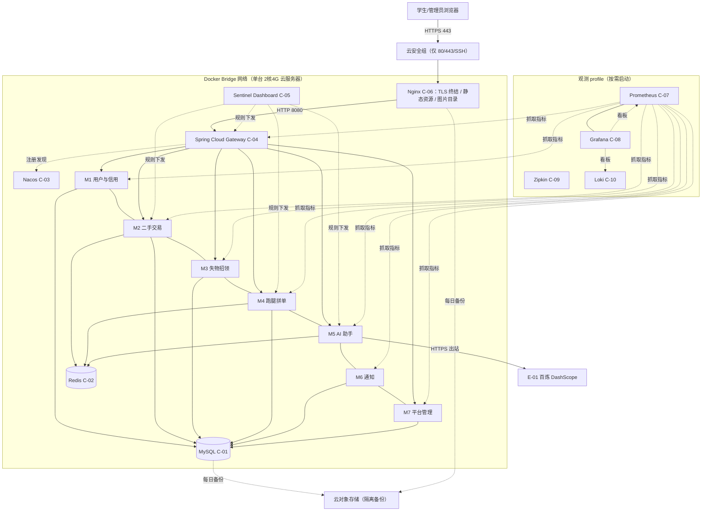

#### 5.4.2 拓扑要素清单

| 要素 | 取值 |
| --- | --- |
| 跨 Region 部署 | 否（单 Region 单机） |
| 跨 AZ 部署 | 否 |
| 流量入口路径 | DNS → 云安全组 → Nginx（TLS） → Gateway → 业务服务 |
| 内部调用路径 | Nacos 服务发现 + OpenFeign（主）/ Dubbo（对比链路） |
| 数据库访问路径 | HikariCP 连接池（单实例，无主从切换） |

#### 5.4.3 故障域划分

| 故障域 | 影响范围 | 容错机制 | 预期 RTO |
| --- | --- | --- | --- |
| 单容器 | 单服务实例 | Docker healthcheck + restart:always 自动重建 | ≤ 1 分钟 |
| 单中间件（Redis/Nacos） | 对应能力退化 | 降级预案（BD-03/BD-07）+ 自动重启 | ≤ 2 分钟 |
| MySQL 实例 | 全部业务写链路 | restart:always；数据级依赖备份恢复 | 进程级 ≤ 1 分钟；数据级 ≤ 30 分钟 |
| 整机 | 全部服务 | 云服务器重装 + 镜像 + 备份回导 | ≤ 4 小时 |

### 5.5 容量规划

#### 5.5.1 业务量预估

| 业务指标 | 当前值 | MVP 阶段值 | 完整版阶段值 | 备注 |
| --- | --- | --- | --- | --- |
| 注册用户数 | 0 | 100~300（同校同学内测） | 500~2000（全校推广） | 上游定位单校园 |
| DAU | 0 | 30~80 | 200~600 | 学生课余时段集中 |
| 峰值 QPS | — | 30（列表/详情读为主） | 80 | 推算：DAU × 人均 PV × 峰值系数 3 |
| 数据写入量 / 天 | — | < 500 行/天 | < 5000 行/天 | 发布/订单/事件 |
| 数据存量（1 年） | — | < 20 万行 | < 200 万行 | 单表 < 50 万行，无分表需求 |

#### 5.5.2 资源容量推算

**常驻容器内存预算（合计 ≤ 3GB，对齐 V6）**：

| 容器 | 内存上限 | 依据 |
| --- | --- | --- |
| MySQL 8 | 500MB | 7 库 + 小数据量，innodb_buffer_pool 128MB |
| Redis 7 | 150MB | < 2 万 Key |
| Nacos 2.3.2 standalone | 450MB | 实测基线 600MB（SR-21）下调：-Xms256m -Xmx384m，单机 12 实例足够 |
| Gateway | 300MB | 响应式转发，-Xmx200m |
| Sentinel Dashboard | 200MB | 控制台轻负载 |
| Nginx + 前端静态 | 30MB | 静态资源 |
| M1 / M3 / M6 / M7（×4） | 各 160MB（-Xmx128m） | 校园级低负载 |
| M2 / M4（×2） | 各 192MB（-Xmx160m） | 核心链路 + 连接池余量 |
| M5 AI 助手 | 256MB（-Xmx224m） | SSE 流式缓冲 |
| **合计** | **约 2.88GB** | ≤ 3GB ✅（系统预留 ≥ 1GB，对齐 V6） |

| 资源 | 推算公式 | MVP 配置 | 完整版配置 |
| --- | --- | --- | --- |
| 带宽 | 峰值 QPS × 平均响应 20KB × 1.3 | 3Mbps 峰值（轻量服务器标配内） | 5Mbps |
| MySQL | 峰值写 TPS < 20 → IOPS 远低于单盘上限 | 单实例 2核4G 同机 | 同左（数据量 < 200 万行） |
| Redis | 单 Key 平均 2KB × 2 万 × 1.3 ≈ 52MB | 150MB 上限 | 300MB |
| 观测组合（按需） | Prometheus 250 + Grafana 200 + Zipkin 150 + Loki 200 | 演示期 ~800MB | 可常驻（升配后） |
| 对象存储 | 每日全量 ~50MB × 30 天 | < 2GB | < 10GB |

#### 5.5.3 扩容触发与路径

| 资源 | 扩容触发指标 | 扩容方式 | 扩容耗时 |
| --- | --- | --- | --- |
| 云服务器 | CPU > 70% 持续 10min / 内存水位 > 80% | 停机升配（2核4G → 4核8G） | ≤ 10 分钟 |
| MySQL | 慢查询占比 > 5% / CPU > 80% | 参数调优（短期）→ 升配（中期）→ 读写分离（远期，完整版） | 调优即时；升配 ≤ 30 分钟 |
| Redis | 内存 > 70% | 升配 / 清理冷 Key | ≤ 10 分钟 |
| 观测组合 | 演示需要 | `--profile observability` 一键启动 | ≤ 2 分钟 |

#### 5.5.4 容量水位线

| 水位 | 阈值 | 动作 | 对开发的约束 |
| --- | --- | --- | --- |
| 健康水位 | < 60% | 无动作 | — |
| 预警水位 | 60~80% | 告警（AL-05），启动扩容评审 | — |
| 危险水位 | > 80% | 紧急扩容（升配）或按需停用非核心容器 | — |
| 红线 | > 95% | 触发限流（全局 500 QPS，与 §3.5.3 一致） | 限流红线值需与本表一致；降级开关在 Nacos 预埋（§5.1 L2） |
| 演示期补充约束 | 观测组合启动时，JVM 服务实际 RSS 需 < -Xmx 的 80% | 演示前 `docker stats` 巡检 | 压测脚本不得与观测组合同时全开 |

**判定合格自查**：业务量预估覆盖 MVP 与完整版区间且含来源（推算公式）✅；红线水位 → §3.5.3 限流默认值 → §8.4 告警规则数值一致（500 QPS / AL-05）✅。

---

## 6. 网络架构

> 本章只承载对开发产生约束的网络结论。单机 Docker Compose 形态下，以"云安全组 + Docker Bridge 网络"替代企业级分区模型；VPC / 子网 / CIDR 等施工细节见《系统部署文档》。

### 6.1 网络环境规划

| 网络环境 | 用途 | 说明 / 访问策略 |
| --- | --- | --- |
| 公网入口 | DNS + 云安全组（仅放行 80/443/22） | 22 端口限源 IP（开发者常用出口）；80 强制 301 跳转 443 |
| Docker Bridge（compose 内部网络） | 全部容器互联 | 仅 Gateway / Nginx 暴露端口到宿主机；业务服务与中间件端口不映射到公网 |
| 宿主机本地 | dev 环境 | 仅 127.0.0.1 访问，与生产完全隔离，不允许连生产数据 |

### 6.2 流量入口与南北向流量

#### 6.2.1 入口流量链路

| 组件 | 作用 | 部署位置 |
| --- | --- | --- |
| DNS | 域名解析 | 公网 |
| 抗 DDoS | 云厂商基础 DDoS 防护（免费档） | 云平台入口 |
| WAF | 不启用（见 §7.1 说明），由参数校验 + 限流兜底 | — |
| Nginx | TLS 终结 / 静态资源 / 图片目录 / 反向代理 | 宿主机容器（C-06） |
| Spring Cloud Gateway | 路由 / JWT 鉴权 / 限流 | Docker 内部（C-04） |
| 业务服务 | 业务逻辑 | Docker 内部 |

**入口决策（对开发的约束）**：

| 决策项 | 取值 | 对开发的约束 |
| --- | --- | --- |
| TLS 终结点 | Nginx | Nginx 之后内网为 HTTP；业务侧需解析 X-Forwarded-Proto / X-Forwarded-Host 生成正确链接 |
| 限流位置 | Gateway 统一拦截（双层：网关全局限流 + Sentinel 服务级熔断） | 业务自实现限流需对接 §3.5.3 红线值 |
| 鉴权位置 | Gateway 统一 JWT 鉴权；/internal/** 路径网关直接 404（不暴露） | 服务内 UserContextInterceptor 二次校验（纵深防御） |
| 真实客户端 IP 获取 | X-Forwarded-For（Nginx 设置，Gateway 透传） | 限流/审计取客户端 IP 必须读该字段，不能直接用 socket 远端 IP |

#### 6.2.2 出口流量

| 决策项 | 取值 | 对开发的约束 |
| --- | --- | --- |
| 出口方式 | 云服务器 NAT 直出（无专线/代理） | M5 调用 E-01 为公网 HTTPS 直连 |
| 是否需要固定出口 IP | 是（云服务器弹性 IP 天然固定） | E-01 侧如配 IP 白名单，使用该弹性 IP |
| 出口白名单 | `dashscope.aliyuncs.com`（E-01 唯一外部依赖） | 业务对接 E-xx 时必须使用白名单内域名；新增 E-xx 必须先登记 |
| 跨地域 / 跨云出口 | 无 | — |

### 6.3 内部互联（东西向流量）

| 决策项 | 取值 | 对开发的约束 |
| --- | --- | --- |
| 服务发现 | Nacos 注册中心（C-03） | 调用方必须使用 OpenFeign/Dubbo + 服务名，禁止硬编码 IP / 直连容器 IP |
| 服务间通信协议 | HTTP（OpenFeign 主链路）+ RPC（Dubbo 单链路）+ Outbox 轮询（异步） | 与 §3.5.4 超时重试基线对齐 |
| 内部 mTLS | 不启用 | 理由：单机 Docker Bridge 信任域内、无跨节点链路；南北向已 TLS，东西向以网关鉴权 + /internal 不暴露兜底（安全设计详见 §7） |
| 跨 VPC 互联 | 不适用（单机） | — |
| 跨账号互联 | 不适用 | — |
| 跨地域互联 | 不适用 | — |
| 跨服务调用幂等性 | 必须遵循 §3.5.2 幂等键传递 | 跨服务调用必须在请求 Header 透传幂等键与 traceId（§8.3） |

**判定合格自查**：§6.1/§6.2/§6.3 决策项 100% 已锁定 ✅；TLS 终结点（Nginx）、限流位置（Gateway 双层）、鉴权位置（Gateway 统一 JWT）三项与 §3.5/§7 一致 ✅；服务发现与服务间通信协议已锁定 ✅。

---

## 7. 安全设计

> 本章承载本系统的机制选择 + 关键参数基线。更深的威胁模型与防御对照由《系统安全设计》独立展开（security-architect），本章结论是其输入。

### 7.1 架构安全全景

| 能力域 | 选用产品 / 机制 | 作用范围 | 是否启用 |
| --- | --- | --- | --- |
| 抗 DDoS | 云厂商基础 DDoS 防护（免费档） | 公网入口 | 是 |
| WAF | 不启用；替代：Gateway 参数校验 + 全局限流 + 敏感词过滤 | Web 应用层 | 否（不适用理由：个人项目入口流量极小，云 WAF 成本不匹配；以 §3.5.3 限流 + 服务端校验 + t_sensitive_word 兜底，完整版可评估免费 WAF 方案） |
| 防火墙 / 安全组 | 云安全组（仅 80/443/22，22 限源 IP）+ Docker Bridge 网络隔离 | 宿主机 + 容器两级 | 是 |
| 主机安全 | 云厂商免费主机安全基线（登录告警）+ 系统补丁手动月更 | 全部主机 | 是（基础档） |
| 容器安全 | 官方镜像 + 最小化自定义镜像、容器非 root 运行、镜像不内嵌密钥 | 全部容器 | 是 |
| 数据安全审计 | 慢查询日志 + 审计表（t_audit_record / t_login_log / t_ai_tool_call） | 关键数据库操作与管理动作 | 是 |
| 密钥管理（KMS） | 不启用云 KMS；替代：服务器 .env（600 权限）+ Git 忽略 + 轮换纪律 | 敏感配置 | 否（不适用理由：单机个人项目无 KMS 预算；红线见 §7.2.3） |
| 安全运营中心（SOC） | 不适用（单人项目）；替代：Grafana 告警（§8.4）作为轻量安全事件感知 | 安全事件监控 | 否（不适用理由：无 SOC 预算与人力，以 P0/P1 告警代偿） |
| 堡垒机 | 不适用（单人 SSH + 密钥登录 + 限源 IP） | 运维通道 | 否（不适用理由：唯一运维者即项目所有者，SSH 密钥 + 审计日志已满足） |

**填写要求自查**：每个能力域均出现，不启用项均给出"不适用原因" ✅。

### 7.2 业务安全架构

#### 7.2.1 用户认证

| 维度 | 取值 |
| --- | --- |
| 账号体系 | 自建（学号/校园邮箱注册；无外部 SSO） |
| 登录方式 | 账号密码（BCrypt）；MVP 无验证码（重保接口以限流 + 失败锁定代偿） |
| 多因素认证（MFA） | 管理端登录启用 TOTP 二次验证（管理员单人，成本极低收益高）；学生端不启用 |
| 密码强度 | 最小长度 8（校园场景友好）；禁止纯数字；BCrypt cost 10 存储 |
| 登录失败锁定 | 连续失败 5 次锁定 15 分钟（Redis 计数，§4.4.3） |
| Token 有效期 | 访问 Token（JWT）2h；刷新 Token 7d（MVP 简化为 2h Token + 静默续签，完整版加 refresh 接口） |
| 会话管理 | 单设备登录策略（新登录作废旧 jti）；注销写 Redis 黑名单；JWT 无状态 + 黑名单补充 |

**D-02 对齐说明**：调研遗留依赖项 D-02（JWT vs Sa-Token）本文档锁定为 **JWT（jjwt 0.12.6）+ 网关统一鉴权**，理由见 §3.1.5；此决策点需 security-architect 在《系统安全设计》中复核确认。

#### 7.2.2 数据安全

| 维度 | 取值 |
| --- | --- |
| 数据分级 | 三级：L1 公开（商品/失物条目）、L2 个人信息（学号/邮箱/联系提示）、L3 资金模拟账目（余额流水） |
| 传输加密 | 南北向强制 HTTPS（Nginx TLS，Let's Encrypt 证书自动续期）；东西向不启用 mTLS（§6.3 已说明理由） |
| 存储加密 | 密码 BCrypt 单向哈希；其余业务字段明文存储（单机磁盘 + 云盘加密由云厂商云盘加密选项覆盖） |
| 敏感字段清单 | 学号（脱敏展示）、邮箱（部分打星）、联系提示（认领场景部分打星）、余额金额（本人可见） |
| 数据导出与共享 | 无批量导出功能（MVP 不提供导出接口，天然规避导出合规问题） |

**敏感字段处理策略表**：

| 字段 | 分级 | 存储策略 | 展示策略（脱敏） | 导出策略 |
| --- | --- | --- | --- | --- |
| 学号 | L2 | 明文（唯一索引需要） | 中间 4 位 `*`（如 2021\*\*\*\*01） | 不提供导出 |
| 邮箱 | L2 | 明文 | `a***@stu.edu.cn` | 不提供导出 |
| 联系提示（认领） | L2 | 明文 | 双方审核通过后互见完整，其余部分打星 | 不提供导出 |
| 余额/流水金额 | L3 | DECIMAL 明文 | 仅本人可见；管理端只看统计不看个人明细 | 不提供导出 |

#### 7.2.3 密钥与凭证

| 维度 | 取值 |
| --- | --- |
| 存储方式 | 服务器 .env 文件（权限 600）+ Docker secrets 语义注入容器环境变量 |
| 下发方式 | 部署时人工写入服务器（唯一运维者即项目所有者） |
| 轮换策略 | JWT secret、百炼 API Key、MySQL 密码：基线 90 天轮换；轮换需重启对应容器（分钟级窗口，公告） |
| 红线 | 禁止入库 / 入代码 / 入 Git / 入日志明文；禁止 dev 与 prod 共用密钥；.env 必须在 .gitignore |

#### 7.2.4 审计日志

| 维度 | 取值 |
| --- | --- |
| 启用的日志类型 | 管理操作审计（t_audit_record）、登录流水（t_login_log）、AI 工具调用证据（t_ai_tool_call）、资金流水（t_balance_flow）、网关接入日志 |
| 审计内容 | 谁（userId）、何时（DATETIME(3)）、对什么资源（bizType+bizId）、做了什么（decision/action）、结果（execStatus）、来源 IP（X-Forwarded-For） |
| 不可篡改保障 | 审计表仅允许 INSERT 与状态更新，禁止 DELETE 接口；与业务数据同库但独立表（单机约束下以"无删除路径"替代物理隔离） |
| 保留期 | ≥ 1 年（t_audit_record / t_ai_tool_call / t_balance_flow 永久保留；t_login_log 保留 1 年） |

#### 7.2.5 访问控制

| 维度 | 取值 |
| --- | --- |
| 权限模型 | RBAC0（两角色：STUDENT / ADMIN）；为何不选 ABAC：两角色固定、单人开发，RBAC0 可解释性最强 |
| 多租户隔离 | 不启用（上游冻结单校园）；school_code 预留字段见 §4.1 |
| 越权防护 | 全部个人数据接口做数据归属校验（buyer_id/seller_id/publisher_id == userId）；管理接口网关层校验 role=admin + /internal/** 网关 404 |
| 接口级权限 | 与 §3.5 对齐：前端路由 meta.roles + 网关 JWT role claim + 服务端拦截器三层一致（§3.5.5） |

**判定合格自查**：§7.1 全景表无空白 ✅；§7.2 五项维度均给出本系统选择 + 关键基线，无"待定" ✅。

---

## 8. 可观测设计

> 本章回答：系统跑起来之后，怎么知道它健康、出问题怎么定位、用户体验是否达标。

### 8.1 Metrics

#### 8.1.1 指标分层

| 指标层 | 本系统关键指标 | 工具 |
| --- | --- | --- |
| 业务指标 | 下单量 / 完单率 / 抢单成功率 / 通知投递成功率（SENT/应投递）/ AI 断言失败率 / 认领审核时长 | 自定义埋点（Micrometer Counter/Gauge）+ Grafana |
| 应用指标 | RED：QPS / 5xx 错误率 / P95-P99 时延（按接口）；JVM 堆与 GC | Spring Boot Actuator + Micrometer + Prometheus |
| 中间件指标 | MySQL 连接池/慢查询、Redis 命中率/内存、Outbox 队列积压（PROCESSING+RETRY 数）、Nacos 实例数 | Micrometer + exporter |
| 资源指标 | 容器 CPU / 内存 / 网络 IO（USE） | Docker/cAdvisor + Prometheus |

#### 8.1.2 关键指标 Dashboard 清单（6 个 ≥ 5 ✅）

| Dashboard 名 | 受众 | 核心指标 | 刷新频率 |
| --- | --- | --- | --- |
| 业务大盘 | 项目所有者 / 答辩演示 | 下单量、完单率、抢单成功率、通知投递成功率、AI 断言失败率 | 1min |
| 服务健康大盘 | 开发 | 7 服务 RED（Rate/Errors/Duration）+ JVM | 30s |
| 中间件大盘 | 开发 | MySQL / Redis / Outbox 积压 / Nacos 全维度 | 30s |
| 容量大盘 | 开发 | §5.5 全部资源水位（CPU/内存/磁盘/带宽） | 1min |
| 告警总览大盘 | On-call（季祥浩） | 当前活跃告警（P0~P3 分级着色） | 实时 |
| AI 质量大盘 | 开发 / 答辩 | 工具调用成功率、断言失败率按 Agent 分布、首字时延 | 1min |

### 8.2 Logs

#### 8.2.1 日志分级与去向

| 日志类型 | 级别 | 保存时间 | 日志去向 |
| --- | --- | --- | --- |
| 应用日志（业务） | INFO+ | 30 天热（服务器磁盘）+ 观测期入 Loki | 结构化 JSON → docker json-file → Promtail → Loki |
| 应用日志（异常） | ERROR+ | 90 天 | Loki + 实时告警（§8.4） |
| 接入日志（Nginx / Gateway） | INFO+ | 30 天 | Loki |
| 审计日志 | INFO+ | ≥ 1 年（数据库审计表承载，§7.2.4） | t_audit_record / t_login_log / t_ai_tool_call / t_balance_flow |
| 慢查询日志 | — | 30 天 | MySQL slow log → Loki |

#### 8.2.2 结构化日志规范

```json
{
  "timestamp": "2026-09-14T10:00:00.000Z",
  "level": "INFO",
  "service": "errand-service",
  "instance": "errand-service-1",
  "traceId": "7f3a9c1d2e4b5f60",
  "spanId": "a1b2c3d4e5f60718",
  "tenantId": "CAMPUS-MAIN",
  "userId": "10001",
  "module": "ErrandGrabService",
  "event": "GRAB_SUCCESS",
  "msg": "抢单成功",
  "extra": { "orderId": 3001, "latencyMs": 42 }
}
```

**硬性要求**：

| 要求项 | 内容 |
| --- | --- |
| 必含字段 | 所有日志必须含 `traceId` + `tenantId`（tenantId 取值 = school_code，见 §4.1 隔离字段说明；MVP 固定 CAMPUS-MAIN，多校扩展后即租户键） |
| 敏感字段 | 禁止打印密码、Token、完整学号、手机号明文（与 §7.2.2 联动） |
| ERROR 级别 | 必须含完整堆栈 + 业务上下文（订单号/跑腿单号/用户 ID 等） |

### 8.3 Traces

| 项 | 取值 |
| --- | --- |
| 协议标准 | OpenTelemetry（Micrometer Tracing 桥接）/ W3C TraceContext |
| 采样策略 | 默认 10% 采样（校园低流量下保证可观测性）；错误请求 100% 采样；慢请求（>1s）100% 采样 |
| 透传方式 | HTTP Header `traceparent` / `tracestate`；Outbox 事件 payload 内嵌 traceId；Dubbo RPC attachment 透传 |
| 关键 Span 命名 | `gateway.route` / `<service>.<method>`（如 errand.grab）/ `db.<operation>` / `outbox.<eventType>.<send|deliver>` / `llm.chat` |
| 跨外部系统 | 调用 E-01 时记录 `peer.service=dashscope` span（对端不支持透传，本端记录时延与错误） |

**与时序图的关联**：§3.2.M{N}.4 模块时序图中的调用链均要求 traceId 全链路透传；本节是其落地规范（错误 100% 采样对齐 QS-05）。

### 8.4 告警体系

#### 8.4.1 告警分级

| 级别 | 适用场景 | 响应时间 | 通知方式 |
| --- | --- | --- | --- |
| P0 紧急 | 业务中断 / 核心链路不可用 | ≤ 5 min | 电话 + 短信 + IM |
| P1 高 | 部分功能受影响 | ≤ 15 min | 短信 + IM |
| P2 中 | 单点异常但有冗余 / 补偿机制 | ≤ 1 h | IM |
| P3 低 | 趋势性预警 | 工作时间处理 | IM / 邮件 |

#### 8.4.2 告警规则编排

| 编号 | 级别 | 触发条件 | 维度 | Owner | Runbook |
| --- | --- | --- | --- | --- | --- |
| AL-01 | P0 | 核心链路（下单/抢单/登录）5xx 错误率 > 5% 持续 5min | 接口可用性 | 季祥浩 | docs/runbook/AL-01（健康检查 → docker logs → 重启 → 回滚镜像） |
| AL-02 | P0 | MySQL 不可访问（readiness 失败持续 2min） | 中间件健康 | 季祥浩 | docs/runbook/AL-02（容器状态 → 磁盘水位 → 备份恢复预案 §4.3.2） |
| AL-03 | P1 | 核心接口 P99 > 800ms 持续 5min | 接口延迟 | 季祥浩 | docs/runbook/AL-03（慢查询定位 → 连接池 → 限流） |
| AL-04 | P2 | Outbox 积压（PROCESSING+RETRY）> 500 条持续 10min | 队列堆积 | 季祥浩 | docs/runbook/AL-04（notify 日志 → DB 状态 → 手动补投） |
| AL-05 | P2 | 容器 CPU > 80% 持续 10min / 内存 > 80% | 资源水位 | 季祥浩 | docs/runbook/AL-05（docker stats → 停用非核心容器 → 升配评估 §5.5.3） |
| AL-06 | P2 | Outbox DEAD 事件数 > 0（1h 窗口） | 通知可靠性 | 季祥浩 | docs/runbook/AL-06（管理端补投 BD-05 → 根因分析） |
| AL-07 | P2 | AI 断言失败率 > 10%（24h 窗口） | AI 质量 | 季祥浩 | docs/runbook/AL-07（t_ai_tool_call 分析 → 工具契约检查 → 白名单校对） |
| AL-08 | P3 | 登录失败率 > 20%（1h 窗口，疑似爆破） | 安全 | 季祥浩 | docs/runbook/AL-08（失败 IP 统计 → 限流加严 → 限源） |
| AL-09 | P3 | 磁盘使用率 > 80% | 资源水位 | 季祥浩 | docs/runbook/AL-09（日志清理 → 备份归档检查） |

**判定合格自查**：指标覆盖业务 / 应用 / 中间件 / 资源四层 ✅；全部 P0/P1 告警有 Owner（季祥浩，单人项目唯一 On-call）✅；Dashboard 6 个 ≥ 5 ✅；日志含 traceId + tenantId ✅；采样策略覆盖错误 / 慢请求兜底 ✅；§5.3 SLA、§2.5.1 质量目标与本章告警阈值数值自洽（5% 错误率 / 800ms P99 / 80% 水位）✅。

---

## 附录 A：中间确认协议自检报告（协议 §2.4 要求，随回传一并提交）

本轮系统设计在四个关键决策点完成自检（对应 agent 工作流要求的 §2/§3/§4/§5 四次自检），**均未命中触发标准，未发起 [中间确认]**。逐点证据如下。

### 自检 1：§2 业务架构（限界上下文拆分 + 上下文映射模式）完成后

- **§2.1 判定**：限界上下文数量与边界由上游《高层架构设计》§5.1/§6.2 冻结的 7 个业务服务直接给定（7 服务 ↔ 7 业务域 ↔ 7 库），拆分粒度非本人裁量 → 不存在"≥2 种合理理解"的分歧。上下文映射 6 种模式为逐关系的选择：每种关系只有一个上下游组合，模式由协作性质唯一确定（外部强势上游→Conformist、多上游共投→Published Language、外部模型隔离→ACL、全站一致身份→Shared Kernel、标准 API 发布→Open Host Service、下游牵引迭代→Customer/Supplier），且已通过高频决策点提示逐项比对。**未命中 §2.1**。
- **§2.3 反向验证 3 问**：
  - Q1（返工成本）：若映射模式需返工，重写范围为 §2.2.2 一表 + §3.2.M5 的 ACL 描述，约 0.5 人日；若限界上下文被推翻则上游 G3 需先推翻，不在本阶段裁量内。可控。
  - Q2（可感知方）：用户/客户/监管均不直接感知文档内的映射模式选择（感知点在功能与页面，归 §2.4 功能清单，与上游冻结一致）；判断依据：G4 审核对象是设计文档质量，用户不操作"上下文映射"。
  - Q3（与诉求一致性）：用户诉求原文"为大三在校生季祥浩设计贴合校园生活的微服务项目（二手交易 + 失物招领 + 跑腿拼单 + AI 助手服务），覆盖简历技能点"——业务域 7 个与四大模块 + 通知 + 管理 + 用户信用一一对应，未新增/删减业务域，一致。

### 自检 2：§3 应用架构（接口契约风格 / 技术选型）完成后

- **§2.1 判定**：接口契约风格（同步 REST/OpenFeign 主链路 + Dubbo 3 单链路 + Outbox 异步）为上游冻结决策（高层架构 §5.2 依赖架构表已明确"OpenFeign 主链路 + Dubbo 3 对比链路"与"Outbox 表 + 定时轮询"，异步方式"异步"），本设计仅落实非新选。技术选型逐项继承用户冻结裁决（MySQL/MyBatis-Plus/Redis/Vue；不用 MongoDB/ES/MQ/Seata/K8s），版本号选择（Boot 3.4.5 / SCA 2023.0.3.2 等）为版本矩阵内的兼容性事实，非方案分歧。限流/超时数值为校园规模推算的内部参数，下游（部署/安全）可在其文档中基于同一数值基线调整，非不可逆。**未命中 §2.1**。
- **§2.3 反向验证 3 问**：
  - Q1：接口契约（错误码/幂等/超时基线）若返工，影响范围 = §3.5 + 各模块接口清单引用点，约 1 人日（全局替换参数值）；不涉及表结构与服务拆分。可控。
  - Q2：用户可感知的是功能与体验（P95 ≤ 300ms 属体验承诺，已列入 §5.3 SLA 由 G4 人工审核把关），契约风格与超时数值本身用户不感知；判断依据：用户交互对象是 Vue 页面而非 OpenFeign。
  - Q3：用户诉求原文要求"体现简历技能点：Spring Cloud 体系（Nacos/Gateway/OpenFeign/Sentinel）+ Dubbo 对比 + AI 助手"——选型表逐项对应，未引入诉求外的重型组件，一致。

### 自检 3：§4 数据库设计（一致性等级 / 隔离字段）完成后

- **§2.1 判定**：数据一致性等级——跨服务无分布式事务、以"本地事务 + Outbox 最终一致"实现——为上游冻结决策（高层架构 §4.3 演进纪律："不引入 Seata，分布式事务用本地事务 + Outbox 方案"），非本人裁量。隔离字段处理（不启用 tenant_id、school_code 预留）同样为上游冻结（§4.2"多租户：否，数据表预留学校维度字段"），本设计如实落实并补齐日志 tenantId 映射。资金一致性（余额冻结/划转单库本地事务 + biz_req_no 幂等）是 D-09 已确认框架内的实现细节。**未命中 §2.1**。
- **§2.3 反向验证 3 问**：
  - Q1：若表结构需返工（如增加字段/索引），影响范围 = §4.2 对应表 + DDL + 对应模块 DTO，单表约 0.2 人日；若一致性方案被推翻则需上游先推翻 Outbox 决策，本阶段不可控但已由上游冻结背书。总体可控。
  - Q2：用户不感知库表设计；唯一潜在感知点是"模拟资金账目可信"（D-09 框架内已确认），本设计的幂等/流水设计恰是对该已确认承诺的落实；判断依据：用户交互不触达 schema。
  - Q3：用户诉求原文（经中间确认 D-09）"模拟支付 + 余额体系（余额由系统内置模拟充值或跑腿完单奖励获得，下单冻结/扣减幂等）"——t_balance_flow / biz_req_no 设计逐字对应，一致。

### 自检 4：§5 部署架构（高可用模式 / SLA 基线）完成后（最后一次完整复核）

- **§2.1 判定**：高可用模式——单机 restart 策略 + 数据级备份（无主备/多活）——由部署形态"2核4G 单机 Docker Compose"唯一确定（O5 冻结不做 K8s/多节点），不存在可选方案空间：多活/主备在单机物理约束下不可行，属"专业上唯一解"且解由用户冻结的部署形态推导。SLA 数值（99% / P95 300ms / RTO 30min / RPO 5min）为该形态下的设计承诺值，存在"数值高低"的裁量空间，但：① 该数值写入 G4 人工审核清单（本报告"人工审核待确认项"第 1 条），由用户在 G4 弹窗直接把关；② 不绑定外部合同/合规框架；③ 返工成本极低。综合判定未命中 §2.2 任一硬指标（返工 < 30% 产物、无月级成本、无供应商绑定、无合规锁定；用户感知经 G4 审核覆盖而非遗漏）。**未命中 §2.1 / §2.2**。
- **§2.3 反向验证 3 问**：
  - Q1：SLA 数值调整影响范围 = §5.3 + §8.4 告警阈值联动 + §2.5.1，约 0.3 人日；高可用结构（单机）被推翻需上游推翻部署冻结，不在本阶段。可控。
  - Q2：用户可感知 SLA 承诺值——已显式列入"人工审核待确认项"交 G4 弹窗确认，未静默选择；判断依据：本报告附录 B 第 1 条。
  - Q3：用户诉求原文"部署按低成本方案（单台轻量云服务器 + Docker Compose，建议 2核4G 起步）"——单机高可用模式直接由该约束推导，一致。

### 结论

本轮系统设计无方案分歧型 / 不可逆-跨界感知型决策点需要用户在 G4 之前裁决：所有关键取舍（服务边界、映射模式、契约风格、一致性方案、单机高可用）均由上游冻结文档直接给定或由其唯一推导，且未静默选择任何未冻结事项。**未发起任何 [中间确认]，无静默选择**——本附录即为协议 §2.4 要求的追溯材料。

---

## 附录 B：人工审核待确认项（交 G4 弹窗把关，非中间确认）

| 编号 | 待确认项 | 本文档取值 | 说明 |
| --- | --- | --- | --- |
| H1 | SLA 指标基线数值 | 可用性 ≥ 99%；P95 ≤ 300ms / P99 ≤ 800ms；RTO ≤ 30min / RPO ≤ 5min（常态） | 单机形态下的设计承诺值，用户可在 G4 提出调整（联动 §8.4 告警阈值） |
| H2 | 可观测栈"按需启动"策略 | Prometheus/Grafana/Zipkin/Loki 定义为 observability profile，答辩/排障时启动，日常关闭 | 为满足 V6 ≤ 3GB 约束的取舍；若用户希望常驻监控，建议升配 4核8G（影响成本） |
| H3 | 网关鉴权选型（调研遗留 D-02） | JWT（jjwt 0.12.6）+ 网关统一鉴权 | 已按可辩护标准锁定，需 security-architect 在《系统安全设计》中复核 |
| H4 | 观测采样率 | 默认 10%（模板示例为 1%） | 校园低流量下 1% 采样几乎采不到数据，10% 兼顾存储与可观测；错误/慢请求仍 100% |

---

## 附录 C：模板覆盖与硬指标自查清单

| 硬指标 | 要求 | 本文档落点 | 状态 |
| --- | --- | --- | --- |
| 业务域数量 | 3~7 个 | §2.1.1 业务域清单：7 个（与 §3 模块、§4.1 七库一一对应） | ✅ |
| 上下文映射模式 | 5 种关系模式 | §2.2.2：6 种（C/S、Published Language、ACL、Conformist、Shared Kernel、Open Host Service） | ✅ |
| 模块设计五段式 | 每模块五段完整 | §3.2.M1~M7，每模块 .1~.5 五段齐全（简单段显式注明设计取舍，无空标题） | ✅ |
| 技术选型 | 每项有版本号 + 选型理由 | §3.1.5：22 行全部含版本与"为何不选 B"理由 | ✅ |
| 全局错误码 | 6 位格式 | §3.5.1：1+2+3 六位格式 + 19 条注册表（含重试建议与用户文案） | ✅ |
| 数据库表设计 | 五段式完整 | §4.2：9 张核心表全五段（元信息/结构/索引/DDL/清理）+ §4.2.10 总览 15 表 | ✅ |
| RPO / RTO | 具体数字 | §4.3.2：RPO ≤ 5min（常态）/ RTO ≤ 30min（数据级）/ 整机 ≤ 4h | ✅ |
| Dashboard | ≥ 5 个 | §8.1.2：6 个（业务/健康/中间件/容量/告警/AI 质量） | ✅ |
| Logs 必含字段 | traceId + tenantId | §8.2.2：结构化 JSON 双字段，tenantId=school_code（§4.1 联动） | ✅ |
| 告警分级 | P0~P3 + Owner + Runbook | §8.4：四级 + 9 条规则全部含 Owner（季祥浩）与 Runbook 路径 | ✅ |
| Out-of-Scope | ≥ 3 条 | §2.4.1：6 条（O1~O6） | ✅ |
| 质量目标 | 3~5 个排序 + 可验证场景 | §2.5.1：Q1~Q5 + QS-01~QS-06 | ✅ |
| 降级清单 | 用户感知无技术词 | §2.5.2：BD-01~BD-07 | ✅ |
| 全文无占位符 | 无尖括号占位符、无日期类占位符残留 | 全文检索通过（本表为自查声明） | ✅ |
| 悬空引用检查 | 跨章引用有效 | §4.5 略过后无引用悬空；§3.5.4/§5.2.4/§7.2.2/§8.2.2 相互引用均已对齐 | ✅ |

> **decision: 系统设计冻结，部署和安全可进入**（待 G4 人工审核通过后由主理人归档至 `delivery/系统设计.md`）


