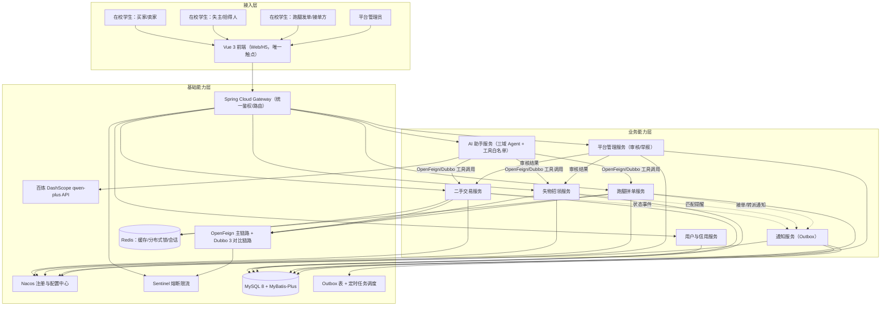
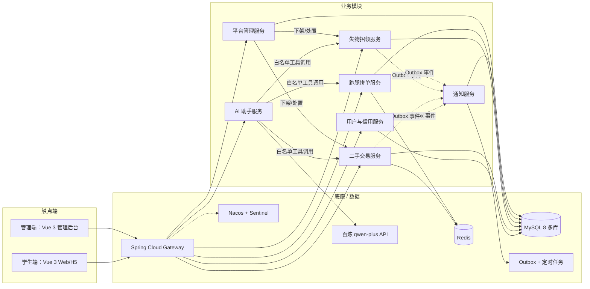

# 校园互助生活平台 - 高层架构设计 v0.3

> 本文档为《AICoding 架构设计》核心产物之一，对应**高层架构设计**阶段。
> 上游输入：用户原始诉求 + 资料摘要 v0.2（G1 已通过）+ 行业调研报告 v1.0（G2 已通过）；
> 下游输出：驱动《系统设计》《部署设计》《安全设计》《UserStory》四份文档的撰写。
> 本阶段 Owner：business-architect（许边界）；Gate：G3。

---

## 0. 元信息：修订记录

```yaml
标题: 校园互助生活平台 - 高层架构设计 v0.3
版本: v0.3
状态: Draft   # Draft | Reviewing | Approved | Deprecated
创建日期: 2026-09-14
最后更新: 2026-09-14
作者: business-architect（许边界）
评审人:
  - team-lead（主理人）
  - 用户（季祥浩，项目所有者）

关联文档:
  上游输入:
    - 业务原始诉求: 主理人正式任务下发消息（Phase 3）
    - 资料摘要: .workbuddy/output/material_digest.md（v0.2，G1 已通过）
    - 行业调研报告: .workbuddy/output/research_report.md（v1.0，G2 已通过）
  下游产出:
    - 系统设计: system-architect（Gate G4 前禁止启动，待 G3 通过）
    - 部署设计: platform-architect
    - 安全设计: security-architect
    - UserStory: product-story-designer
```

| 版本 | 日期 | 作者 | 变更内容 | 评审状态 |
| --- | --- | --- | --- | --- |
| v0.1 | 2026-09-14 | business-architect（许边界） | 初稿：基于资料摘要 v0.2 与调研报告 v1.0 冻结业务边界、系统定位、业务架构与需求清单 | Draft |
| v0.2 | 2026-09-14 | business-architect（许边界） | G3 校验返工：① 两项中间确认结论（D-08 拼单轻量化、D-09 模拟支付+余额）回填 §2.5/§4.3/§5.3/§6；② §2.1 补角色概述段落；③ 补齐 §4.3 MVP 决策与 §6 产品需求及原型整章；④ §6.1 Out-of-Scope 按类别拆为 3 张小表（纯格式适配校验器计数，内容未减） | Draft |
| v0.3 | 2026-09-14 | business-architect（许边界） | Phase 6 引用一致性回填：§6.3 功能清单新增 F18（注册隐私同意，与《UserStory》v0.3 §3 口径一致，经中间确认·论题四方案 A）；§6.3/§6.6 数量表述同步更新（功能 18 项：P0 11 / P1 4 / P2 3）；其余内容不动 | Draft |

> **版本管理纪律**：破坏性变更（章节结构调整 / 关键决策反转）升 MAJOR；新增章节、扩充内容升 MINOR。

---

## 1. 需求概要

### 1.1 需求概要说明

校园互助生活平台用于解决高校校园内二手交易、失物招领、跑腿拼单、日常问答四类互助信息**分散、无状态跟踪、无信任保障**的问题，服务于在校学生（买卖双方、失主与拾得人、跑腿发单与接单双方）与平台管理员，覆盖"发布 → 检索匹配 → 下单/抢单 → 履约确认 → 评价沉淀"四条核心互助场景。本期由项目所有者季祥浩（大三在校生）的**求职简历项目**需求驱动启动：以贴合校园生活的真实场景为载体，落地 Spring Cloud 微服务、AI Agent 应用、并发与幂等等简历技能点的完整工程闭环。系统定位一句话：**面向单一校园的自部署微服务互助平台 + AI 助手，验收口径为"技术学习价值 > 生产级完备性"（调研报告 §0 总基调）**。

### 1.2 关键决策摘要

| 编号 | 决策类别 | 决策内容 | 关联章节 |
| --- | --- | --- | --- |
| D1 | 范围决策 | 本期覆盖二手交易、失物招领、跑腿拼单、AI 助手四大业务模块 + 平台管理（审核/举报）；不做真实支付、ES 搜索、K8s、MongoDB | §6.1 需求边界 |
| D2 | 技术选型决策 | 微服务骨架采用 Spring Cloud Alibaba（Nacos + Gateway + OpenFeign + Sentinel），OpenFeign 为主链路 + Dubbo 3 单链路对比演示；AI 内核采用 Spring AI + 百炼 qwen-plus（延续实习栈） | §3.2 / §4.2 |
| D3 | MVP / 完整版边界 | MVP 覆盖四大模块核心链路 + 可靠通知（Outbox）；完整拼团撮合与真实支付按中间确认结论归入完整版（见 §4.3 决策 D-08/D-09） | §4.3 |
| D4 | 复用 vs 新建 | AI Agent 能力（多 Agent 拆分、工具白名单 + 后置断言、Outbox 可靠投递）复用实习已验证方案；四大业务模块、微服务基建为新建 | §2.4 / §5.2 |
| D5 | 部署形态 | 单台轻量云服务器（2核4G 起步）+ Docker Compose 自部署，组件裁剪 + JVM 内存上限，不用 K8s | §5.2 / 部署设计 |

**硬指标自查**：共 5 条（3 ≤ n ≤ 5），每条均可映射到正文具体章节。✅

### 1.3 价值主张

| 价值维度 | 量化目标 | 度量指标 | 当前值 | 目标值 | 截止时间 |
| --- | --- | --- | --- | --- | --- |
| 效率（用户侧） | 互助信息从"群聊刷屏"变为"结构化检索 + 状态跟踪"，核心互助场景（发布/检索/下单/完结）全部线上闭环 | 核心场景线上覆盖率 | 0%（仅群聊，无系统） | 100%（二手/失物/跑腿三类核心状态流转全覆盖） | MVP 上线 |
| 效率（AI 侧） | AI 助手完成"问答 + 工具调用"替代人工翻找：高频查询（商品/失物/跑腿单状态）由对话直达 | AI 助手可调用工具数 / 写操作后置断言覆盖率 | 0 | ≥ 8 个工具 / 100% | MVP 上线 |
| 学习价值（对内，核心） | 简历技能点全部落地为可演示、可答辩的工程证据 | 可演示技能点数（Spring Cloud 4 组件 + Dubbo 对比 + AI Agent 3 能力 + 并发/幂等 2 项） | 0（均为"了解"级） | ≥ 10 项，每项有对应代码模块与演示路径 | MVP 上线 |
| 成本 | 单机低成本运行：基建 + 4 业务服务 + AI 服务共约 10 容器在 2核4G 服务器内稳定运行 | 容器内存峰值合计 | — | ≤ 3GB（为系统预留 ≥ 1GB） | MVP 上线 |
| 体验 | 状态变更通知可靠触达（复用 Outbox 方案） | 状态变更通知投递成功率 | — | ≥ 99% | MVP 上线 |

**硬指标自查**：业务价值 3 条（效率 ×2 + 体验）+ 技术/成本价值 2 条，全部可量化，无"提升/优化"类模糊词。✅

---

## 2. 需求分析 & 痛点解构

### 2.1 核心角色关注点

本平台的核心角色共分三类六种：**甲方决策者**——项目所有者季祥浩（大三在校生、本平台唯一开发者兼运营者），关心简历技能点落地与答辩价值；**最终用户**——在校学生中的三种身份：互助需求方（买家/失主/跑腿发单人）、互助提供方（卖家/拾得人/跑腿接单员）、AI 助手使用者（全体学生）；**受影响方**——平台管理员（季祥浩兼任，负责内容审核与违规处置）与答辩评委/招聘面试官（外部评估者，影响简历可信度判定）。各角色的业务身份、主要操作与 Top1 关心点如下表：

| 角色 | 业务身份 | 主要操作 | Top1 关心点 | 来源 |
| --- | --- | --- | --- | --- |
| 甲方决策者：季祥浩（项目所有者） | 大三在校生 / 求职者，本平台唯一开发者兼运营者 | 立项、开发、答辩演示、日常运营 | 简历技能点是否全部落地为可演示、可答辩的工程证据（Spring Cloud / Dubbo 对比 / AI Agent / 并发幂等） | 用户原始诉求；material_digest.md X1 |
| 最终用户 A：互助需求方 | 在校学生（买家 / 失主 / 跑腿发单人） | 发布求购、搜索商品、登记失物、发布跑腿单、支付（模拟）、评价 | 找到目标的速度与交易/履约的确定性（商品还在不在、失物有没有人捡到、单有没有人接） | 调研报告 B1/B2/B4 业务模型（SR-01~03、SR-06~09） |
| 最终用户 B：互助提供方 | 在校学生（卖家 / 拾得人 / 跑腿接单员） | 上架商品、发布拾物、抢单、履约交接、收款（余额）、评价 | 抢单公平性（不被重复抢单/超接）与收益到账可信（防"假成功"） | 调研报告 R-03、B2 履约链路（SR-10~12） |
| 最终用户 C：AI 助手使用者 | 全体在校学生 | 对话问答、让 AI 代查/代办（查商品、登记失物、查跑腿单状态） | AI 回答可信：说"已下单/已登记"必须真的执行成功 | material_digest.md D1 §实习经历④（工具调用可信化） |
| 受影响方：平台管理员 | 季祥浩兼任（管理员后台） | 内容审核、举报处置、违规下架 | 审核有记录、可追溯，审核流程轻量（不引入工作流引擎） | 用户冻结裁决 1（状态机 + 审核记录表方案） |
| 受影响方：答辩评委 / 招聘面试官 | 外部评估者 | 查看简历、追问架构细节、审阅演示 | 微服务拆分理由、技术选型依据、并发与幂等的真实落地证据 | 用户原始诉求（简历技能点）；research §0 总基调 |

**硬指标自查**：6 行 ≥ 3 类，甲方决策者 / 最终用户 / 受影响方三类各至少一行，每行有具体 Top1 关心点。✅

### 2.2 核心痛点

| 编号 | 痛点描述 | 现象 / 数据 | 影响角色 | 影响程度 | 优先级 |
| --- | --- | --- | --- | --- | --- |
| P1-1 | 简历技能差距：Spring Cloud（Nacos/Gateway/OpenFeign/Sentinel）、Redis、Vue 均为"了解"级，无微服务项目落地证据，秋招简历竞争力存在硬缺口 | 简历原文表述为"了解……基本用途"，且无微服务项目经历条目（material_digest.md X1、D1 §专业技能·框架与微服务） | 季祥浩（甲方决策者） | 高（求职核心目标不达成） | P1 |
| P1-2 | 校园互助信息分散且无闭环：二手/失物/跑腿信息散落在微信群、QQ 群，时间线式信息流无法结构化检索、无状态跟踪、无信任保障，二手"单库存售出即失效"、失物"认领无记录易纠纷"、跑腿"接单无约束" | 同构痛点已被行业验证：B4 校园开源项目群普遍内置状态机、认领审核、抢单防重、超时转派等能力作为响应（research SR-06~09、SR-11~12）；UU 跑腿将"全程定位 + 交接确认"产品化（SR-10） | 互助需求方 / 互助提供方 | 高（四大核心场景无一闭环） | P1 |
| P2 | 互助动作缺乏并发安全与可信保障：跑腿热门单并发抢单会出现重复接单/超接；AI 代办存在"模型未真正执行工具却回复成功"的虚假确认风险 | 行业佐证：同类校园项目用分布式锁 + 数据库乐观锁防重复抢单、30 分钟未接单自动转派（SR-11/12）；实习项目实测发现模型虚假确认问题并以"工具白名单 + 后置断言"解决（material_digest.md D1 §实习经历④） | 互助提供方 / AI 助手使用者 | 中（核心演示场景翻车风险） | P2 |
| P3 | 状态变更通知不可靠：接单通知、订单状态推送、失物匹配提醒散落在各业务代码中，易重复、丢失或"假成功" | 实习项目实测：定时主动消息易重复、丢失或出现"假成功"，需 Outbox 队列 + 原子领取 + 失败重试 + 成功证据校验（material_digest.md D1 §实习经历③） | 互助需求方 / 互助提供方 | 中 | P2 |

**优先级标准**：P1 = 不解决则项目核心目标（求职竞争力 / 场景闭环）不成立；P2 = MVP 必须覆盖但可通过成熟方案快速解决；P3 = 体验型长尾问题，列入完整版。

**硬指标自查**：4 条痛点均有"现象 / 数据"佐证（含上游文档引用与调研来源），P1 共 2 条且在 §2.3 均有对应 V 级目标。✅

### 2.3 期待目标

| 编号 | 目标描述 | 对齐痛点 | 度量指标 | 当前值 | 目标值 | 截止时间 |
| --- | --- | --- | --- | --- | --- | --- |
| V1 | 微服务骨架跑通：网关统一入口 + 注册/配置中心 + 4 业务域服务 + AI 服务全链路可演示，Sentinel 降级场景可复现 | P1-1 | 可演示服务容器数；Sentinel 降级演示用例数 | 0 | ≥ 6 个服务；≥ 2 个降级用例 | MVP 上线 |
| V2 | 四大业务模块场景闭环：二手（发布→检索→下单→完结）、失物（登记→匹配→认领审核→归还）、跑腿（发单→抢单→履约→评价）三条主链路状态流转 100% 线上化，AI 助手可对话代办 | P1-2 | 核心主链路状态覆盖率 | 0% | 100%（三类主链路 + AI 问答/代办入口） | MVP 上线 |
| V3 | 抢单并发安全：并发压测下无重复接单、无超接 | P2 | 并发 100 线程压测下重复接单数 / 超接单数 | 未测 | 0 / 0（附压测脚本与报告作为答辩证据） | MVP 上线 |
| V4 | AI 工具调用可信：所有写操作（发布/接单/修改）以系统执行证据为准，模型虚假确认率归零 | P2 | 写操作后置断言覆盖率 | 0%（无系统） | 100%（复用实习白名单 + 后置断言方案） | MVP 上线 |
| V5 | 状态变更通知可靠投递 | P3 | 通知投递成功率 | — | ≥ 99%（Outbox 成功证据校验口径） | MVP 上线 |
| V6 | 单机成本约束达标 | 1.3 成本维度 | 容器内存峰值合计 | — | ≤ 3GB（2核4G 服务器） | MVP 上线 |

**硬指标自查**：6 条目标全部有数字 + 对齐至少 1 条痛点；P1-1 → V1、P1-2 → V2，P1 痛点均有对应 V 级目标。✅

### 2.4 基线复用

| 复用类别 | 现有能力 | 复用方式 | 来源系统 | 备注 |
| --- | --- | --- | --- | --- |
| AI Agent 内核 | Spring AI 2.0 + 百炼 qwen-plus 对话、Function Calling 工具编排、多 Agent 路由、流式问答、记忆架构 | 直接复用（方案级），代码按新平台业务域重写 | 季祥浩实习项目（优课达餐饮助手，material_digest.md D1 §实习经历②） | 本项目最大复用资产；按交易/失物/跑腿三域拆分 Agent 与工具白名单 |
| AI 工具可信机制 | 工具权限白名单 + 后置断言，以系统证据为准 | 直接复用 | 同上（D1 §实习经历④） | 对应 V4 |
| 可靠消息投递 | Outbox 队列：原子领取、失败重试、防重复、成功证据校验 | 直接复用 | 同上（D1 §实习经历③） | 对应 V5；MVP 不引入 RocketMQ/RabbitMQ（单机内存约束 R-01） |
| 数据访问层 | MyBatis-Plus + MySQL 建模与 CRUD | 直接复用 | 实习项目 + 简历"熟悉"级技能（D1 §专业技能·数据与工程） | 各业务模块主存储 |
| 通用工程素养 | 多线程并发、JVM、设计模式、幂等与失败重试意识 | 直接复用 | 简历 §专业技能·Java 后端 / §个人优势 | 落点：抢单并发、支付幂等、策略/适配器模式 |
| 渠道解耦经验 | 渠道接入与领域能力分进程、MCP 网关级工具、薄适配器 | 方案思想复用 | 实习项目（D1 §实习经历⑤） | 演化为"Vue 前端 → Gateway → 各服务"的接入结构；小程序作为第二渠道薄适配 |
| 微服务基建 | Spring Cloud Alibaba（Nacos/Gateway/OpenFeign/Sentinel）、Dubbo 3 | 全新实践（参考 mall-swarm 裁剪模板） | research SR-04/05 | 学习目标本体，非复用；按 B3 裁剪版骨架搭建 |
| 缓存与前端 | Redis（缓存/分布式锁/会话）、Vue 3 前端 | 需扩展（"了解"级 → 实操） | 简历 + 用户冻结裁决 2 | 使用方式保持简单、可解释、可答辩（material_digest.md X2） |

**硬指标自查**：先盘点后决策新建；§2.5 中所有"必须新建"的能力均已确认基线无法覆盖（微服务基建、四大业务模块业务代码）。✅

### 2.5 功能缺口

> 按互助业务阶段分组：发布前（注册/信用）→ 场景中（交易/失物/跑腿/AI）→ 场景后（评价/通知）→ 运营（审核/监控）。

| 阶段 | 功能缺口 | 必要性 | 优先级 | 对齐目标 |
| --- | --- | --- | --- | --- |
| 发布前 | 校园身份注册登录 + 用户与信用服务（信用分由交易/履约/评价沉淀） | 必须 | MVP | V2 |
| 场景中 | 二手交易服务：商品发布（轻发布 + 类目结构化）、检索、单库存下单、订单状态机 | 必须 | MVP | V2 |
| 场景中 | 失物招领服务：失物/拾物双发布、关键词匹配提醒、认领提交 + 审核记录（状态机方案，不引入工作流引擎） | 必须 | MVP | V2 |
| 场景中 | 跑腿拼单服务：发单、并发抢单（Redis 锁 + DB 乐观锁双保险）、履约交接确认、超时自动转派 | 必须 | MVP | V2 / V3 |
| 场景中 | AI 助手服务：三域 Agent（交易/失物/跑腿）+ LLM 路由 + 工具白名单 + 后置断言 + 流式问答 + 会话记忆 | 必须 | MVP | V4 |
| 场景中 | 支付与余额：模拟支付 + 平台余额体系（支付网关适配器抽象） | 必须 | MVP | V2 |
| 场景后 | 通知服务：Outbox 可靠投递 + 状态变更触达 | 必须 | MVP | V5 |
| 场景后 | 评价与信用回流：双向评价写入信用分，信用分影响检索排序与接单优先级 | 重要 | MVP | V2 |
| 运营 | 平台管理服务：内容审核（敏感词过滤 + 审核记录表）、举报处置、违规下架 | 必须 | MVP | V2 |
| 运营 | 运营看板：核心指标（下单量/完单率/通知投递成功率/AI 断言失败率）展示 | 重要 | 完整版 | V5 |
| 场景中 | 多人拼单完整撮合（拼团创建、凑单截止、成团状态机、费用分摊） | 重要 | 完整版（MVP 以"顺路拼单备注字段 + 子任务接单"轻量承载）——经中间确认（D-08） | V2 |
| 场景中 | 真实在线支付（微信支付回调/对账/退款） | 不做（MVP 用模拟支付 + 平台余额体系承载，支付网关适配器保留完整版替换入口）——经中间确认（D-09） | MVP 外 | — |

**硬指标自查**：每条缺口均对齐 §2.3 至少一条目标（真实支付行为边界决策，不设 V 级目标）；MVP 缺口与 §6.3 功能清单 MVP 标记一一对应。✅

---

## 3. 行业调研

### 3.1 行业标杆系统分析

| 标杆系统 | 厂商 / 来源 | 场景覆盖 | 技术亮点 | 商业模式 | 适用度 |
| --- | --- | --- | --- | --- | --- |
| B1 闲鱼 | 阿里巴巴 | C2C 二手交易（含校园场景子集） | C2C 轻发布、商品结构化、单库存售出即下架、信任体系降低交易成本 | SaaS（交易免费 + 增值） | 中（思想参考） |
| B2 UU 跑腿 | 河南艾顿 | 同城跑腿：帮取/帮买/帮送/排队代办 | 发单-接单-全程定位-交接确认的完整履约链路 | SaaS（按单抽佣） | 中（流程参考） |
| B3 mall-swarm | macrozheng 开源社区（约 1.3 万 Star） | B2C 电商（微服务教学向） | Nacos 注册/配置 + Gateway + Sentinel + OpenFeign + 监控中心，Spring Cloud 学习事实标准 | 开源 + 付费教程 | 高（基建裁剪模板） |
| B4 校园综合互助开源项目群 | GitHub / Gitee / 语雀个人与结对学生团队 | 校园二手 + 失物招领 + 跑腿 + AI 问答（与本项目四模块 100% 同构） | Spring Boot + MyBatis-Plus + MySQL + Redis 主流栈；抢单防重、超时转派、认领审核、DeepSeek AI 问答先例 | 开源（MIT / MulanPSL-2 等） | 高（业务模型参考，不复制代码） |

**硬指标自查**：4 家 ≥ 3 家，含 2 家头部 SaaS（B1/B2）+ 2 家开源代表（B3/B4）。✅

**分层借鉴结论**（事实依据详见调研报告 §2.2 逐卡片置信度标注）：
- **B1 闲鱼**：借鉴 C2C 单库存 + 状态机 + 实时下架的交易链路设计、"轻发布 → 商品结构化"的发布理念、"降低信任成本"的信用/评价视角；**不借鉴**任何架构级与规模级设计（闭源、不可复刻）。
- **B2 UU 跑腿**：借鉴跑腿履约业务流程（发单-抢单-定位跟踪-交接确认-双向评价-超时转派）；**不借鉴**骑手体系、保险风控、抽佣模式（校园场景不需要）。
- **B3 mall-swarm**：借鉴微服务基建骨架并**裁剪**（只取 Nacos/Gateway/OpenFeign/Sentinel/监控中心，去掉 ES/RabbitMQ/MongoDB/MinIO/Seata/K8s）；**否决**全量组件栈复刻（与用户"不采用 MongoDB"裁决、2核4G 约束直接冲突）。
- **B4 校园开源项目群**：借鉴业务数据模型与状态机设计；**不复制代码**（版权与查重风险 R-05），差异化路线为"别人停在单体，本项目用 Spring Cloud 微服务化同类场景"。

### 3.2 方案对标及优先级打分

**对比矩阵**（权重依据调研报告 §3.1：项目验收口径为"技术学习价值 > 生产级完备性"，故学习价值权重最高 0.30；已验证按模板默认权重重算排名不反转）：

| 评估维度 | 权重 | B1 闲鱼 | B2 UU 跑腿 | B3 mall-swarm | B4 校园开源项目群 |
| --- | --- | --- | --- | --- | --- |
| 场景契合度 | 0.25 | 5 | 4 | 3 | 5 |
| 技术学习价值（简历/答辩增益） | 0.30 | 2 | 1 | 5 | 4 |
| 技术成熟度 | 0.15 | 5 | 5 | 5 | 2 |
| 集成与部署成本（反向，分越高成本越低） | 0.20 | 1 | 1 | 2 | 5 |
| 合规可控性 | 0.10 | 3 | 3 | 4 | 4 |
| **加权总分** | **1.00** | **3.10** | **2.55** | **3.80** | **4.15** |

**结论摘要**：
- **优先借鉴**：B4 校园开源项目群（4.15）—— 场景与数据模型/状态机参考系，代码独立实现；B3 mall-swarm（3.80）—— 微服务基建裁剪模板，与目标技术栈一一对应。
- **部分借鉴**：B1 闲鱼（3.10）—— 交易链路与信任设计思想；B2 UU 跑腿（2.55）—— 跑腿履约流程设计。
- **不借鉴（否决）**："完整复刻 mall-swarm 全组件部署栈"（含 ES/Mongo/Seata/K8s，与用户裁决及成本约束冲突）；"将 B1/B2 闭源 SaaS 作为集成对象"（不可集成，仅思想来源）。

**方案组合**（采纳调研报告 §3.3）：B4 场景骨架（数据模型/状态机）+ B3 裁剪版微服务基建 + B1 交易与信任设计思想 + B2 跑腿履约流程；未覆盖能力（真实支付、大规模搜索）经 §4.3 / §6.1 边界决策处理。

### 3.3 完整报告参考

- 完整报告：`.workbuddy/output/research_report.md`（v1.0，G2 已通过；含 4 张标杆详述卡片、23 条可追溯来源 SR-01~SR-23、6 条风险 R-01~R-06、4 项待确认 U-01~U-04）
- 调研工具：`tech-research-advisor`（见附录 B）
- 调研日期：2026-09-14
- 调研人：research-analyst（查有据）；本章节为调研结论整合，事实/推断/建议的置信度标注以原报告为准

---

## 4. 方案决策

### 4.1 价值定位澄清

```
对外价值（学生用户侧）: 一站式校园互助入口——二手交易、失物招领、跑腿拼单、AI 问答
                        四类场景从"群聊刷屏"变为"结构化检索 + 状态跟踪 + 信用保障"，
                        核心互助链路 100% 线上闭环（对齐 V2）。
对内价值（项目所有者侧）: 将简历技能点（Spring Cloud 4 组件、Dubbo 对比、AI Agent
                        工程化、并发与幂等）转化为可演示、可答辩的完整工程闭环（对齐 V1/V4），
                        秋招简历竞争力缺口补齐（对齐 P1-1）。
差异化价值        : 同类校园开源项目停在 Spring Boot 单体（B4 局限，成熟度仅 2/5）；
                        本项目以"同构场景 + Spring Cloud 微服务化 + AI Agent 可信工具调用"
                        形成差异化——微服务拆分理由可答辩、抢单并发有压测证据、
                        AI 写操作有后置断言证据，均为可验证的独有亮点。
```

**与产品矩阵的关系**：本系统是独立新建的自部署平台，无内部产品矩阵上下游；在"简历项目"价值主线中承担**技能点工程化载体**的核心职责，与 Vue 前端（唯一触点）、百炼 LLM API（唯一外部上游）形成完整业务闭环（见 §5.2、§5.3）。

### 4.2 系统定位澄清

| 维度 | 内容 |
| --- | --- |
| 系统名称 | 校园互助生活平台 |
| 系统类型 | 新建 |
| 部署形态 | 自部署（单台轻量云服务器 2核4G 起步 + Docker Compose，约 10 容器：基建 + 网关 + 4 业务服务 + AI 服务 + 前端；非 SaaS、非私有化交付、不用 K8s） |
| 多租户 | 否（单校园实例；数据表预留学校维度字段，不做租户隔离） |
| 服务对象 | 在校学生（互助需求方/互助提供方/AI 助手使用者）、平台管理员（对齐 §2.1） |
| 上游依赖 | 阿里云百炼 DashScope（qwen-plus LLM API，唯一外部上游，详见 §5.2） |
| 下游消费者 | 无外部系统下游；Vue 3 前端为唯一用户触点（经 Gateway 统一接入），小程序作为完整版第二渠道（薄适配器接入） |
| 边界（不做） | 不做真实支付（MVP 模拟支付 + 余额，按中间确认结论）、不做 Elasticsearch 搜索（MySQL 全文索引/前缀匹配够用）、不做 MongoDB/Flowable/poi-tl（用户冻结裁决）、不做 K8s、不做平台抽佣与骑手体系 |

**定位自检（协议 §2.4）**：系统类型（新建）、部署形态（单机 Docker Compose）、多租户（否）均由用户原始诉求显式锁定（"微服务简历项目""单台轻量云服务器 + Docker Compose，建议 2核4G 起步"），非本人裁量 → 不触发中间确认。反向验证 3 问：Q1 若部署形态日后变更（如加 K8s），返工范围仅部署设计章节与 docker-compose.yml，约 0.5~1 人月内可控；Q2 部署形态用户可感知（服务器成本），但本决策即用户诉求原文，一致；Q3 用户诉求原文："部署按低成本方案（单台轻量云服务器 + Docker Compose，建议 2核4G 起步）"——直接一致。✅

### 4.3 MVP 与完整版决策

**本期两项经中间确认的边界决策**（决策结果已写入对应章节，标注「经中间确认」）：
- **D-08（经中间确认）**：MVP 不做多人拼团完整撮合，以"跑腿单 + 顺路拼单备注字段 + 子任务接单"轻量承载"拼单"场景入口；拼团创建、凑单截止、成团状态机、费用分摊归完整版。
- **D-09（经中间确认）**：MVP 采用"模拟支付 + 平台余额体系"（余额由系统内置模拟充值或跑腿完单奖励获得，下单冻结/扣减幂等），支付模块按"支付网关适配器"抽象；真实微信支付因个人学生主体商户资质受限（调研 U-01）不进 MVP。

| 阶段 | 时间窗 | 范围（功能编号） | 架构差异点 | 退出标准 | 不做（延后） |
| --- | --- | --- | --- | --- | --- |
| MVP | W1 ~ W6（约 6 周：W1-2 微服务骨架 + 用户/信用，W3 二手交易 + 余额支付，W4 失物招领 + 跑腿拼单，W5 AI 助手 + 通知/Outbox，W6 平台管理 + 压测与演示打磨） | F1 ~ F9、F11、F13 ~ F16（见 §6.3 功能清单） | ① 模拟支付适配器（完整版替换真实支付网关，业务代码不动）；② 不引入 ES / MQ / MongoDB / Seata / K8s；③ 数据库为单 MySQL 实例多库（每业务服务独立 schema）；④ 单机 Docker Compose 约 10 容器 | ① 二手/失物/跑腿三条主链路端到端跑通（对齐 V2）；② 并发 100 压测重复接单 = 0（V3）；③ Sentinel 降级演示用例 ≥ 2（V1）；④ 通知投递成功率 ≥ 99%（V5）；⑤ 容器内存峰值合计 ≤ 3GB（V6） | F10（拼团撮合）、F12（真实支付）、F17（运营看板），及 §6.1 Out-of-Scope O1 ~ O8 |
| 完整版 | W7 ~ W12 | + F10、F12、F17，可选小程序第二渠道（薄适配器） | 支付适配器实现切换为真实微信支付（含回调/对账/退款）；新增拼团撮合状态机；可选接入 RocketMQ 替换 Outbox 轮询（依赖项 D-04 按需评估） | 真实用户（同校同学）试运行 2 周，三大主链路完单率 ≥ 90%，无 P0 级缺陷 | — |

**演进纪律自查**：
- ✅ MVP 架构骨架是完整版子集：微服务拆分、数据模型、支付适配器抽象、渠道接入层均为完整版直接继承项，无推倒重来项。
- ✅ MVP 中可 Mock 的能力（真实支付）已明确完整版替换计划：仅替换适配器实现类，业务服务代码与接口契约不变（模板演进纪律第 2 条）。
- ✅ 无"完整版无法继承"的临时架构：MVP 即按服务独立 schema 建库（非临时单库），不引入 Seata（分布式事务用"本地事务 + Outbox"方案，与完整版一致）。
- ✅ 拼单（D-08）与支付（D-09）两项裁剪均为"功能延后"而非"架构临时化"，完整版演进为 MVP 严格超集。

---

## 5. 业务架构设计

### 5.1 业务架构图



**绘制说明**：
- 三层结构完整：接入层（用户/触点）→ 业务能力层（7 个业务模块）→ 基础能力层（8 项底座能力），无缺层。
- 实线 = 同步调用（HTTP/OpenFeign），虚线（`-.->`）= 异步事件（Outbox 投递），模块标准名与 §4.2、§6.2 一致。
- AI 助手服务对业务服务的工具调用限定白名单内接口，且 Dubbo 对比链路限定 AI 助手查询跑腿单一条内部链路（调研报告 §4.1 RPC 行结论）。

### 5.2 系统依赖架构

| 依赖类型 | 系统 / 模块 | 提供方 | 依赖能力 | 接入方式 | 同步/异步 | 关键约束 |
| --- | --- | --- | --- | --- | --- | --- |
| 上游 | 阿里云百炼 DashScope（qwen-plus） | 阿里云 | LLM 对话 / 流式 / Function Calling | HTTPS + SSE（Spring AI 抽象层） | 同步 + 流式 | 调用熔断上限（风险 R-04）；完整版可选 Ollama 本地兜底；API Key 由安全设计管理 |
| 复用底座 | Spring Cloud Alibaba（Nacos / Gateway / OpenFeign / Sentinel） | 自建（开源组件） | 注册发现、配置、路由鉴权、声明式调用、熔断限流 | Java SDK / Docker Compose 容器 | 同步 | Nacos 先于业务服务启动（depends_on）；各容器 JVM -Xmx 上限（风险 R-01） |
| 复用底座 | Apache Dubbo 3（对比链路专用） | 自建（开源组件） | RPC 双实现对比演示 | dubbo-spring-boot-starter + dubbo-registry-nacos | 同步 | 仅 AI 助手查询跑腿单一条链路双实现，避免全链路双协议复杂度（调研 §4.1） |
| 复用底座 | MySQL 8 + MyBatis-Plus | 自建 | 各业务模块主存储 | JDBC（Docker 容器） | 同步 | 用户冻结裁决 2（不采用 MongoDB）；业务服务可按需启停 |
| 复用底座 | Redis | 自建 | 热点缓存、抢单分布式锁、会话 | Redisson/lettuce（Docker 容器） | 同步 | 使用方式保持简单可解释（material_digest.md X2） |
| 复用底座 | Outbox 表 + Spring 定时任务 | 自建 | 状态变更可靠通知投递 | 数据库轮询（原子领取） | 异步 | MVP 不引入 RocketMQ/RabbitMQ（单机内存约束，调研 SR-21）；完整版按需评估轻量 MQ（依赖项 D-04） |
| 内部调用 | AI 助手服务 → 各业务服务 | 本平台 | 白名单工具调用（查商品/登记失物/查跑腿单等） | OpenFeign（主）/ Dubbo（对比链路） | 同步 | 工具白名单 + 后置断言，写操作以系统证据为准（V4） |
| 内部事件 | 各业务服务 → 通知服务 | 本平台 | 状态变更事件（接单/转派/审核结果/成交） | Outbox 表（同库事务写入） | 异步 | 投递成功率 ≥ 99%（V5）；防重复防丢失（复用实习方案） |
| 下游 | 无外部系统下游 | — | — | — | — | 用户触点仅 Vue 前端；完整版小程序为第二渠道薄适配器 |

**硬指标自查**：每条依赖均有"接入方式 + 同步/异步 + 关键约束"；P1-1 对应的微服务基建能力、P1-2 对应的四大业务模块能力均在本表有依赖来源（自建）。✅

### 5.3 业务闭环

**业务主链路（端到端，三条主链路共用同一骨架）**：

```
触发（发布/登记/发单） → 环节1：结构化上架与检索匹配 → 环节2：意向达成（下单 / 认领申请 / 抢单）
→ 环节3：履约交付（模拟支付 + 平台余额冻结/扣减，幂等保障，经中间确认 D-09；真实资金流不在本期范围 / 认领审核 / 交接确认） → 环节4：完结沉淀（双向评价 → 信用分回流）
→ 反馈回路（信用排序 + 通知回路 + 审核回路 + 运营监控）
```

**关键反馈回路**：

| 回路 | 触发点 | 反馈对象 | 反馈机制 | 价值 |
| --- | --- | --- | --- | --- |
| 信用回路 | 交易/履约/认领完结 | 用户与信用服务 | 双向评价写入信用分，信用分影响检索排序与接单优先级 | 降低信任成本（借鉴 B1 思想），抑制违约 |
| 审核回路 | 举报 / 敏感词命中 / 违规内容 | 平台管理服务 | 状态机 + 审核记录表人工处置（不引入 Flowable，用户冻结裁决）→ 下架/封禁/驳回 | 内容合规（风险 R-06），处置可追溯 |
| 通知回路 | 订单状态变更 / 失物匹配 / 接单转派 | 互助需求方/提供方 | Outbox 可靠投递（原子领取 + 重试 + 成功证据） | 状态触达 ≥ 99%（V5），防重复防丢失 |
| 运营监控回路 | 下单失败率 / 通知投递成功率 / AI 断言失败率异常 | 平台管理员 | MVP 阶段日志 + 数据库指标查询；完整版运营看板实时告警 | 快速发现演示事故（配合 R-03 压测证据） |

**运营主线**：
- **每日**：管理员（季祥浩兼任）查看待审核队列（认领申请、举报）与异常日志，处置审核项。
- **每周**：核验核心指标（三大主链路完单率、通知投递成功率、AI 断言失败率），对照 V2/V4/V5 目标值。
- **每月**：复盘信用分分布与违规处置记录，调整敏感词库与审核规则；核对 LLM API 调用量与成本（风险 R-04）。

> 注：交易资金环节已按经中间确认结论（D-09）定稿为"模拟支付 + 平台余额体系"，真实资金流不在本期业务边界内；本节其余闭环设计同轮定稿。

---

## 6. 产品需求及原型

### 6.1 需求边界

**In-Scope**（本期必做，共 12 条 ≤ 15 条）：

```
F1. 用户与信用服务：校园身份注册登录、个人主页、信用分体系（评价/履约沉淀 + 排序影响）
F2. 二手交易服务：商品发布（轻发布 + 类目结构化）、关键词检索、单库存下单、订单状态机、售出即下架
F3. 失物招领服务：失物/拾物双发布、关键词匹配提醒、认领申请 + 状态机审核（审核记录表）
F4. 跑腿拼单服务：发单、并发抢单（Redis 锁 + DB 乐观锁双保险）、履约交接确认、超时自动转派
F5. 顺路拼单（轻量，经中间确认 D-08）：跑腿单拼单标注 + 子任务接单
F6. 余额与模拟支付（经中间确认 D-09）：平台余额（模拟充值/完单奖励）、下单冻结/扣减幂等、支付网关适配器抽象
F7. AI 助手服务：三域 Agent（交易/失物/跑腿）+ LLM 路由 + 工具白名单 + 后置断言 + 流式问答 + 会话记忆
F8. Dubbo 对比链路：AI 助手查询跑腿单一条链路 OpenFeign/Dubbo 双实现演示
F9. 通知服务：Outbox 可靠投递（原子领取/失败重试/防重复/成功证据）
F10. 平台管理服务：敏感词过滤、内容审核（审核记录表）、举报处置、违规下架
N1. 非功能：单机 2核4G 轻量服务器 + Docker Compose 部署，容器内存峰值合计 ≤ 3GB
N2. 非功能：核心接口幂等（支付/扣减/抢单），并发 100 压测重复接单 = 0；Sentinel 降级演示用例 ≥ 2
```

**Out-of-Scope**（本期不做，按类别分列，合计 8 条 ≥ 3 条）：

**Out-of-Scope·支付与商业类**
| 编号 | 不做的事 | 原因 | 后续计划 |
| --- | --- | --- | --- |
| O1 | 真实在线支付（微信支付/支付宝回调、对账、退款） | 个人学生主体商户资质准入受限（调研 U-01）；不损伤核心技能点——经中间确认（D-09） | 完整版：经支付网关适配器替换实现（F12），待资质确认 |
| O7 | 平台抽佣、骑手/保险风控体系、商业化运营 | 校园互助为非商业场景（借鉴 B2 流程但明确不做其商业模式） | 不做 |

**Out-of-Scope·功能与技术组件类**
| 编号 | 不做的事 | 原因 | 后续计划 |
| --- | --- | --- | --- |
| O2 | 多人拼团完整撮合（拼团创建、凑单截止、成团状态机、费用分摊） | 撮合状态机复杂度高，单人项目工期风险大，简历增益边际最低——经中间确认（D-08） | 完整版（F10），MVP 以顺路拼单轻量承载场景入口 |
| O3 | Elasticsearch 搜索引擎 | 校园规模关键词检索用 MySQL 全文索引/前缀匹配即可，省约 1GB 级单机内存（调研 R-01/B3 否决项） | 完整版按需评估 |
| O4 | MongoDB、Flowable、poi-tl | 用户冻结裁决："可以不用mongoDB，poi，flowable"；审核/申诉场景用状态机 + 审核记录表轻量方案 | 不做 |
| O8 | 独立消息队列（RocketMQ/RabbitMQ） | Outbox + 定时任务已覆盖 MVP 通知需求；MQ 对单机是约 450MB 额外负担（调研 SR-21、D-04） | 完整版按 D-04 决策评估 |

**Out-of-Scope·部署与渠道类**
| 编号 | 不做的事 | 原因 | 后续计划 |
| --- | --- | --- | --- |
| O5 | Kubernetes 编排、多节点部署、服务网格 | 超出"单台轻量云服务器 + Docker Compose"低成本硬约束 | 不做 |
| O6 | 微信小程序原生端 | 小程序类目审核政策不确定（调研 U-04）；渠道接入层已抽象，MVP 仅 Vue Web/H5 | 完整版作为第二渠道薄适配器接入 |

**硬指标自查**：In-Scope 12 条 ≤ 15；Out-of-Scope 按类别分 3 张表（支付与商业类 2 条 / 功能与技术组件类 4 条 / 部署与渠道类 2 条），合计 8 条 ≥ 3，每条有原因与后续计划，编号 O1~O8 全局唯一。✅

### 6.2 产品模块全景图

**模块卡片**：

| 模块名称 | 一级归属 | 责任团队 | 上游 | 下游 | MVP 是否包含 |
| --- | --- | --- | --- | --- | --- |
| Vue 3 前端（Web/H5） | 接入层 | 季祥浩（前端） | 各业务服务（经 Gateway） | — | 是 |
| 用户与信用服务 | 业务能力层 | 季祥浩（后端） | Gateway；各业务服务（信用读写） | MySQL、Redis | 是 |
| 二手交易服务 | 业务能力层 | 季祥浩（后端） | Gateway、AI 助手服务（工具调用） | MySQL、Redis、通知服务 | 是 |
| 失物招领服务 | 业务能力层 | 季祥浩（后端） | Gateway、平台管理服务、AI 助手服务 | MySQL、通知服务 | 是 |
| 跑腿拼单服务 | 业务能力层 | 季祥浩（后端） | Gateway、AI 助手服务 | MySQL、Redis、通知服务 | 是 |
| AI 助手服务 | 业务能力层 | 季祥浩（后端 + AI） | Gateway；百炼 qwen-plus | 二手/失物/跑腿服务（白名单工具）、Redis（会话记忆） | 是 |
| 通知服务 | 业务能力层 | 季祥浩（后端） | 各业务服务（Outbox 事件） | Outbox 表、定时任务 | 是 |
| 平台管理服务 | 业务能力层 | 季祥浩（后端） | Gateway（管理员端） | MySQL；二手/失物服务（下架指令） | 是 |
| Spring Cloud Gateway / Nacos / Sentinel | 基础能力层 | 季祥浩（基建） | — | 全部业务服务 | 是 |
| MySQL 8 + MyBatis-Plus / Redis / Outbox 定时任务 | 基础能力层 | 季祥浩（基建） | — | 全部业务服务 | 是 |
| 百炼 DashScope qwen-plus API | 基础能力层 | 阿里云（外部） | AI 助手服务 | — | 是 |

**全景图**：



### 6.3 功能清单

| 编号 | 一级模块 | 二级功能 | 功能描述 | 优先级 | MVP 范围 | 完整版范围 | 对齐目标 |
| --- | --- | --- | --- | --- | --- | --- | --- |
| F1 | 用户与信用 | 注册登录与个人主页 | 学号/校园邮箱注册、JWT 会话、个人主页 | P0 | ✅ | ✅ | V2 |
| F2 | 用户与信用 | 信用分体系 | 双向评价/履约记录写入信用分，影响检索排序与接单优先级 | P1 | ✅ | ✅ | V2 |
| F3 | 二手交易 | 商品发布与检索 | 轻发布 + 类目结构化 + 关键词检索 | P0 | ✅ | ✅ | V2 |
| F4 | 二手交易 | 订单流转 | 单库存下单、订单状态机、售出即下架、余额结算联动 | P0 | ✅ | ✅ | V2 |
| F5 | 失物招领 | 失物/拾物发布与匹配 | 双向发布、关键词匹配触发提醒 | P0 | ✅ | ✅ | V2 |
| F6 | 失物招领 | 认领申请与审核 | 认领提交 + 状态机审核记录表（不引入 Flowable） | P0 | ✅ | ✅ | V2 |
| F7 | 跑腿拼单 | 发单与并发抢单 | Redis 分布式锁 + DB 乐观锁双保险、30 分钟未接单自动转派 | P0 | ✅ | ✅ | V2 / V3 |
| F8 | 跑腿拼单 | 履约交接与评价 | 交接确认、双向评价 | P0 | ✅ | ✅ | V2 |
| F9 | 跑腿拼单 | 顺路拼单（轻量） | 拼单标注 + 子任务接单——经中间确认（D-08） | P1 | ✅ | ✅ | V2 |
| F10 | 跑腿拼单 | 完整拼团撮合 | 拼团创建/凑单截止/成团状态机/费用分摊——经中间确认（D-08） | P2 | ❌ | ✅ | — |
| F11 | 余额支付 | 平台余额与模拟支付 | 模拟充值/完单奖励入账、下单冻结/扣减幂等、支付网关适配器——经中间确认（D-09） | P0 | ✅ | ✅ | V2 |
| F12 | 余额支付 | 真实微信支付 | 回调/对账/退款，替换支付适配器实现——经中间确认（D-09） | P2 | ❌ | ✅（待商户资质） | — |
| F13 | AI 助手 | 对话问答与工具代办 | 三域 Agent + LLM 路由 + 工具白名单 + 后置断言 + 流式问答 + 会话记忆 | P0 | ✅ | ✅ | V4 |
| F14 | AI 助手 | Dubbo 对比链路 | 查询跑腿单单链路 OpenFeign/Dubbo 双实现演示 | P1 | ✅ | ✅ | V1 |
| F15 | 通知 | Outbox 可靠投递 | 状态变更通知投递（原子领取/重试/防重复/成功证据） | P0 | ✅ | ✅ | V5 |
| F16 | 平台管理 | 审核/举报/下架 | 敏感词过滤 + 审核记录表人工处置 + 违规下架 | P0 | ✅ | ✅ | V2 |
| F17 | 平台管理 | 运营看板 | 完单率/通知成功率/AI 断言失败率指标展示 | P2 | ❌ | ✅ | V5 |
| F18 | 用户与信用 | 注册隐私同意 | 注册环节"已阅读并同意《用户协议与隐私政策》"勾选 + 静态政策页 | P1 | ✅ | ✅ | 备注：个保法告知同意（Phase 5 安全设计下游落地，经中间确认·论题四方案 A），由 US-1 AC8 承载 |

**硬指标自查**：功能共 18 项；P0 功能（F1、F3~F8、F11、F13、F15、F16）共 11 项，MVP 范围全部 ✅；P1 功能 4 项（F2/F9/F14/F18）均纳入 MVP ✅；每个功能可反向映射 §2.5 功能缺口与 §2.3 目标（F10/F12 为边界决策项，F18 为个保法合规承载项，不设业务 V 级目标）。✅

### 6.4 产品原型 - 学生端（Vue 3 Web/H5）

**核心页面清单**：

| 页面 | 用途 | 关键交互 | MVP |
| --- | --- | --- | --- |
| 首页/广场 | 四大场景统一入口 | 分类卡片（二手/失物/跑腿/AI）、最新发布流、关键词搜索 | ✅ |
| 二手列表/详情 | 商品检索与下单 | 类目筛选、商品详情、一键下单（余额支付）、售出即下架 | ✅ |
| 发布页 | 商品/失物/拾物/跑腿单统一发布 | 场景切换表单、图片上传、轻发布字段、顺路拼单标注（跑腿单） | ✅ |
| 失物招领列表/详情 | 失物检索与认领 | 关键词匹配提醒、认领申请提交、审核状态跟踪 | ✅ |
| 跑腿大厅 | 发单与抢单 | 实时单池、一键抢单（防重复提示）、我的接单、交接确认 | ✅ |
| AI 助手对话页 | 问答与代办 | 流式输出、工具调用卡片（"已下单/已登记"附系统证据）、多 Agent 自动路由 | ✅ |
| 订单与余额中心 | 交易管理 | 我的订单（买/卖/跑腿分栏）、余额明细（模拟充值/冻结/扣减/入账）、评价提交 | ✅ |
| 消息通知中心 | 状态触达 | 接单/转派/审核结果/匹配提醒通知列表，未读标记 | ✅ |

**关键交互约束**：
- 核心路径步数：发布 ≤ 3 步、下单 ≤ 2 步、抢单 1 步（对齐 V2 场景闭环）。
- AI 流式首字呈现 P99 ≤ 2s；工具调用结果必须展示系统证据标识（对齐 V4）。
- 通知触达成功率 ≥ 99%（对齐 V5，Outbox 成功证据口径）。
- 全部写操作走网关统一鉴权（JWT），余额扣减接口幂等（对齐 N2）。

**原型链接**：MVP 阶段以 Vue 3 + Element Plus 直接实现高保真页面（学生个人项目无独立原型工具环节，页面清单即原型基线；如后续补充 Figma 再归档）。

### 6.5 产品原型 - 管理端（Vue 3 管理后台）

**核心页面清单**：

| 页面 | 用途 | 关键交互 | MVP |
| --- | --- | --- | --- |
| 管理员登录/首页 | 管理入口 | 管理员账号登录（独立于学生端角色权限）、待办概览 | ✅ |
| 审核工作台 | 认领申请/举报/敏感词命中处置 | 待审队列、通过/驳回（附审核意见，写入审核记录表）、状态机流转 | ✅ |
| 内容管理 | 全量内容治理 | 商品/失物/拾物/跑腿单列表、筛选、违规下架（联动业务服务） | ✅ |
| 用户管理 | 信用与违规处置 | 用户列表、信用分查看、违规封禁 | ✅ |
| 数据指标页 | 运营监控 | 完单率/通知投递成功率/AI 断言失败率多维下钻 | ❌（完整版 F17，MVP 以数据库查询/日志替代） |

**关键交互约束**：审核操作全量留痕（审核记录表：操作人/时间/对象/结论/意见）；违规下架实时生效并触发通知（对齐审核回路）。

**原型链接**：同 §6.4，页面清单即原型基线。

### 6.6 需求边界与功能清单自检汇总

- In-Scope 12 条（≤ 15）✅；Out-of-Scope 按类别分 3 张表，合计 8 条（≥ 3）✅
- 功能清单共 18 项（P0 11 项 / P1 4 项 / P2 3 项）；P0 11 项 MVP 全覆盖 ✅；P1 4 项（F2/F9/F14/F18）纳入 MVP；P2 3 项（F10/F12/F17）归完整版 ✅
- 模块全景 11 个模块，标准名与 §4.2 系统定位、§5.1 业务架构图一致 ✅
- 两处「经中间确认」边界（D-08 拼单轻量、D-09 模拟支付）已贯通 §2.5 / §4.3 / §5.3 / §6.1 / §6.3 ✅

---

## 附录 A：生成流程方法论

> 本附录为高层架构设计的生成方法论，描述每一步的目标、工具与产物形态，作为正文章节的产出依据。（元信息，不随业务替换。）

### A.0 生成流程总览

| 步骤 | 名称 | 核心产出 | 落入正文章节 |
| --- | --- | --- | --- |
| Step0 | 业务基础知识库构建 | 关联文档结构化知识库（material_digest.md v0.2，G1 已通过） | （为全文提供输入） |
| Step1 | 行业调研分析 | 行业标杆 / 方案对比 / MVP 建议（research_report.md v1.0，G2 已通过） | §3 行业调研 |
| Step2 | 需求分析 / 痛点解构 | 需求画像卡 | §2 需求分析 & 痛点解构 |
| Step3 | 能力盘点，系统定位 | 价值定位 + 系统定位 | §4 方案决策 / §5.2 系统依赖架构 |
| Step4 | 生成系统高层架构设计 | 本文档主文档 | §1 ~ §5 |
| Step5 | 产品需求及原型 | 需求边界 + 全景图 + 原型 | §6 产品需求及原型 |

### A.1 Step0：业务基础知识库构建

- **目标**：解析项目关联资料（本轮为用户简历 PDF）为结构化摘要。
- **工具**：`pdf`（pypdf 文本抽取）。
- **产物**：material_digest.md v0.2（knowledge-ingest-engineer 产出，G1 已通过）。

### A.2 Step1：行业调研分析

- **目标**：调研行业标杆（B1 闲鱼 / B2 UU 跑腿 / B3 mall-swarm / B4 校园开源项目群），对比打分，形成 MVP 与落地路径建议。
- **工具**：`tech-research-advisor`。
- **产物**：research_report.md v1.0（research-analyst 产出，G2 已通过），整合入本文档 §3。

### A.3 Step2：需求分析 / 痛点解构

- **目标**：构建需求画像卡（核心角色 / 痛点 / 目标 / 基线复用 / 功能缺口五段式）。
- **产物**：本文档 §2。

### A.4 Step3：能力盘点，系统定位

- **目标**：盘点实习项目可复用资产（AI Agent 内核 / Outbox / 工具可信机制）与全新实践项（微服务基建 / 四大业务模块），澄清价值定位与系统定位。
- **产物**：本文档 §4.1 / §4.2 / §5.2。

### A.5 Step4：生成系统高层架构设计

- **目标**：整合上游输入输出三层业务架构、依赖架构与业务闭环。
- **产物**：本文档 §1 ~ §5。

### A.6 Step5：产品需求及原型

- **目标**：输出需求边界、模块全景、功能清单与核心触点原型。
- **产物**：本文档 §6。

---

## 附录 B：配套工具清单

### B.1 知识库 Skill

- `pdf`（本轮实际使用：pypdf 解析季祥浩.pdf）

### B.2 行业调研

- `tech-research-advisor`
